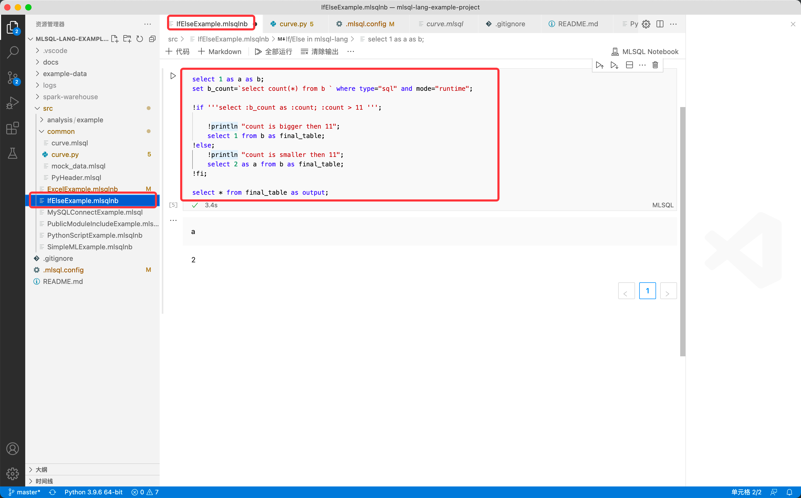
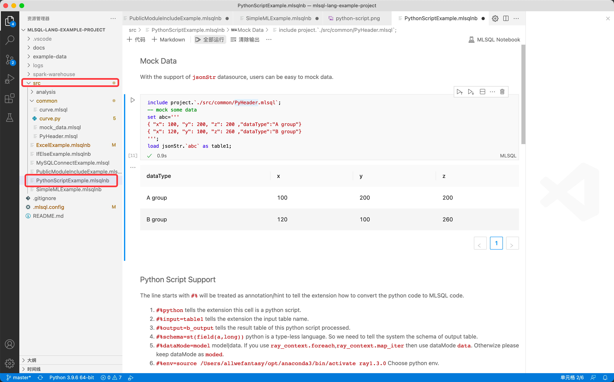

# Byzer-lang desktop installation (Mac/Linux)

### Prerequisites
Install [Visual Studio Code](https://code.visualstudio.com/) (VSCode).

> Byzer-lang desktop version has been tested in the Mac/Linux environment, but there are file read/write errors in the Windows environment, so it is recommended to use Byzer-lang desktop only in the Mac/Linux environment.

### Installation

Install the Byzer-lang VSCode plugin following the steps below:
1. Download the VSIX file based on your operating system, the latest version is 0.0.7.

   - [Linux](https://download.byzer.org/byzer/2.2.1/byzer-lang-linux-0.0.7.vsix)

   - [Mac](https://download.byzer.org/byzer/2.2.1/byzer-lang-darwin-0.0.7.vsix)

2. Open VSCode, click `Extension` on the left navigation bar and click `... (Install from VSIX)`. Select the downloaded VSIX file.

   

> Note:
>
> 1. For Byzer-lang plugin source code, see [mlsql-lang-vscode-plugin/github](https://github.com/allwefantasy/mlsql-lang-vscode-plugin)
>
> 2. The plugin will only be initialized after the `.mlsql` file is opened.

### Configure the `.mlsql.config` file (optional)

If you want to configure each project differently, you can add `.mlsql.config` to Byzer-lang root directory.

1. Configure the `engine.home` variable in `.mlsql.config`  (`engine.home` is only required for installation from the marketplace). Choose the file to download based on your operating system (mac, linux, win):
   - [Linux](https://download.byzer.org/byzer-lang-linux-amd64-2.3.0-preview.tar.gz)
   - [Mac](https://download.byzer.org/byzer-lang-mac-amd64-2.3.0-preview.tar.gz)

   Unzip the file.  Set `engine.home` to point to this directory. (You don't need to configure bin directory in `engin.home` and only need to configure the directory where bin is located)

3. If this is the first time you create this file, to make the configuration take effect, press and hold `shift+command+p` in VSCode. Select **[Developer: Reload Window]** to ensure that the `mlsql.config` file takes effect, then select **MLSQL RUN** to compile and run the `.mlsql` file.

### Examples

You can download a sample project of the Byzer-lang VSCode plugin from [here](https://github.com/allwefantasy/mlsql-lang-example-project). Before running, you can run `./src/common/PyHeader.mlsql` to enable `conda env`

1. **ExcelExample**

   

2. **IfElseExample**

   

3. **SimpleMLExample**

   

4. **PythonScriptExample**

   

5. **PublicModuleIncludeExample**

   