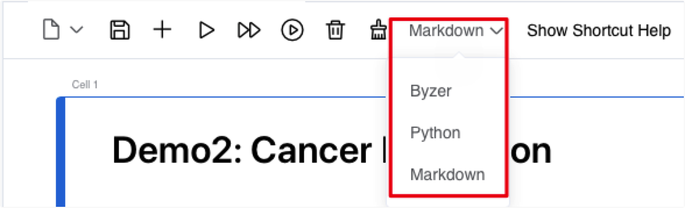

# Try online

In this chapter, we will guide you to quickly experience Byzer Notebook, Byzer's IDE application platform on the cloud. You can reserve 5 minutes to experience whole process.

### Official website registration

Before starting the trial, please make sure that you have successfully registered on the [Byzer official website](https://www.byzer.org) and had a trial account.

Click **Try Online** on the homepage:

Fill in the basic information and click **Create an account**:

After verifying your account by clicking the link in your email, you will be directed to Byzer trial page and click **Start trial** to start your experience journey.

### Quick Start

#### 1. Login to Byzer Notebook and enter the workspace

##### 1.1 Create a file

You can view all project files in the workspace list and create **notebook** files,**workflow** files and **folder** by clicking **+** on the right side of **Workspace**. You can also import local **notebook** files (.bznb) and **workflow** files (.bzwf) by clicking **Import**.

> Tip: The maximum size of a single file in the online experience environment is 200M, and the total file size for a single user is up to 500M.

##### 1.2 Manage a file

Click the icon on the right side of the project file to manage file such as **Duplicate**,**Move**,**Rename**,**Delete** and etc..

##### 1.3 Export a file

Click **Export** under the icon on the right side of the project file to export and save the project file locally. (It is recommended to save the important documents in time)

#### 2. Data Catalog

Byzer Notebook supports many different types of data sources. The online trial environment currently only supports the import and storage of Delta Lake and HDFS data sources.

> Tips: The online environment of Delta Lake is public, please do not upload important files.

#### 3. Byzer Notebook

##### 3.1 Edit notebook

In the **Workspace**, click **notebook** you want to edit to enter its own workspace.
You can click the buttons in the **toolbar** at the top of the notebook workspace to manage cell such as **Run, Delete, and Clear All Results**.

##### 3.2 Run notebook

You can run code by clicking **Run** in the upper right corner of a cell or the toolbar. You can also find the **Run All** button in the toolbar.

##### 3.3 Code mode VS Markdown mode

You can switch cell to **Byzer code mode**,**Python code mode** or **Markdown text editing** mode.

##### 3.4 Shortcut key and documentation manual

Click the **?** button in the upper right corner of the navigation bar, where you can give **feedback** or read the **Byzer Docs**.

