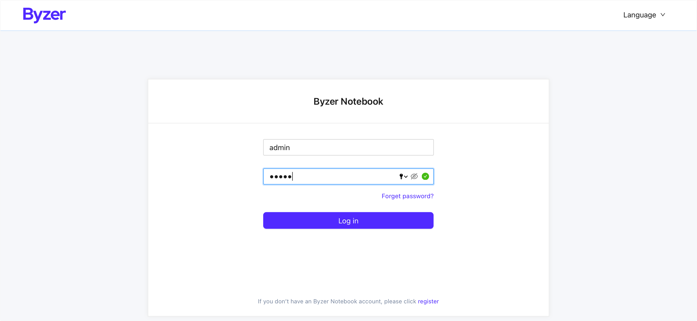
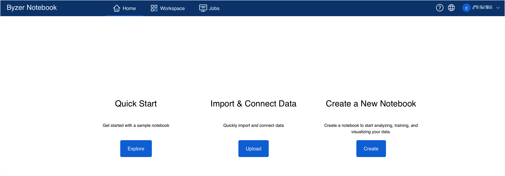

# Quick Start

This chapter will introduce using the Docker mirror environment to quickly experience Byzer's IDE application platform-Byzer Notebook.

### Prerequisites

[Install Docker](https://www.docker.com/products/docker-desktop). Skip this process if Docker is already installed.

### Install Sandbox

1. Acquire the Sandbox mirror

   `docker pull byzer/byzer-sandbox:<tag>`

   > Tag corresponds to the mirror version. Click [Here](https://hub.docker.com/r/byzer/byzer-sandbox/tags) to view all available tags.

3. Run the container

   `docker run -d --name <container_name> -p <host_notebook__port>:9002 -p <host_byzer_port>:9003 -p <host_mysql_port>:3306 -e MYSQL_ROOT_PASSWORD=<mysql_pwd> byzer/byzer-sandbox:<tag>`

   Parameter specification：

   - container_name：container name
   - host_notebook_port: port of the host server exposed by Notebook
   - host_byzer_port: port of the host server exposed by Byzer
   - host_mysql_port: port of the host server exposed by MySQL
   - mysql_pwd: root account and password of mysql
   - Tag：the selected mirror version number in last process

4. Access Byzer Notebook

   Enter `http://localhost:9002` in address bar to experience Byzer Notebook.

   Admin account and password: admin/admin

### Example

We will use an example to illustrate the entire installation process. The command-line parameters are as follows：

- tag: 3.1.1-2.2.0
- container_name: byzer-sandbox
- host_notebook_port: 9002
- host_byzer_port: 9003
- host_mysql_port: 3306
- mysql_pwd: root

1. Acquire the Sandbox mirror

   `docker pull byzer/byzer-sandbox:3.1.1-2.2.0`

2. Run the container

   `docker run -d --name byzer-sandbox -p 9002:9002 -p 9003:9003 -p 3306:3306 -e MYSQL_ROOT_PASSWORD=root byzer/byzer-sandbox:3.1.1-2.2.0`

3. Access Byzer Notebook

   Enter `http://localhost:9002` in address bar.

Enter your account and password (default: admin/admin) to explore Byzer Notebook.

