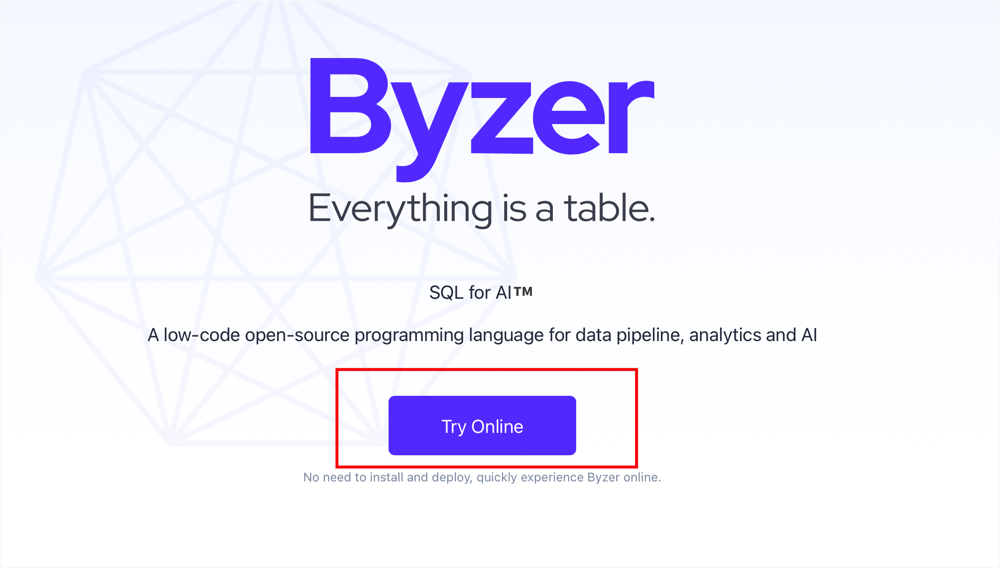
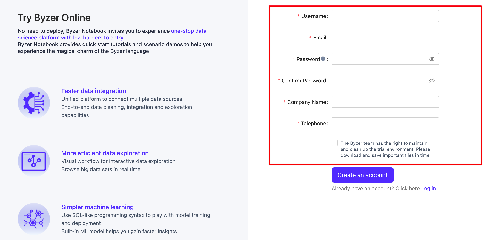
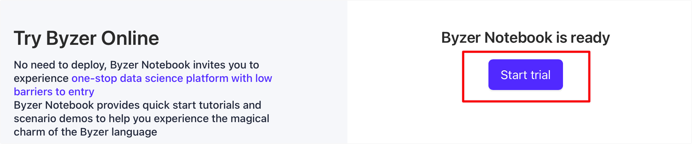
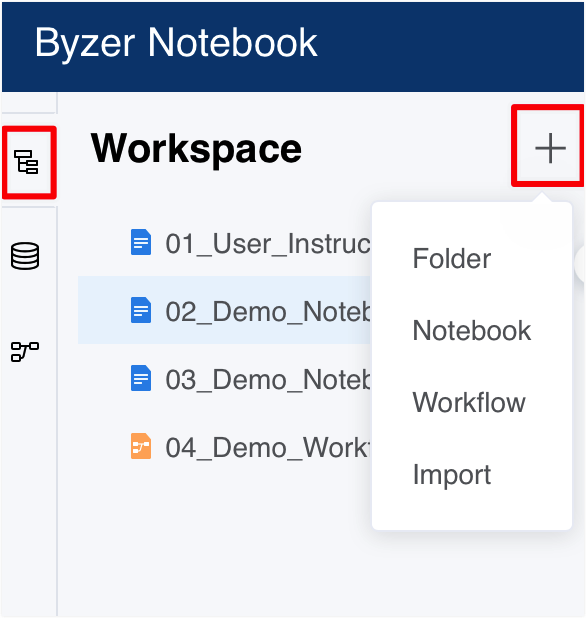
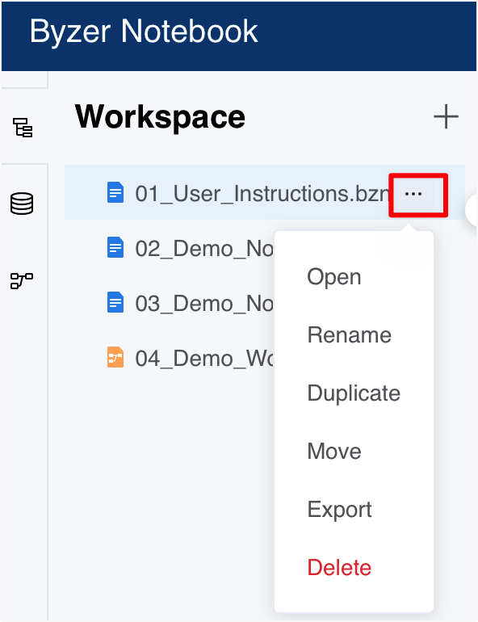
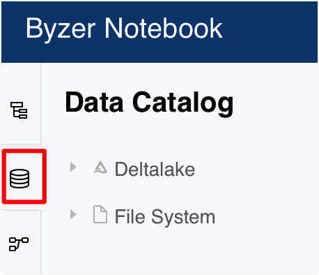
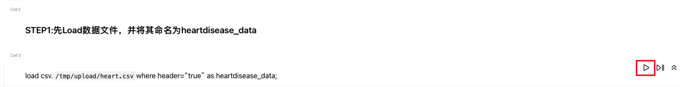

# Try online

In this chapter, we will guide you to quickly experience Byzer Notebook, that is, Byzer's IDE application platform on the cloud. It takes 5 minutes to experience the whole process.

### Register

Before starting the trial, please make sure that you have successfully applied for a trial account on [Byzer website](https://www.byzer.org).

Click **Try Online** on the homepage:

Fill in the basic information and click **Create an account**:

After verifying your account by clicking the link in your email, you will be directed to Byzer trial page and click **Start trial** to start your experience journey.

### Quick Start

#### 1. Login to Byzer Notebook and enter the workspace

Click **Explore** to get started with a sample notebook. 

##### 1.1 Create a file

You can view all project files in the workspace list.

To create **Notebook**, **Workflow** or **Folder**, click **+** on the right side of **Workspace**. You can also import local **Notebook** files (.bznb) and **workflow** files (.bzwf) by clicking **Import**.

> Note: The maximum size of a single file supported in the online trial environment is 200M, and the total file size provided for a single user is 500M.

##### 1.2 Manage a file

Click the icon on the right side of the project file for file management. You can **Duplicate**, **Move**, **Rename**, **Delete** the file.

##### 1.3 Export a file

Click **Export** under the icon on the right side of the project file to export and save the project file locally. (It is recommended to save the important documents in time)

#### 2. Data Catalog

Byzer Notebook supports different data source types. The online trial environment currently only supports Delta Lake and HDFS data sources.

> Tips: The online trial environment of Delta Lake is public, please do not upload important files.

#### 3. Byzer Notebook

##### 3.1 Edit Notebook

In **Workspace**, click the **Notebook** you want to edit to enter the corresponding workspace.You can click the buttons in the top **toolbar** to manage cells, such as **Run, Delete,** and **Clear All Results**.

##### 3.2 Run Notebook

You can run code by clicking **Run** in the upper right corner of a cell or on the toolbar. You can also find the **Run All** button in the toolbar.

##### 3.3 Code mode VS. Markdown mode

You can switch the cell to **Byzer code mode**, **Python code mode** or **Markdown text editing** mode.

##### 3.4 Shortcut key and user manual

Click the **?** button in the upper right corner of the navigation bar, where you can give **feedback** or read the **Byzer Docs**.

