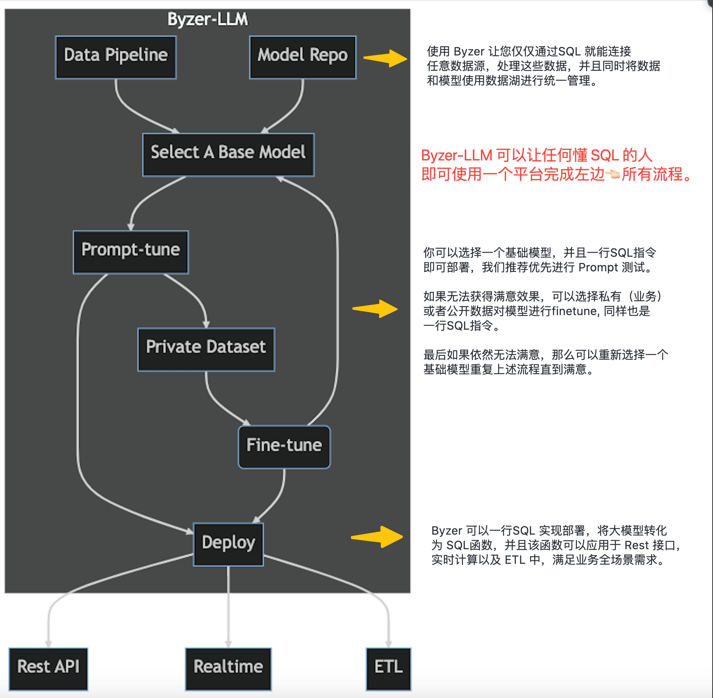

# Byzer-LLM

Byzer-LLM 是基于 Byzer 数据库的一个引擎插件，让用户可以端到端的完成业务数据获取，处理，finetune大模型，多场景部署大模型等全流程。
该扩展的目标也是为了让企业更好的将业务数据注入到私有大模型（开源或者商业），并且可对外提供多场景部署形态，诸如 ETL, 流式计算，API 服务
等。

下面是使用 Byzer-LLM 完成大模型的一个工作流程图：

