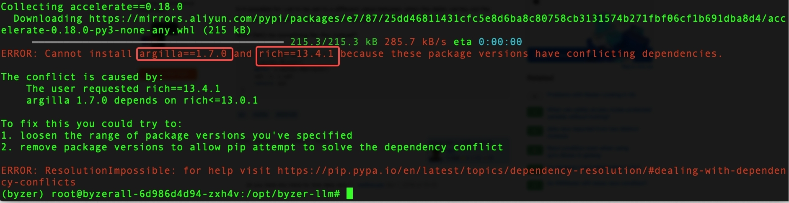

## 部署


使用 Byzer-LLM 需要做如下工作：

1. 安装 Byzer-lang/Byzer Notebook
2. 创建一个 byzerllm-desktop Python环境，并按要求安装依赖
3. 启动 Ray
4. 安装 Byzer-LLM 扩展

> 注意：Byzer-LLM 需要在有 Nvidia 的 GPU 的机器上才能正常工作。推荐 Ubuntu 22.04, 同时确保安装了驱动。可以直接安装他的大礼包： https://developer.nvidia.com/cuda-downloads?target_os=Linux&target_arch=x86_64&Distribution=Ubuntu&target_version=22.04&target_type=runfile_local

### Byzer-lang/Byzer-notebook 部署

下载：

1. Byzer-lang: https://download.byzer.org/byzer-lang/2.3.6/byzer-lang-all-in-one-linux-amd64-3.3.0-2.3.6.tar.gz
2. Byzer-notebook: https://download.byzer.org/byzer-notebook/1.2.3/Byzer-Notebook-1.2.3.tar.gz

然后解压。

首先是启动 Byzer-lang 引擎，

进入 byzer-lang-all-in-one-linux-amd64-3.3.0-2.3.6 目录，执行如下命令即可启动 By zer 引擎：

```shell
./bin/byzer.sh start
# 重启可以用下面的命令
# ./bin/byzer.sh restart
```

启动完成后就可以访问 9003 端口了。

> 注意：如果需要访问 file:// 或者对象存储的绝对路径，则需要修改 ${BYZER_HOME}/conf/byzer.properties.overwrite，添加如下配置(显示的罗列哪些schema可以用绝对路径)：
> spark.mlsql.path.schemas=oss,s3a,s3,abfs,file


启动 Byzer Notebook 则需要提前准备一个 MySQL 数据库，建议 5.7 版本的，然后创建一个名称叫做 notebook 的数据库。

现在可以进入 Byzer-Notebook-1.2.3， 修改 conf/notebook.properties 文件，

根据数据库实际地址修改数据库配置部分：

```
notebook.database.type=mysql
notebook.database.ip=127.0.0.1
notebook.database.port=3306
notebook.database.name=notebook
notebook.database.username=root
notebook.database.password=root
```

**特别注意**，下面的参数 `notebook.user.home` 务必需要修改。
该参数其实是指定的 Byzer 引擎存储用户文件数据所在的目录。你需要选一个实际可用的目录。默认的 `/mlsql` 因为在根目录下，往往Byzer引擎没有权限创建。这会导致在 Byzer-Notebook 上传文件到引擎失败等问题。

```
notebook.user.home=/mlsql
```


现在就可以启动 Notebook了：

```shell
./bin/notebook.sh start

## 重启可以用
## ./bin/notebook.sh restart
```


此时就可以访问 9002 端口了，进入 Notebook 界面开始工作了。


### Ray 部署


推荐 Ubuntu 22.04 操作系统。

1. 使用 conda 创建一个 Python 3.10.10  

```
conda create --name byzerllm-desktop python=3.10
```

2. 现在可以切换到环境 `byzerllm-desktop`，安装 pip 依赖：https://github.com/allwefantasy/byzer-llm/blob/master/demo-requirements.txt


继续保持在环境 `byzerllm-desktop`， 然后使用如下命令启动 Ray:

```
CUDA_VISIBLE_DEVICES=0,1 ray start --head \
--dashboard-host 192.168.3.224 \
--num-gpus=2 \
--object-store-memory 40949672960 \
--storage /my8t/byzerllm/ray_stroage  \
--temp-dir /my8t/byzerllm/ray_temp 
```

简要解释下，CUDA_VISIBLE_DEVICES 配置让 Ray 可以看到的 GPU,从0开始。 

1. --num-gpus 则配置 Ray 可以管理的 GPU 数，另外三个参数 
2. --object-store-memory, --storage, --temp-dir 可选。
3. --dashboard-host 是 Ray 的dashboard地址

根据自身的显卡情况填写（显卡显存需要>=8g）


### Byzer-LLM 扩展安装

Byzer-LLM 作为一个扩展，可以有两种方式安装。第一种在线安装, 在 Byzer-Notebook 的 Cell 中执行如下命令：

```
!plugin app add - "byzer-llm-3.3";
```

第二种方式是离线安装, 在这个 https://download.byzer.org/byzer-extensions/nightly-build/ 中下载 byzer-llm-3.3_2.12-0.1.0-SNAPSHOT.jar ， 然后将其放到 Byzer 引擎 `${BYZER_HOME}/plugin` 目录里,然后在  `${BYZER_HOME}/conf/byzer.properties.overwrite` 中添加如下参数 `streaming.plugin.clzznames=tech.mlsql.plugins.llm.LLMApp` ，因为我已经添加了一些扩展，所以这里看起来会是这样你在的：

```
streaming.plugin.clzznames=tech.mlsql.plugins.ds.MLSQLExcelApp,tech.mlsql.plugins.assert.app.MLSQLAssert,tech.mlsql.plugins.shell.app.MLSQLShell,tech.mlsql.plugins.mllib.app.MLSQLMllib,tech.mlsql.plugins.llm.LLMApp
```


## 常见问题

### Python 依赖库安装超时

在文件 https://github.com/allwefantasy/byzer-llm/blob/master/demo-requirements.txt 中，会有三个项目采用直接从github安装，分别是：

1. peft
2. byzerllm
3. pyjava

如果你发现会超时，可以通过类似如下方式手动安装这三个组件：

```
conda activate byzerllm-desktop
git clone https://github.com/huggingface/peft
cd perf
pip install .
```

因为涉及到torch以及cuda的依赖的安装，如果安装过慢，可以配置国内阿里云镜像。
具体做法是新增 `~/.pip/pip.conf` 文件，然后填入如下内容：

```
[global]
 trusted-host = mirrors.aliyun.com
 index-url = https://mirrors.aliyun.com/pypi/simple
```

### protobuf 安装问题

这个时候你可以先注释掉 requiments.txt里的 protobuf, 然后在安装完成后再强制执行一遍如下命令：

```
pip install protobuf==3.20.0
```

### argilla/rich 库冲突问题

类似下面的错误：



可以先uninstall rich 然后再安装 argilla。 
如果有需要再安装指定版本 rich。


