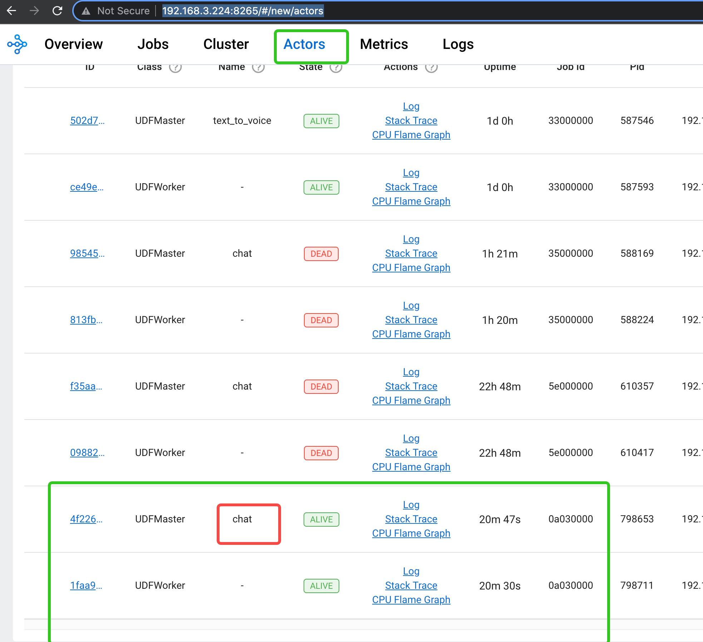
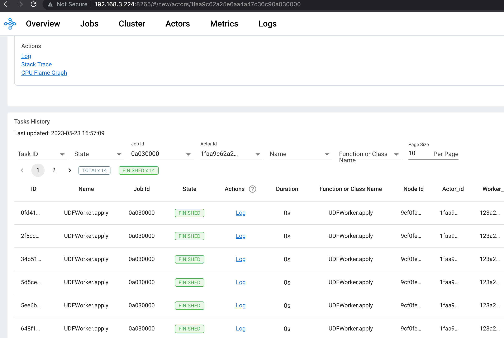

## 如何通过日志排查错误

当你在 Byzer 数据库所在服务器部署模型后，目前他daemon进程会启动相应的服务。 
一个模型分成两个部分，一个是 UDFMaster，一个是 UDFWorker。通常一个模型部署实例，对应一个UDFMaster ，一个或者多个UDFWorker。

当我使用如下代码进行部署时：

```sql
!byzerllm setup single;
!byzerllm setup "num_gpus=1";
!byzerllm setup "maxConcurrency=1";

run command as LLM.`` where 
action="infer"
and pretrainedModelType="llama"
and localModelDir="/home/byzerllm/models/openbuddy-llama-7b-v4-fp16"
and reconnect="false"
and udfName="chat"
and modelTable="command";
```

此时 打开 Ray Dashborad ，进入 `Actors` 页面：

```sql
http://127.0.0.1:8266/#/actors
```

你应该可以看到两个 Actor, 一个名字叫 `chat` UDFMaster ，一个没有名字的 UDFWorker。其中：

1. num_gpus 控制一个 UDFWorker 使用多少个 GPU
2. maxConcurrency 控制一个 UDFMaster 最多可以同时运行多少个 UDFWorker

你可能看到的图类似这样：




可以看到，我们部署的 chat 函数已经都处于 alive状态了。

现在你可以点击 UDFWorker 进去查看日志，日志包含两部分：

1. Logs 标签页，包含了 UDFWorker 的日志。包括 stderr 和 stdout.
2. Tasks History 标签页，包含了 UDFWorker 执行过的任务。

一般而言，我们重点关注 Tasks History 标签页，如果你的 UDFWorker 在执行推理时有错误，你可以在这里看到错误信息。

Tasks History 标签页类似这样：



