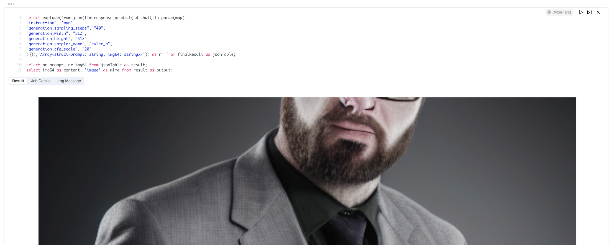
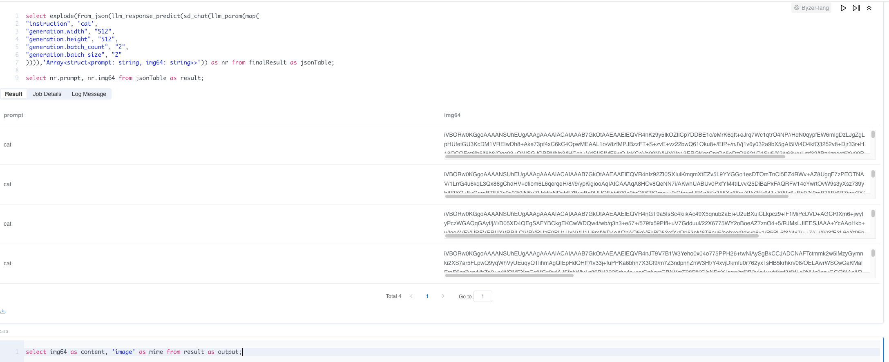
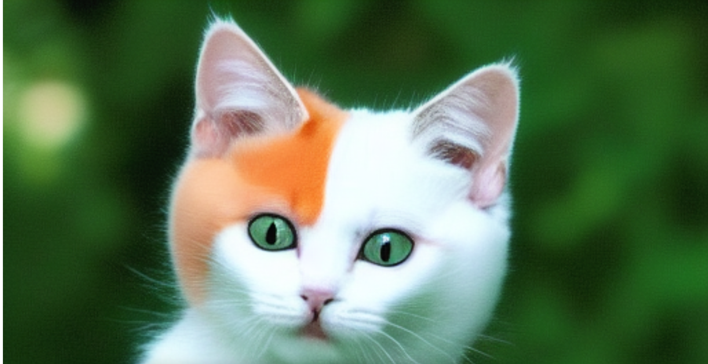

# Stable Diffusion Parameter

下面是在byzer中使用stable_diffusion生成图片的一些参数。
### 启动参数

```sql
!byzerllm setup single;
!byzerllm setup "num_gpus=2";

run command as LLM.`` where 
action="infer"
and pretrainedModelType="custom/stable_diffusion"
and localModelDir="/home/byzerllm/models/stable-diffusion-v1-5"
and reconnect="false"
and udfName="sd_chat"
and modelTable="command";
```

| 参数            | 含义                                   | 默认值                                               |
| --------------- | -------------------------------------- | ---------------------------------------------------- |
| localPathPrefix | 模型checkpoint，lora，emb等缓存路径    | 在localModelDir目录下新建stable_diffusion_models目录 |
| xformers        | 开启xformers(需要pip install xformers) | "true"                                               |
| hf_token        | Hugging face的token                    | ""                                                   |
| precision       | 精度                                   | "fp16"                                               |
| variant         | 调用模型的类型                         | "fp16"                                               |
| checkpoint      | 模型是否调用checkpoint                 | "checkpoint"                                         |

```sql
select explode(from_json(llm_response_predict(sd_chat(llm_param(map(
"instruction", 'cat',
"generation.width", "512",
"generation.height", "512",
"generation.batch_count", "2",
"generation.batch_size", "2"
)))),'Array<struct<prompt: string, img64: string>>')) as nr from finalResult as jsonTable;

select nr.prompt, nr.img64 from jsonTable as result;
```

### 模型参数

| 参数                        | 含义                                                         | 默认值   |
| --------------------------- | ------------------------------------------------------------ | -------- |
| Instruction                 | prompt                                                       | 非空     |
| generation.negative_prompt  | 反向的prompt                                                 | ""       |
| generation.sampler_name     | 调度名(unpic, euler_a,euler,ddim,ddpm,deis,dpm2,dpm2-a,dpm++_2m,dpm++_2m_karras,heun,heun_karras,lms,pndm:w) | euler_a  |
| generation.sampling_steps   | 生成的步骤数                                                 | 25       |
| generation.batch_size       | 一次生成几张                                                 | 1        |
| generation.batch_count      | 生成几次                                                     | 1        |
| generation.cfg_scale        | 随机或贴合程度值,值越小生成的图片离你的Tags描述的内容差距越大 | 7.5      |
| generation.seed             | 随机种子                                                     | -1       |
| generation.width            | 图片宽度                                                     | 768      |
| generation.height           | 图片高度                                                     | 768      |
| generation.enable_hires     | 开启高分辨率修复功能(和下面两个一组)                         | false    |
| generation.upscaler_mode    | 放大算法(bilinear, bilinear-antialiased,bicubic,bicubic-antialiased,nearest,nearest-exact) | bilinear |
| generation.scale_slider     | 放大比例                                                     | 1.5      |
| generation.enable_multidiff | 图片分割处理(减少显存销耗)(和下面3个一组)                    | false    |
| generation.views_batch_size | 分批处理规模                                                 | 4        |
| generation.window_size      | 切割大小，宽，高                                             | 64       |
| generation.stride           | 步长                                                         | 16       |
| generation.init_image       | 初始化图片，基于这个图片处理(必须传输base64加密的图片) (和下面的一组) | None     |
| generation.strength         | 重绘幅度: 图像模仿自由度，越高越自由发挥，越低和参考图像越接近，通常小于0.3基本就是加滤镜 | 0.5      |

scheduler Link: https://blog.csdn.net/guochunyun/article/details/130362582

### 生成效果图:




