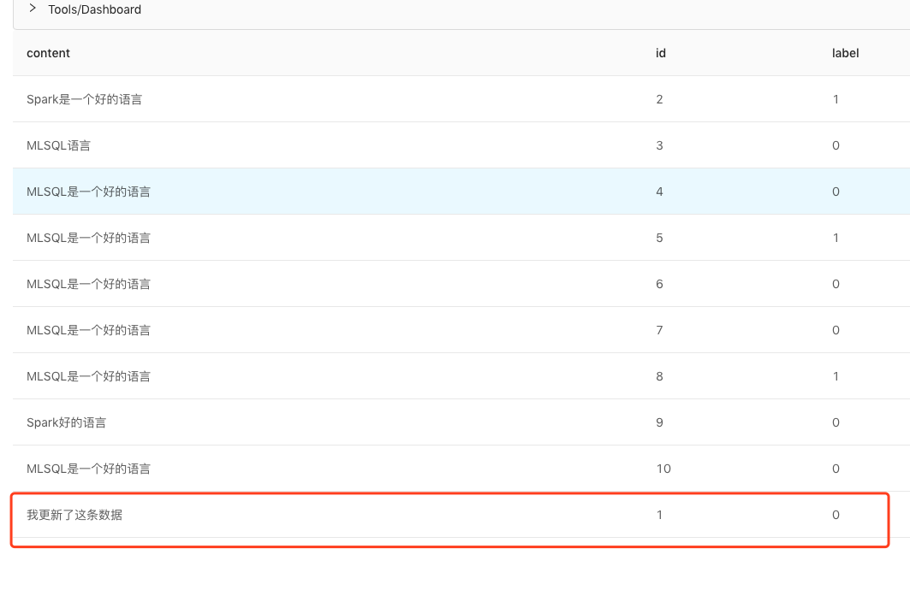
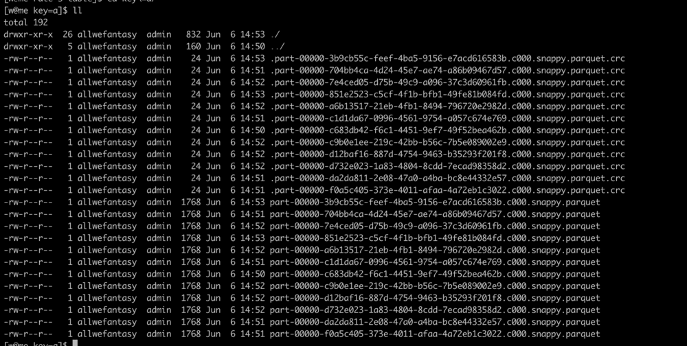

# Delta 加载和存储以及流式支持

Delta 本质就是 HDFS 上一个目录。这就意味着你可以在自己的主目录里欢快的玩耍。我们会分如下几个部分介绍 Delta 的使用：

1. 基本使用
2. 按数据库表模式使用
3. Upsert语义的支持
4. 流式更新支持
5. 小文件合并
6. 同时加载多版本数据为一个表
7. 查看表的状态(如文件数等)

### 基本使用

```sql
set rawText='''
{"id":1,"content":"MLSQL 是一个好的语言","label":0.0},
{"id":2,"content":"Spark 是一个好的语言","label":1.0}
{"id":3,"content":"MLSQL 语言","label":0.0}
{"id":4,"content":"MLSQL 是一个好的语言","label":0.0}
{"id":5,"content":"MLSQL 是一个好的语言","label":1.0}
{"id":6,"content":"MLSQL 是一个好的语言","label":0.0}
{"id":7,"content":"MLSQL 是一个好的语言","label":0.0}
{"id":8,"content":"MLSQL 是一个好的语言","label":1.0}
{"id":9,"content":"Spark 好的语言","label":0.0}
{"id":10,"content":"MLSQL 是一个好的语言","label":0.0}
''';

load jsonStr.`rawText` as orginal_text_corpus;

save append orginal_text_corpus as delta.`test_demo.table1`;
```

执行上面的语句，我们就能成功的将相关数据写入 Delta 数据湖了。

加载的方式如下：

```sql
load delta.`test_demo.table1` as output;
```

### 按数据库表模式使用

很多用户并不希望使用路径，他们希望能够像使用 Hive 那样使用数据湖。Byzer-lang 对此也提供了支持。在启动时，加上参数

```
-streaming.datalake.path /tmp/datahouse
```

> 默认情况，/tmp/datahouse 是本地目录。若 $SPARK_HOME/conf 包含HDFS配置文件，/tmp/datahouse 指 HDFS 目录；同样的方式也可支持 OSS 等对象存储。
>
> 请先创建目录 /tmp/datahouse.

系统便会按数据湖模式运行。此时用户不能自己写路径了，而是需要按db.table的模式使用。

保存数据湖表

```sql
select 1 AS id, 'abc' AS address
UNION ALL
SELECT 2 AS id, 'def' AS address
AS table_1;

save overwrite table_1 as delta.`default.table_1` partitionBy id;
```

加载数据湖表：

```sql
load delta.`default.table_1` as output;
```

你可以使用下列命令查看所有的数据库和表：

```sql
!delta show tables;
```

### Upsert 语义的支持

Delta 支持数据的 Upsert 操作，对应的语义为： 如果存在则更新，不存在则新增。

我们前面保存了十条数据，现在尝试如下代码：

```sql
set rawText='''
{"id":1,"content":"我更新了这条数据","label":0.0}
''';

load jsonStr.`rawText` as orginal_text_corpus;

save append orginal_text_corpus  
as delta.`/tmp/delta/table10` 
and idCols="id";
```
我们看到 id 为 1 的数据已经被更新为。




### 流式更新支持

这里，我们会简单涉及到流式程序的编写。大家可以先有个感觉，不用太关注细节。我们后续专门的流式章节会提供更详细的解释和说明。

为了完成这个例子，用户可能需要在本机启动一个 Kafka，并且版本是 0.10.0 以上。

首先，我们通过 Byzer-lang 写入一些数据到 Kafka:

```sql
set abc='''
{ "x": 100, "y": 201, "z": 204 ,"dataType":"A group"}
''';
load jsonStr.`abc` as table1;

select to_json(struct(*)) as value from table1 as table2;
save append table2 as kafka.`wow` where 
kafka.bootstrap.servers="127.0.0.1:9092";
```

接着启动一个流式程序消费：

```sql
-- the stream name, should be uniq.
set streamName="kafkaStreamExample";

!kafkaTool registerSchema 2 records from "127.0.0.1:9092" wow;

-- convert table as stream source
load kafka.`wow` options 
kafka.bootstrap.servers="127.0.0.1:9092"
and failOnDataLoss="false"
as newkafkatable1;

-- aggregation 
select *  from newkafkatable1
as table21;

-- output the the result to console.
save append table21  
as rate.`/tmp/delta/wow-0` 
options mode="Append"
and idCols="x,y"
and duration="5"
and checkpointLocation="/tmp/s-cpl6";
```

这里，我们指定x,y为联合主键。

现在可以查看了：

```sql
load delta.`/tmp/delta/wow-0` as show_table1;
select * from show_table1 where x=100 and z=204 as output;
```

### 小文件合并

Byzer-lang 对 Delta 的小文件合并的要求比较苛刻，要求必须是 append 模式，不能发生更新已有记录的的表才能进行小文件合并。

我们在示例中模拟一些Kafka的数据：

```sql
set data='''
{"key":"a","value":"no","topic":"test","partition":0,"offset":0,"timestamp":"2008-01-24 18:01:01.001","timestampType":0}
{"key":"a","value":"no","topic":"test","partition":0,"offset":1,"timestamp":"2008-01-24 18:01:01.002","timestampType":0}
{"key":"b","value":"no","topic":"test","partition":0,"offset":2,"timestamp":"2008-01-24 18:01:01.003","timestampType":0}
{"key":"b","value":"no","topic":"test","partition":0,"offset":3,"timestamp":"2008-01-24 18:01:01.003","timestampType":0}
{"key":"b","value":"no","topic":"test","partition":0,"offset":4,"timestamp":"2008-01-24 18:01:01.003","timestampType":0}
{"key":"b","value":"no","topic":"test","partition":0,"offset":5,"timestamp":"2008-01-24 18:01:01.003","timestampType":0}
''';
```

接着流式写入：

```sql
-- the stream name, should be uniq.
set streamName="streamExample";

-- load data as table
load jsonStr.`data` as datasource;

-- convert table as stream source
load mockStream.`datasource` options 
stepSizeRange="0-3"
as newkafkatable1;


select *  from newkafkatable1 
as table21;

-- output the the result to console.
save append table21  
as rate.`/tmp/delta/rate-1-table`
options mode="Append"
and duration="10"
and checkpointLocation="/tmp/rate-1" partitionBy key;
```

这里注意一下是流里面 Delta 叫 rate。

现在我们利用工具 !delta 查看已有的版本：

```sql
!delta history /tmp/delta/rate-2-table;
```

内容如下：


现在我们可以对指定版本之前的数据做合并了：

```
!delta compact /tmp/delta/rate-2-table 8 1;
```

这条命令表示对第八个版本之前的所有数据都进行合并，每个目录（分区）都合并成一个文件。

我们看下合并前每个分区下面文件情况：



合并后文件情况：


我们删除了16个文件，生成了两个新文件。另外在compaction的时候，并不影响读和写。所以是非常有用的。

### 同时加载多版本数据为一个表

Delta 支持多版本，我们也可以一次性加载一个范围内的版本，比如下面的例子，我们说，将[12-14) 的版本的数据按
一个表的方式加载。接着用户可以比如可以按 id 做 group by，在一行得到多个版本的数据。

```sql
set a="b"; 

load delta.`/tmp/delta/rate-3-table` where 
startingVersion="12"
and endingVersion="14"
as table1;

select __delta_version__, collect_list(key), from table1 group by __delta_version__,key 
as table2;
```

### 查看表的状态

```sql
!delta info scheduler.time_jobs;
```

