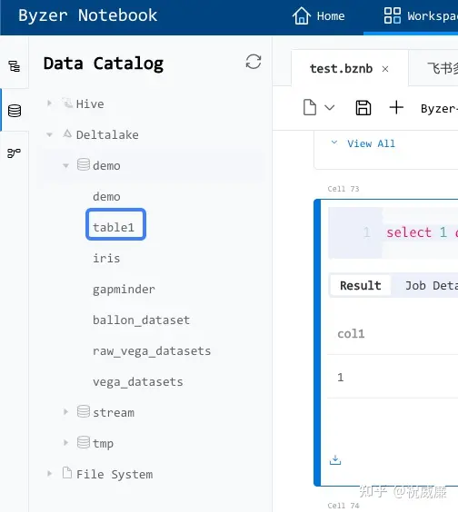
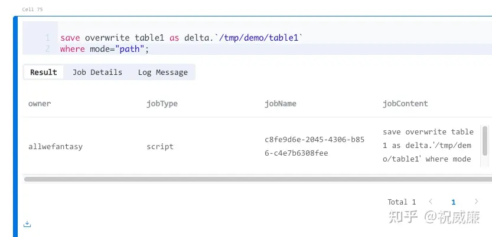
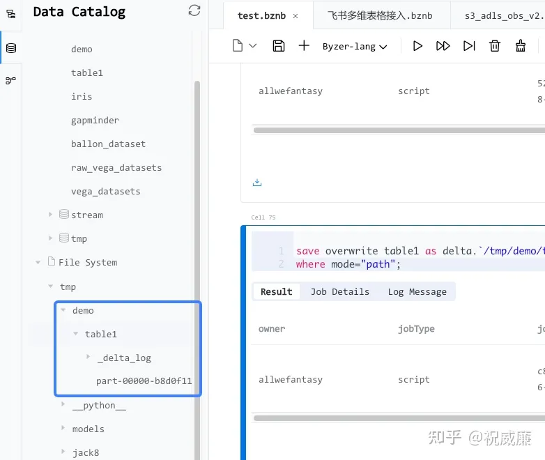

# 内置数据湖 Delta Lake

DeltaLake 作为 Byzer 的内置数据源，使用非常简单，只需在启动添加启动参数(${BYZER_HOME}/conf/byzer.properties.overwrite):

```
-streaming.datalake.path "对象存储某个目录"
```

此时，你就获得一个名字叫 `delta` 的数据源。通过该数据源，你可以管理和使用数据湖。

执行如下语句：

```sql
select 1 as col1 as table1;
save overwirte table1 as delta.`demo.table1`;
```

刷新下侧边栏，就可以看到 demo 目录下有 table1 表。



如果用户不想以库表方式保存数据，那么可以这么操作：



然后刷新目录，就可以看到 FIleSystem里有相关目录产生了。 读取话也是配置 load 中的 mode="path"。



如果用户使用绝对路径怎么办？我们知道 /tmp/demo/table1 这个目录是个人目录，其他用户是无法看到的。这个时候可以使用带schema的绝对路径。比如：

```sql
save overwrite table1 as delta.`oss:/YOUR_BUCKET_NAME/tmp/demo/table1` 
where mode="path";
```

因为 Byzer 默认是不支持使用带Schema路径的，所以你需要开启一个白名单(${BYZER_HOME}/conf/byzer.properties.overwrite)：

```
spark.mlsql.path.schemas="oss"
```

这样所有以 oss://bucket 开头前缀的地址都不会被改写，用户可以正确的去访问这个地址。多个对象存储schema可以按逗号分隔。