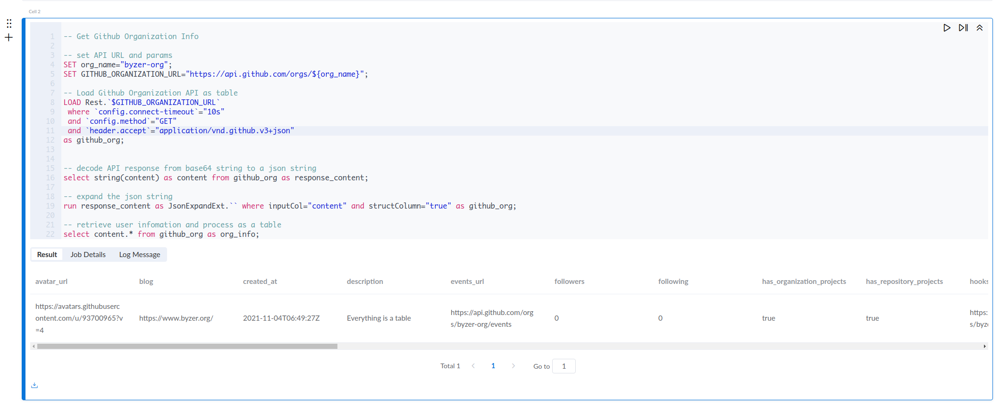
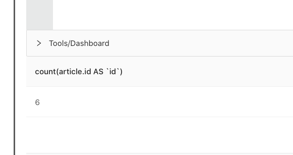

# REST API

REST API 是 Byzer-lang 的一个核心特性功能，能够使得用户可以通过一条 `load` 语句，将一个 REST API 的返回结果进行解析后，映射为一张二维表。

一般而言，对于常见系统的 REST API 返回，无论是什么请求，都会将结果通过 json 的方式来封装返回体，json 是一个 key-value 格式的具备 schema 的文本内容，Byzer 可以将 json 的 schema 进行打平，将 key 作为结果表的列 （table column），将 value 作为结果表的行 （row）。


### REST API 语法示例
下面是一个基于 Github 的 open api 来获取 Github Organization 信息的简单例子：

```sql
-- Get Github Organization Info

-- set API URL and params
SET org_name="byzer-org";
SET GITHUB_ORGANIZATION_URL="https://api.github.com/orgs/${org_name}";

-- Load Github Organization API as table
LOAD Rest.`$GITHUB_ORGANIZATION_URL` 
 where `config.connect-timeout`="10s"
 and `config.method`="GET"
 and `header.accept`="application/vnd.github.v3+json"
as github_org;


-- decode API response from base64 string to a json string
select string(content) as content from github_org as response_content;

-- expand the json string 
run response_content as JsonExpandExt.`` where inputCol="content" and structColumn="true" as github_org;

-- retrieve user infomation and process as a table
select content.* from github_org as org_info;
```

在这个例子中，一共分为五个步骤：
- 通过 `SET` 语法定义的一些变量，比如 API 的参数
- 通过 `LOAD` 语法定义的一个 API 调用体，给 Github 发送 API 请求
- 得到 Github REST API 的返回体，这个返回体是一个 base64 的字符串，将其通过 decode 解析为一个可读的 json string
- 通过 `RUN` 语法的执行 Byzer 的内置插件 `JsonExpandExt`，对 Json 进行展开，将 Json String （content 列）解析为一个结构化的 Json 数据
- 通过 json path 的方式来按需获取 Json 中的 key 以及 value

下面说一下上述示例中 `LOAD` 语句的组成:
- 使用 `Rest` 关键字标志此次加载的数据源是 REST API，可以在反引号內直接填写访问的 REST API URL，也可以通过引用 SET 变量的方式来传递这个 URL
- 使用 `where` 从句来设置 REST API 的参数。
    - `config.connect-timeout` 代表 API 的请求超时时间，此例中为 `10s`，
    - `config.method` 代表 API 的 REST 请求方法，此例中为 `GET`
    - `header.accept` 代表 API 可以请求的内容类型，此例中为 `application/vnd.github.v3+json`

上述代码的执行结果会将 Github 中 Byzer Org 的信息以表的方式进行返回，内容如下图




### REST API 请求基本参数

和我们熟知的使用其他命令来调用 REST API 一样，比如 `curl`，`postman` 等，用户需要自己来填写 REST API 的请求参数，大致可以分为一下 3 类：
- `config`：设置 rest 请求信息，如 `method`/`timeout` 等
- `header`：设置请求头
- `body/form`：设置请求参数，随 `method`/`content-type` 不同而变化 

| 参数名                  | 参数含义                                                     |
| ----------------------- | ------------------------------------------------------------ |
| config.connect-timeout  | http 请求超时时间                                             |
| config.socket-timeout   | socket 连接的超时时间                                         |
| config.method           | http 请求行中的请求方法，如：`config.method`="GET"            |
| config.retry            | 状态码不为 200 时尝试次数                                      |
| config.retry.interval   | 重试时等待的时间，默认为 1s                                   |
| header.[参数]           | http 请求头部参数，如：`header.content-type`="application/json" |
| body                    | http 的请求数据，如：`body`="{}"                              |
| form.file-name          | 上传文件的名称，当 POST 请求的 header.content-type 为 multipart/form-data 时有效 |
| form.file-path          | 上传文件的路径，当 POST 请求的 header.content-type 为 multipart/form-data 时有效 |
| form.*                  | 请求体参数；如果是 GET 请求时表示请求行的参数，如果是 POST 请求为请求数据 |
| config.page.next        | 翻页时下一页的 URL 地址                                        |
| config.page.skip-params | 翻页是是否携带数据源中配置的 URL 参数，比如：Rest.`http://domain?a=1`，其中a=1 就是配置的参数 |
| config.page.values      | 获取服务端响应正文的规则路径，多条规则路径使用','进行分隔，如：$.cursor,$.wow；我们是通过 JsonPath 来完成的，了解更多使用方式，请参考： https://github.com/json-path/JsonPath |
| config.page.interval    | 翻页请求的间隔时间，避免高频请求对服务端造成影响             |
| config.page.retry       | 翻页请求失败的重试次数，默认为 3                              |
| config.page.limit       | 翻页请求所使用的分页数，默认为 1，表示只请求一次分页 Rest 接口  |

> **注意：**
> 1. 所有参数值都必须是字符串，也就是必须用 `""` 或者 `'''` 括起来
> 2. 参数值可以使用 `SET` 变量进行传递

### REST API 高级参数

Byzer 支持取返回值中的字段进行多次请求，并将所有返回值组合成一张表。
下面是一个简单的例子：

```sql
> SET acc_ko = `SELECT get_json_object(string(content),'$.access_token')  FROM token_1 AS token_2` WHERE type = "sql" and mode = "runtime";

> LOAD Rest.`$url` where
`config.connect-timeout`="10s"
 and `config.socket-timeout`="10s"
 and `config.method`="GET"
 and `header.Authorization`='''Bearer $acc_ko'''
 and `header.Content-Type`= "application/json"
 and `config.page.next`="{0}"
 and `config.page.values`="$.nextPage"
 and `config.page.limit`="10"
 AS worklog_del;
```

在这个例子中，我们首先通过 `SET` 语法将上个例子中获取到的 token 设置为变量。这里利用了 [SparkSQL Build-in Function](https://spark.apache.org/docs/latest/api/sql/)。
紧接着我们使用 `load` 语法 `Rest` 工具进行多次请求。
下面详细讲解用到的参数：

**`config.page.values`**

是返回结构中下一页的关键信息，使用 [JsonPath语法](https://github.com/json-path/JsonPath)。
你可以指明多个关键信息，并在`config.page.next`中使用他们。

**`config.page.next`**

表示下次请求的 url，你可以用 {0},{1}... {n} 代表 `config.page.values` 获取的若干信息，并直接写到请求字符串中，如：
```sql
config.page.next="http://www.example.com/rest/{0}/deleted?projects={1}"
```
如果 `$.nextPage` 路径下就是请求链接，则可以像例子一样直接写：
```sql
config.page.next="{0}"
```

**`config.page.interval`**

表示多次请求时的请求间隔。一些 SAAS 服务会对请求进行限流，如 120s 內只允许 100 次请求，这时可以设置这个参数为 `1200ms` 或 `1.2s`。

默认值为 `10ms`。

**`config.page.limit`**

表示请求次数/页数，默认为 `1` 次。

### 3. 返回值

load 语句将请求的返回值设置为一张表。其中有两列：
- content：base64 编码的返回体
- status：http 状态码

如下所示：

|content | status |
|--------|--------|
|  (base64 encode content)| (http status)|

如果是多次请求，则返回表会有多行，每行代表一次请求的结果。
你可以使用 [SparkSQL Build-in Function](https://spark.apache.org/docs/latest/api/sql/) 或自定义 UDF 对他们进行聚合和其他操作。


### 更多的 REST API 调用示例


Rest 数据源可以让 Byzer-lang 脚本更加灵活，可以使用该数据源完成非常复杂的 REST API 交互。Rest 数据源支持简单的 REST API 调用，也支持直接在 Rest 数据源中实现分页数据的读取。


#### 1. 使用 POST 方法将 json string 作为 Request body

下述例子是调用 Byzer 引擎的 `/run/script` 的 api，来执行一段 byzer 的 sql 脚本，`body` 参数的值是 request body，在其中填写了 `/run/script` 这个请求的参数

```sql
SET ENGINE_URL="http://127.0.0.1:9003/run/script"; 

load Rest.`$ENGINE_URL` where

 `config.connect-timeout`="10s"

 and `config.method`="post"

 and `header.content-type`="application/json"

 and `body`='''

 { 

   "executeMode": "query",

   "sql": "select 1 as a as b;",

   "owner": "admin",

   "jobName": "f39ba3b2-0a28-4aa2-806e-5412813c995b"

 }

'''

as table1;

-- 获取接口返回结果

select status, string(content) as content  

from table1 as output;
```

执行结果：

| status | content     |
| ------ | ----------- |
| 200    | [{"a":"1"}] |


#### 2. 使用 GET 发起 Form 表单请求

下面这个例子展示了使用 cnnodejs 的一个 api 来获取 topics 相关的内容，其中请求参数是通过 `form` 的参数进行传递的

```sql
SET TOPIC_URL="https://cnodejs.org/api/v1/topics"; 

load Rest.`$TOPIC_URL` where

 `config.connect-timeout`="10s"

 and `config.method`="get"

 -- will retry 3 times if api call failed

 and `config.retry`="3"

 -- below lists the parameters of form

 and `form.page`="1"

 and `form.tab`="share"

 and `form.limit`="2"

 and `form.mdrender`="false" 

as cnodejs_articles;


-- decode API response from base64 string to a json string
select string(content) as content from cnodejs_articles as response_content;

-- expand the json string 
run response_content as JsonExpandExt.`` where inputCol="content" and structColumn="true" as cnodejs_articles;

-- retrieve user infomation and process as a table
select content.data from cnodejs_articles as cnodejs_articles_info;
```

在这里，我们发起了 get 请求，请求参数可以放到 URL 里，也可以放到`form.[key]` 里。这些参数最终会被拼接到 URL 中。

执行结果：

| data |
| ------ |
| [ { "author": { "avatar_url": "https://avatars.githubusercontent.com/u/156269?v=4&s=120", "loginname": "fengmk2" }, "author_id": "4efc278525fa69ac6900000f", "content": "https://registry.npmmirror.com 中国 npm 镜像源在2013年12月开始就使用基于 koa 的 https://github.com/cnpm/cnpmjs ......    |


#### 3. 设置动态渲染参数

动态渲染参数可以在 `:{....}` 中执行代码。其语法和 if/else 里的条件表达式相同，用于返回一个变量，该变量会以字符串形式返回。所以可以写的更复杂，比如：

```sql
and `form.created`=''':{select split(:create_at,":")[0] as :ca; :ca}'''
```

渲染动作产生在运行时，所以可以很方便的获取的参数。

下面我们看一个具体的例子：

```sql
SET TOPIC_URL="https://cnodejs.org/api/v1/topics"; 

load Rest.`$TOPIC_URL` where

 `config.connect-timeout`="10s"

 and `config.method`="get"

 and `form.page`=''':{select 1 as :b;:b}'''

 and `form.tab`="share"

 and `form.limit`="2"

 and `form.mdrender`="false" 

as cnodejs_articles;


select status, string(content) as content  

from cnodejs_articles as output;
```


在 `form.page` 参数中我们设置的代码包含一段表达式：

```sql
 and `form.page`=''':{select 1 as :b;:b}'''
```

其中的`:{select ``1`` as :b;:b}`会动态执行，并将结果渲染到模板代码中，则实际执行的 SQL 内容变成了：

```sql
 and `form.page`='''1'''
```

所有 form 参数都支持动态渲染参数。


#### 4. 如何解析结果集

下面演示一个结果集解析的 demo，为了方便处理JSON结果集，我们结合 JsonExpandExt ET 和 explode 函数，代码示例如下所示：

```sql
SET ENGINE_URL="https://cnodejs.org/api/v1/topics";

load Rest.`$ENGINE_URL` where

  `config.connect-timeout`="10s"

  and `config.method`="get"

  and `form.page`=''':{select 1 as :b;:b}'''

  and `form.tab`="share"

  and `form.limit`="2"

  and `form.mdrender`="false"

as raw_cnodejs_articles;


select status, string(content) as content

from raw_cnodejs_articles as temp_cnodejs_articles;


-- 提取 JSON 结构内容（也就是 condejs 列表页面内容）并将其保存为 struct field 以便我们使用 JSON 数据

run temp_cnodejs_articles as JsonExpandExt.``

where inputCol="content" and structColumn="true"

as cnodejs_articles;


-- 转换列表页上的一行数据来操控行（即展开嵌套的 JSON 数据）
select explode(content.data) as article from cnodejs_articles as articles;
```


结果如下：


我们可以看到，我们很容易将表展开，从而实现更复杂的需求。


#### 5. 分页数据的读取

我们以 Node.js 专业中文社区的列表页为例，代码如下所示：

```sql
SET ENGINE_URL="https://cnodejs.org/api/v1/topics"; 

load Rest.`$ENGINE_URL` where

`config.connect-timeout`="10s"

and `config.method`="get"

and `form.page`=''':{select 1 as :b;:b}'''

and `form.tab`="share"

and `form.limit`="2"

and `form.mdrender`="false"


and `config.page.next`="https://cnodejs.org/api/v1/topics?page={0}"

and `config.page.skip-params`="false"

-- 自动增量这项特殊配置是为了自动增加页数而设计。`:1` 意味着页数值从1开始。

and `config.page.values`="auto-increment:1"

and `config.page.interval`="10ms"

and `config.page.retry`="3"

and `config.page.limit`="2"


as raw_cnodejs_articles;


set status= `select status from raw_cnodejs_articles` where type="sql" and mode="runtime";


-- 如果状态不是200，则模拟不带数据的新表

!if ''' :status != 200 '''; 

!then; 

    run command as EmptyTableWithSchema.`` where schema='''st(field(content,binary),field(status,integer))''' as raw_cnodejs_articles;    

!fi;


select status, string(content) as content  

from raw_cnodejs_articles as temp_cnodejs_articles;


run temp_cnodejs_articles as JsonExpandExt.`` 

where inputCol="content" and structColumn="true" 

as cnodejs_articles;


select explode(content.data) as article from cnodejs_articles as articles;


select count(article.id) from articles as output;
```


结果如下，可以看到有 6 条数据，一共进行了三次分页




对于那种需要从结果集获取分页参数的，则可以使用 jsonpath 进行抽取并且进行渲染，相关配置如下：

```sql
-- 为了得到 `cursor` 和 `wow` 在 page.next 中使用动态参数。

and `config.page.next`="https://cnodejs.org/api/v1/topics?page={0}"

-- 不能携带表单中携带的请求参数。

and `config.page.skip-params`="true"

-- 使用 JsonPath 来解析请求中的分页信息。更多信息，请参考: https://github.com/json-path/JsonPath。

and `config.page.values`="$.path1;$.path2"

-- 为每个分页请求设置间隔时间。

and `config.page.interval`="10ms"

-- 为每个分页请求设置设置失败重试次数。

and `config.page.retry`="3"

-- 设置请求页面的数量。

and `config.page.limit`="2"
```

通过json path抽取的值会作为位置参数去重新生成 config.page.next 页。


#### 6. 使用POST请求上传文件

```sql
save overwrite command as Rest.`http://lab.mlsql.tech/api/upload_file` where

`config.connect-timeout`="10s"

and `header.content-type`="multipart/form-data"

and `header.Content-Type`="multipart/form-data; boundary=$you_boundary"

and `header.Cookie`="JSESSIONID=$your_jsession_id;"

-- upload file path

and `form.file-path`="/tmp/upload/test_date.csv"

-- upload file name

and `form.file-name`="test_date.csv"

and `config.method`="post"

;
```

我们请求的 byzer-notebook 是需要授权的，我们通过`header.`设置 Jsession 等授权信息。


#### 7. 忽略请求结果异常

对于 http 服务端响应的状态码不是 200 的情况，如果不想报错，可以结合分支加空表的模式：

```sql
-- 这里的 url 是错误的, 因此状态是404。

-- 它将在之后的脚本中抛出异常。

SET ENGINE_URL="https://cnodejs.org/api/v1/topics1"; 

load Rest.`$ENGINE_URL` where

 `config.connect-timeout`="10s"

 and `config.method`="get"

 and `form.page`=''':{select 1 as :b;:b}'''

 and `form.tab`="share"

 and `form.limit`="2"

 and `form.mdrender`="false" 

as raw_cnodejs_articles;


set status= `select status from raw_cnodejs_articles` where type="sql" and mode="runtime";


-- 如果状态不是200，则模拟一个不带数据的新表。

!if ''' :status != 200 '''; 

!then; 

    run command as EmptyTableWithSchema.`` where schema='''st(field(content,binary),field(status,integer))''' as raw_cnodejs_articles;    

!fi;


select status, string(content) as content  

from raw_cnodejs_articles as temp_cnodejs_articles;


run temp_cnodejs_articles as JsonExpandExt.`` 

where inputCol="content" and structColumn="true" 

as cnodejs_articles;


-- 因为这段内容中没有字段数据，应再次模拟表。

-- 从 condejs_articles 中选择 explode(content.data) 作为 article；

-- 从 articles 中选择 article.id, article 作为输出；
```


