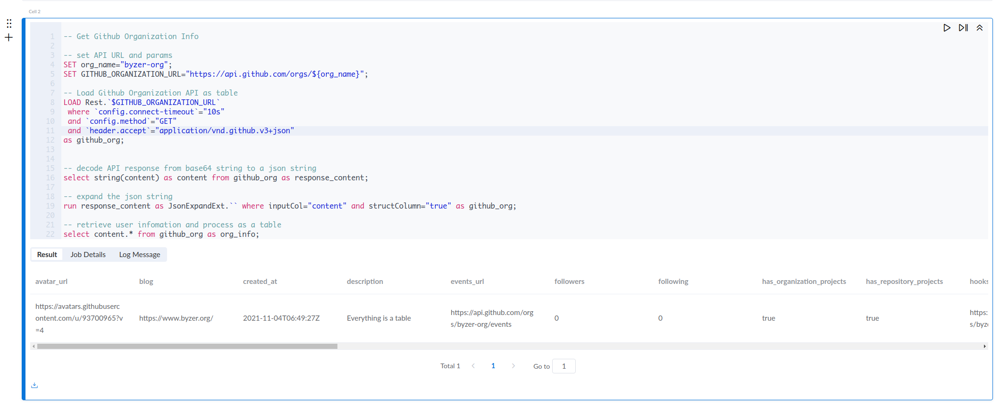
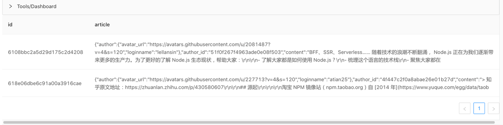
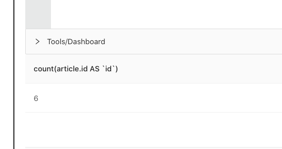

# 加载 REST API 数据源

## REST API 获取数据代码示例
下面是一个基于 Github 的 open api 来获取 Github Organization 信息的简单例子：

```sql
-- Get Github Organization Info

-- set API URL and params
SET org_name="byzer-org";
SET GITHUB_ORGANIZATION_URL="https://api.github.com/orgs/${org_name}";

-- Load Github Organization API as table
LOAD Rest.`$GITHUB_ORGANIZATION_URL` 
 where `config.connect-timeout`="10s"
 and `config.method`="GET"
 and `header.accept`="application/vnd.github.v3+json"
as github_org;


-- decode API response from binary to a json string
select string(content) as content from github_org as response_content;

-- expand the json string 
run response_content as JsonExpandExt.`` where inputCol="content" and structColumn="true" as github_org;

-- retrieve user infomation and process as a table
select content.* from github_org as org_info;
```

在这个例子中，一共分为五个步骤：
- 通过 `SET` 语法定义的一些变量，比如 API 的参数
- 通过 `LOAD` 语法定义的一个 API 调用体，给 Github 发送 API 请求
- 得到 Github REST API 的返回体，这个返回体是一个 binary 的字符串，将其通过 decode 解析为一个可读的 json string
- 通过 `RUN` 语法的执行 Byzer 的内置插件 `JsonExpandExt`，对 Json 进行展开，将 Json String （content 列）解析为一个结构化的 Json 数据
- 可以通过 get_json_object 和 json path 的方式来按需获取 Json 中的 key 以及 value， 但该例中 Json 已经被 `JsonExpandExt` 结构化，所以可以直接通过 `key.key` 的方式来获取 Json 中的值 


## LOAD 语句

上述示例中 `LOAD` 语句的组成:
- 使用 `Rest` 关键字标志此次加载的数据源是 REST API，可以在反引号內直接填写访问的 REST API URL，也可以通过引用 SET 变量的方式来传递这个 URL
- 使用 `where` 从句来设置 REST API 的参数。
    - `config.connect-timeout` 代表 API 的请求超时时间，此例中为 `10s`，
    - `config.method` 代表 API 的 REST 请求方法，此例中为 `GET`
    - `header.accept` 代表 API 可以请求的内容类型，此例中为 `application/vnd.github.v3+json`

上述代码的执行结果会将 Github 中 Byzer Org 的信息以表的方式进行返回，内容如下图




### REST API 数据源基本参数

和我们熟知的使用其他命令来调用 REST API 一样，比如 `curl`，`postman` 等，用户需要自己来填写 REST API 的请求参数，大致可以分为一下 3 类：
- `config`：设置 rest 请求信息，如 `method`/`timeout` 等
- `header`：设置请求头
- `body/form`：设置请求参数，随 `method`/`content-type` 不同而变化 

| 参数名                  | 参数含义                                                     |
| ----------------------- | ------------------------------------------------------------ |
| config.connect-timeout  | http 请求超时时间                                             |
| config.socket-timeout   | socket 连接的超时时间                                         |
| config.method           | http 请求行中的请求方法，如：`config.method`="GET"            |
| config.retry            | 状态码不为 200 时尝试次数                                      |
| config.retry.interval   | 重试时等待的时间，默认为 1s                                   |
| header.[paramter]           | http 请求头部参数，如：`header.content-type`="application/json" |
| body                    | http 的请求数据，如：`body`="{}"                              |
| form.file-name          | 上传文件的名称，当 POST 请求的 header.content-type 为 multipart/form-data 时有效 |
| form.file-path          | 上传文件的路径，当 POST 请求的 header.content-type 为 multipart/form-data 时有效 |
| form.*                  | 请求体参数；如果是 GET 请求时表示请求行的参数，如果是 POST 请求为请求数据 |


> **注意：**
> 1. 所有参数值都必须是字符串，也就是必须用 `""` 或者 `'''` 括起来
> 2. 参数值可以使用 `SET` 变量进行传递


## REST API 数据源的返回值

LOAD 语句将请求的返回值设置为一张表。其中有两列：
- `content`：API 的返回体，是一个 binary 字符串
- `status`：http 状态码

如下所示：

|content | status |
|--------|--------|
|  (binary content)| (http status)|

这里我们可以通过 `select string(content) as content` 的方式，来将 base64 加密后的反解为可读的字符串。

> 如果是通过 REST API 数据源进行多次分页请求调用，则此处返回表会有多行，每行代表一次请求的结果。你可以使用 [SparkSQL Build-in Function](https://spark.apache.org/docs/latest/api/sql/) 或自定义 UDF 对他们进行聚合和其他操作。


## 分页调用 REST API 数据源获取数据

有时候受限于一次 HTTP 请求的大小限制，或处于对系统的负载保护，某些系统的 REST API 需要根据某些字段进行分页来进行数据获取，最后将所有的数据进行合并处理。 

Byzer 的 REST API 数据源支持动态获取一次　API 调用返回值中的字段，自动进行进行多次 API 请求调用，并将所有返回值组合成一张表。

### 1. 分页获取数据示例

下面以 JIRA 的 Open API 获取工时记录的场景来举一个稍微复杂些的例子：

```sql
> SET CLIENT_ID = `select CLIENT_ID from token` where type='sql' and mode = 'runtime';
> SET CLIENT_SECRET = `select CLIENT_SECRET from token` where type='sql' and mode = 'runtime';
> SET REFRESH_TOKEN = `select REFRESH_TOKEN from token` where type='sql' and mode = 'runtime';

-- get access token from refresh token
> SET JIRA_URL="https://auth.atlassian.com/oauth/token";
> LOAD Rest.`$JIRA_URL` 
 where `config.connect-timeout`="10s"
 and `config.method`="POST"
 and `header.content-type`="application/json"
 and `body`='''{ 
  "grant_type": "refresh_token",
  "client_id": "${CLIENT_ID}",
  "client_secret": "${CLIENT_SECRET}",
  "refresh_token": "${REFRESH_TOKEN}"
 }
'''
as token_1;

-- retrieve access token from response
> SET acc_ko = `SELECT get_json_object(string(content),'$.access_token')  FROM token_1 AS token_2` WHERE type = "sql" and mode = "runtime";

-- check accessible resources from jira and get id
> LOAD Rest.`https://api.atlassian.com/oauth/token/accessible-resources` where
 `config.connect-timeout`="10s"
 and `config.method`="GET"
 and `header.Authorization`='''Bearer $acc_ko'''
 and `header.Accept`="application/json"
 as site_id;
 

> SET id = `select replace(get_json_object(string(content),'$[*].id'),"\"","") from site_id as site_content` where type = "sql" and mode = "runtime" and scope = "session";

-- use id to get the worklog
> SET since = 1578535668423;
> SET worklog_url= "https://api.atlassian.com/ex/jira/${id}/rest/api/3/worklog/updated?since=${since}";

-- retrieve the worklog by id and from {since} time
> LOAD Rest.`$worklog_url` where
 `config.connect-timeout`="10s"
 and `config.method`="GET"
 and `header.Authorization`='''Bearer $acc_ko'''
 and `header.content-type`="application/json"
 and `config.page.values`="$.nextPage"
 and `config.page.next`="{0}"
 and `config.page.limit`="20"
 as worklog1;

select string(content) as content from worklog1 as worklog2;
```

上述获取 Jira 这个例子中，一共做了三次的 API 的调用：
- 通过 REFRESH TOKEN 来拿 ACCESS TOKEN， 作为后续 API 调用的认证信息
- 通过 ACCESS TOKEN 查询 JIRA 系统来获取可访问的资源，获得的是一个 ID 的集合
- 根据获取的 `${ID}` 以及一个起始时间 `$｛SINCE｝` 来请求 JIRA 中的 worklog 数据

前两次 API 调用都是比较简单的调用，而获取 Jira Worklog 的 API 则会比较复杂，因为该 API 一次返回的数据行数最大为 1000 行，所以当数据行数超过 1000 行时，这里就需要采用翻页的机制，来进行对 Jira Worklog 进行多次的请求，最后将每次的返回合并成到 worklog1 这张表中。

这里是通过 `config.page.values`，`config.page.next`，`config.page.limit` 三个参数来控制分页的。下面来详细解释如何在 REST API 数据源分页参数和分页策略。


### 2. REST API 数据源分页参数

当前 Rest 数据源总共有如下的分页参数

| 参数名                  | 参数含义                                                     |
| ----------------------- | ------------------------------------------------------------ |
| config.page.values | 配置分页策略，无默认值，详细见下述解释 |
| config.page.next   | 分页请求的下一页的地址，值为该分页请求 URL 模板，支持通过位置占位符如 {0}，在程序运行时会进行自动渲染替换 |
| config.page.limit | 配置最大分页次数，默认 `1`，表示只请求一次分页 Rest 接口  |
| config.page.stop | 配置分页请求的停止条件，无默认值，可选值 `sizeZero:$.{jsonPath}`， `notExists:$.{jsonPath}`，`equals:$.{jsonPath}`  |
| config.page.retry| 配置每次分页最多尝试次数，默认 `3`  |
| config.page.interval | 每次分页的时间间隔，默认 `10ms`, 值可以写为 `10ms`, `10s`, `10m` 等，翻页请求的间隔时间，表示多次请求时的请求间隔。一些 SAAS 服务会对请求进行限流，如 120s 內只允许 100 次请求，这时可以设置这个参数为 `1200ms` 或 `1.2s`。|
| config.page.skip-params   | 是否忽略原有的 URL 的参数，默认 `false`，系统会把原有的一些参数给你自动带到 config.page.next 里去，比如 Rest.`http://domain?a=1`，其中 `a=1` 就是该 URL 中的参数 |

通常情况下，`config.page.values`，`config.page.next`，`config.page.limit` 几个参数是必须要使用的。 

> **注意** 如果上一次请求经过 `config.page.retry` 重试后，状态码不为 200 , 则会停止分页


### 3. REST API 数据源分页策略

REST API 数据源有三种分页策略，是根据 **`config.page.values`** 这个参数来进行控制的。您可以根据你要调用的 API 暴露的分页方式，来选择对应的分页策略。

当 `config.page.values` 的值：
- 使用 `auto-increment:` 为前缀时，则使用 AutoIncrementPageStrategy
- 使用 `offset:` 为前缀时，则使用 OffsetPageStrategy
- 无前缀时，使用 DefaultPageStrategy

该参数用于获取服务端响应正文的规则路径，通过 JsonPath 来解析，多条规则路径使用 `,` 进行分隔，如 `$.cursor,$.wow`， 了解更多使用方式，请参考[JsonPath](https://github.com/json-path/JsonPath)

这三种分页策略，您都可以使用 **`config.page.limit`** 来限制最大的分页次数，同时需要配置 **`config.page.next`** 来作为下一次分页 API 请求 URL 的渲染模板，表示下次请求的 url，你可以用 `{0},{1}... {n}` 替换从 `config.page.values` 获取的若干信息，并直接写到请求字符串中，如：

```sql
and `config.page.next`="http://www.example.com/rest/{0}/deleted?projects={1}"
```

其中 `{0}` 和 `{1}` 分别是一个变量，在不同的分页策略下会渲染成不同的值，会在下述介绍不同的分页策略中进行详细说明


如果分页的值是可以通过 jsonPath `$.nextPage` 直接获取请求链接，实际上就是下文介绍的 **DefaultPageStrategy**， 则可以像例子一样直接将 `config.page.next` 直接用变量 `{0}` 进行替换：

```sql
and `config.page.next`="{0}"
```


#### **AutoIncrementPageStrategy** 策略

此策略适合的 API 一般是需要传递类似 “第一次请求 page=1， 第二次page=2” 这种方式进行 API 的分页， 即此类 API 是会在 URL 通过一个指定的 page 参数用于控制分页获取数据的。那么对于用户而言，只要设置初始值和翻页停止条件即可。

`config.page.stop` 的值一共有三种，格式
- `notExists:$.{jsonPath}`：指定的 jsonPath 不存在，则停止分页
- `sizeZero:$.{jsonPath}`：指定的 jsonPath 是数组，并且数组值为空时，则停止分页
- `equals:$.{jsonPath}`：指定的 jsonPath 是字符串，并且该字符串的值等于指定的值，则停止分页

在 AutoIncrementPageStrategy 中，对于参数 `config.page.next` 中的变量 `{0}` 将会被渲染成一个新的 page 的值

下面我们来看两个示例， 有一个 API 的返回体结构如下

```
{
 status: 000,
 content: []
}
```
该 API 返回体中有两个字段，可以使用 jsonPath`$.status` 或 `$.content` 来进行表示。

a. 当分页停止条件设置为 
```sql
...
and `config.page.values`="auto-increment:0"
and `config.page.stop`="sizeZero:$.content"
```
其中 `config.page.values` 设置了分页策略为 `auto-increment:` 以及起始值 `0`；`config.page.stop` 设置分页停止条件，在示例中，`sizeZero:` 表示当 API 返回体中的指定字段 `content` 的格式是一个数组，并且该数据的长度为 `0` 时，则停止分页请求。


b. 当分页停止条件设置为
```sql
...
and `config.page.values`="auto-increment:0"
and `config.page.stop`="equals:$.status,999"
```
其中 `config.page.values` 设置了分页策略为 `auto-increment:` 以及起始值 `0`；`config.page.stop` 设置分页停止条件，在示例中，`equals:` 表示当该 API 返回体中指定字段 `status` 的值为 `999` 时，则停止分页请求


#### **OffsetPageStrategy** 策略

此策略适合的 API 一般会通过在 URL 中暴露类似 `start` 和 `offset` 两个参数，来指明 API 的调用起点以及每次 API 调用获取数据行数的 offset 偏移量。

在 OffsetPageStrategy 策略中，对于参数 `config.page.next`的值，类似于 `https://host/path/to/xxxx/start={0}`这么一个 API，用于指明下次的分页请求的 API， 变量 `{0}` 在每次调用的时候将会被渲染成一个新的 start 的值

对于这种类型的 API，参数填写示例如下：

```sql
and `config.page.values`="offset:100,100"
and `config.page.stop`="equals:$.status,999"
```
`config.page.values` 的值的格式 `offset:${limit},${offset}`, 此机制和 MySQL 中的 `limit n offset m` 一致， `${limit}` 代表 API 一页请求回来的数量，`${offset}` 是下一次分页请求的偏移量。停止分页的机制和 AutoIncrementPageStrategy 保持一致


#### **DefaultPageStrategy** 策略

此策略一般适合于将分页信息作为 API 返回体中的一个字段返回给调用方的 API，
此时一般都是可以通过 JsonPath 来从返回结果中获取到下一分页的信息。

对于这类型的 API，调用时不需要设置停止分页的条件 `config.page.stop`，只需要在 `config.page.values` 中写入获取下一分页信息字段的 jsonPath 即可。当某次 API 调用的返回中不包含此字段，则自动停止分页

对于这种类型的 API，假设 API 返回中通过字段 `pageBase64JsonPath` 来给出下一个分页的值， 那么参数填写示例如下：

```sql
and `config.page.values`="$.pageBase64JsonPath"
and `config.page.next`="{0}"
```
对于此类策略，一般情况 `config.page.next` 的值可以直接使用变量 `{0}`，`{0}` 会被渲染成从 API 返回的数据结果中抽取出的分页信息。


## 同时多次调用 API

我们在使用 API 的时候有时候会碰到一种情况，就是 API 的请求参数是有数量上限的，所以需要将参数进行分组，进行多次 API 调用。

这种情况使用编程思维来解释大概是下面这样：

```
response = []
for parameters in each bucket:
   response.add(call_api(parameters))
```

Byzer 语言内置了一个 UDF `rest_request` 来帮助解决这个问题，下面我们来举一个实际的例子， Jira 的 Open API 中有一个是通过传入一组 id 来获取 worklog 的列表的，使用 LOAD 语句的写法如下：

```sql
-- ids is an variable which presents an id array, size < 1000

> SET worklog_list_url = 'https://api.atlassian.com/ex/jira/xxxxxxxxxxx/rest/api/3/worklog/list';

load Rest.`$worklog_list_url` 
where `config.connect-timeout`="10s"
 and `config.method`="POST"
 and `header.content-type`="application/json"
 and `header.Authorization`='''Bearer $acc_ko'''
 and `body`='''{ 
  "ids": $ids
 }
'''
as worklog_list_bucket;
```

这是一个很简单的 API POST 请求调用，在 request body 中传入一个 ids 数组作为参数 "ids" 的值。但该 API 会对 "ids" 这个参数进行一个限流的策略，传入的数组的长度不能大于 1000。 

但我们在写脚本的时候，ids 这个数组一般是动态生成的，我们没有办法确保该数组的长度一定小于 1000，所以此时我们可以将 ids 数组按 1000 进行分桶操作，通过 `rest_request` 这个 udf 来进行同时多次 API 调用，每次调用都只传入一个桶的 id，代码处理示例如下：

```sql

-- split ids to multiple buckets by window function 
> select ceil(row_number() over (order by ids) / 1000) as bucket, ids from worklog_allIds as ids_in_bucket;

-- build a map <bucket_id, id_array>
> select bucket, concat("[", array_join(collect_list(ids), ","), "]") as ids from ids_in_bucket group by bucket as id_arrays_by_buckets;
-- The result
--   bucket | ids
--   1      "[100506,100507,100508,100509,100510,100511,100512,100513]"
--   2      "[100501, 100517]"


> SET worklog_list_url = 'https://api.atlassian.com/ex/jira/xxxxxxxxxxx/rest/api/3/worklog/list';


-- use rest_request udf, pass ids by using map() 
> select  string(rest_request(
    "$worklog_list_url","POST", -- url/method
    map("body",concat('''{ "ids": ''', ids, '''}''')), -- params
    map("Content-Type" , "application/json", "Authorization", "Bearer $acc_ko"), -- headers
    map() -- config
))  as content from id_arrays_by_buckets as worklog_list2;

```

从上述示例，我们先将 ids 按照 1000 个一桶通过窗口函数进行分桶操作（给每 1000 个 id 打一个 bucket 的标记）；借着我们通过 group by 将 bucket 相同的 id， 拼成一个新的数组，这样我们就获得了 n 个 id 数组组成的一个列。

在调用 `rest_request` 时，我们填入 5 个参数，参数间按逗号 `,` 分隔
- `API URL`: API 的 URL
- `HTTP method`： 即 `GET/POST/DELETE/PUT`
- `API Parameters`：通过 map 函数，将 http 的请求的参数一次填入，同时支持 URL Paramters，或者 Request Body， 以 Key-Value 的方式进行填写， 格式为 `map("param_1", "value1", "param_2", "value2" ...)`
- `API Headers`: 通过 map 函数，将 http 的请求头一次填入，以 Key-Value 的方式进行填写， 格式为 `map("header_1", "value1", "header_2", "value2" ...)`
- `config 参数`: 通过 map 函数填入 Byzer 引擎 REST API 数据源的 config 参数， 以 Key-Value 的方式进行填写， 格式为 `map("param_1", "value1", "param_2", "value2" ...)`


`rest_request` 的返回结果，会将每一次 API 请求的结果追加进表的一行，以上述示例为例说明， 假如我们一共有 5 个桶的 id，即 ids 数组列有 5 行，那么经过 `rest_request` 调用后，结果表 `worklog_list2` 中会包含 5 行返回，每一行是每一次单独请求的结果。


## 更多 REST API 调用示例


Rest 数据源可以让 Byzer-lang 脚本更加灵活，可以使用该数据源完成非常复杂的 REST API 交互。Rest 数据源支持简单的 REST API 调用，也支持直接在 Rest 数据源中实现分页数据的读取。


### 1. 使用 POST 方法将 json string 作为 Request body

下述例子是调用 Byzer 引擎的 `/run/script` 的 api，来执行一段 byzer 的 sql 脚本，`body` 参数的值是 request body，在其中填写了 `/run/script` 这个请求的参数

```sql
SET ENGINE_URL="http://127.0.0.1:9003/run/script"; 

load Rest.`$ENGINE_URL` where

 `config.connect-timeout`="10s"

 and `config.method`="post"

 and `header.content-type`="application/json"

 and `body`='''

 { 

   "executeMode": "query",

   "sql": "select 1 as a as b;",

   "owner": "admin",

   "jobName": "f39ba3b2-0a28-4aa2-806e-5412813c995b"

 }

'''

as table1;

-- 获取接口返回结果

select status, string(content) as content  

from table1 as output;
```

执行结果：

| status | content     |
| ------ | ----------- |
| 200    | [{"a":"1"}] |


### 2. 使用 GET 发起 Form 表单请求

下面这个例子展示了使用 cnnodejs 的一个 api 来获取 topics 相关的内容，其中请求参数是通过 `form` 的参数进行传递的

```sql
SET TOPIC_URL="https://cnodejs.org/api/v1/topics"; 

load Rest.`$TOPIC_URL` where

 `config.connect-timeout`="10s"

 and `config.method`="get"

 -- will retry 3 times if api call failed

 and `config.retry`="3"

 -- below lists the parameters of form

 and `form.page`="1"

 and `form.tab`="share"

 and `form.limit`="2"

 and `form.mdrender`="false" 

as cnodejs_articles;


-- decode API response from base64 string to a json string
select string(content) as content from cnodejs_articles as response_content;

-- expand the json string 
run response_content as JsonExpandExt.`` where inputCol="content" and structColumn="true" as cnodejs_articles;

-- retrieve user infomation and process as a table
select content.data from cnodejs_articles as cnodejs_articles_info;
```

在这里，我们发起了 get 请求，请求参数可以放到 URL 里，也可以放到`form.[key]` 里。这些参数最终会被拼接到 URL 中。

执行结果：

| data |
| ------ |
| [ { "author": { "avatar_url": "https://avatars.githubusercontent.com/u/156269?v=4&s=120", "loginname": "fengmk2" }, "author_id": "4efc278525fa69ac6900000f", "content": "https://registry.npmmirror.com 中国 npm 镜像源在2013年12月开始就使用基于 koa 的 https://github.com/cnpm/cnpmjs ......    |


### 3. 设置动态渲染参数

动态渲染参数可以在 `:{....}` 中执行代码。其语法和 if/else 里的条件表达式相同，用于返回一个变量，该变量会以字符串形式返回。所以可以写的更复杂，比如：

```sql
and `form.created`=''':{select split(:create_at,":")[0] as :ca; :ca}'''
```

渲染动作产生在运行时，所以可以很方便的获取的参数。

下面我们看一个具体的例子：

```sql
SET TOPIC_URL="https://cnodejs.org/api/v1/topics"; 

load Rest.`$TOPIC_URL` where

 `config.connect-timeout`="10s"

 and `config.method`="get"

 and `form.page`=''':{select 1 as :b;:b}'''

 and `form.tab`="share"

 and `form.limit`="2"

 and `form.mdrender`="false" 

as cnodejs_articles;


select status, string(content) as content  

from cnodejs_articles as output;
```


在 `form.page` 参数中我们设置的代码包含一段表达式：

```sql
 and `form.page`=''':{select 1 as :b;:b}'''
```

其中的`:{select ``1`` as :b;:b}`会动态执行，并将结果渲染到模板代码中，则实际执行的 SQL 内容变成了：

```sql
 and `form.page`='''1'''
```

所有 form 参数都支持动态渲染参数。


### 4. 如何解析结果集

下面演示一个结果集解析的 demo，为了方便处理JSON结果集，我们结合 JsonExpandExt ET 和 explode 函数，代码示例如下所示：

```sql
SET ENGINE_URL="https://cnodejs.org/api/v1/topics";

load Rest.`$ENGINE_URL` where

  `config.connect-timeout`="10s"

  and `config.method`="get"

  and `form.page`=''':{select 1 as :b;:b}'''

  and `form.tab`="share"

  and `form.limit`="2"

  and `form.mdrender`="false"

as raw_cnodejs_articles;


select status, string(content) as content

from raw_cnodejs_articles as temp_cnodejs_articles;


-- 提取 JSON 结构内容（也就是 condejs 列表页面内容）并将其保存为 struct field 以便我们使用 JSON 数据

run temp_cnodejs_articles as JsonExpandExt.``

where inputCol="content" and structColumn="true"

as cnodejs_articles;


-- 转换列表页上的一行数据来操控行（即展开嵌套的 JSON 数据）
select explode(content.data) as article from cnodejs_articles as articles;
```


结果如下：



我们可以看到，我们很容易将表展开，从而实现更复杂的需求。


### 5. 分页数据的读取

我们以 Node.js 专业中文社区的列表页为例，代码如下所示：

```sql
SET ENGINE_URL="https://cnodejs.org/api/v1/topics"; 

load Rest.`$ENGINE_URL` where

`config.connect-timeout`="10s"

and `config.method`="get"

and `form.page`=''':{select 1 as :b;:b}'''

and `form.tab`="share"

and `form.limit`="2"

and `form.mdrender`="false"


and `config.page.next`="https://cnodejs.org/api/v1/topics?page={0}"

and `config.page.skip-params`="false"

-- 自动增量这项特殊配置是为了自动增加页数而设计。`:1` 意味着页数值从1开始。

and `config.page.values`="auto-increment:1"

and `config.page.interval`="10ms"

and `config.page.retry`="3"

and `config.page.limit`="2"


as raw_cnodejs_articles;


set status= `select status from raw_cnodejs_articles` where type="sql" and mode="runtime";


-- 如果状态不是200，则模拟不带数据的新表

!if ''' :status != 200 '''; 

!then; 

    run command as EmptyTableWithSchema.`` where schema='''st(field(content,binary),field(status,integer))''' as raw_cnodejs_articles;    

!fi;


select status, string(content) as content  

from raw_cnodejs_articles as temp_cnodejs_articles;


run temp_cnodejs_articles as JsonExpandExt.`` 

where inputCol="content" and structColumn="true" 

as cnodejs_articles;


select explode(content.data) as article from cnodejs_articles as articles;


select count(article.id) from articles as output;
```


结果如下，可以看到有 6 条数据，一共进行了三次分页




对于那种需要从结果集获取分页参数的，则可以使用 jsonpath 进行抽取并且进行渲染，相关配置如下：

```sql
-- 为了得到 `cursor` 和 `wow` 在 page.next 中使用动态参数。

and `config.page.next`="https://cnodejs.org/api/v1/topics?page={0}"

-- 不能携带表单中携带的请求参数。

and `config.page.skip-params`="true"

-- 使用 JsonPath 来解析请求中的分页信息。更多信息，请参考: https://github.com/json-path/JsonPath。

and `config.page.values`="$.path1;$.path2"

-- 为每个分页请求设置间隔时间。

and `config.page.interval`="10ms"

-- 为每个分页请求设置设置失败重试次数。

and `config.page.retry`="3"

-- 设置请求页面的数量。

and `config.page.limit`="2"
```

通过json path抽取的值会作为位置参数去重新生成 config.page.next 页。


### 6. 使用 POST 请求上传文件

```sql
save overwrite command as Rest.`http://lab.mlsql.tech/api/upload_file` where

`config.connect-timeout`="10s"

and `header.content-type`="multipart/form-data"

and `header.Content-Type`="multipart/form-data; boundary=$you_boundary"

and `header.Cookie`="JSESSIONID=$your_jsession_id;"

-- upload file path

and `form.file-path`="/tmp/upload/test_date.csv"

-- upload file name

and `form.file-name`="test_date.csv"

and `config.method`="post"

;
```

我们请求的 byzer-notebook 是需要授权的，我们通过`header.`设置 Jsession 等授权信息。


### 7. 忽略请求结果异常

对于 http 服务端响应的状态码不是 200 的情况，如果不想报错，可以结合分支加空表的模式：

```sql
-- 这里的 url 是错误的, 因此状态是404。

-- 它将在之后的脚本中抛出异常。

SET ENGINE_URL="https://cnodejs.org/api/v1/topics1"; 

load Rest.`$ENGINE_URL` where

 `config.connect-timeout`="10s"

 and `config.method`="get"

 and `form.page`=''':{select 1 as :b;:b}'''

 and `form.tab`="share"

 and `form.limit`="2"

 and `form.mdrender`="false" 

as raw_cnodejs_articles;


set status= `select status from raw_cnodejs_articles` where type="sql" and mode="runtime";


-- 如果状态不是200，则模拟一个不带数据的新表。

!if ''' :status != 200 '''; 

!then; 

    run command as EmptyTableWithSchema.`` where schema='''st(field(content,binary),field(status,integer))''' as raw_cnodejs_articles;    

!fi;


select status, string(content) as content  

from raw_cnodejs_articles as temp_cnodejs_articles;


run temp_cnodejs_articles as JsonExpandExt.`` 

where inputCol="content" and structColumn="true" 

as cnodejs_articles;


-- 因为这段内容中没有字段数据，应再次模拟表。

-- 从 condejs_articles 中选择 explode(content.data) 作为 article；

-- 从 articles 中选择 article.id, article 作为输出；
```


