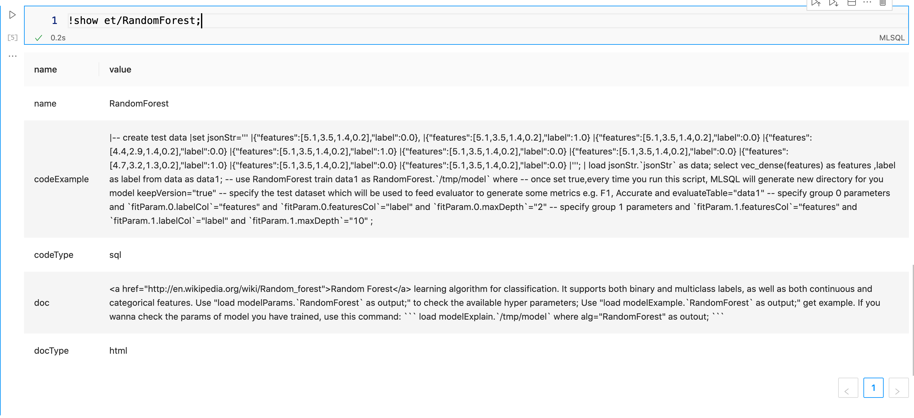

# 参数自省机制介绍

MLSQL ET设计时，尽可能实现自省。所谓自省，就是用户可以通过ET提供的辅助命令完成对ET的一些二次封装。


## 罗列所有ET

```SQL
-- 获取所有ET

!show et;


-- 过滤某个ET

!lastCommand named ets;

select * from ets where name like "%Random%" as output;
```


这里DocType会指定了文档的类型，方便前端做渲染（比如是html或者markdown等）。


查看某个ET文档：


```SQL
!show et/RandomForest;
```




这个命令会显示更多的信息，包括示例文档。 示例中，codeType显示“sql”，表示是标准的MLSQL文本。 doc是html格式的文档。这些信息都可以方便前端做渲染，帮助用户更好的使用该 ET。


## 显示ET的参数


```SQL
load modelParams.`RandomForest` as output;
```


这里的 param表示参数，description则是对参数的描述。 value则会以字符串的形式把默认值、当前设置的值显示出来。 这些参数是给用户查看的。为了方便程序的二次封装使用，我们在新的[PR](https://github.com/allwefantasy/mlsql/pull/1553)，新增了一个extra参数。该extra丰富了参数的描述。接下来我们用上面的例子做一下演示。


keepVersion 参数拥有extra 参数，该参数为Json格式，具体内容如下：


```JSON
{

    "name":"keepVersion", // 参数名

    "values":[

        {

            "name":"keepVersion", // 组件名称

            "value":"true" // 枚举值

        },

        {

            "name":"keepVersion", // 组件名称

            "value":"false" // 枚举值

        }

    ],

    "extra":{ // 附加信息

        "doc":"If set true, then every time you run the \" +\n \"algorithm, it will generate a new directory to save the model.", //参数介绍

        "label":"", // 参数标题

        "options":{ // 扩展内容

            "valueType":"string", // 值类型[1]

            "derivedType":"NONE", // 伴生类型[2]

            "required":"false",  // 是否必要，非必要：false，必要：true

            "defaultValue":"true", // 默认值，表示keepVersion默认值为true

            "currentValue":"undefined" // 当前值，如果没有的话，则为undefined

        }

    },

    "tpe":"Select",  // 前端组件类型[3]

    "valueProvider":{


    }

}
```


参数名称为`keepVersion `， 基础类型为 `Select`，也就是一般使用单选框。可选值为 `values`，可以看到是kv形式的。在 `extra`中，我们还可以获得更多信息，比如doc是该字段的描述信息， label 是展示给用户看到的字段名称， `extra.options` 则提供了该参数的默认值以及被新设置的值。如果没有的话，则为undefined。


可以看到，根据这个json字段的信息，前端已经可以获取到足够的信息去渲染该字段了。


另外，我们需要在参数定义中维护一个表示参数依赖的字段，用于展示伴生参数的依赖的参数。我们维护在*Dynamic类型的参数中，前端需要发起一次请求，请求通过*`*set*` *语法设置partitonType的值，最后结合*`*valueProviderName*` *生成判断是否是值依赖的代码。具体参考下面第6条。*

上述JSON示例中，注释`[数字]` 位置将在下面介绍。


### [1], 值类型可选值如下

| MLSQL值类型（valueType） | 备注             |
| ------------------------ | ---------------- |
| string                   | 字符串类型       |
| int                      | 整型类型         |
| float                    | 单精度浮点数类型 |
| double                   | 双精度浮点数类型 |
| array[int]               | 整型数组类型     |
| array[double]            | 浮点数数组类型   |
| boolean                  | 布尔类型         |
| array[string]            | 字符串数组类型   |
| long                     | 长整型           |
| ENUM                     | TreeSelect类型   |

### [2], 伴生类型

伴生类型 （derivedType），伴生即伴随其他参数产生而产生，伴生参数的显示需要紧随原生参数后面，由于参数的依赖关系有时会非常复杂，我们使用下面几种类型来描述不同的伴生类型数据结构：

- NONE，非伴生类型

- VALUE_BIND，值绑定，比如在 load 中选择了 csv format，才会出现的参数

- NOT_EMPTY_BIND，非空绑定，只有填写了某个参数，才会伴生出现

- DYNAMIC，动态类型，需要前端请求**valueProviderName中的sql**

这几种类型的具体使用方式，我们将在下面的【字段存在依赖关系】中详细介绍。


### [3], 前端组件类型

现支持的前端组件类型：

| 前端控件类型（tpe） | 备注         | 示例                                                         |
| ------------------- | ------------ | ------------------------------------------------------------ |
| Select              | 下拉菜单     | 即枚举类型。e.g. tableRepartition 中partitionType值范围为：["hash", "renge"]  |
| Text                | 文本框       | 多行文本。e.g. set rawData='''  {"jack":1,"jack2":2} {"jack":2,"jack2":3} ''';  |
| Input               | 输入框       | 单行文本。e.g. a="b" -20211216213245684.(null)) |
| CheckBox            | 复选框       | 可以选择多个值，且存在值范围。e.g. num="2,3"  |
| Radio               | 单选框       |                                                              |
| Switch              | Switch开关   | 即boolean类型，值范围为：[true,false]  |
| Slider              | 滑动轴       |                                                              |
| Rate                | Rate条       |                                                              |
| InputNumber         | 数字输入框   | 数字输入框，可以使用上下按钮调整值大小。e.g.   |
| TreeSelect          | 树形下拉框   |                                                              |
| TimePicker          | 时间控件     |                                                              |
| Dynamic             | 依赖关系绑定 | 依赖关系，用于描述属性的依赖绑定关系。会在下面【ET 参数自省机制开发规范】小节中介绍。 |
| Editor              | Editor控件   |                                                              |

其中，不同的控件类型会有不同的数据结构，下面主要介绍常用的几种控件数据结构。

- Select: 以**keepVersion**为例，结构如下所示。

```JSON
{

    "name":"keepVersion", // 参数名

    "values":[

        {

            "name":"keepVersion", // 组件名称

            "value":"true" // 枚举值

        },

        {

            "name":"keepVersion", // 组件名称

            "value":"false" // 枚举值

        }

    ],

    "extra":"{ // 附加信息，为jsonString

        "doc":"If set true, then every time you run the \" +\n \"algorithm, it will generate a new directory to save the model.", //参数介绍

        "label":"", // 参数标题

        "options":{ // 扩展内容

            "valueType":"string", // 值类型[1]

            "derivedType":"NONE", // 伴生类型[2]

            "required":"false",  // 是否必要，非必要：false，必要：true

            "defaultValue":"true", // 默认值，表示keepVersion默认值为true

            "currentValue":"undefined" // 当前值，如果没有的话，则为undefined

        }

    },

    "tpe":"Select",  // 前端组件类型[3]

    "valueProvider":{


    }"

}
```

- Text : 以ET TableRepartition为例，结构如下所示（已经注释的字段不再进行注释赘述）。

```JSON
{

    "name":"partitionNum",

    "value":"",

    "extra": "{

        "doc":"\n | Required. Number of repartition.\n | e.g. partitionNum = \"3\"\n ",

        "label":"Number of repartition",

        "options":{

            "valueType":"string", //值类型，可选值：string、boolean、int、long、float、double、array[int]、array[string]、array[boolean]

            "derivedType":"NONE",

            "required":"true",

            "defaultValue":"undefined",

            "currentValue":"undefined"

        }

    },

    "tpe":"Text",

    "valueProvider":{


    }"

}
```

- Input: 示例如下。

```Scala
{

    "name":"inputParam",

    "value":"",

    "extra": "{

        "doc":"",

        "label":"inputParam demo",

        "options":{

            "valueType":"string", //值类型，可选值：string、boolean、int、long、float、double、array[int]、array[string]、array[boolean]

            "derivedType":"NONE",

            "required":"true",

            "defaultValue":"undefined",

            "currentValue":"单行文本内容" // 单行文本内容

        }

    },

    "tpe":"Input",

    "valueProvider":{


    } "

}
```

- CheckBox : 示例如下。

```Scala
{

    "name":"checkBoxParam",

    "values": [

        {

            "name":"group1", // 组件名称

            "value":"input01" // 枚举值

        },

        {

            "name":"group1", // 组件名称

            "value":"input02" // 枚举值

        }

    ],

    "extra": "{

        "doc":"",

        "label":"inputParam demo",

        "options":{

            "valueType":"array[string]", // 数组类型，可选值：array[string]，array[int], array[double]

            "derivedType":"NONE",

            "required":"true",

            "defaultValue":[""],

            "currentValue": [""]  

        }

    },

    "tpe":"CheckBox",

    "valueProvider":{


    } "

}
```

- InputNumber: 示例如下。

```Scala
{

    "name":"InputNumberParam",

    "value":"",

    "extra": "{

        "doc":"",

        "label":"InputNumberParam demo",

        "options":{

            "valueType":"int", // 数值类型，可选值：int、double、long、float

            "derivedType":"NONE",

            "required":"true",

            "defaultValue":"-1",

            "currentValue":"1" 

        }

    },

    "tpe":"InputNumber",

    "valueProvider":{


    } "

}
```

- Dynamic：我们支持4种绑定类型(**derivedType**),分别为：`NONE`、`STATIC_BIND`、`DYNAMIC_BIND` 、`GROUP_BIND`;

其中`NONE` 为无绑定；`STATIC_BIND` 静态绑定会用枚举的方式绑定依赖关系，不需要拼接和查询依赖sql，通过**override**描述覆盖哪些属性值；DYNAMIC_BIND动态类型需要动态拼接sql，并查询返回依赖关系。


- 下面是STATIC_BIND的示例，以ET TableRepartition为例, 结构如下所示。

```JSON
{

    "name":"shuffle",

    "extra": "{

        "doc":"\n Whether to start shuffle during the repartition.\n",

        "label":"",

        "options":{

            "valueType":"string", //值类型，可选值：string、boolean、int、long、float、double、array[int]、array[string]、array[boolean]

            "derivedType":"STATIC_BIND"

            "required":"false",

            "defaultValue":"true",

            "currentValue":"undefined"

        }

    } ",

    "tpe":"Dynamic",

    "subTpe":"Select", // SQL结果类型，可选值：Select->枚举类型，Text->文本类型

    "depends":[":partitionType==hash"]

}
```

depends有两种表示方式：

- 字段名称，如：**"depends"**:["partitionType"]。表示shuffle字段依赖partitionType是否有值
- 依赖字段为冒号表达式，如：**"depends"**:[":partitionType==hash", ":partitionType==range"] 。表示为partitionType 为 hash时**shuffle需要显示，默认多个值是或的关系，如果存在复杂规则，需要使用DYNAMIC_BIND进行描述。**


如果是DYNAMIC_BIND（属性多对一依赖或者比较复杂的依赖情况），则使用如下：

```Java
{

    "name":"partitionCols",

    "extra": "{

        "doc":"\n Column used for repartition, must be specified when partitionType is range.\n e.g. partitionCols = \"col1\"\n",

        "label":"",

        "options":{

            "valueType":"string", //值类型，可选值：string、boolean、int、long、float、double、array[int]、array[string]、array[boolean]

            "derivedType":"DYNAMIC_BIND", //绑定类型：NONE->无绑定, DYNAMIC_BIND->动态绑定,STATIC_BIND->静态绑定

            "depends": // 下述属性为与的关系 该参数无绑定关系的uniq_depends， or_depends均为空数组

                    {},

            "required":"false",

            "defaultValue":"undefined",

            "currentValue":"undefined"

        }

    },

    "tpe":"Dynamic",

    "subTpe":"Select", // SQL结果类型，可选值：Select->枚举类型，Text->文本类型

    "depends":[ // 依赖的属性，可以为多个。如果存在与或非关系，在valueProviderName中动态描述

        "partitionType"

    ],

    "valueProviderName": // 动态查询属性依赖关系的sql，注意：需要前端按照自省机制规则拼接

    "\nset partitionType=\"\" where type=\"defaultParam\";\n!if ''' :partitionType == \"hash\" ''';\n!then;\n select true as enabled, false as required as result;\n!else;\n select true as enabled, false as required as result;\n!fi;\nselect * from result as output;\n"

}
```


对于很多算法，我们是wrap的mmlib的实现，里面已经存在很多参数，那么我们该如何将其参数自动转化为上述格式呢？


首先，系统会尝试自动转换，如下图：


可以看到，大部分算法的参数都会被自动转换。尽管如此，比如对于`featureSubsetStrategy` 他申明的是字符串，但其实是个枚举类型。此时，用户可以通过如下方式覆盖输出：


在 WowParams中，添加覆盖参数，从而得到新的渲染结果。这样我们就可以覆盖父类的参数。


现在我们再来看看引擎侧的开发者是如何描述这些信息的,用户只需要在他定义的ET组件中按如下方式定义参数即可:


```Scala
final val keepVersion: BooleanParam = new BooleanParam(this, "keepVersion",

  FormParams.toJson(

    Select(

      name = "keepVersion",

      values = List(),

      extra = Extra(

        doc = "If set true, then every time you run the \" +\n    \"algorithm, it will generate a new directory to save the model.",

        label = "",

        options = Map()), valueProvider = Option(() => {

        List(

          KV(Some("keepVersion"), Some("true")),

          KV(Some("keepVersion"), Some("false"))

        )

      })

    )

  )

)
```


如果参数之间互相有依赖，譬如只有选择了A字段，才能显示B字段，则可以定义一个没有含义的字段，里面使用 `Dynamic` 来描述已定义字段之间的依赖关系。前端根据Dynamic的信息来控制字段之间的依赖关系。下面是一个简单的示例：


```Lisp
val USER_NAME = Input(UserService.Config.USER_NAME, "")

val NAV_API_ID = Dynamic(

  name = "apiNavId",

  subTpe = "Select",

  

  depends = List(Params.USER_NAME.name),

  valueProviderName = ChooseAPINav.action)
```

> 值依赖的情况暂时不考虑。


这个表示，这个Dynamic类型也是`Select`, 字段名称是`apiNavId ` 他依赖参数 userName, 当用户填写了用户名后，前端可以根据URL `ChooseAPINav.*action* ` 获取到这个字段的值列表。


前端如何根据这些信息渲染表单，这里有一个我实现的参考项目[](https://github.com/allwefantasy/ar_runtime_web_console)，使用React开发。


## 字段存在依赖关系


以 `TableRepartition` 为例，当用户勾选了*partitionType字段，并且选择了* `*range*`*值时，此时，用户也必须填写* `*partitionCols*` *字段。 那么如何描述这种关系呢？这是第一个问题。 第二个问题，假设partitionCols 的是一个Select字段，并且内容需要根据 partitionType的选择值动态变化，这个该如何描述呢？*


下面是partitionCols的字段描述：


```Julia
final val partitionCols: StringArrayParam = new StringArrayParam(this, "partitionCols",

    FormParams.toJson(Dynamic(

      name = "partitionCols",

      extra = Extra(

        """

          |

          |""".stripMargin, label = "", options = Map(

          "valueType" -> "array[string]"

        )),

      subTpe = "Text",

      depends = List("partitionType"),

      valueProviderName =

        """

          |set  partitionType="" where type="defaultParam";

          |!if ''' :partitionType == "hash" ''';

          |!then;

          |   select false  as enabled  as result;

          |!else;

          |   select true as enabled  as result;

          |!fi;

          |select * from result as output;

          |""".stripMargin

    )

    ))
```


首先我们申明这是一个动态字段，该字段的行为依赖于`partitionType`。考虑到用户必须选择了partitionType并且勾选了`range`才需要触发这个字段。首先，如果用选择了partionType字段，那么就会触发前端发起一次请求，请求需要通过`set` 语法设置partitonType的值，最后结合`valueProviderName` 生成如下代码：


```SQL
-- 前端动态生成的语句

set partitionType="range";

----模板代码

set  partitionType="" where type="defaultParam";

!if ''' :partitionType == "hash" ''';

!then;

   select false  as enabled  as result;

!else;

   select true as enabled  as result;

!fi;

select * from result as output;
```


提交该代码，最后系统会输出 enabled = true（这里可以约定其他格式或者字段名称），也就是说，这个字段需要被启用。结合此时前端根据这个结果，把这个字段动态显示在前端。


如果动态字段在依赖的字段不同的值，对应必填和非必填状态，可以使用如下描述：


```Julia
final val partitionCols: StringArrayParam = new StringArrayParam(this, "partitionCols",

    FormParams.toJson(Dynamic(

      name = "partitionCols",

      extra = Extra(

        """

          |

          |""".stripMargin, label = "", options = Map(

          "valueType" -> "array[string]"

        )),

      subTpe = "Text",

      depends = List("partitionType"),

      valueProviderName =

        """

          |set  partitionType="" where type="defaultParam";

          |!if ''' :partitionType == "hash" ''';

          |!then;

          |   select true  as enabled,false as required  as result;

          |!else;

          |   select true as enabled,false as required  as result;

          |!fi;

          |select * from result as output;

          |""".stripMargin

    )

    ))
```


下面是完整的代码例子：


```Scala
package tech.mlsql.plugins.ets


import org.apache.spark.ml.param.{IntParam, Param, StringArrayParam}

import org.apache.spark.sql.expressions.UserDefinedFunction

import org.apache.spark.sql.mlsql.session.MLSQLException

import org.apache.spark.sql.{DataFrame, SparkSession, functions => F}

import streaming.dsl.auth.TableAuthResult

import streaming.dsl.mmlib._

import streaming.dsl.mmlib.algs.param.WowParams

import tech.mlsql.common.form._

import tech.mlsql.dsl.auth.ETAuth

import tech.mlsql.dsl.auth.dsl.mmlib.ETMethod.ETMethod

import tech.mlsql.version.VersionCompatibility


class TableRepartition(override val uid: String) extends SQLAlg with VersionCompatibility with WowParams with ETAuth {

  def this() = this("tech.mlsql.plugins.ets.TableRepartition")


  // 

  override def train(df: DataFrame, path: String, params: Map[String, String]): DataFrame = {


    params.get(partitionNum.name).map { item =>

      set(partitionNum, item.toInt)

      item

    }.getOrElse {

      throw new MLSQLException(s"${partitionNum.name} is required")

    }


    params.get(partitionType.name).map { item =>

      set(partitionType, item)

      item

    }.getOrElse {

      set(partitionType, "hash")

    }


    params.get(partitionCols.name).map { item =>

      set(partitionCols, item.split(","))

      item

    }.getOrElse {

      set(partitionCols, Array[String]())

    }


    $(partitionType) match {

      case "range" =>


        require(params.contains(partitionCols.name), "At least one partition-by expression must be specified.")

        df.repartitionByRange($(partitionNum), $(partitionCols).map(name => F.col(name)): _*)


      case _ =>

        df.repartition($(partitionNum))

    }


  }


  override def auth(etMethod: ETMethod, path: String, params: Map[String, String]): List[TableAuthResult] = {

    List()

  }


  override def supportedVersions: Seq[String] = {

    Seq("1.5.0-SNAPSHOT", "1.5.0", "1.6.0-SNAPSHOT", "1.6.0")

  }


  override def doc: Doc = Doc(MarkDownDoc,

    s"""

       |

    """.stripMargin)


  override def codeExample: Code = Code(SQLCode,

    """

      |

    """.stripMargin)


  override def batchPredict(df: DataFrame, path: String, params: Map[String, String]): DataFrame = train(df, path, params)


  override def load(sparkSession: SparkSession, path: String, params: Map[String, String]): Any = ???


  override def predict(sparkSession: SparkSession, _model: Any, name: String, params: Map[String, String]): UserDefinedFunction = ???


  final val partitionNum: IntParam = new IntParam(this, "partitionNum",

    FormParams.toJson(Text(

      name = "partitionNum",

      value = "",

      extra = Extra(

        """

          |Split table into target partition num.

          |""".stripMargin, label = "", options = Map(

          "valueType" -> "int"

        )))

    ))

  final val partitionType: Param[String] = new Param[String](this, "partitionType",

    FormParams.toJson(Select(

      name = "partitionType",

      values = List(),

      extra = Extra(

        """

          |

          |""".stripMargin, label = "", options = Map(

        )), valueProvider = Option(() => {

        List(

          KV(Option("partitionType"), Option("range")),

          KV(Option("partitionType"), Option("hash"))

        )

      })

    )

    ))


  final val partitionCols: StringArrayParam = new StringArrayParam(this, "partitionCols",

    FormParams.toJson(Dynamic(

      name = "partitionCols",

      extra = Extra(

        """

          |

          |""".stripMargin, label = "", options = Map(

          "valueType" -> "array[string]"

        )),

      subTpe = "Select",

      depends = List("partitionType"),

      valueProviderName =

        """

          |set  partitionType="" where type="defaultParam";

          |!if ''' :partitionType == "hash" ''';

          |!then;

          |   select true  as enabled  as result;

          |!else;

          |   select false as enabled  as result;

          |!fi;

          |select * from result as output;

          |""".stripMargin

    )

    ))


  override def explainParams(sparkSession: SparkSession): DataFrame = _explainParams(sparkSession)


}
```


## 字段控制多组参数


比如 ET `Discretizer`, 他有一个method参数，该参数是枚举，有两个值，分别是buckeizer 和 quantile。 每个枚举值都关联了一组参数。 此时我们采用如下方式来做关联：


我们可以看到，现在 fitParam后面接的不再是group了，而是 tag__method__xxxx. 其中。 tag表示这个参数数据标签参数，该参数依赖于 method, 当method 对应的值为xxx时才显示。


实现代码如下：


```Scala
override def explainParams(sparkSession: SparkSession): DataFrame = {

  _explainTagParams(sparkSession, () => {

    Map(

      TagParamName(method.name, DiscretizerFeature.BUCKETIZER_METHOD) -> new Bucketizer(),

      TagParamName(method.name, DiscretizerFeature.QUANTILE_METHOD) -> new QuantileDiscretizer()

    )

  })

}


val method:Param[String] = new Param[String](this, "method", FormParams.toJson(

  Select(

    name = "method",

    values = List(),

    extra = Extra(

      doc = "",

      label = "",

      options = Map(

      )), valueProvider = Option(() => {

      List(

        KV(Some("method"), Some(DiscretizerFeature.BUCKETIZER_METHOD)),

        KV(Some("method"), Some(DiscretizerFeature.QUANTILE_METHOD))

      )

    })

  )

))
```


对于AutoML,则完全采用相同的技巧即可。但有一点不同的是，在Discretizer中，method是枚举互斥的，而在AutoML中，里面的值则是多选的。这个是前端实现时需要考虑的。


## 显示DataSource所有参数


MLSQL 使用 load/save 加载和保存数据。比如我们希望把数据保存成csv,那么我们肯定是需要查看保存过程中有哪些参数可用。可以使用如下命令：


```Bash
!show datasources/params/csv;
```


格式和ET 完全一致。唯一有区别的地方在于， 以codec 为例：


```JSON
{

  "name": "codec",

  "values": [

    {

      "name": "codec",

      "value": "bzip2"

    },

    {

      "name": "codec",

      "value": "gzip"

    },

    {

      "name": "codec",

      "value": "lz4"

    },

    {

      "name": "codec",

      "value": "snappy"

    }

  ],

  "extra": {

    "doc": "\nFor save; compression codec to use when saving to file.\nShould be the fully qualified name of a class implementing org.apache.hadoop.io.compress.CompressionCodec\nor one of case-insensitive shorten names (bzip2, gzip, lz4, and snappy). Defaults to no compression when a codec is not specified.\n",

    "label": "",

    "options": {

      "stage": "save",

      "defaultValue": "undefined",

      "currentValue": "undefined",

      "valueType":"String"

    }

  },

  "tpe": "Select",

  "valueProvider": {}

}
```


可以看到，extra.options里多个一个参数stage, stage 表名该参数仅用于save语法。 此外，虽然这是一个单选框，但是默认值是undefiend,意味着前端需要保证如果用户没有选择，那么不要传递该参数。