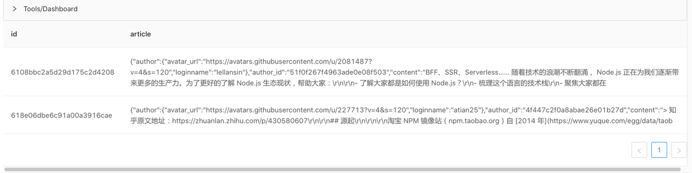
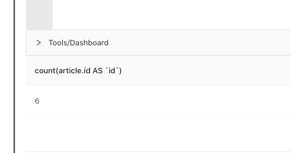

## 使用 byzer-lang 访问*REST API*

Rest 数据源可以让 byzer-lang 脚本更加灵活，可以使用该数据源完成非常复杂的 REST API 交互。Rest 数据源支持简单的 REST API 调用，也支持直接在 Rest 数据源中实现分页数据的读取。


## 如何使用

### 使用 POST 发起 Json 请求

```SQL
SET ENGINE_URL="http://127.0.0.1:9003/run/script"; 

load Rest.`$ENGINE_URL` where

 `config.connect-timeout`="10s"

 and `config.method`="post"

 and `header.content-type`="application/json"

 and `body`='''

 { 

   "executeMode": "query",

   "sql": "select 1 as a as b;",

   "owner": "admin",

   "jobName": "f39ba3b2-0a28-4aa2-806e-5412813c995b"

 }

'''

as table1;

-- 获取接口返回结果

select status, string(content) as content  

from table1 as output;
```

执行结果：

| status | content     |
| ------ | ----------- |
| 200    | [{"a":"1"}] |


### 使用 GET 发起 Form 表单请求

```SQL
SET ENGINE_URL="https://cnodejs.org/api/v1/topics"; 

load Rest.`$ENGINE_URL` where

 `config.connect-timeout`="10s"

 and `config.method`="get"

 -- 如果失败，会连续尝试三次

 and `config.retry`="3"

 -- The following `form` is the request line parameter, which supports setting dynamic rendering parameters

 and `form.page`="1"

 and `form.tab`="share"

 and `form.limit`="2"

 and `form.mdrender`="false" 

as cnodejs_articles;


select status from cnodejs_articles as output;
```

在这里，我们发起了 get 请求，请求参数可以放到 URL 里，也可以放到`form.[key]` 里。这些参数最终会被拼接到 URL 中。

执行结果：

| status |
| ------ |
| 200    |


### 设置动态渲染参数

动态渲染参数可以在 `:{....}` 中执行代码。其语法和 if/else 里的条件表达式相同，用于返回一个变量，该变量会以字符串形式返回。所以可以写的更复杂，比如：

```Python
and `form.created`=''':{select split(:create_at,":")[0] as :ca; :ca}'''
```

渲染动作产生在运行时，所以可以很方便的获取的参数。

下面我们看一个具体的例子：

```SQL
SET ENGINE_URL="https://cnodejs.org/api/v1/topics"; 

load Rest.`$ENGINE_URL` where

 `config.connect-timeout`="10s"

 and `config.method`="get"

 -- The following `form` is the request line parameter, which supports setting dynamic rendering parameters

 and `form.page`=''':{select 1 as :b;:b}'''

 and `form.tab`="share"

 and `form.limit`="2"

 and `form.mdrender`="false" 

as cnodejs_articles;


select status, string(content) as content  

from cnodejs_articles as output;
```


在 `form.page` 参数中我们设置的代码包含一段表达式：

```SQL
 and `form.page`=''':{select 1 as :b;:b}'''
```

其中的`:{select ``1`` as :b;:b}`会动态执行，并将结果渲染到模板代码中，则实际执行的 SQL 内容变成了：

```SQL
 and `form.page`='''1'''
```

所有 form 参数都支持动态渲染参数。


### 如何解析结果集

下面演示一个结果集解析的 demo，为了方便处理JSON结果集，我们结合 JsonExpandExt ET 和 explode 函数，代码示例如下所示：

```SQL
SET ENGINE_URL="https://cnodejs.org/api/v1/topics";

load Rest.`$ENGINE_URL` where

  `config.connect-timeout`="10s"

  and `config.method`="get"

  and `form.page`=''':{select 1 as :b;:b}'''

  and `form.tab`="share"

  and `form.limit`="2"

  and `form.mdrender`="false"

as raw_cnodejs_articles;


select status, string(content) as content

from raw_cnodejs_articles as temp_cnodejs_articles;


-- Extract the JSON structure of content (which is cnodejs list page content) and save it as a struct field for us to use JSON data

run temp_cnodejs_articles as JsonExpandExt.``

where inputCol="content" and structColumn="true"

as cnodejs_articles;


-- Convert one line of data on the list page to multiple lines (that is, expand the nested JSON data data)

select explode(content.data) as article from cnodejs_articles as articles;
```


结果如下：



我们可以看到，我们很容易将表展开，从而实现更复杂的需求。


### *分页数据的读取*

我们以 Node.js 专业中文社区的列表页为例，代码如下所示：

```Ruby
SET ENGINE_URL="https://cnodejs.org/api/v1/topics"; 

load Rest.`$ENGINE_URL` where

`config.connect-timeout`="10s"

and `config.method`="get"

and `form.page`=''':{select 1 as :b;:b}'''

and `form.tab`="share"

and `form.limit`="2"

and `form.mdrender`="false"


and `config.page.next`="https://cnodejs.org/api/v1/topics?page={0}"

and `config.page.skip-params`="false"

-- auto-increment is special config which designed for simple auto increment page num. `:1` means the value starts from 1.

and `config.page.values`="auto-increment:1"

and `config.page.interval`="10ms"

and `config.page.retry`="3"

and `config.page.limit`="2"


as raw_cnodejs_articles;


set status= `select status from raw_cnodejs_articles` where type="sql" and mode="runtime";


-- mock a new table without data if the status is not 200

!if ''' :status != 200 '''; 

!then; 

    run command as EmptyTableWithSchema.`` where schema='''st(field(content,binary),field(status,integer))''' as raw_cnodejs_articles;    

!fi;


select status, string(content) as content  

from raw_cnodejs_articles as temp_cnodejs_articles;


run temp_cnodejs_articles as JsonExpandExt.`` 

where inputCol="content" and structColumn="true" 

as cnodejs_articles;


select explode(content.data) as article from cnodejs_articles as articles;


select count(article.id) from articles as output;
```


结果如下，可以看到有 6 条数据，一共进行了三次分页




对于那种需要从结果集获取分页参数的，则可以使用 jsonpath 进行抽取并且进行渲染，相关配置如下：

```Lua
-- Use dynamic parameters in page.next to get `cursor` and `wow`

and `config.page.next`="https://cnodejs.org/api/v1/topics?page={0}"

-- Do not carry the request parameters carried in the form

and `config.page.skip-params`="true"

-- We use JsonPath to parse the pagination information in the results. For more information about how to use it, please refer to: https://github.com/json-path/JsonPath

and `config.page.values`="$.path1;$.path2"

-- Set the interval time for each paging request

and `config.page.interval`="10ms"

-- Set the number of failed retries for each paging request

and `config.page.retry`="3"

-- Set the number of requested pages

and `config.page.limit`="2"
```

通过json path抽取的值会作为位置参数去重新生成 config.page.next 页。


### 使用POST请求上传文件

```JavaScript
save overwrite command as Rest.`http://lab.mlsql.tech/api/upload_file` where

`config.connect-timeout`="10s"

and `header.content-type`="multipart/form-data"

and `header.Content-Type`="multipart/form-data; boundary=$you_boundary"

and `header.Cookie`="JSESSIONID=$your_jsession_id;"

-- upload file path

and `form.file-path`="/tmp/upload/test_date.csv"

-- upload file name

and `form.file-name`="test_date.csv"

and `config.method`="post"

;
```

我们请求的 byzer-notebook 是需要授权的，我们通过`header.`设置 Jsession 等授权信息。


### 忽略请求结果异常

对于 http 服务端响应的状态码不是 200 的情况，如果不想报错，可以结合分支加空表的模式：

```SQL
-- here the url is wrong, so the status == 404

-- it will throws exception in later script

SET ENGINE_URL="https://cnodejs.org/api/v1/topics1"; 

load Rest.`$ENGINE_URL` where

 `config.connect-timeout`="10s"

 and `config.method`="get"

 and `form.page`=''':{select 1 as :b;:b}'''

 and `form.tab`="share"

 and `form.limit`="2"

 and `form.mdrender`="false" 

as raw_cnodejs_articles;


set status= `select status from raw_cnodejs_articles` where type="sql" and mode="runtime";


-- mock a new table without data if the status is not 200

!if ''' :status != 200 '''; 

!then; 

    run command as EmptyTableWithSchema.`` where schema='''st(field(content,binary),field(status,integer))''' as raw_cnodejs_articles;    

!fi;


select status, string(content) as content  

from raw_cnodejs_articles as temp_cnodejs_articles;


run temp_cnodejs_articles as JsonExpandExt.`` 

where inputCol="content" and structColumn="true" 

as cnodejs_articles;


-- here we should mock table again since there no field data in content.

-- select explode(content.data) as article from cnodejs_articles as articles;

-- select article.id, article from articles as output;
```


## **配置参数**

| 参数名                  | 参数含义                                                     |
| ----------------------- | ------------------------------------------------------------ |
| config.connect-timeout  | http 请求超时时间                                             |
| config.socket-timeout   | socket 连接的超时时间                                         |
| config.method           | http 请求行中的请求方法，如：`config.method`="GET"            |
| config.retry            | 状态码不为 200 时尝试次数                                      |
| config.retry.interval   | 重试时等待的时间，默认为 1s                                   |
| header.[参数]           | http 请求头部参数，如：`header.content-type`="application/json" |
| body                    | http 的请求数据，如：`body`="{}"                              |
| form.file-name          | 上传文件的名称，当 POST 请求的 header.content-type 为 multipart/form-data 时有效 |
| form.file-path          | 上传文件的路径，当 POST 请求的 header.content-type 为 multipart/form-data 时有效 |
| form.*                  | 请求体参数；如果是 GET 请求时表示请求行的参数，如果是 POST 请求为请求数据 |
| config.page.next        | 翻页时下一页的 URL 地址                                        |
| config.page.skip-params | 翻页是是否携带数据源中配置的 URL 参数，比如：Rest.`http://domain?a=1`，其中a=1 就是配置的参数 |
| config.page.values      | 获取服务端响应正文的规则路径，多条规则路径使用','进行分隔，如：$.cursor,$.wow；我们是通过 JsonPath 来完成的，了解更多使用方式，请参考： https://github.com/json-path/JsonPath |
| config.page.interval    | 翻页请求的间隔时间，避免高频请求对服务端造成影响             |
| config.page.retry       | 翻页请求失败的重试次数，默认为 3                              |
| config.page.limit       | 翻页请求所使用的分页数，默认为 1，表示只请求一次分页 Rest 接口  |