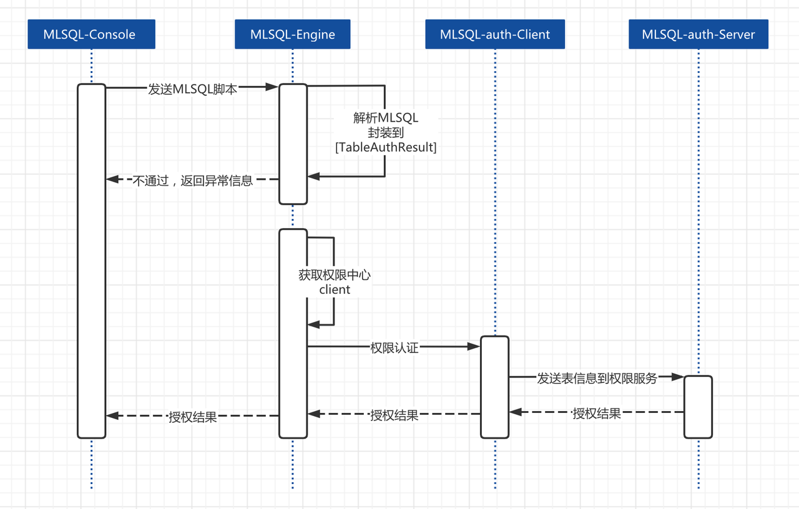
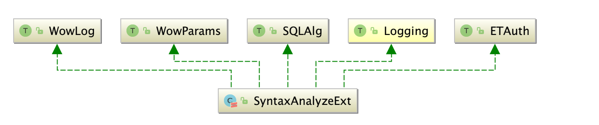

# 自定义 ET 插件开发

### ET 概念

Byzer具备足够灵活的扩展性，能够同时解决 Data + AI 领域的问题。我们提供了大量的插件，方便用户在数据处理、商业分析和机器学习的不同场景中使用 Byzer。这些插件类型包括: DataSource、ET、Script、App，我们都可以灵活的通过离线或者线上的方式注册到 Byzer Engine 中使用。

在 Byzer 中，ET（Estimator/Transformer 的简称）是一个非常重要的概念。通过 ET，我们可以完成非常多的复杂任务。包括：

1. 无法用 SQL 实现的特定的数据处理
2. 实现各种可复用的复杂的算法模型以及特征工程工具
3. 提供各种便利工具，比如发送邮件、生成图片等各种必需的工具


ET 也是实现将算法的特征工程从训练复用到预测时的核心，即大部分特征工程训练完成后都可以转化为一个函数，从而供给预测时使用。比如 `train,register,predict` 语法去抽象机器学习流程，通过 ET 一站式解决模型的训练、注册、预测的语法定制。本节，我们会以表抽取插件为例，来介绍如何用包装 Spark 内置的工具应用 于 Byzer 中。


### 查看系统可用 ET

可使用功能如下命令查看所有可用的 `ET`：

```
!show et;
```

### 模糊匹配查询 ET

需要模糊匹配某个 `ET` 的名字，可以使用如下方式：

```sql
!show et;
!lastCommand named ets;
select * from ets where name like "%Random%" as output;
```

同理，你也可以实现根据关键字模糊检索 `doc` 字段。

### 查看 ET 代码示例和使用文档

通过上面的方式，知道 `ET` 具体名字后，你可以查看该 `ET` 的使用示例等信息：

```
!show et/RandomForest;
```

### 查看 ET 可选参数

此外，如果你想看到非常详尽的参数信息，可以通过如下命令：

```
!show et/params/RandomForest;
```


为了方便灵活地开发 ET 插件，用户可以根据插件的类型，选择插件接入到哪个位置，我们提供了三种接入方式：

1. 直接修改 Byzer 源码
2. 独立成模块作为内置插件使用
3. 独立成项目作为外置插件使用

下面我们将重点介绍第一种方式——直接修改 Byzer 源码的方式添加 ET 插件。


### **ET 使用语法**

以 ET 插件`SyntaxAnalyzeExt`为例，其功能是用来解析SQL中的输入、输出表。我们需要使用 run 语法对数据进行处理，其中语法解析的类型 `action` 为 extractTables，表示抽取表名，sql为待解析的sql语句，如下：

```SQL
run command as SyntaxAnalyzeExt.`` where 

action="extractTables" and sql='''

select a from table1 as output;

''';
```

下面给一个完整的例子。首先生成两个表，table1 和 table2。然后执行`SyntaxAnalyzeExt`抽取一个嵌套 SQL 的所有的表。 如下：

```Ruby
 select "stub" as table1;
 select "stub" as table2;

 run command as SyntaxAnalyzeExt.`` where

 action = "extractTables" and sql='''

 select * from (select * from table1 as c) as d left join table2 as e on d.id=e.id

 ''' as extractedTables;

 select * from extractedTables as output;
```

在 Byzer notebook 中，可以看到结果如下：

| tableName |
| --------- |
| table1    |
| table2    |

### **ET 开发**

要实现一个 ET 的开发，需要实现如下接口：

1. SQLAlg 定义 ET 的 train/batchPredict/load/predict 函数
2. WowParams 定义函数，并添加 Param 函数说明和 Doc 文档说明
3. ETAuth 权限控制
4. VersionCompatibility 版本兼容

最后，将开发好的 ET 注册到 ETRegister 中，启动我们的 Byzer Engine 即可使用了。下面我们来一起看一下如何实现一个 ET，用于抽取 SQL 语句中所有的表名功能。

#### Class definition

首先，介绍一个目前 Byzer 里已经提供了一个工具类，可以让我们复用 Spark SQL 解析器来进行解析抽取表名：

```Scala
object MLSQLAuthParser {

  val parser = new AtomicReference[WowSparkSqlParser]()

  def filterTables(sql: String, session: SparkSession) = {

    val t = ArrayBuffer[WowTableIdentifier]()

    lazy val parserInstance = new WowSparkSqlParser(session.sqlContext.conf)

    parser.compareAndSet(null, parserInstance)

    parser.get().tables(sql, t)

    t

  }

}
```

我们发现 `MLSQLAuthParser` 用法也比较简单，只要在 `SyntaxAnalyzeExt` 调用该类即可。

接下来，新建一个类`SyntaxAnalyzeExt`，需要注意所有的ET都需要继承 `*streaming.dsl.mmlib.SQLAlg*`

```Scala
class SyntaxAnalyzeExt extends SQLAlg  {
```

然后你需要实现 SQLAlg 的所有方法。核心方法是四个：

```Scala
def train(df: DataFrame, path: String, params: Map[String, String]): DataFrame
def load(sparkSession: SparkSession, path: String, params: Map[String, String]): Any

def predict(sparkSession: SparkSession, _model: Any, name: String, params: Map[String, String]): UserDefinedFunction

def batchPredict(df: DataFrame, path: String, params: Map[String, String]): DataFrame = {

  val sparkSession = df.sparkSession

  import sparkSession.implicits._

  Seq.empty[(String, String)].toDF("param", "description")

}
```

1. train 对应 train 和 run  语法关键字。注意 run/train 具有完全一致的用法，但是目的不同。 run 的语义是对数据进行处理，而不是训练，他是符合大数据处理的语义的，在我们这个例子中是用于 run 语法。
2. batchPredict 对应 predict 语法关键字，为了批量预测用的。
3. load 对应 load 语法关键字，用于加载目录下的数据。
4. predict 则对应 register 语法关键字。 将模型注册成UDF函数，方便在批/流/API中使用。

> 如果想了解更详细的内容参考：[Train/Run/Predict语法](/byzer-lang/zh-cn/grammar/et_statement.md)


#### **Override train**

我们看到，train 其实接受了很多参数。这些参数都是 train 里的 params 传递的。我们看到 params 的签名是 `Map[String, String]` ， 所以在 Byzer 中，所有的属性配置都是字符串。我们先对方法做个解释：

```Scala
def train(

df: DataFrame, //需要处理的数据 

path: String,  //处理后需要保存的路径

params: Map[String, String]): //所有配置参数 

DataFrame //返回结果一般是显示处理的结果，比如时间，是否成功等等。
```

从这个函数签名，对应下之前的SQL：

```SQL
run command as SyntaxAnalyzeExt.`` where action="extractTables" and sql=''' ... ''';
```

是不是非常清晰了？我们再看下需要实现的接口：

```Scala
class SyntaxAnalyzeExt(override val uid: String) extends SQLAlg 

with WowParams // 用于让你暴露出你需要的配置参数。也就是train/run语法里的where条件。

with Logging with WowLog // 用于打印日志

with ETAuth // 用于ET权限控制

with VersionCompatibility // 兼容哪些版本的Byzer
```

我们可以使用 Byzer 已经支持的解析器 `MLSQLAuthParser` ，下面是 train 部分所有的代码：

```Scala
override def train(df: DataFrame, path: String, params: Map[String, String]): DataFrame = {

  val context = ScriptSQLExec.contextGetOrForTest()

  // params是一个Map,包含了所有where条件的参数

  params.get(sql.name)

    // 过滤空白字符和分号结束符

    .map(s => s.trim)

    .map(s => if (s != "" && s.last.equals(';')) s.dropRight(1) else s)

    .filter(_ != "")

    .map { s =>

      /**

        * params.getOrElse(action.name, x)表示获取不到则获取默认值

        * getOrDefault(action) 为我们提前在Param中设置好的默认值，我们将在后面代码呈现

        */

      params.getOrElse(action.name, getOrDefault(action)) match {

        case "extractTables" =>

          import df.sparkSession.implicits._

          // 输出抽取表结果

          MLSQLAuthParser.filterTables(s, context.execListener.sparkSession).map(_.table).toDF("tableName")

      }

    }.getOrElse {

    // 输出空结果

    df.sparkSession.emptyDataFrame

  }

}
```

这样我们的 train 方法就已经开发好了。


#### **ET 参数定义和一些需要重写的函数**

上面说到我们可以定义 where 里面的参数定义、参数默认值等信息，具体如下：

```Scala
final val action: Param[String]  = new Param[String] (this, "action",

  // 前端控件类型

  FormParams.toJson(Select(

    // 参数名

    name = "action",

    // 值列表

    values = List(),

    // 附加信息

    extra = Extra(

      // 使用文档

      doc =

        """

          | Action for syntax analysis

          | Optional parameter: extractTables

          | Notice: Currently, the only supported action is `extractTables`,

          | and other parameters of the action are under construction.

          | e.g. action = "extractTables"

        """,

      //  标题

      label = "action for syntax analysis",

      options = Map(

        // 值类型

        "valueType" -> "string",

        // 默认值

        "defaultValue" -> "",

        // 是否必填

        "required" -> "false",

        // 依赖类型

        "derivedType" -> "NONE"

      )), valueProvider = Option(() => {

      // 枚举值列表

      List(KV(Option("action"), Option("extractTables")))

    })

  )

  )

)

// 设置spark params默认值

setDefault(action, "extractTables")


// 把所有模型参数罗列。我们可以方便的在sql中使用modelParams来查看参数介绍。

override def explainParams(sparkSession: SparkSession): DataFrame = {

  _explainParams(sparkSession)

}


// 标识是数据预处理还是算法，默认未定义。常用的三种是：algType、processType、undefinedType。

override def modelType: ModelType = ProcessType


// 是否自动补充主目录，大部分都需要。所以保持默认即可。

override def skipPathPrefix: Boolean = false


// 指定该插件能够兼容哪些版本的Byzer。Byzer会在加载插件的时候会通过该检查兼容性。[插件兼容性版本](https://github.com/allwefantasy/mlsql/issues/1544)支持指定版本和指定范围2中方式，如下版本表达式 [2.0.0,) 表示大于或等于 2.0.0

override def supportedVersions: Seq[String] = Seq("[2.0.0,)")
```

我们强烈建议覆盖一下上述函数，方便 ET 的使用方快速了解它。比如，用户可以运行如下 SQL 进行查看：

```SQL
load modelParams.`SyntaxAnalyzeExt` as output; 

-- 2.2.0 版本提供如下方式查看

-- !show et/params/SyntaxAnalyzeExt;
```

执行结果如下：

paramdescriptionactionRequired. action for syntax analysis Optional parameter: extractTables Notice: Currently, the only supported action is `extractTables`, and other parameters of the action are under construction. e.g. action = "extractTables" (default: extractTables)sqlRequired. SQL to be analyzed e.g. sql = "select * from table" (default: )

在上面的示例中，参数的定义还是比较复杂的，我们也非常建议完成的定义该数据结构，因为在代码自动补全、workflow中插件可视化、了解参数原信息和参数间依赖关系等方面都非常有用。如需了解更多参数机制，请访问[开发插件自省参数](../../../../byzer-lang/zh-cn/extension/extension/et_params_dev.md)


#### **ET组件的权限**

> Byzer 将一切资源都抽象成了表，最细粒度可以控制到列级别。

在 Byzer 中有非常完善的权限体系，我们可以轻松控制任何数据源到列级别的访问权限，而且创新性的提出了编译时权限，也就是通过静态分析 Byzer 脚本从而完成表级别权限的校验（列级别依然需要运行时完成）。

Byzer 的权限内置于语言级别。这意味着，通过 Byzer 我们就可以控制各种数据源的访问，亦或是Byzer 自身的各种功能，我们会在后面的内容具体阐述如何开发Byzer的权限体系。下面用一个图更好的描述：



**基本描述如下：**

1.  Byzer Engine接收脚本，检查是否开启授权验证
2.  如果开启，则解析该脚本所有表，然后获取表相关信息如数据源类型，表名，操作类型    （create/save等）

> 注意：权限系统只识别库表形态的格式，我们可以把任何东西，抽象成库表的模样，他可以是文件，可以是一个ET，也可以是任意东西。如果我们的输入是空，或者是一个load等语句加载的临时表，不需要对输入表鉴权，因为我们在前面load的操作已经内置了读取路径的权限控制。而这里我们需要控制的是ET插件的使用权限，比如在我们实现的中`SyntaxAnalyzeExt`示例表示： 我对库MLSQL_SYSTEM 下的表 __syntax_analyze_operator__ 检查select权限。

1.  检查用户配置的client实现，调用其代码，默认的client为`streaming.dsl.auth.client.DefaultConsoleClient`
2.  用户client需要连接自己的授权中心，查看执行脚本的用户是否对这些表有相应的权限，返回权限验证结果。
3.  失败，则 Byzer Engine 会拒绝执行该脚本。
4.  成功，则 Byzer Engine 会继续执行该脚本。


我们看一下如何在插件中添加一个语法解析的权限控制：

```Dart
override def auth(etMethod: ETMethod, path: String, params: Map[String, String]): List[TableAuthResult] = {

  val vtable = params.getOrElse(action.name, getOrDefault(action)) match {

   // 我们在extractTables条件上添加一个权限的定义

    case "extractTables" =>

      MLSQLTable(

        Option(DB_DEFAULT.MLSQL_SYSTEM.toString),

        Option("__syntax_analyze_operator__"),

        OperateType.SELECT,

        Option("select"),

        TableType.SYSTEM)

    case _ =>

      throw new NoSuchElementException("Failed to execute SyntaxAnalyzeExt, unsupported action")

  }
```

在auth的实现中，我们发现在条件 `extractTables` 中定义了一个 `MLSQLTable` ，表示Byzer解析脚本后返回的表的所有信息，其对应的数据结构如下：

```Scala
MLSQLTable(

  db: Option[String],

  table: Option[String],

  columns: Option[Set[String]],

  operateType: OperateType,

  sourceType: Option[String],

  tableType: TableTypeMeta)
```

其中对应的字段名称为：

1. db： 数据库名称（es、solr是index名称、hbase为namespace名称）
2. table： 表名称（es、solr是type名称、mongo为集合、hdfs为全路径）
3. operateType： create、drop、load、save、select、insert
4. sourceType： hbase、es、solr、mongo、jdbc（mysql、postgresql）、hdfs（parquet、json、csv、image、text、xml）
5. tableType： table的元数据类型


对应到我们的`SyntaxAnalyzeExt`表示如下含义：

1. db（数据库名称）： DB_DEFAULT.MLSQL_SYSTEM
2. table（表名）：__syntax_analyze_operator__
3. operateType（操作类型）：OperateType.SELECT
4. sourceType（源类型）：select
5. tableType（表类型）：TableType.SYSTEM


实际上我们SQL语句在解析的时候，会检测我们用户是否配置跳过权限验证，没有配置跳过则会调用我们实现的 auth 函数生成  `*List[MLSQLTable]*` ，我们可以看下 `ScriptSQLExec.parse`对权限的处理，如下面源码所示：

```Scala
// 获取auth_client

val authImpl = staticAuthImpl match {

  case Some(temp) => temp

  case None => context.userDefinedParam.getOrElse("__auth_client__",

    Dispatcher.contextParams("").getOrDefault("context.__auth_client__", "streaming.dsl.auth.client.DefaultConsoleClient").toString)

}

// 执行auth_client中的auth函数

val tableAuth = Class.forName(authImpl)

  .newInstance().asInstanceOf[TableAuth]

sqel.setTableAuth(tableAuth)

tableAuth.auth(authListener.tables().tables.toList)
```

系统通过参数将 `*List[MLSQLTable]*` 传递给你。接着你就可以将这些信息转化为用户已有【权限系统】可以识别的格式发给用户。用户启动的时候，需要配置：

```CSS
--conf spark.mlsql.auth.implClass streaming.dsl.auth.client.MLSQLConsoleClient
```

或者，在请求参数里 `context.__auth_client__` 带上全路径。在我们的 auth_client 中可以看到，我们通过 http 请求到实际的 auth_server，完成一次权限的认证，如下源码所示：

```Scala
// 获取配置中的__auth_server_url__

val authUrl = context.userDefinedParam("__auth_server_url__")

// 获取配置中的__auth_secret__

val auth_secret = context.userDefinedParam("__auth_secret__")

try {

  // 请求到权限服务

  val returnJson = Request.Post(authUrl).

    bodyForm(Form.form().add("tables", jsonTables).

      add("owner", owner).add("home", context.home).add("auth_secret", auth_secret)

      .build(), Charset.forName("utf8"))

    .execute().returnContent().asString()
```

在权限服务中会对请求中的进行验证，我们看下通过内置的MLSQLConsoleClient请求到对应的权限服务， `TableAuthController` 处理逻辑：

```JavaScript
// 现在我们将检查所有表的身份验证

val finalResult = tables.map { t =>

  (getOrUndefined(t.db) + "_" + getOrUndefined(t.table) + "_" + t.tableType.name + "_" + getOrUndefined(t.sourceType) + "_" + t.operateType.toString, t)

}.map { t =>

  // 通过checkAuth判断MLSQLTable的权限

  checkAuth(t._1, t._2, home, authTables)

}


...


def checkAuth(key: String, t: MLSQLTable, home: String, authTables: Map[String, String]): Boolean = {

  // 是否为非法的operateType

  if (forbidden(t, home)) return false

  // 判断没有权限的场景

  if (withoutAuthSituation(t, home)) return true

  return authTables.get(key) match {

    case Some(_) => true

    case None => false

  }


}


...


// 返回认证结果

render(200, JSONTool.toJsonStr(finalResult))
```

从上面的例子可以看出，用户需要实现 `TableAuth` 接口以及里面的auth方法，系统通过参数将前面我们描述的 `List[MLSQLTable]` 传递给你。接着你就可以将这些信息转化为用户已有【权限服务】可以识别的格式发给用户。

如果想测试一下我们插件的Auth认证，首先，要设置Console不跳过权限认证。

然后我们在Byzer Engine启动项配置好请求权限服务的AuthClient客户端，这里演示Byzer内置的client：

```CSS
"-spark.mlsql.auth.implClass", "streaming.dsl.auth.client.MLSQLConsoleClient"
```

MLSQLConsoleClient会在auth函数中请求到我们Console中内置的权限服务，完成权限校验。我们也可以通过简单的Client实现，不请求Server查看效果，配置如下：

```CSS
"-spark.mlsql.auth.implClass", "streaming.dsl.auth.client.DefaultConsoleClient"
```


在Byzer中也支持列级别的控制，如果需要了解更多Byzer权限相关的内容，参考：[编译时权限控制](/public/blog_archive_2021/Compile-time_access_control.md)


#### 注册到Byzer引擎

到目前为止，我们就实现了一个抽取表名称的 ET 插件了。那么如何注册到 Byzer 引擎中呢？如果是作为内置插件，我们只要添加如下一行代码到`tech.mlsql.ets.register.ETRegister`即可：

```Scala
register("SyntaxAnalyzeExt", "tech.mlsql.plugins.ets.SyntaxAnalyzeExt")
```

如果是一个外部插件，我们可以通过网络安装的方式或者离线安装方式，以 jar 的方式添加到 Byzer 引擎中，具体实现方法在本文下面的小节 `作为外置插件使用` 会有介绍。

现在，你启动 IDE，就可以使用这个模块了。


我们开发好的 ET 可以很简单的封装为宏命令，简化交互上的使用。比如 ET `SQLShowTableExt`，就是我们常用的命令 !`desc`，我们可以参考文章: [命令行开发](../../../../byzer-lang/zh-cn/extension/extension/et_command.md)


我们来复习一下实现一个 ET 的核心要素和规范：

1. **继承 SQLAlg ，根据ET的功能我们实现SQLAlg的方法 train/batchPredict/load/predict，并实现ModelType**
2. **实现 WowParams，添加参数 Param 定义和文档 Doc、codeExample 定义**
3.  **实现 VersionCompatibility 接口，实现方法 supportedVersions**
4. **实现 ETAuth接口，并实现方法 auth**

1，2，4必须实现，3可选。



#### 另一个模型ET的示例

我们已经知道如何实现一个 run 语法的 ET，并投入使用，那么如果是一个算法插件，除了 train 外，其他的几个函数的功能我们应该怎么实现呢？

我们以`RandomForest`为例，看下一个模型怎么在Byzer中使用。

```Haskell
set jsonStr='''

{"features":[5.1,3.5,1.4,0.2],"label":0.0},

{"features":[5.1,3.5,1.4,0.2],"label":1.0}

{"features":[5.1,3.5,1.4,0.2],"label":0.0}

{"features":[4.4,2.9,1.4,0.2],"label":0.0}

''';

load jsonStr.`jsonStr` as data;

select vec_dense(features) as features,label as label from data

as data1;


-- 使用RandomForest的train语法进行训练

train data1 as RandomForest.`/tmp/model` where

-- 一旦设置为 true，每次运行此脚本时，Byzer 都会为您的模型生成新目录

keepVersion="true"

-- 指定测试数据集

and evaluateTable="data1"

-- 指定第0组参数

and `fitParam.0.labelCol`="features"

and `fitParam.0.featuresCol`="label"

and `fitParam.0.maxDepth`="2"

-- 指定第1组参数

and `fitParam.1.featuresCol`="features"

and `fitParam.1.labelCol`="label"

and `fitParam.1.maxDepth`="10"

;


-- 注册为函数rf_predict

register RandomForest.`/tmp/model` as rf_predict;


-- 使用函数进行预测

select rf_predict(features) as predict_label from trainData

as output;
```

我们通过走读下面的代码，来看下 `RandomForest` 模型 ET 是如何实现的。

```Scala
// 因为我们使用了Spark MLLib里的params,所以需要override uid。

class SQLRandomForest(override val uid: String) extends SQLAlg 

with MllibFunctions // spark mllib相关辅助函数。

with Functions      // 辅助函数

with BaseClassification // 参数比如 keepVersion, fitParam等等 
```

下面是 train 函数：

```Scala
// 获取keepVersion的值

val keepVersion = params.getOrElse("keepVersion", "true").toBoolean

setKeepVersion(keepVersion)    

    

val evaluateTable = params.get("evaluateTable")

setEvaluateTable(evaluateTable.getOrElse("None"))


// 递增版本 

SQLPythonFunc.incrementVersion(path, keepVersion)

val spark = df.sparkSession


// 多组参数解析，包装Mllib里的算法，最后进行训练，并且计算效果

trainModelsWithMultiParamGroup[RandomForestClassificationModel](df, path, params, () => {

  new RandomForestClassifier()

}, (_model, fitParam) => {

  evaluateTable match {

    case Some(etable) =>

      val model = _model.asInstanceOf[RandomForestClassificationModel]

      val evaluateTableDF = spark.table(etable)

      val predictions = model.transform(evaluateTableDF)

      multiclassClassificationEvaluate(predictions, (evaluator) => {

        evaluator.setLabelCol(fitParam.getOrElse("labelCol", "label"))

        evaluator.setPredictionCol("prediction")

      })


    case None => List()

  }

}

)

// 输出训练结果

formatOutput(getModelMetaData(spark, path))
```

一旦模型训练完成之后，我们会把训练参数，模型等都保存起来。之后我们需要加载这些信息，用于预测时使用。下面是 load 函数：

```Scala
override def load(sparkSession: SparkSession, path: String, params: Map[String, String]): Any = {

    /*

     可以加载任意spark内置模型，返回多个模型路径，元数据路径等。我们一般取第一个（已经根据evaluateTable进行了打分，打分

     最高的排在最前面），最后加载成模型     

    */

    val (bestModelPath, baseModelPath, metaPath) = mllibModelAndMetaPath(path, params, sparkSession)

    val model = RandomForestClassificationModel.load(bestModelPath(0))

    ArrayBuffer(model)

  }
```

批量预测本质是调用 load 得到模型，然后调用 spark 内置的 transform方法：

```Scala
 override def batchPredict(df: DataFrame, path: String, params: Map[String, String]): DataFrame = {

    val model = load(df.sparkSession, path, params).asInstanceOf[ArrayBuffer[RandomForestClassificationModel]].head

    model.transform(df)

  }
```

将模型注册为UDF函数：

```Scala
override def predict(sparkSession: SparkSession, _model: Any, name: String, params: Map[String, String]): UserDefinedFunction = {

    predict_classification(sparkSession, _model, name)

  }
```

这样我们就定义好了一个模型的 `load、train、predict、register` 过程，我们可以很方便的包装任何 Spark 的内置算法作为 ET 使用。


### 独立成模块作为内置插件使用

上面我们介绍了直接修改 Byzer 源码的方式添加 ET，如果你希望这个插件是一个独立的模块，并且内置在 Byzer 中，那么你需要在 external 目录下新建一个模块，然后在`tech.mlsql.runtime.PluginHook` 添加该内置插件。另外，你还需要在 streamingpro-mlsql 添加该该模块依赖。通常添加在profile/streamingpro-spark-2.4.0-adaptor 和 profile/streamingpro-spark-3.0.0-adaptor 中都要添加。如果你这个模块只兼容其中一个，添加一个即可。


### 作为外置插件使用

如果你想作为外置插件使用，也就是单独做成一个项目开发和维护，可以参考项目: [byzer-extension](https://github.com/byzer-org/byzer-extension)

模式和内置插件一样，然后打成jar包，使用[离线安装的方式安装](/byzer-lang/zh-cn/extension/operation/offline_install.md)，即手动下载好jar包放置到程序目录，并在启动命令中设置 jar 包以及启动类。MLSQL 外置插件可以动态安装，但是如果要更新，则需要重启服务。

我们也支持[网络安装插件](/byzer-lang/zh-cn/extension/operation/online_install.md)，直接使用命令行方式在 Console 里安装。比如，如果需要安装 excel 支持，一行命令在 MLSQL Console 里即可搞定：

```Shell
!plugin ds add - "mlsql-excel-3.0";
```