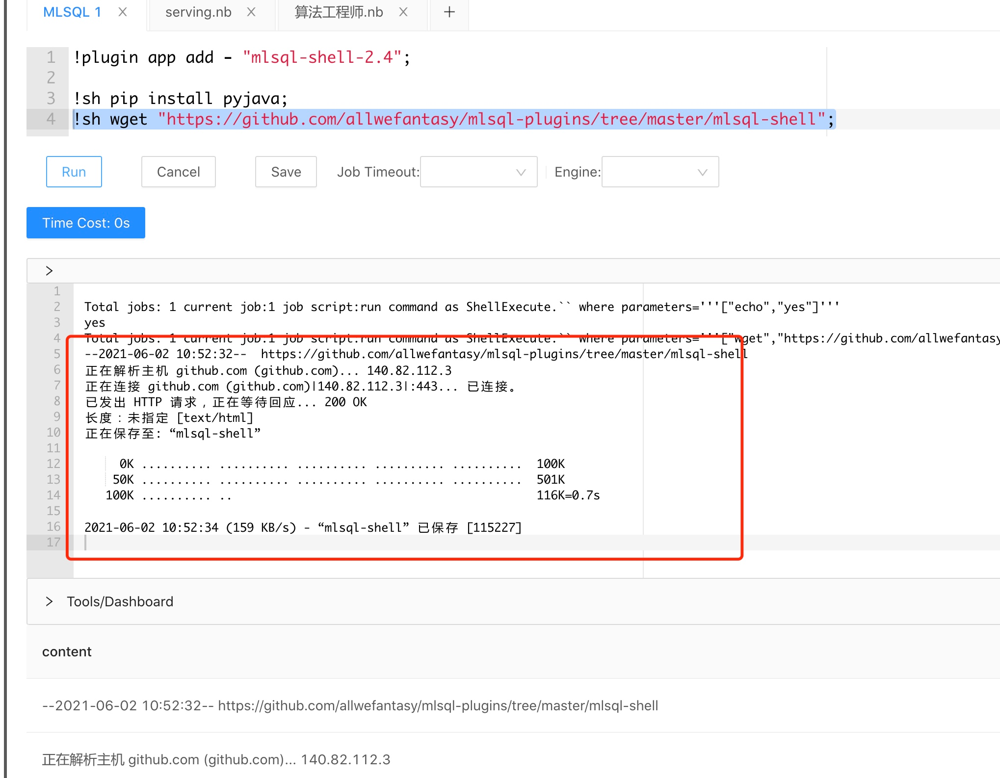

# shell命令插件

[mlsql shell](https://github.com/byzer-org/kolo-extension/tree/master/mlsql-shell)  插件在 MLSQL engine 端提供 shell 宏命令，用于将 shell 脚本作为 MLSQL 代码的一部分来执行。



## 如何安装

在 Web 控制台中执行以下命令：

```
!plugin app add - "mlsql-shell-2.4";
```

> 注意：示例中 mlsql 的 spark 版本为 2.4 ，如果需要在 spark 3.X 的版本运行，请将安装的插件设置为 `mlsql-shell-3.0`

执行一个测试脚本，验证是否正确安装：

```
!sh echo "yes";
```

## 如何使用

```sql
!sh pip install pyjava;
!sh echo "yes";
!sh wget "https://github.com/allwefantasy/mlsql-plugins/tree/master/mlsql-shell";
```


