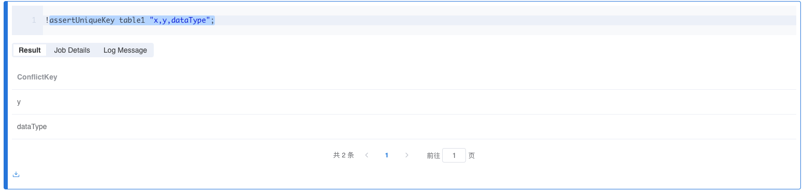

# 断言支持

## 简介

断言可以让 Byzer 在 SQL 脚本中的任何一个位置实现中断，判断某个条件是否成立。

```sql
set abc='''
{ "x": 120, "y": 100, "z": 260 ,"dataType":"B group"}
{ "x": 160, "y": 100, "z": 260 ,"dataType":"C group"}
{ "x": 170, "y": 100, "z": 260 ,"dataType":"C group"}
{ "x": 150, "y": 100, "z": 260 ,"dataType":"B group"}
{ "x": 110, "y": 100 ,"dataType":"A group"}
{ "x": 130 ,"dataType":"A group"}
{ "x": 140, "y": 200 ,"dataType":"A group"}
''';
load jsonStr.`abc` as table1;
```
> 注意：
> 
> 1.下面相关算子，不带有Throw的不会打断脚本运行，并且会返回具体的异常数据集，通长用来做数据探查。
> 
> 2.如果希望在执行的过程中，像执行代码一样遇到异常直接打断运行，可以使用带有Throw的算子，这样会抛出异常，不会返回数据集。

## 常用单表或视图Data Quality验证算子
### assertNotNull tableName 'fieldName1,fieldName2...'
判断表中的某些字段是否为空,默认会返回具体的非空数据集


### assertNotNullThrow tableName 'fieldName1,fieldName2...' 
判断表中的某些字段是否为空,不满足条件则会抛出异常


### assertUniqueKey tableName 'fieldName1,fieldName2...'
判断表中的某些字段是否唯一,默认会非唯一的字段名



### assertUniqueKeyThrow tableName 'fieldName1,fieldName2...'
判断表中的某些字段是否唯一,不满足条件则会抛出异常


### assertUniqueKeys tableName 'fieldName1,fieldName2...'
判断组合字段是否全局唯一,默认会返回具体的非唯一数据集


### assertUniqueKeysThrow tableName 'fieldName1,fieldName2...'
判断组合字段是否全局唯一,不满足条件则会抛出异常


## 通用表达式校验

Byzer 支持断言，断言的语法如下：

```sql
!assert <tableName> <expr> <message>;
```
让我们来解释下上面的三个参数：

- tableName: 表名，这个表名的表必须存在，否则会抛出异常。
- expr: 一个表达式，这个表达式的值必须是一个 boolean 值，如果是 true，则不会抛出异常，如果是 false，则会抛出异常。
- message: 异常信息，当 expr 为 false 时，这个信息会在抛出异常时显示。

因为 Byzer 是使用 表 来进行上下语句的衔接的。所以，和传统语言直接对标量进行判定不同， Byzer 的断言是对表内的数据进行判定。

## 例子

我们来看一个例子，假设我加载了一个数据集，我要判断该数据集不为空的情况下，才能继续执行后续的 SQL 语句,把结果保存起来。


```sql
load csv.`/tmp/upload/visual_data_0.csv` 
where inferSchema="true" and header="true"
as vega_datasets;

select count(*) as v from vega_datasets as vega_datasets_count;
!assert vega_datasets_count 
''' :v>0 ''' 
"数据集不能为空";

save overwrite vega_datasets as parquet.`/tmp/visual_data_0`;
```

上面的例子中，我们使用了 `!assert` 语句，来判断数据集的数量是否大于 0，如果不大于 0，则会抛出异常，异常信息是 "数据集不能为空"。
但是判断自身，其实是通过 `select count(*) as v from vega_datasets as vega_datasets_count;` 这条辅助 SQL 语句来实现的，这条语句的结果会被传递给 `!assert` 语句，然后我们对 v 字段进行判断。

判断中对于变量的引用使用了 `:<varName>` 的语法, 这种变量引用的方式，我们在 Byzer 的条件分支表达式里也会用到。

## 注意

1. 断言中的表必须是一个结果表（一般里面只会有一条记录），因为他会在内存中使用，如果表太大可能会导致系统崩溃。
2. 断言会触发一次实际的SQL执行，可能会极大的降低了脚本的执行速度，请在确实需要的地方使用。

## 举一反三

如果我想看一个表是不是年份字段是不是重复，如果有的话，那么停止执行，否则往后执行，该怎么实现呢？
下面的例子我们使用变量的方式

```sql
load csv.`/tmp/upload/visual_data_0.csv` 
where inferSchema="true" and header="true"
as vega_datasets;

set vega_datasets_count = `select count(*) as v from vega_datasets` where type="sql" ;
set vega_datasets_distinct_count = `select count(Year) as distinct_v from vega_datasets group by Year` where type="sql" ;

select ${vega_datasets_count} as vega_datasets_count, ${vega_datasets_distinct_count} as vega_datasets_distinct_count as assertTable;

!assert assertTable 
''' :vega_datasets_count == :vega_datasets_distinct_count ''' 
"Year 字段不能有重复";

save overwrite vega_datasets as parquet.`/tmp/visual_data_0`;
```

上面的例子中，我们使用了两个辅助 SQL 语句，来获取数据集的总数和去重后的总数，并且构建成一个新表，然后通过 `!assert` 语句来判断新表中这两个值是否相等，如果不相等，则会抛出异常，异常信息是 "Year 字段不能有重复"。

为了做这个判断，我们相当于执行了两条count语句，这个在数据量大的时候，可能会导致脚本执行的很慢，所以请谨慎使用。

## Byzer 模块中使用 !assert 语法

我们知道 Byzer 是支持模块的，也就是代码文件的的引用。模块在使用之前，需要用户传递一些参数，此时可以通过 !assert 来确定参数是否存在或者是否正确。

下面的代码来自 一个示例模块

```sql
/**
Usage:

set inputTable="abc";
include local.`libCore.alg.xgboost`;
**/

!assert inputTable in __set__  ''' inputTable is missing. Try set inputTable="" ''';
!assert rayAddress in __set__ ''' rayAddress is missing. Try set rayAddress="127.0.0.1:10001" ''';

set inModule="true" where type="defaultParam";
set rayAddress="127.0.0.1:10001" where type="defaultParam";
set outputTable="xgboost_model" where type="defaultParam";

!python conf "rayAddress=${rayAddress}";
!python conf "runIn=driver";
!python conf "schema=file";
!python conf "dataMode=model";

-- 引入python脚本
!if ''' :inModule == "true" ''';
!then;
    !println "include from module";
    !pyInclude local 'github.com/allwefantasy/lib-core.alg.xgboost.py' named rawXgboost;
!else;
    !println "include from project";
    !pyInclude project 'src/algs/xgboost.py' named rawXgboost;
!fi;  
```

在这个例子里，我们通过 !assert 检查用户是不是通过 set 设置了参数 inputTable, rayAddress的，如果没有，那么我们会报错。 这段脚本，用户可以这么用：

```sql
-- 引入第三方依赖
include lib.`gitee.com/allwefantasy/lib-core`
where alias="libCore";

-- 调用依赖里的模块
set inputTable="abc";
include local.`libCore.alg.xgboost`;
```

## 总结

Byzer 提供了 `!assert` 模块可以随时对结果进行校验，如果不符合条件，那么就会抛出异常，这个异常会在控制台显示，方便用户进行调试。


