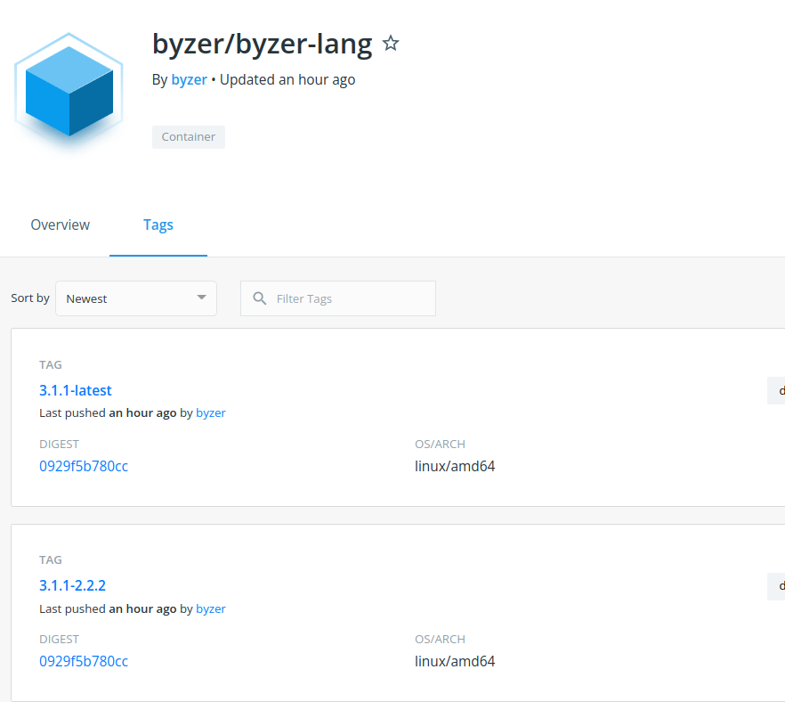

# Byzer 引擎部署指引

Byzer 引擎为 Byzer-lang 提供了 Runtime 执行环境，有多种部署方式可以部署 Byzer 引擎，用户可以根据自己的情况和部署环境（开发，测试，生产）来选择不同的部署方式。

Byzer 引擎本质上来讲就是一个 Spark Service 实例， 分为 Driver 端和 Executor 端。得益于 Spark 的生态， Byzer 引擎部署从技术架构上来讲，可以同时支持 **Local 模式**， **Byzer on YARN 模式**，以及 **Byzer on K8S 模式**。

### 下载站点

Byzer 社区提供了三种官方下载方式：

| 下载渠道            | 地址              | 说明                       |
|--------------------|------------------|---------------------------|
|官方下载站点|[https://download.byzer.org/](https://download.byzer.org/)|官方下载站点，提供了 CDN 加速访问， 包含了 Byzer 引擎，Byzer Notebook，Byzer VSCode Extension 等产品包的下载方式|
|Github Release|[Byzer-lang Release](https://github.com/byzer-org/byzer-lang/releases) [Byzer Notebook Release](https://github.com/byzer-org/byzer-notebook/releases)| Github 官方 Release 页面，只包含对应产品的已正式发布的二进制包 |
|Docker Hub|[byzer docker hub](https://hub.docker.com/u/byzer)|Docker 镜像，包含了 Sandbox， Byzer 引擎，Byzer Notebook 等 Docker 镜像|

> 注意：
> - 对于服务器环境安装部署，推荐用户去官方下载站点进行下载
> - 对于使用 Docker 等容器化部署，推荐用户去 Docker Hub 上获取镜像

### 部署方式

| 部署方式 | 说明 | 适合场景 |
|--------|-----|----------|
| [Byzer All In One 版本](/byzer-lang/zh-cn/installation/server/byzer-all-in-one-deployment.md)     |该版本内置了所有的依赖，包括 JDK，Spark，其中 Spark 以 Local 的方式运行，不需要额外准备 Spark on YARN 或者 Spark on K8S 环境。  该版本内置了 Byzer CLI 的**命令行交互方式**和**服务化的 REST 交互方式**| 一般适合于快速体验 Byzer 引擎部署，本机开发环境的搭建，或者是测试环境的部署， 受限于单机的 CPU 核心数量和内存限制，一般情况下不适合生产环境 |
| [Byzer Server 版本](/byzer-lang/zh-cn/installation/server/byzer-all-in-one-deployment.md) | 该版本没有内置 JDK，需要用户配置 Spark 集群   该版本只**支持服务化 REST 的交互方式**| 一般适合于在生产环境进行部署，最常见的场景是搭配 Hadoop 集群进行使用|
| [容器化部署](/byzer-lang/zh-cn/installation/containerized-deployment/containerized-deployment.md) | 提供了基于 Docker 的多种镜像，方便用户用于自动构建、部署服务，供快速体验 Byzer-lang 功能 | 一般适合于快速体验 Byzer 引擎部署，本机开发环境的搭建，或者是测试环境的部署， 受限于容器虚拟化，除了 K8S 部署模式外一般不适合生产环境  |
| [K8S 环境部署](/byzer-lang/zh-cn/installation/k8s/k8s-deployment.md) | K8S 部署方案，本质上是使用了 Byzer 引擎的容器镜像，可以支持 minikube 或云上 K8S 服务|搭配基于云厂商的 K8S，适合做测试以及生产环境|
| [Byzer VSCode Extension](/byzer-lang/zh-cn/installation/vscode/byzer-vscode-extension-installation.md) | VisualStudio Code 插件，支持 Windows， Mac， Linux | 适合搭建本机开发环境和快速体验上手 |

### 版本说明

#### Release Note
从 Byzer 社区建立开始，每一次发布都有对应的发布声明，用户可通过以下几个渠道进行发布声明的获取：
- 该手册文档的[发行说明章节](/byzer-lang/zh-cn/release-notes/version.md)
- Github Release 页面
    - [Byzer-lang Release](https://github.com/byzer-org/byzer-lang/releases)
    - [Byzer Notebook Release](https://github.com/byzer-org/byzer-notebook/releases)
- 关注 Byzer Community Slack 社区中获取
- 关注 Byzer Community 

#### Byzer 引擎版本说明

Byzer 引擎（包括 Byzer Notebook， Byzer VSCode Extension 等）会区分已发布版本和 Nightly Build 版本：
- **Nightly Build 版本**：每日基于主分支自动构建的最新版本，会包含最新的功能 Feature 但可能未经过测试
- **已发布版本**: 经过测试的发布版本

> 目前只有官方下载站点和 Docker Hub 会包含 Nightly Build 的版本产品包

Byzer 引擎的版本号规范为 `byzer-lang-{spark-version}-{byzer-version}.tar.gz`, 其中 `{spark-version}` 是 Byzer 引擎内置的 Spark 版本号。如下图所示

- 其中 `3.1.1` 代表的是 Spark 的版本，目前 Byzer 支持的 Spark 版本有 `3.1.1` 及 `2.4.3`，后续随着项目迭代，会对 Spark 的版本进行升级，以产品包名为为准
- `latest` 和 `2.2.2` 则代表了 Byzer 引擎的版本号。
    - `latest` 代表该产品包或镜像是 nightly build 版本
    - `2.2.2` 代表该产品包是经过测试发行的正式版本，版本号为 2.2.2

#### Byzer VSCode Extension 版本说明

请参考 [Byzer VSCode Extension 安装说明](/byzer-lang/zh-cn/installation/vscode/byzer-vscode-extension-installation.md) 中版本说明一节。

### Byzer 引擎配置说明

当使用 Byzer 引擎时，根据不同的用户，可能需要调整 Spark Driver，Executor 以及 JVM 等配置，相关配置信息请参考 [Byzer 引擎参数配置说明](/byzer-lang/zh-cn/installation/configuration/byzer-lang-configuration.md)