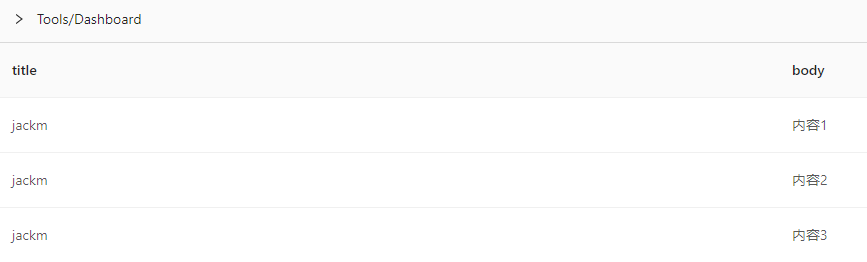
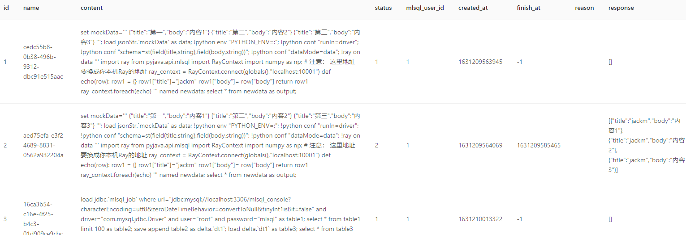

# Sandbox 独立部署

Sandbox 包含了 Kolo 两大组件 Byzer Notebook 和 Kolo Lang，您可以快速体验 Kolo 功能。

### 前置条件

#### 安装 Docker Desktop

Docker 桌面版是一个适用于 MacOS 和 Windows 机器的应用程序，用于构建和共享容器化应用程序和微服务。它提供
了非常丰富便捷的管理平台，方便我们快速部署、管理Sandbox镜像和容器。

从 [Docker 官网](https://www.docker.com/products/docker-desktop) 下载适配您操作系统的安装包，安装并使用。

适用于 Linux 的 Docker 桌面社区还在开发中，可以参考 [Docker 官网安装文档](https://docs.docker.com/engine/install/ubuntu/)
在 Linux 上安装 Docker 引擎。

### Sandbox 独立部署 Kolo

使用 docker 命令启动 Spark 2.4.3版 Sandbox 容器:

```shell
docker run -d \
--restart=always \
--name sandbox-2.4.3-2.2.0-SNAPSHOT \
-p 9002:9002 \
-p 9003:9003 \
-e MYSQL_ROOT_PASSWORD=root \
techmlsql/mlsql-sandbox:2.4.3-2.2.0-SNAPSHOT
```

使用 docker 命令启动 Spark 3.1.1版 Sandbox 容器:

```shell
docker run -d \
--restart=always \
--name sandbox-3.1.1-2.2.0-SNAPSHOT \
-p 9002:9002 \
-p 9003:9003 \
-e MYSQL_ROOT_PASSWORD=root \
techmlsql/mlsql-sandbox:3.1.1-2.2.0-SNAPSHOT
```

> 请注意，若启动容器时，拉取镜像超时，您只需启动一个Sandbox 镜像。


### 体验 Kolo 功能

浏览器[登录](http://localhost:9002)，在用户注册界面，输入用户名和密码，在下一界面按下图输入，点击 Create a New Notebook - Create, 进入 Notebook 使用界面。
 
#### 使用 Python 和 Ray 处理 JSON 数据

请执行代码:

```sql
-- 构造测试数据
set mockData='''

{"title":"第一","body":"内容1"}
{"title":"第二","body":"内容2"}
{"title":"第三","body":"内容3"}

''';

load jsonStr.`mockData` as data;

-- 设置Python 环境 
!python env "PYTHON_ENV=:";
!python conf "runIn=driver";
!python conf "schema=st(field(title,string),field(body,string))";
!python conf "dataMode=data";

-- Python 代码在Sandbox内置的Ray上执行
!ray on data '''

import ray
from pyjava.api.mlsql import RayContext
import numpy as np;

ray_context = RayContext.connect(globals(),"localhost:10001")

def echo(row):
    row1 = {}
    row1["title"]="jackm"
    row1["body"]= row["body"]
    return row1

ray_context.foreach(echo)

''' named newdata;

select * from newdata as output;
``` 

结果如下:



#### 处理MySQL 数据

 ```sql
-- 加载mlsql_console.mlsql_job 表数据
 load jdbc.`mlsql_job` where url="jdbc:mysql://localhost:3306/mlsql_console?characterEncoding=utf8&zeroDateTimeBehavior=convertToNull&tinyInt1isBit=false"
 and driver="com.mysql.jdbc.Driver"
 and user="root"
 and password="mlsql"
 as table1;
 
-- 查询100条
select * from table1 limit 100 as table2;

-- 保存到DeltaLake
save append table2 as delta.`dt1`;

-- 查询 DeltaLake 
load delta.`dt1` as table3;
 
select * from table3 as table4;
 ```

结果如下:
