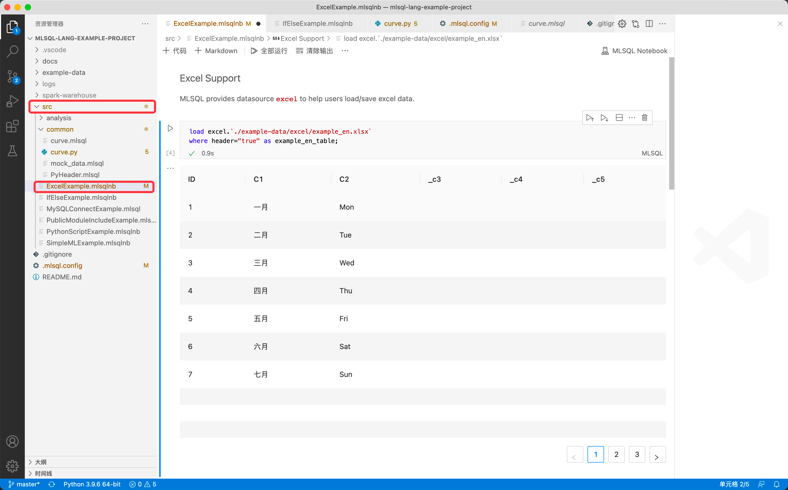
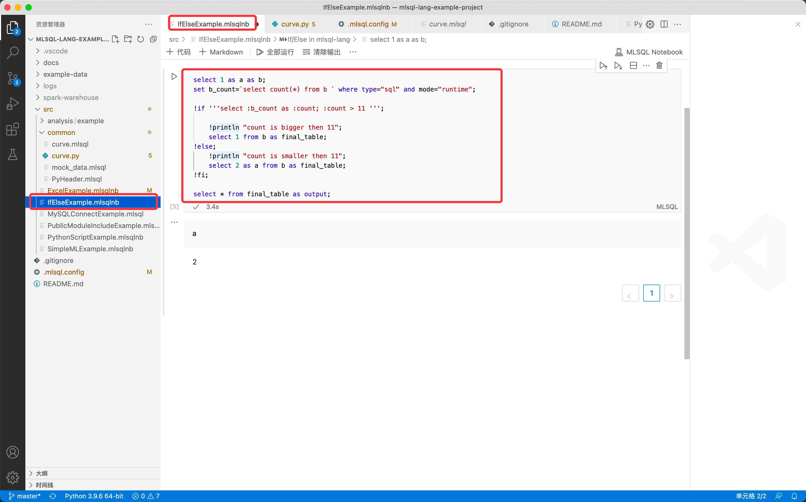
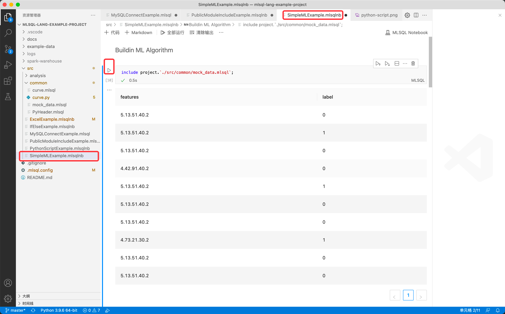
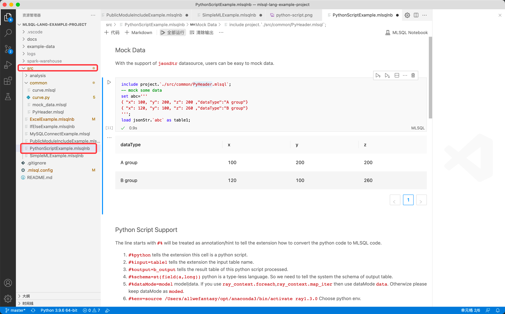

## Byzer-lang 桌面版使用 (Mac/Linux)

### 前置条件
1. 安装 [Visual Studio Code](https://code.visualstudio.com/)

> 在 Mac/Linux 环境中测试通过, 但是在 Windows 环境文件读写报错，因此建议您仅在 Linux 和 Mac 环境中使用.

### 安装步骤

Byzer-lang VSCode 插件本地安装具体步骤如下：
  1. 下载对应操作系统的 vsix 文件，最新版为 0.0.7
  - [Linux 版](http://download.mlsql.tech/byzer-lang-linux-0.0.7.vsix)
  - [Mac 版](http://download.mlsql.tech/byzer-lang-mac-0.0.7.vsix)

  2. 打开 VSCode -> 左侧面板选择`拓展` -> 选择 `从 VSIX 安装` -> 选择刚下载的 kolo-lang-<os>-0.0.7.vsix 进行安装

     

> 请注意:
> 1. Windows 环境版本还未被验证过，因此建议您在 Linux 和 Mac 的环境下使用
> 2. 插件源码参考 [mlsql-lang-vscode-plugin/github](https://github.com/allwefantasy/mlsql-lang-vscode-plugin)

### 特别注意

只有打开了`.mlsql`结尾的文件，插件才会被初始化。

### 配置 .mlsql.config文件 （可选）

你可以通过添加 `.mlsql.config` 到你的 kolo-lang 项目根目录,每个项目都可以有不同的配置。

1. 根据下方图片，在.mlsql.config里配置变量 *engine.home*（从市场安装的才需要engine.home）。根据您的操作系统(mac, linux win) 下载
   - [Linux](http://download.mlsql.tech/byzer-lang-linux-amd64-2.3.0-preview.tar.gz)
   - [Mac](http://download.mlsql.tech/byzer-lang-mac-amd64-2.3.0-preview.tar.gz)
   
   解压缩。engine.home 指向该目录。（P.S. bin目录无需配置在 engin.home 里，只需要配置 bin 所在的目录）
   
3. 如果你是第一次创建该文件，为了使配置生效，在 VSCode 里按住 `shift+command+p`，先选择【开发人员：重新加载窗口】确保 mlsql.config 文件生效，然后再选择 MLSQL RUN 即可编译和执行.mlsql文件

### 示例

您可以从 [此处](https://github.com/allwefantasy/mlsql-lang-example-project) 下载 Kolo-lang VSCode 插件的样例项目
在执行之前，可以先执行 `./src/common/PyHeader.mlsql`  启用 conda env 

1. **ExcelExample**

   

2. **IfElseExample**

   

3. **SimpleMLExample**

   

4. **PythonScriptExample**

   

5. **PublicModuleIncludeExample**

   