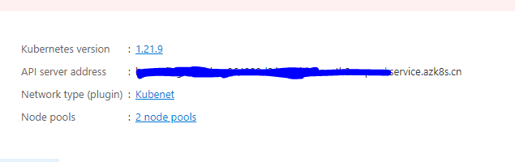
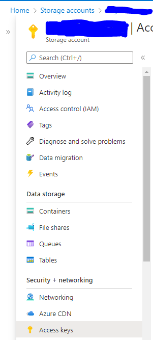

# 在 Azure 通过 K8S 部署 Byzer 引擎

Azure 提供了一个托管的 K8S 服务 [AKS](https://azure.microsoft.com/en-us/services/kubernetes-service/)，用户可以直接使用 AKS 来部署管理应用。

本章节以 Azure CN 公有云为例，来介绍如何在云上部署 Byzer 引擎。请确保在开始部署之前，您有阅读并根据 [K8S 部署前置条件](/byzer-lang/zh-cn/installation/k8s/k8s-prerequisites.md) 完成了前置条件中的准备工作

### 其他准备工作

在 Azure CN 公有云上您的账户需要满足以下条件：
1. 资源组及该资源组的权限
2. 您的账户里有足够的云资源配额（quota）

在您的资源组中，创建
- AKS 服务， 要求最少有 24 GB 内存，6 核 CPU，用于部署 Byzer 引擎
- 1 个 Azure Database for MySQL 实例
- 1 个 Azure Blob Container 实例，用做 Byzer 引擎的存储系统


>　对于个人用户来说，Ａzure 提供了部分免费额度，你可以通过使用这些额度来进行使用和创建上述资源，过程请参考微软云文档。

#### 在 VM Client 中安装 Azure CLI 工具

在 Azure 上部署时，VM Client 可以直接在 Azure 的资源组中创建，也可以选择一台可访问到您资源组中的虚拟网络的任一 Linux 虚拟机，除了在 [K8S 部署前置条件](/byzer-lang/zh-cn/installation/k8s/k8s-prerequisites.md) 一节中安装的 `kubectl` 以及 `helm` 工具外，我们需要在 VM Client 中安装 Azure CLI 用于访问 Azure 的资源。

在 Linux 上安装 Azure CLI 请参考 Azure 官方文档 [Install the Azure CLI on Linux](https://docs.microsoft.com/en-us/cli/azure/install-azure-cli-linux?pivots=apt)。安装完毕后，接下来我们需要在 VM Client 里配置 AKS 集群的连接信息。

执行下面命令配置 AKS 连接信息。使用 `az login` 命令进行认证时，会通过 Azure 的 SSO 跳转到 azure web 页面进行认证。

可参考如下命令， 设置
- `subscription-id`, 值是 Azure 订阅的 id 
- `resource-group`， 资源组名称
- `aks-name` 为 AKS 集群名称

上述这些值都可以通过访问 [Azure Portal](https://portal.azure.cn) 中在您的订阅下查询到。

```shell
$ az cloud set --name AzureChinaCloud
$ az login
$ az account set --subscription <subscription-id>
$ az aks get-credentials --resource-group <resource-group> --name <aks-name>
```
配置好上述集群信息后，在命令行中执行下述命令来检查集群信息。 

```shell
$ kubectl cluster-info
```


### 通过 Helm 部署 Byzer 引擎

完成上述的准备工作后，我们以 `Byzer-lang 2.3.0.1` 为例在 AKS 上进行部署，在该示例中，我们直接使用对象存储 Azure Blob 作为文件存储系统。

> Byzer engine 作为执行引擎，一般不对公网暴露，一般在公网暴露的是类似于 Byzer Notebook 等产品应用服务，Byzer Notebook 和 Byzer engine 的 API 交互发送在 K8S 集群的内网之内。


#### 1.下载 helm chart 

前往下载站获取于 Byzer-lang 2.3.0.1 版本的 helm chart 下载地址。我们使用目录 `/home/byzer/server` 作为工作路径，你可以自行创建目录进行替换。

```shell
$ wget https://download.byzer.org/k8s-helm/byzer-lang/2.3.0.1/byzer-lang-helm-charts-2.3.0.1.tgz
$ tar -xf byzer-lang-helm-charts-2.3.0.1.tgz -C /home/byzer/server
$ cd /home/byzer/server/byzer-lang
```

解压后目录结构如下

```shell
|-- byzer-lang
  |-- Chart.yaml
  |-- values.yaml
  |-- VERSION
  |-- templates
    |-- _helpers.tpl
    |-- deployment.yaml
    |-- secret.yaml
    |-- serviceaccount.yaml
    |-- configmap.yaml
    |-- hpa.yaml
    |-- service.yaml
    |-- tests
      |-- test-connection.yaml
```

在 templates 目录包含 `deployment`， `service`， `configmap`， `secret` 等模板，在部署时，会使用 `values.yaml` 文件的中来渲染上述模板，然后将应用部署至 K8S。 

#### 2.通过 values.yaml 修改配置

按照部署平台的实际情况，修改 `values.yaml` 中以下配置。

> **注意**
> 1. CPU 内存不要超过 AKS 每个 worker 节点可分配数，否则 Pod 无法启动。
> 2. 在配置文件系统时，可能需要修改镜像，目前 Byzer 官方的 byzer-lang-k8s 镜像中集成的是 Azure Blob Jar，不需要改动镜像即可在 Azure 上进行部署和访问 Blob。


|参数|说明|
|--|--|
|**fs.defaultFS**|预先申请的 Azure Blob 地址，Byzer-lang 基于 HDFS API 访问它。格式为 `wasb://<container_name>@<account_name>.blob.core.chinacloudapi.cn/` 。其中 `core.chinacloudapi.cn` 表示中国区微软云，其他区域有不同地址。**Azure Blob jar 已经集成在 byzer 镜像**|
|**clusterUrl**|Base 64 编码的AKS APIServer 地址。可以在 AKS overview 页面查到，例如 `https://hello-k8s-dns.hcp.chinanorth2.cx.prod.service.azk8s.cn:443`，如下图所示 |
|
**storage.SecretKey**|Base 64 编码的 Azure Blob Secret Key; 可以在 [Azure Portal](https://portal.azure.cn) 查到. 如图所示|
|**spark.driver.memory**|Driver 内存，例如 `16g`；由于 Byzer Driver 承担的负载较重，建议 16g 起步|
|**spark.driver.cores**| Driver CPU 核数，例如 `4`；在生产上建议 cpu/mem 比为 1:4 |
|**spark.driver.maxResultSize**|Driver 端结果集上限，例如 `2g`|
|**spark.executor.memory**|Executor 内存，例如 `4g`|
|**spark.executor.cores**|Executor CPU 核数，例如 `1`；在生产上建议 cpu/mem 比为 1:4|
|**spark.executor.instances**|Executor 数量，例如 `2`；此值建议根据生产负载来规划，建议 4 个起步|
|**streaming.datalake.path**|Byzer Engine 内置的 DeltaLake 的工作目录，引擎会在 Azure Blob 上自动创建，例如 `/byzer/_delta`， 无需事先创建。|

其他的参数配置修改，请参考[Byzer 引擎参数配置说明](/byzer-lang/zh-cn/installation/k8s/byzer-on-azure.md) 一节的参数说明


#### 3. 通过 helm install 进行部署
当我们修改完 `values.yaml` 文件后，就可以通过执行下述命令来进行部署了

```shell
$ cd /home/byzer/server/byzer-lang
$ helm install byzer-lang .
```

该命令中， `byzer-lang` 是 helm release 的名称， `.` 表示使用当前目录中的 helm chart。
执行后，可以在 AKS 页面看到新的 deployment, pod, service。 


```shell
$ kubectl get pod -l app.kubernetes.io/instance=byzer-lang
NAME                                     READY   STATUS    RESTARTS   AGE
byzer-lang-deployment-686f555dc8-l7x99   1/1     Running   0          2d5h
```

可以通过下述命令使用 kubectl 查看 Byzer 引擎部署的日志信心

```shell
$ kubectl logs $(kubectl get pod -l app.kubernetes.io/name=byzer-lang -o name | head -1)
```

#### 4. 验证部署是否成功

当您检查 AKS 上的 pod 就绪后，您可以通过使用 **Ingress** 或者通过 **Service port forwarding** 的方式来将  Byzer Engine Console 和 Spark UI 服务进行暴露，然后通过浏览器进行访问。默认的 Byzer 引擎的端口为 `9003`， 您也可以在 `values.yaml` 中进行修改； Spark UI 的默认端口为 `4040`