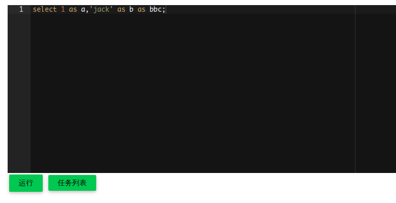
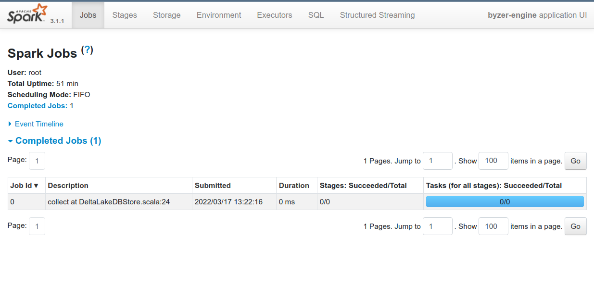

# 在 Minikube 部署 Byzer 引擎

> 本章节会以 minikube 作为 K8S 服务来演示如何通过 kubectl + yaml 配置文件的方式来部署 Byzer-lang 引擎，**您可以将 minikube 替换为任意 K8S 服务** 操作都相同

### I. 环境准备

需要提前准备操作系统， Docker 的安装，以及 minikube 的安装

#### 1.1 操作系统

推荐使用 Linux 系统或 MacOS 系统。

本文基于 CentOS 7 minimal 版本进行安装，其他的操作系统在安装时可以根据自己的系统版本进行 Docker 和 K8S 的安装。

#### 1.2 安装 Docker

在 CentOS 中设置镜像源 

```shell
$ sudo yum install -y yum-utils
$ sudo yum-config-manager \
>     --add-repo \
>     https://download.docker.com/linux/centos/docker-ce.repo
```

安装　Ｄocker Engine

```shell
$ sudo yum install docker-ce docker-ce-cli containerd.io
```

将 Docker 服务设置随机自启动并启动服务

```shell
$ sudo systemctl enable docker
$ sudo systemctl start docker
```

测试 Docker 服务是否正常工作

```shell
$ sudo docker run hello-world
```

当您看到 Terminal 中输出如下内容时，说明 Docekr 服务已正常运行

```shell
Hello from Docker!
This message shows that your installation appears to be working correctly.

To generate this message, Docker took the following steps:
 1. The Docker client contacted the Docker daemon.
 2. The Docker daemon pulled the "hello-world" image from the Docker Hub.
    (amd64)
 3. The Docker daemon created a new container from that image which runs the
    executable that produces the output you are currently reading.
 4. The Docker daemon streamed that output to the Docker client, which sent it
    to your terminal.

To try something more ambitious, you can run an Ubuntu container with:
 $ docker run -it ubuntu bash

Share images, automate workflows, and more with a free Docker ID:
 https://hub.docker.com/

For more examples and ideas, visit:
 https://docs.docker.com/get-started/
```

> 注意：
> 1. 请访问 Docker 用户手册 [https://docs.docker.com/](https://docs.docker.com/) 获取更多关于 Docker 的信息
> 2. 如果你使用的用户是非 root 账户，并不想通过 sudo 权限来使用 Docker，你需要将当前用户加入 `docker` 的用户组，此处我们使用的用户是 `byzer`, 你可以在下面的代码中提换为你需要使用的用户名，执行完毕后重启 VM 来使设置生效

```shell
$ sudo groupadd docker
$ sudo usermod -aG docker byzer
```

#### 1.3 安装 minikube

下载 minikube stable 版本的安装包并安装

```shell
$ curl -LO https://storage.googleapis.com/minikube/releases/latest/minikube-latest.x86_64.rpm
$ sudo rpm -Uvh minikube-latest.x86_64.rpm
```

> 在您的操作系统中安装 minikube 可以访问 [https://minikube.sigs.k8s.io/docs/start/](https://minikube.sigs.k8s.io/docs/start/) 获取更多信息

为了使用 kubectl 来和 minikube 交互，你可以通过使用 `minikube kubectl` 来代替 `kubectl` 命令，也可以安装 kubectl 工具

通过 curl 下载 kubectl

```shell
$ curl -LO "https://dl.k8s.io/release/$(curl -L -s https://dl.k8s.io/release/stable.txt)/bin/linux/amd64/kubectl"
```
安装 minikube

```shell
$ sudo install -o root -g root -m 0755 kubectl /usr/local/bin/kubectl
```

执行 `kubectl version --client` 验证 kubectl 是否安装成功，当您看到输出的 Json 信息说明 kubectl 工具已经成功安装至您的环境中

```shell
$ kubectl version --client
Client Version: version.Info{Major:"1", Minor:"23", GitVersion:"v1.23.4", GitCommit:"e6c093d87ea4cbb530a7b2ae91e54c0842d8308a", GitTreeState:"clean", BuildDate:"2022-02-16T12:38:05Z", GoVersion:"go1.17.7", Compiler:"gc", Platform:"linux/amd64"}
```

> 您可以访问 k8s 官方手册来查看如何在您的操作系统中安装 kubectl 工具 [https://kubernetes.io/docs/tasks/tools/install-kubectl-linux/]([https://kubernetes.io/docs/tasks/tools/install-kubectl-linux/)

#### 1.4 启动 minikube 环境

启动 minikube，启动成功后可以看到如下输出，可以看到当前的 minikube 版本为 `v1.25.2`，kubernetes 版本为 `v1.23.3`，docker 版本为 `20.10.12`

```shell
$ minikube start
😄  minikube v1.25.2 on Centos 7.9.2009
✨  Using the docker driver based on existing profile
👍  Starting control plane node minikube in cluster minikube
🚜  Pulling base image ...
🔄  Restarting existing docker container for "minikube" ...
🐳  Preparing Kubernetes v1.23.3 on Docker 20.10.12 ...
    ▪ kubelet.housekeeping-interval=5m
🔎  Verifying Kubernetes components...
    ▪ Using image gcr.io/k8s-minikube/storage-provisioner:v5
🌟  Enabled addons: default-storageclass, storage-provisioner
🏄  Done! kubectl is now configured to use "minikube" cluster and "default" namespace by default
```

执行 `kubectl get po -A` 可以查看到当前 minikube 环境中 Pod 的信息

```shell
$ kubectl get po -A
NAMESPACE     NAME                               READY   STATUS    RESTARTS      AGE
kube-system   coredns-64897985d-2l765            1/1     Running   0             11m
kube-system   etcd-minikube                      1/1     Running   0             11m
kube-system   kube-apiserver-minikube            1/1     Running   0             11m
kube-system   kube-controller-manager-minikube   1/1     Running   0             11m
kube-system   kube-proxy-snldn                   1/1     Running   0             11m
kube-system   kube-scheduler-minikube            1/1     Running   0             11m
kube-system   storage-provisioner                1/1     Running   1 (11m ago)   11m
```

### II. 在 minikube 中部署 Byzer 引擎

接下来我们介绍如何通过 kubectl 和 yaml 的方式来在安装好的 minikube 环境中部署 byzer 引擎。

> **注意**：此处我们使用 minikube 和 本地存储进行部署仅作为演示使用，真实开发、测试以及生产环境，请将 minikube 替换为生产可用的 K8S 服务或云服务，并选择使用对象存储或 JuiceFS 作为存储

#### 2.1 选择 Byzer 引擎 K8S 镜像

前往 Byzer 社区 Docker Hub 根据自己的需求选择对应版本的 `byzer/byzer-lang-k8s` 镜像， 地址是 [https://hub.docker.com/r/byzer/byzer-lang-k8s/tags]，这里我们选择的版本为 `3.1.1-2.2.1` 作为示例


#### 2.2 创建命名空间和 Service Account

首先需要通过 kubectl 工具创建 namespace 以及 service account，分别为 `byzer` 和 `spark`，并赋予其在 `byzer` namespace 中的 `edit` 权限。这样 Byzer Engine 就拥有可以在 byzer namespace 中用于创建，管理和删除 executor pod 的权限。

```shell
$ kubectl create ns byzer
namespace/byzer created
$ kubectl create serviceaccount spark -n byzer
serviceaccount/spark created
$ kubectl create clusterrolebinding spark-role --clusterrole=edit --serviceaccount=byzer:spark --namespace=byzer
clusterrolebinding.rbac.authorization.k8s.io/spark-role created
```

#### 2.3 准备 YAML 部署配置文件

在通过 YAML 配置文件部署 Byzer 引擎时，我们需要创建 `secret.yaml`, `configmap.yaml`, `deployment.yaml` 以及 `service.yaml` 文件进行配置的编写


**创建 byzer-engine-secret.yaml**

```yaml
apiVersion: v1
kind: Secret
metadata:
  name: byzer-engine-secret
  namespace: byzer
  labels:
    app: byzer-engine
type: Opaque
data:
  CLUSTER_URL: ${cluster-url}
```

`byzer-engine-secret.yaml` 主要是为了传入一些敏感信息，比如对象存储的 AKSK（Access Key & Secret Key），CLUSTER_URL 等，也可以根据自己的需要来定义一些敏感信息的 Key-Value Pair，声明在此文件中。

声明的 Key-Value 键值对会被 `byzer-engine-deployment.yaml` 文件中通过 `env` 的方式进行取值操作，在部署的时候声明进环境变量当中。

> **注意：**
> 1. Data 中的值要进行 base64 加密
> 2. 获取 CLUSTER_URL 的方式可以通过执行命令 `kubectl config view --output=jsonpath='{.clusters[].cluster.server}'` 获得，然后通过 base64 加密后，替换上述文件的 `${cluster-url}`

**创建 byzer-engine-configmap.yaml**

```yaml
apiVersion: v1
kind: ConfigMap
metadata:
  name: byzer-engine-configmap
  namespace: byzer
data:
   core-site-xml: |
    <configuration>
    </configuration>
```
`byzer-engine-cofnigmap.yaml` 文件主要是用来配置文件存储系统对应配置和参数，主要是对象存储或 JuiceFS
可读的 `core-site.xml` 配置文件。Byzer Engine 本质上就是一个 Spark Application，这里我们配置本地文件系统作为 spark 的读写目录（实际上是 pod 内的本地存储），所以此处 `core-site-xml` 中属性留空，不需要做任何的配置。 


> 注意：
> - 如果需要使用宿主机本地文件系统，配置信息可以参考 Spark 的官方文档 [Running Spark on Kubernetes - Spark 3.2.1 Documentation](https://spark.apache.org/docs/3.2.1/running-on-kubernetes.html#using-kubernetes-volumes)
>　- 不同的文件存储信息的配置是不同的，请参考所使用对象存储或其他文件系统的文档，比如如果是使用 HDFS 或者是对象存储，那么这里需要在 data 中配置为相应的 core-site.xml 的内容，详情可以参考其他云平台的 K8S 部署章节


**创建 byzer-engine-service.yaml**

```yaml
apiVersion: v1
kind: Service
metadata:
 name: byzer-engine-service
 namespace: byzer
spec:
 ports:
  - name: http
    port: 9003
    protocol: TCP
    targetPort: 9003
  - name: spark-ui
    port: 4040
    protocol: TCP
    targetPort: 4040    
 selector:
  app: byzer-engine
 sessionAffinity: ClientIP
```

`byzer-engine-service.yaml` 文件主要定义了 Byzer Engine 启动的服务端口和指定的协议，在这个文件中，我们主要暴露出两个 http 的服务：
- Byzer Engine 的 HTTP 服务，端口为 `9003`
- Spark UI 的 Web 服务，端口为 `4040`

**创建 byzer-engine-deployment.yaml**

```yaml
apiVersion: apps/v1
kind: Deployment
metadata:
  name: byzer-engine
  namespace: byzer
spec:
  progressDeadlineSeconds: 600
  replicas: 1
  revisionHistoryLimit: 3
  selector:
    matchLabels:
      app: byzer-engine
  strategy:
    rollingUpdate:
      maxSurge: 25%
      maxUnavailable: 0
    type: RollingUpdate
  template:
    metadata:
      labels:
        app: byzer-engine
    spec:
      serviceAccountName: spark
      imagePullSecrets:
        - name: dockerhub      
      containers:
        - name: byzer-engine
          image: byzer/byzer-lang-k8s:3.1.1-2.2.1
          imagePullPolicy: Always
          args:
             - echo "/work/spark-3.1.1-bin-hadoop3.2/bin/spark-submit --master k8s://$(CLUSTER_URL) --deploy-mode client --driver-memory 1024m --driver-cores 1 --executor-memory 1024m --executor-cores 1 --driver-library-path "local:///home/deploy/mlsql/libs/ansj_seg-5.1.6.jar:local:///home/deploy/mlsql/libs/nlp-lang-1.7.8.jar" --class streaming.core.StreamingApp --conf spark.kubernetes.container.image=byzer/byzer-lang-k8s:3.1.1-2.2.1 --conf spark.kubernetes.container.image.pullPolicy=Always --conf spark.kubernetes.namespace=$(EXCUTOR_NAMESPACE) --conf spark.kubernetes.executor.request.cores=1 --conf spark.kubernetes.executor.limit.cores=1 --conf spark.executor.instances=1 --conf spark.driver.host=$(POD_IP) --conf spark.sql.adaptive.enabled=true --conf spark.driver.maxResultSize=2g --conf spark.serializer=org.apache.spark.serializer.KryoSerializer --conf spark.kryoserializer.buffer.max=200m --conf "\"spark.executor.extraJavaOptions=-XX:+UnlockExperimentalVMOptions -XX:+UseZGC -XX:+UseContainerSupport -Dio.netty.tryReflectionSetAccessible=true\"" --conf "\"spark.driver.extraJavaOptions=-XX:+UnlockExperimentalVMOptions -XX:+UseZGC -XX:+UseContainerSupport -Dio.netty.tryReflectionSetAccessible=true\"" --conf "\"spark.executor.extraLibraryPath=local:///home/deploy/mlsql/libs/ansj_seg-5.1.6.jar:local:///home/deploy/mlsql/libs/nlp-lang-1.7.8.jar\"" --conf spark.kubernetes.authenticate.driver.serviceAccountName=spark --conf \"spark.kubernetes.file.upload.path=file:///byzer-demo/byzer-upload\" local:///home/deploy/mlsql/libs/streamingpro-mlsql-spark_3.0_2.12-2.2.1.jar -streaming.name byzer-engine -streaming.rest true -streaming.thrift false -streaming.platform spark -streaming.enableHiveSupport true -streaming.spark.service true -streaming.job.cancel true -streaming.driver.port 9003\" -streaming.datalake.path\" \"/byzer/admin\"  " | bash
          command:
            - /bin/sh
            - -c
          env:
            - name: CLUSTER_URL
              valueFrom:
                secretKeyRef:
                  name: byzer-engine-secret
                  key: CLUSTER_URL
            - name: POD_IP
              valueFrom:
                fieldRef:
                  fieldPath: status.podIP
            - name: EXCUTOR_NAMESPACE
              valueFrom:
                fieldRef:
                  fieldPath: metadata.namespace          
            - name: MAX_EXECUTOR
              value: "5"                  
          resources:
            limits:
              cpu: "2"
              memory: 2Gi
            requests:
              cpu: "1"
              memory: 1Gi
          terminationMessagePath: /dev/termination-log
          terminationMessagePolicy: File
          volumeMounts:
            - name: spark-conf
              mountPath: /work/spark-3.1.1-bin-hadoop3.2/conf
      volumes:
        - name: spark-conf
          configMap:
            name: byzer-engine-configmap
            items:
              - key: core-site-xml
                path: core-site.xml
      restartPolicy: Always
```

`byzer-deployment-deployment.yaml` 文件定义了 Byzer Engine 部署所使用的 Docker image， service account name （见 2.3 节中解释），镜像启动参数，环境变量，使用资源，配置文件等。

- Docker Image： 位于 `containers.image`， 此处使用的值为 `byzer/byzer-lang-k8s:3.1.1-2.2.1`
- Byzer 引擎启动参数：位于 `container.args`, 由于当前 Byzer 引擎是通过 spark-submit 命令提交启动，在启动的时候需要传入 Spark 参数 / Byzer 参数等， 所以需要在此处填入对应的参数

> **注意:**
> 1. 受限于当前 Byzer 引擎的启动方式，当前的 deployment 还存在优化的空间, Byzer引擎的配置信息都需要写在启动参数中，我们已计划在 2.3.0 版本中进行 byzer 引擎的启动重构，解耦启动命令和配置
> 2. 关于 Byzer 引擎的启动参数说明，可以参考 [Byzer Server 二进制版本安装和部署](/byzer-lang/zh-cn/installation/server/binary-installation.md) 的说明
> 3. 此处是因为在 minikube 上部署，所以 driver 和 executor 的配置都设置的比较小，对于在生产环境上部署，driver 的资源至少要 `8 core 16 gb mem` 以上，executor 的 `cpu:mem` 比例建议设置到 `1:4`


#### 2.4 使用 kubectl 工具进行部署

将 2.3 一节中创建的的 4 个 YAML 文件放入一个文件夹 `byzer-yaml` 中，接下来我们通过 `kubectl` 来进行部署, 执行下述命令：

```shell
$ kubectl apply -f byzer-engine-secret.yaml 
secret/byzer-engine-secret created
$ kubectl apply -f byzer-engine-configmap.yaml 
configmap/byzer-engine-configmap created
$ kubectl apply -f byzer-engine-deployment.yaml 
deployment.apps/byzer-engine created
$ kubectl apply -f byzer-engine-service.yaml 
service/byzer-engine-service created
```


部署的过程中，我们可以通过查看 pod 或者 event 的方式来看 pod 的部署状态

```shell
$ kubectl get pods -n byzer
$ kubectl get event -n byzer
```

当我们看到 Byzer Engine Pod 的状态为 Running 时，说明 Pod 已经成功创建并正常运行。


#### 2.5 部署验证

我们在 2.3 一节创建的 `byzer-engine-service.yaml` 文件中定义了 Byzer 引擎的服务端口，分别是
-  Byzer Engine 自带的 Console UI，端口为 `9003`
- Spark UI，端口为 `4040`

当 Pod 成功启动后，我们来检查一下 Pod 和 Service 的状态

通过 `kubectl get pods -n byzer` 命令，可以查看到当前正在运行的 Byzer Engine Pod

```shell
$ kubectl get pods -n byzer  
NAME                            READY   STATUS    RESTARTS   AGE
byzer-engine-6fdc89b549-z4t2p   1/1     Running   0          42m
```

通过 `kubectl get services -n byzer` 命令，可以查看到当前正在运行的 Byzer Engine Service 的状态和信息

```shell
$ kubectl get services -n byzer       
NAME                   TYPE        CLUSTER-IP       EXTERNAL-IP   PORT(S)             AGE
byzer-engine-service   ClusterIP   10.109.213.196   <none>        9003/TCP,4040/TCP   6h57m
```

但此时我们是没有办法通过浏览器进行访问的，如果想要通过浏览器进行访问 Byzer Engine Console 和 Spark UI，可以通过使用 **Ingress** 将服务进行暴露，或者通过 **Service port forwarding** 的方式直接暴露服务端口来进行访问 :

```shell
$ kubectl port-forward pods/byzer-engine-6fdc89b549-z4t2p 9003:9003 -n byzer
```

此时 Byzer Engine 的 Console `9003` 端口就被转发至 [http://localhost:9003/](http://localhost:9003/) , 通过浏览器打开后，可以看到 Byzer Engine Console 界面，如下图所示



点击运行按钮后，可以直接查看到上述语句执行的结果。

同理，可通过同样的方式来进行转发 Spark UI 的服务端口

```shell
$ kubectl port-forward pods/byzer-engine-6fdc89b549-z4t2p 4040:4040 -n byzer
```

在浏览器中访问  [http://localhost:4040/](http://localhost:4040/) ，可以看到 Spark UI 



至此，Byzer Engine 已成功的部署至 minikube 中。
