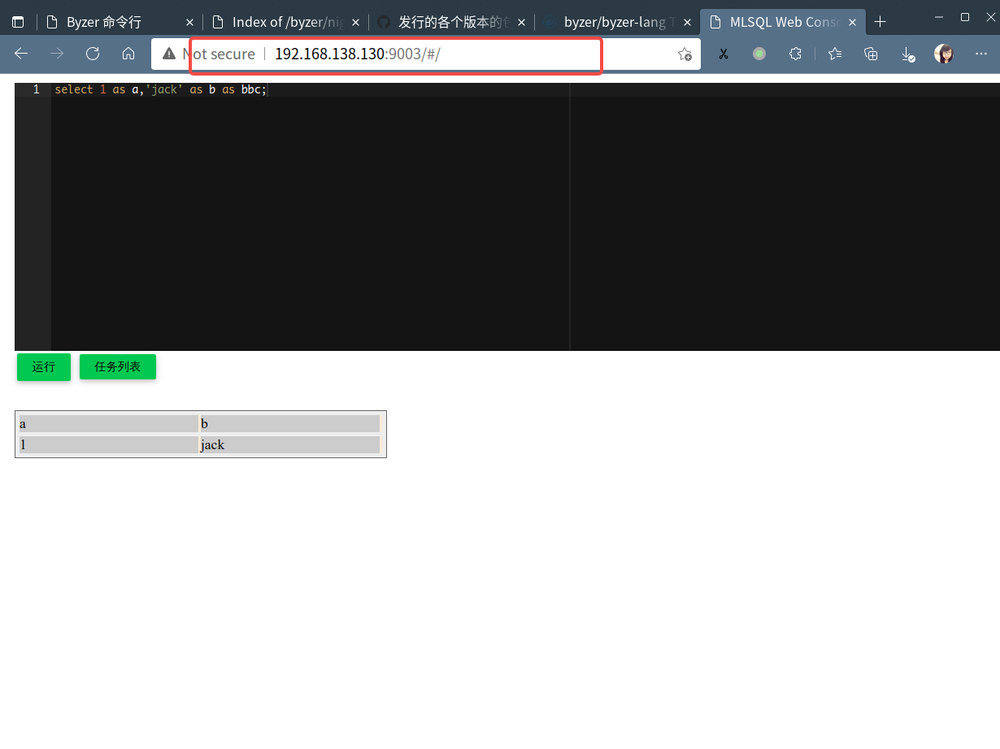

# Byzer Server 二进制版本安装和部署


区别于 [Byzer All In One 产品包](/byzer-lang/zh-cn/installation/server/byzer-all-in-one-deployment.md)，Byzer Server 二进制包仅包含 Byzer 引擎的核心引擎，**不包含** [Byzer CLI](https://download.byzer.org/byzer/misc/byzer-cli/) 以及 [Byzer Extensions](https://download.byzer.org/byzer-extensions/)， 也不包含 JDK 和 Spark 的依赖 Jar 文件。


Byzer Server 二进制包的部署需要配合一个 Spark 集群来使用，目前支持的 Spark 版本为 `3.1.1` 和 `2.4.3`，暂不支持其他版本的 Spark。

> nightly-build 版本(Byzer>=2.4.0-SNAPSHOT) 已经支持 Spark 3.3.0

1. **推荐在 Hadoop 集群上使用 Byzer 时，下载此版本进行安装**
2. 推荐的操作系统为 CentOS7.x 以及 Ubuntu 18.04 +，不支持 Windows
3. 如果您想要在单机（Linux or MacOS）进行 Bzyer 引擎的部署，推荐使用 [Byzer All In One](/byzer-lang/zh-cn/installation/server/byzer-all-in-one-deployment.md) 
3. 如果您想要在 Windows 环境上进行 Bzyer 的体验，推荐使用 [Byzer VSCode Extension](/byzer-lang/zh-cn/installation/vscode/byzer-vscode-extension-installation.md) 或使用 Byzer Notebook


### 下载 Byzer Server 二进制包

请前往 [Byzer 官方下载站点](https://download.byzer.org/byzer/) 下载对应的 Byzer Server二进制包。


#### 产品包名说明

Byzer Server二进制包的包名规范为 `byzer-lang-{spark-vesion}-{byzer-version}.tar.gz`

其中 `｛spark-version｝` 是 Byzer 引擎支持的 Spark 版本，`{byzer-version}` 是 Byzer 的版本。

> 注意： 此处需要提前选择需要使用的 Spark 版本，Byzer 的版本要和 Spark 的版本一一对应


#### Byzer 引擎版本的选择
如何选择对应的 Byzer 引擎版本说明，请参考 [Byzer 引擎部署指引](/byzer-lang/zh-cn/installation/README.md) 中 **Byzer 引擎版本说明** 一节，一般情况下，我们推荐使用最新的正式发布版本


### 安装前置准备

JDK8 和 Spark 可执行环境是 Byzer-lang 启动的必要条件


#### JDK 1.8 安装

请根据自己系统的要求，下载并安装 JDK 1.8，并确保 `$JAVA_HOME` 被正确设置，推荐使用 Oracle JDK 1.8 或 Open JDK 1.8

#### Spark 安装

如果您使用的是 Hadoop 发行版，比如 Apache Hadoop、HDP 或 CDH，请前往您的 Hadoop 发行版提供方下载 Spark 3.1.1 或 Spark 2.4.3

以 Apache Hadoop 为例，前往 [Spark Downloads](https://spark.apache.org/downloads.html) 下载对应的 Spark 版本，在指定位置解压即可。（您需要确保 Spark 在您的 Hadoop 上运行正常）

```shell
## 下载合适的 Spark 版本
$ wget https://archive.apache.org/dist/spark/spark-3.1.1/spark-3.1.1-bin-hadoop3.2.tgz
$ wget https://archive.apache.org/dist/spark/spark-2.4.3/spark-2.4.3-bin-hadoop2.7.tgz
```

**注意：**
1. 您需要删除 `$SPARK_HOME/jars/velocity-1.5.jar`，因为该 jar 与 byzer-lang 中的 Jar 冲突，会影响 Byzer 中 JsonPath 的正确解析
2. 您需要在启动 Byzer 引擎前正确的设置 `$SPARK_HOME` 环境变量以及 `$HADOOP_CONF_DIR` 环境变量

### 下载安装 Byzer 引擎

这里我们以 Linux 环境和 Byzer `2.3.0` 版本举例说明， 访问 [https://download.byzer.org/byzer/2.3.0/](https://download.byzer.org/byzer/2.3.0/) ，下载 Byzer `2.3.0` Byzer Server 的产品包 `byzer-lang-3.1.1-2.3.0.tar.gz` 

此处我们以目录 `/home/byzer` 为例，下载安装包至此目录，解压安装包

```shell
$ tar -zxvf byzer-lang-3.1.1-2.3.0.tar.gz 
$ cd byzer-lang-3.1.1-2.3.0
```
此处我们解压后的目录为 `/home/byzer/byzer-lang-3.1.1-2.3.0`，解压后的目录结构如下

```shell 
|-- bin                # 可执行脚本
|-- conf               # Byzer 引擎的配置目录
|-- libs               # Byzer 引擎的依赖 Jar文件
|-- logs               # 日志目录
|-- main               # Byzer 产品主程序 Jar 文件
|-- plugin             # Byzer Extension 的安装目录  
```


### 修改 Byzer 引擎配置

在启动 Byzer 引擎之前，您可以参考 [Byzer 引擎参数配置说明](/byzer-lang/zh-cn/installation/configuration/byzer-lang-configuration.md) 一文来进行配置文件的修改。
您可以通过以下命令来进行快速的配置修改

```shell
$ cd /home/byzer/byzer-lang-3.1.1-2.3.0
$ cp conf/byzer.properties.server.example conf/byzer.properties.override
```
在 Hadoop 集群上部署的一个典型的配置文件示例如下，你可根据下述示例来修改 `byzer.properties.override` 文件

```properties
# byzer.properties.override
# override example for server package

byzer.server.mode=server

streaming.master=yarn
streaming.name=byzer-engine
streaming.rest=true
streaming.platform=spark
streaming.spark.service=true
streaming.driver.port=9003
streaming.enableHiveSupport=false

spark.driver.memory=2g
spark.executor.memory=1g
spark.driver.cores=1
spark.executor.cores=1
spark.executor.instances=1
```


**注意：** Byzer Server 产品包的默认出厂配置是 `byzer.server.mode=server`，不支持切换至 `all-in-one` 模式，即不支持在单服务器的情况下启动


### 安装 Byzer CLI 和 Byzer Extension （Optional）

#### 安装 Byzer CLI
如果您希望体验通过命令行交互来直接执行 Byzer 脚本，详情可参考 [Byzer CLI](/byzer-lang/zh-cn/installation/cli/byzer-cli.md) 章节，来进行 Byzer CLI 的下载和安装

#### 安装 Byzer Extension
如果您希望安装 Byzer Extensions, 您可以前往 [Byzer Extensions](https://download.byzer.org/byzer-extensions/) 下载 Byzer 的官方插件，放入 `$BYZER_HOME/plugin` 目录下，您也可以根据自己的需要，参照 [byzer-org/byzer-extension](https://github.com/byzer-org/byzer-extension) 来开发自己需要的插件，打包后将 Jar 包放入`$BYZER_HOME/plugin` 目录下。

随后修改 `byzer.properties.override` 文件，修改如下参数，在 Byzer 引擎中注册插件的入口类,示例如下：

```properties
streaming.plugin.clzznames=tech.mlsql.plugins.ds.MLSQLExcelApp,tech.mlsql.plugins.assert.app.MLSQLAssert,tech.mlsql.plugins.shell.app.MLSQLShell,tech.mlsql.plugins.ext.ets.app.MLSQLETApp,tech.mlsql.plugins.mllib.app.MLSQLMllib
```


### 启动 Byzer 引擎

Byzer 引擎提供了可执行脚本 `$BYZER_HOME/bin/byzer.sh` 来进行 Byzer 引擎的启动，停止，和重启，您可以通过执行该脚步获取使用说明，示例如下

```shell
$ ./bin/byzer.sh 
Usage: 'byzer.sh [-v] start' or 'byzer.sh [-v] stop' or 'byzer.sh [-v] restart'

```

启动前请保证正确设置 `$SPARK_HOME` `$HADOOP_CONF_DIR` 环境变量，示例如下：

```shell
export SPARK_HOME=/work/server/spark
export HADOOP_CONF_DIR=/work/server/hadoop/etc/hadoop
```

接下来，您可以通过执行下述命令来启动 Byzer 引擎。

```shell
$ ./bin/byzer.sh start
```

当您看到如下输出时，说明服务启动成功

```shell
$ ./bin/byzer.sh start
Starting Byzer engine...

Byzer-lang is checking installation environment, log is at /home/byzer/byzer-lang-3.1.1-2.3.0/logs/check-env.out

Checking OS
...................................................[PASS]
Checking Java Version
...................................................[PASS]
Checking Ports Availability
...................................................[PASS]

Checking environment finished successfully. To check again, run 'bin/check-env.sh' manually.

SPARK_HOME is: /work/server/spark
BYZER_HOME is: /home/byzer/byzer-lang-3.1.1-2.3.0
BYZER_CONFIG_FILE is: /home/byzer/byzer-lang-3.1.1-2.3.0/conf/byzer.properties
Starting Byzer engine in server mode...

[Spark Config]
--conf spark.kryoserializer.buffer=256k
--conf spark.executor.memory=1g
--conf spark.driver.memory=2g
--conf spark.kryoserializer.buffer.max=1024m
--conf spark.sql.hive.thriftServer.singleSession=true
--conf spark.master=local[*]
--conf spark.scheduler.mode=FAIR
--conf spark.executor.cores=1
--conf spark.serializer=org.apache.spark.serializer.KryoSerializer
--conf spark.executor.instances=1
--conf spark.driver.cores=1
[Byzer Config]
-streaming.spark.service true
-streaming.driver.port 9003
-streaming.platform spark
-streaming.name byzer-engine
-streaming.thrift false
-streaming.master yarn
-streaming.rest true
-streaming.enableHiveSupport false
[Extra Config]
/home/byzer/byzer-lang-3.1.1-2.3.0/plugin/*.jar:/home/byzer/byzer-lang-3.1.1-2.3.0/libs/ansj_seg-5.1.6.jar:/home/byzer/byzer-lang-3.1.1-2.3.0/libs/nlp-lang-1.7.8.jar:/home/byzer/byzer-lang-3.1.1-2.3.0/main/byzer-lang-3.1.1-2.12-2.3.0.jar


Byzer engine is starting. It may take a while. For status, please visit http://192.168.49.1:9003.

You may also check status via: PID:401599, or Log: /home/byzer/byzer-lang-3.1.1-2.3.0//logs/byzer-lang.log.

```
Byzer 引擎在启动时，会引入环境检查以及配置读取，启动成功后，会在终端提供可访问的 Web 地址， 你可以在浏览器中访问该地址进入 Byzer Web Console，如下图所示



点击运行可以查看到上述 SQL 执行的结果，说明 Byzer 引擎正常。

#### 使用 spark-submit 来进行提交

byzer.sh 其实封装了 spark-submit 命令。如果你想精细的控制任务如何提交，可以自己手写 spark-submit 来完成任务提交。

```
${SPARK_HOME}/bin/spark-submit \
--class streaming.core.StreamingApp \
--master yarn \
--deploy-mode client \
--driver-memory 40g \
--driver-cores 20 \
--conf spark.executor.cores=3 \
--conf spark.serializer=org.apache.spark.serializer.KryoSerializer \
--conf spark.executor.instances=2 \
--conf spark.executor.memory=20g \
--conf spark.mlsql.path.schemas=oss \
/opt/byzer/byzer-lang/main/byzer-lang-3.3.0-2.12-2.4.0-SNAPSHOT.jar \
-streaming.spark.service true \
-streaming.driver.port 9003 \
-streaming.platform spark \
-streaming.datalake.path oss://edrington-cdp/deltalake \
-streaming.name byzer-engine \
-streaming.thrift false \
-streaming.rest true \
-streaming.enableHiveSupport true 
```


### 停止 Byzer 引擎

您可以通过如下命令来停止 Byzer 引擎

```shell
$ ./bin/byzer.sh stop 
2022-04-27 23:49:47 Stopping Byzer engine...
2022-04-27 23:49:47 Stopping Byzer-lang: 356657
```

### 重启 Byzer 引擎

您可以通过如下命令来重启 Byzer 引擎

```shell
$ ./bin/byzer.sh restart
2022-04-27 23:49:47 Stopping Byzer engine...
2022-04-27 23:49:47 Stopping Byzer-lang: 356657
```


### FAQ

####  如何设置 `$HADOOP_CONF_DIR` 环境变量

1. 软链接 `core-site.xml`, `hdfs-site.xml`, `yarn-site.xml` 文件到 `$SPARK_HOME/conf` 目录下。
2. 设置环境变量 `HADOOP_CONF_DIR`, 指向 `$SPARK_HOME/conf`, 参考命令如下

```shell 
export HADOOP_CONF_DIR=$SPARK_HOME/conf 
```
也可将此环境变量设置在 `~/.bash_profile` 文件中