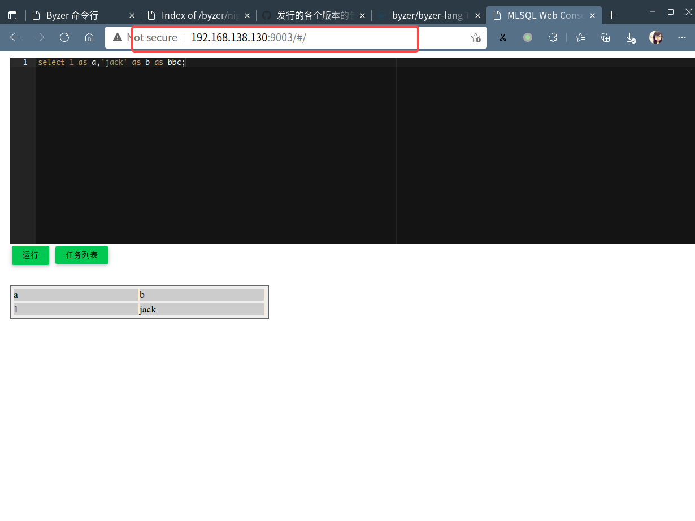

# Byzer All In One 安装与配置

Byzer All In One 版本是在 [Byzer Server 产品包](/byzer-lang/zh-cn/installation/server/binary-installation.md)的基础上，内置包含了 JDK8，[Byzer CLI](https://download.byzer.org/byzer/misc/byzer-cli/) 以及 [Byzer Extensions](https://download.byzer.org/byzer-extensions/) , 给用户提供了单机启动 Byzer 引擎服务以及在 Hadoop 集群启动 Byzer 引擎服务的能力。


### 下载 Byzer All In One

请前往 [Byzer 官方下载站点](https://download.byzer.org/byzer/) 下载对应的 Byzer All In One 产品包。

#### 选择版本
如何选择对应的 Byzer 引擎版本说明，请参考 [Byzer 引擎部署指引](/byzer-lang/zh-cn/installation/README.md) 中 **Byzer 引擎版本说明** 一节，一般情况下，我们推荐使用最新的正式发布版本

#### 产品包名说明

- Byzer `2.3.0` 版本及之后发布的版本，Byzer All In One 包名规范为 `byzer-all-in-one-{os}-{spark-vesion}-{byzer-version}.tar.gz`
- Byzer `2.3.0` 以前的版本，Byzer All In One 的包名规范为 `byzer-lang-{os}-{spark-vesion}-{byzer-version}.tar.gz`

其中 `｛os｝` 为对应的操作系统版本：
- **linux-amd64**: 64 位 linux 操作系统
- **darwin-amd64**: macOS
- **win-amd64**: 64 位 windows 操作系统（**仅支持命令行的交互**）

`｛spark-version｝` 是 Byzer 引擎内置的 Spark 版本，`{byzer-version}` 是 Byzer 的版本。


> Byzer All In One 暂时只提供了适配 Spark `3.1.1` 版本的安装包

### 下载并安装

这里我们以 Linux 环境和 Byzer `2.3.0` 版本举例说明， 访问 [https://download.byzer.org/byzer/2.3.0/](https://download.byzer.org/byzer/2.3.0/) ，下载 Byzer `2.3.0` Byzer All In One 的产品包 `byzer-lang-all-in-one-linux-amd64-3.1.1-2.3.0.tar.gz` 

此处我们以目录 `/home/byzer` 为例，下载安装包至此目录，解压安装包

```shell
$ tar -zxvf byzer-lang-all-in-one-linux-amd64-3.1.1-2.3.0.tar.gz 
$ cd byzer-lang-all-in-one-linux-amd64-3.1.1-2.3.0
```
此处我们解压后的目录为 `/home/byzer/byzer-lang-all-in-one-linux-amd64-3.1.1-2.3.0`，解压后的目录结构如下

```shell 
|-- bin                # 可执行脚本
|-- conf               # Byzer 引擎的配置目录
|-- jdk8               # 内置的 Open JDK 1.8
|-- libs               # Byzer 引擎的依赖 Jar文件
|-- logs               # 日志目录
|-- main               # Byzer 产品主程序 Jar 文件
|-- plugin             # Byzer Extension 的安装目录
|-- spark              # 内置的 Spark Jar 文件 
|-- spark-warehouse    
```

> 由于内置了 Byzer CLI 命令行执行工具， 位置是 `$BYZER_HOME/bin/byzer`，您可以直接通过命令行交互来直接执行 Byzer 脚本，详情可参考 [Byzer CLI](/byzer-lang/zh-cn/installation/cli/byzer-cli.md) 章节


### 修改 Byzer 引擎配置

在启动 Byzer 引擎之前，您可以参考 [Byzer 引擎参数配置说明](/byzer-lang/zh-cn/installation/configuration/byzer-lang-configuration.md) 一文来进行配置文件的修改

**注意：**
- Byzer All In One 产品包的默认出厂配置是 `byzer.server.mode=all-in-one`，即默认情况下是**单机启动 Byzer 引擎服务**
- 如果您希望以配合 Hadoop 集群的方式来启动，可以参考 [Byzer 引擎参数配置说明](/byzer-lang/zh-cn/installation/configuration/byzer-lang-configuration.md) 来修改 `$BYZER_HOME/conf/byzer.properties.override` 文件的参数


### 安装 Byzer Extension （Optional）

Byzer All In One 已默认内置安装了 [Byzer Extensions](https://download.byzer.org/byzer-extensions/) 官方插件，位于 `$BYZER_HOME/plugin` 目录下，您无需手动安装。

如果您需要安装自己开发的插件，您可以参照 [byzer-org/byzer-extension](https://github.com/byzer-org/byzer-extension) 来开发自己需要的插件，打包后将 Jar 包放入`$BYZER_HOME/plugin` 目录下。

随后修改 `byzer.properties.override` 文件，修改如下参数，在 Byzer 引擎中注册插件的入口类,示例如下：

```properties
streaming.plugin.clzznames=tech.mlsql.plugins.ds.MLSQLExcelApp,tech.mlsql.plugins.assert.app.MLSQLAssert,tech.mlsql.plugins.shell.app.MLSQLShell,tech.mlsql.plugins.ext.ets.app.MLSQLETApp,tech.mlsql.plugins.mllib.app.MLSQLMllib
```


### 启动 Byzer 引擎

Byzer 引擎提供了可执行脚本 `$BYZER_HOME/bin/byzer.sh` 来进行 Byzer 引擎的启动，停止，和重启，您可以通过执行该脚步获取使用说明，示例如下

```shell
$ ./bin/byzer.sh 
Usage: 'byzer.sh [-v] start' or 'byzer.sh [-v] stop' or 'byzer.sh [-v] restart'

```

您可以通过执行下述命令来启动 Byzer 引擎。

```shell
$ ./bin/byzer.sh start
```

当您看到如下输出时，说明服务启动成功

```shell
$ ./bin/byzer.sh start
Starting Byzer engine...

Byzer-lang is checking installation environment, log is at /home/byzer/byzer-lang-all-in-one-linux-amd64-3.1.1-2.3.0/logs/check-env.out

Checking OS
...................................................[PASS]
Checking Java Version
...................................................[PASS]
Checking Ports Availability
...................................................[PASS]

Checking environment finished successfully. To check again, run 'bin/check-env.sh' manually.

SPARK_HOME is: 
BYZER_HOME is: /home/byzer/byzer-lang-all-in-one-linux-amd64-3.1.1-2.3.0
BYZER_CONFIG_FILE is: /home/byzer/byzer-lang-all-in-one-linux-amd64-3.1.1-2.3.0/conf/byzer.properties
Starting Byzer engine in all-in-one mode...

[All Config]
-spark.kryoserializer.buffer 256k -streaming.plugin.clzznames tech.mlsql.plugins.ds.MLSQLExcelApp,tech.mlsql.plugins.assert.app.MLSQLAssert,tech.mlsql.plugins.shell.app.MLSQLShell,tech.mlsql.plugins.ext.ets.app.MLSQLETApp,tech.mlsql.plugins.mllib.app.MLSQLMllib -streaming.spark.service true -streaming.job.cancel true -streaming.driver.port 9003 -streaming.platform spark -streaming.name Byzer-lang-desktop -streaming.thrift false -spark.driver.memory 2g -spark.kryoserializer.buffer.max 1024m -streaming.master local[*] -spark.sql.hive.thriftServer.singleSession true -spark.master local[*] -spark.scheduler.mode FAIR -byzer.server.mode all-in-one -spark.serializer org.apache.spark.serializer.KryoSerializer -streaming.rest true -streaming.datalake.path ./data/ -streaming.enableHiveSupport false 


Byzer engine is starting. It may take a while. For status, please visit http://192.168.49.1:9003.

You may also check status via: PID:401599, or Log: /home/byzer/byzer-lang-all-in-one-linux-amd64-3.1.1-2.3.0/logs/byzer-lang.log.

```
Byzer 引擎在启动时，会引入环境检查以及配置读取，启动成功后，会在终端提供可访问的 Web 地址， 你可以在浏览器中访问该地址进入 Byzer Web Console，如下图所示



点击运行可以查看到上述 SQL 执行的结果，说明 Byzer 引擎正常。


### 停止 Byzer 引擎

您可以通过如下命令来停止 Byzer 引擎

```shell
$ ./bin/byzer.sh stop 
2022-04-27 23:49:47 Stopping Byzer engine...
2022-04-27 23:49:47 Stopping Byzer-lang: 356657
```

### 重启 Byzer 引擎

您可以通过如下命令来重启 Byzer 引擎

```shell
$ ./bin/byzer.sh restart
2022-04-27 23:49:47 Stopping Byzer engine...
2022-04-27 23:49:47 Stopping Byzer-lang: 356657
```