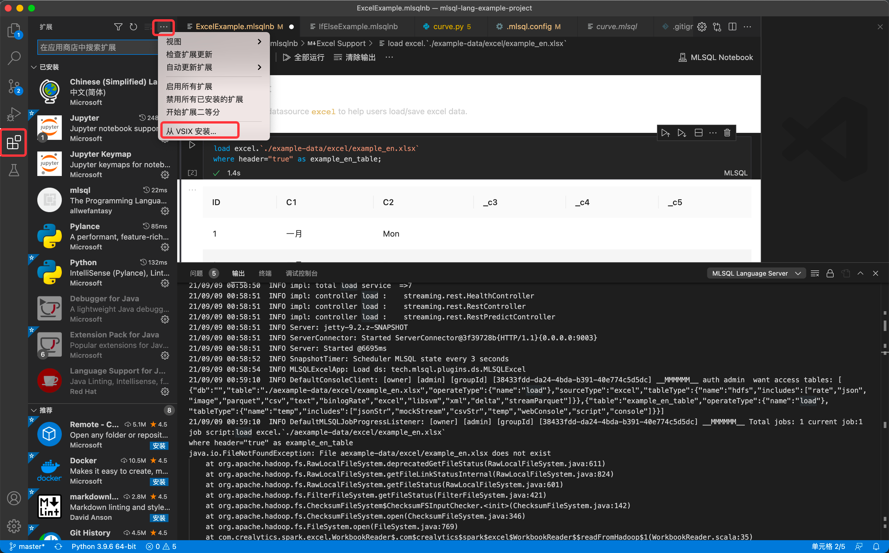
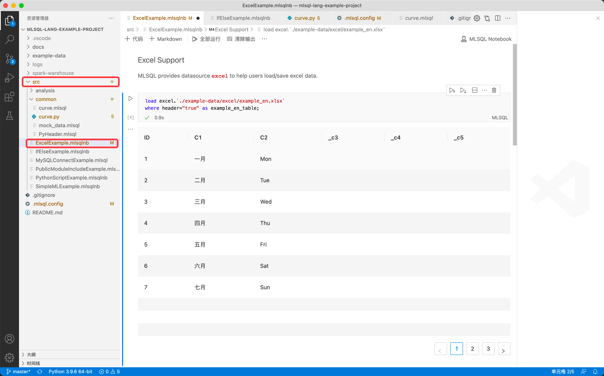
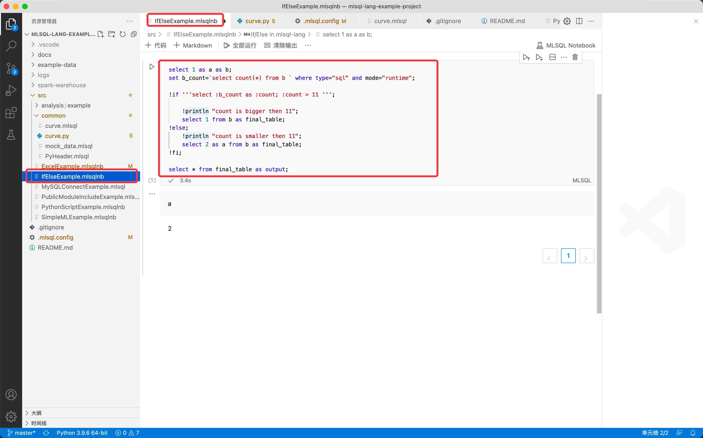
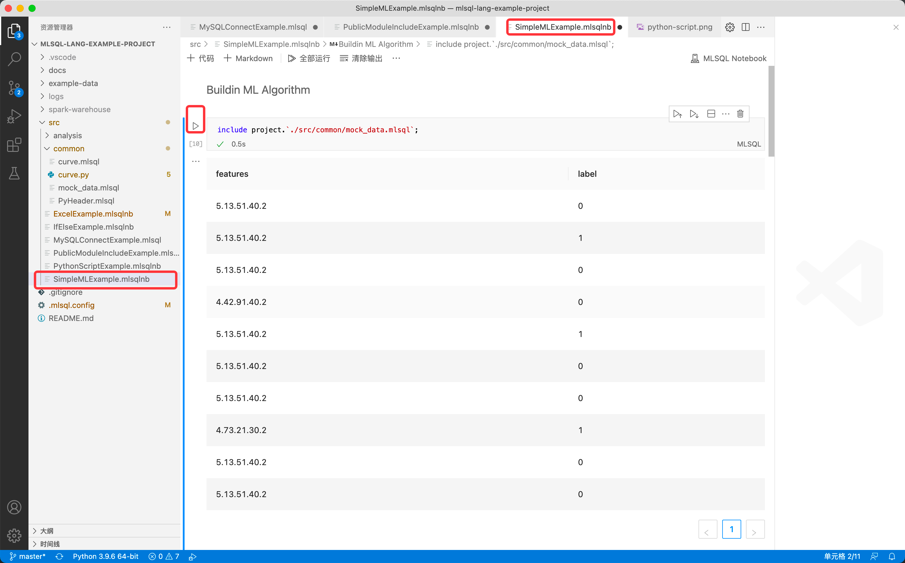

# Byzer VSCode Extension 安装说明

### 前置条件
请根据自己的操作系统的要求，安装 [Visual Studio Code](https://code.visualstudio.com/)

> 注意：
> 1. Byzer VSCode Extension 支持 Windows，Linux，Mac 操作系统
> 2. 推荐通过下述安装部署来进行安装，此插件内置了 Byzer All In One 产品包
> 3. Byzer VSCode Extension 源码参考： [byzer-org/byzer-desktop](https://github.com/byzer-org/byzer-desktop)
> 4. 插件当前识别的文件后缀名为 `.mlsql` | `.byzer` | `.mlsqlnb`，由于一些历史原因，目前我们还没有完全在代码层面做 naming 的变更，后续会持续更新迭代


### 下载说明
Byzer VSCode Extension 目前只能在[Byzer 官方下载站点](https://download.byzer.org/byzer/)进行下载。

Byzer VSCode Extension 的命名规范：
- 在 byzer-lang `2.3.0` 版本发布之前为：`byzer-lang-{os}-{version}.vsix`
- 在 byzer-lang `2.3.0` 版本发布之后为：`byzer-vscode-extesion-{os}-{version}.vsix` 

其中 `{os}` 用于区分不同的操作系统：
- `win`：windows 
- `darwin`：macOS
- `linux`：linux

`{version}` 是该 VScode Extension 的版本，区分为
- Nightly Build 版本：版本号为 `latest`，即包含最新开发改动，可能未经过充分测试，
- 正式发布版本：版本号为数字，随 Byzer 引擎正式版发布

> 需要注意的是，Byzer VSCode Extension 的版本号和 Byzer 引擎的版本号目前不保持一致，用户可以通过官方站点的下载路径，来判断 VSCode Extension 匹配哪一个版本的 Byzer 引擎，比如 Byzer `2.2.1` 版本中对应的 VSCode Extension 版本为 `0.0.7`


### 安装步骤

安装 Byzer VSCode Extension，具体步骤如下：


1. 前往官方站点，根据自己的操作系统，选择版本进行下载，一般推荐选择最新的正式发布版本
2. 打开 VSCode， 在侧边栏点击 **扩展**，并在上方工具栏中点击 **...** -> **从 VSIX 安装...** ，选择刚下载的 vsix 进行安装。

   

> 注意： 只有当打开后缀名为 `.mlsql`的文件，插件才会被初始化

### 配置 mlsql.config 文件 （可选）

当启用了 Byzer VSCode Extension 后，我们可以项目文件夹的根目录下，可以创建 `.mlsql.config` 文件，来为该项目进行不同的配置， 下面是一个配置的示例文件

```properties
# 设置引擎的内存大小
engine.memory=6048m
# 设置引擎的地址，默认是本机的 9003 端口
engine.url=http://127.0.0.1:9003

# Byzer engine 的 Spark 参数配置
engine.spark.shuffle.spill.batchSize=1000
engine.spark.shuffle.spill.numElementsForceSpillThreshold=10000
engine.spark.sql.shuffle.partitions=8
engine.spark.shuffle.accurateBlockThreshold=5242880
engine.spark.memory.fraction=0.1
engine.spark.memory.storageFraction=0.1
engine.spark.sql.inMemoryColumnarStorage.batchSize=1000
engine.spark.sql.files.maxPartitionBytes=5242880
engine.spark.sql.parquet.columnarReaderBatchSize=1000
engine.spark.sql.pivotMaxValues=1000
engine.spark.unsafe.sorter.spill.reader.buffer.size=1m
engine.spark.file.transferTo=false
engine.spark.shuffle.file.buffer=1m
engine.spark.shuffle.unsafe.file.ouput.buffer=1m
engine.spark.io.compression.lz4.blockSize=128k

# Byzer 引擎的 access token， 如果引擎端未设置 access token，则不需要此配置
# user.owner=admin
# user.access_token=123
```


> 如果你是第一次创建该文件，为了使配置生效，在 VSCode 里按住 `shift+command+p`，输入 **开发人员：重新加载窗口** 确保 mlsql.config 文件生效，然后再按住 `shift+command+p`，输入 **MLSQL RUN** 即可解释执行 `.mlsql` 文件

### 示例

接下来我们将通过示例演示Byzer-lang VSCode 插件，您可以从 [此处](https://github.com/allwefantasy/mlsql-lang-example-project) 下载 Byzer-lang VSCode 插件的样例项目。

在执行之前，可以先执行 `./src/common/PyHeader.mlsql`  启用 conda env 

1. **ExcelExample**

   

2. **IfElseExample**

   

3. **SimpleMLExample**

   

4. **PythonScriptExample**

   

5. **PublicModuleIncludeExample**

   