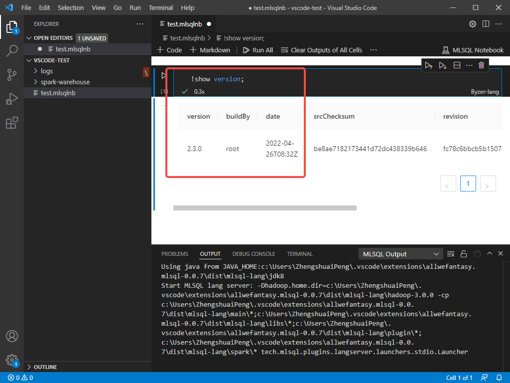

# Byzer VSCode Extension 安装说明

### 前置条件
请根据自己的操作系统的要求，安装 [Visual Studio Code](https://code.visualstudio.com/)

1. Byzer VSCode Extension 支持 Linux，Mac 操作系统，部分支持 Windows
2. 推荐通过下述安装部署来进行安装，此插件内置了 Byzer All In One 产品包
3. Byzer VSCode Extension 源码参考： [byzer-org/byzer-desktop](https://github.com/byzer-org/byzer-desktop)
4. 插件当前识别的文件后缀名为 `.mlsql` | `.byzer` | `.mlsqlnb`， 暂不支持 `.bznb`，由于一些历史原因，目前我们还没有完全在代码层面做 naming 的变更，后续会持续更新迭代
5. Byzer VSCode Extension 目前内置了一个 Byzer All In One 引擎，在插件启动后会使用 9003 端口在本地启动一个 Byzer 引擎，关闭 VSCode 后，该引擎停止


### 下载说明
Byzer VSCode Extension 目前只能在[Byzer 官方下载站点](https://download.byzer.org/byzer/)进行下载。

Byzer VSCode Extension 的命名规范：
- byzer-lang `2.3.0` 版本发布之后为：`byzer-vscode-extesion-{os}-{version}.vsix` 
- byzer-lang `2.3.0` 之前的版本：`byzer-lang-{os}-{version}.vsix`

其中 `{os}` 用于区分不同的操作系统：
- `win`：windows 
- `darwin`：macOS
- `linux`：linux

`{version}` 是该 VScode Extension 的版本，区分为
- Nightly Build 版本：版本号为 `latest`，即包含最新开发改动，可能未经过充分测试，
- 正式发布版本：版本号为数字，随 Byzer 引擎正式版发布

> **注意**
> 1. Byzer VSCode Extension 的版本号和 Byzer 引擎的版本号目前不保持一致，用户可以通过官方站点的下载路径，位于同一下载目录下的 VSCode Extension 和 Byzer 引擎是同版本的
> 2. Windows 环境下， Byzer VSCode Extension 不支持 Byzer Python


### 安装步骤

安装 Byzer VSCode Extension，具体步骤如下：

1. 前往官方站点，根据自己的操作系统，选择版本进行下载，一般推荐选择最新的正式发布版本
2. 打开 VSCode， 在侧边栏点击 **扩展**，并在上方工具栏中点击 **...** -> **从 VSIX 安装...** ，选择刚下载的 vsix 进行安装。

   

> 注意： 只有当打开后缀名为 `.mlsqlnb`的文件，插件才会被初始化

### 使用方式

#### Notebook 交互式使用

您可以在您的项目文件夹下，创建以 `.mlsqlnb` 为结尾的文件，例如 `test.mlsqlnb`， 在文件编辑器中打开该文件。

点击 `+Code` 按钮，您会打开一个新的 cell， Cell 支持的语言有三种
- Byzer-lang
- Markdown
- Python

在该 Cell 的右下角，可以更改该 Cell 的语言为 `Byzer-lang`，然后在 Cell 中输入 Byzer 语句，点击执行按钮，即可看到返回结果。

例如，在 Cell 中输入 `!show version;`，执行的结果如下



#### 执行 Byzer Script

Byzer Script 支持的文件后缀为 `.byzer` 和 `.mlsql`,您可以创建一个空白文件，命名为 `test.byzer`, 在其中写入 Byzer 语句。

在 VSCode 通过下述快捷键打开 VSCode 的命令行输入：
- MacOS：`Shift` + `Command` + `P`
- Linux/Win: `Shift` + `Ctrl` + `P`
 
 输入 **MLSQL RUN**, 即可解释执行当前的 Byzer Script


### 配置 mlsql.config 文件 （可选）

Byzer VSCode Extension 允许在项目中进行 Byzer 的配置变更，当启用了 Byzer VSCode Extension 后，我们可以项目文件夹的根目录下，可以创建 `.mlsql.config` 文件，来为该项目进行不同的配置， 下面是一个配置的示例文件

```properties
# 设置引擎的内存大小
engine.memory=6048m
# 设置引擎的地址，默认是本机的 9003 端口，你可以设置部署在服务器上的 Byzer 引擎 URL和端口，来将您的 VSCode 直接连接到远端的 Byzer 引擎
engine.url=http://127.0.0.1:9003

# Byzer engine 的 Spark 参数配置
engine.spark.shuffle.spill.batchSize=1000
engine.spark.shuffle.spill.numElementsForceSpillThreshold=10000
engine.spark.sql.shuffle.partitions=8
engine.spark.shuffle.accurateBlockThreshold=5242880
engine.spark.memory.fraction=0.1
engine.spark.memory.storageFraction=0.1
engine.spark.sql.inMemoryColumnarStorage.batchSize=1000
engine.spark.sql.files.maxPartitionBytes=5242880
engine.spark.sql.parquet.columnarReaderBatchSize=1000
engine.spark.sql.pivotMaxValues=1000
engine.spark.unsafe.sorter.spill.reader.buffer.size=1m
engine.spark.file.transferTo=false
engine.spark.shuffle.file.buffer=1m
engine.spark.shuffle.unsafe.file.ouput.buffer=1m
engine.spark.io.compression.lz4.blockSize=128k
```


如果你是第一次创建该文件，为了使配置生效，在 VSCode 可以通过如下快捷键打开 VSCode 的命令行输入：
- MacOS：`Shift` + `Command` + `P`
- Linux/Win: `Shift` + `Ctrl` + `P`
 
输入 **开发人员：重新加载窗口** 来重载 `mlsql.config` 文件使其生效

您可以参考 [Byzer 引擎参数配置说明](/byzer-lang/zh-cn/installation/configuration/byzer-lang-configuration.md) 来进行配置的变更

### 更多示例

社区提供了许多示例项目，比如您可以克隆项目 [allwefantasy/mlsql-lang-example-project](https://github.com/allwefantasy/mlsql-lang-example-project) 来获得 Byzer-lang VSCode 插件的样例项目。

通过 VSCode 打开该项目后，可以先执行 `./src/common/PyHeader.mlsql`  脚本文件，来启用 conda env 

1. **ExcelExample**

   

2. **IfElseExample**

   

3. **SimpleMLExample**

   

4. **PythonScriptExample**

   

5. **PublicModuleIncludeExample**

   