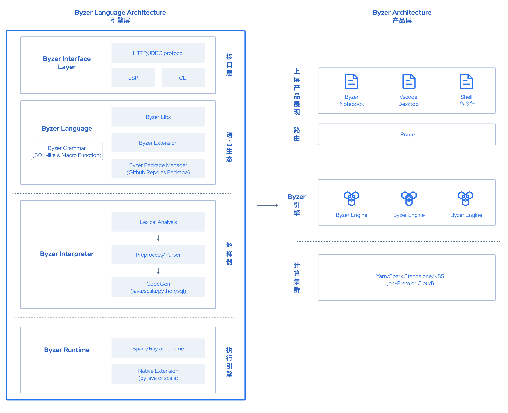
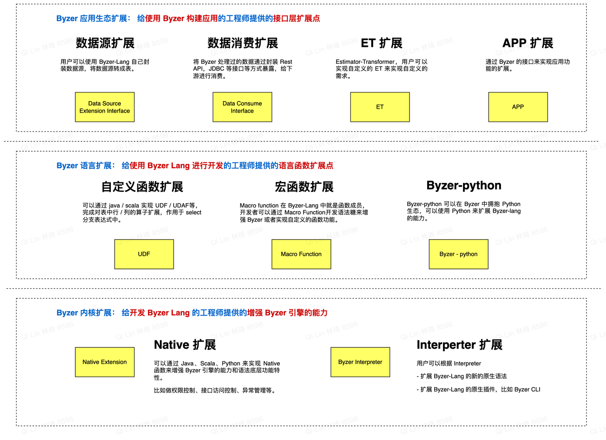

# Byzer SQL 设计原理

### 设计理念

在抽象业务能力的时候，数据的处理和流转承载着信息传递的核心任务，而数据的载体往往就是二维数据表或多维数据表，SQL 语言其实就是抽象在二维数据表上的各种数据操作。Byzer 语言的核心设计是**万物皆表（Everything is a table）**，无论是结构化数据、半结构化数据、非结构化数据，我们希望用户可以非常容易的将任何实体对象通过 Byzer 来抽象成二维表，从而能够基于表来进行数据处理或模型训练等进一步操作。

因此，Byzer SQL 作为一门面向 Data 和 AI 的新一代编程语言，在设计的时候存在了许多的考量：

第一，Byzer 融合了声明式语言和命令式语言的能力与特点，Byzer 的基础语法非常简单，比标准的 SQL 只多了一些关键字，整个学习过程可以在几个小时内完成。

第二，Byzer SQL 目的是想要解决 Data Pipeline 处理和 AI 落地的效率问题，因此我们需要更为抽象更易用的语言去做到跨平台的 Data Connection，这也是我们采用了解释型语言设计的原因。

第三，我们想要尽可能复用业界现有的强大生态，可以让语言天然支持云原生或者分布式，所以我们采用了 Spark/Ray 作为了语言的混合执行引擎，以在引擎层面丰富 Byzer SQL 的原生生态。

第四，大模型最终要落地，必须和数据结合，而SQL可以很好的把大模型和数据结合，所以我们希望 Byzer SQL 可以支持大模型的部署和调用。


### Byzer SQL 语言架构

Byzer SQL 的架构如下图：



上图为 Byzer 架构图，我们可以看到 Byzer 作为一个解释型语言，拥有解释器（Interpreter）以及运行时环境 （Runtime），Byzer 的 Interpreter 会对 Byzer 的脚本做词法分析，预处理，解析等，然后生成 Java/Scala/Python/SQL 等代码，最后提交到 Runtime 上进行执行。

Byzer 使用 **Github 作为包管理器（Package Manager）**，有内置 lib 库和第三方 lib 库（lib 库是使用 Byzer 语言编写出的功能模块）。

从上述设计理念实现而来，Byzer 既保留了 SQL 的优势，简洁易懂，还允许用户通过扩展点来进行更多的进阶操作，提供更多可编程能力。


### Byzer SQL 的扩展设计

Byzer SQL 作为一门语言，需要给开发者提供各种接口来进行实现来完成功能的开发，Byzer 给两类开发者提供了不同层面的扩展抽象：
- 使用 Byzer SQL 开发应用的工程师，主要是编写业务逻辑代码和扩展
- 开发 Byzer SQL 语言的工程师，主要是增强 Byzer SQL 语言特性或者引擎的能力

Byzer SQL 在语言层面提供了**变量成员（Variable**），**函数成员（Macro Function）**，以及提供了**模块（Lib）**以及**包（Package）**的设计。开发者可以通过 Macro Function 来封装代码功能，或实现 Byzer 的语法糖来增强语法特性；也可以通过 Package 进行代码组织，开发可供第三方使用的功能库。

接下来我们将从 Byzer 的**应用生态扩展点**、**语言层扩展点**以及**内核层扩展点**这三个方面展开分享下 Byzer 语言的扩展架构（如下图所示）：




#### 1) Byzer SQL 应用生态扩展

这个层面主要是面向使用 Byzer SQL ，具备 Scala/Java 开发能力的工程师。通过他可以增加 Byzer SQL 处理业务需求的能力。大致分为下面几类：

- **数据源扩展**（数据源扩展从接入数据和消费数据两个角度来进行区分）
  - 接入数据，将数据源抽象成 Byzer 内的表
  - 消费数据，将 Byzer 处理过的数据通过 API 进行暴露，给下游进行消费
  
  
  
- **ET 扩展**（`Estimator-Transformer`）：ET 定义了对表操作的扩展接口，常见的通过 ET 接口实现的一些扩展如
  
  - UDF 函数
  - Byzer-Python，拥抱 Python 生态来扩展 Byzer 处理表的能力
  - `!plugin` 插件及插件管理
  - Macro Function 实际上也是 ET 的一个实现
  
  
  
- **App 扩展**： 通过 Byzer 的接口来实现应用功能的扩展
  - 比如通过实现 LSP 协议，暴露 auto-suggest 接口来完成 Byzer 的代码提示

#### 2) Byzer SQL 语言层扩展

该层扩展主要供 Byzer 编码者使用来扩展语言能力，比如编写 Byzer 的第三方功能库，常见的扩展点如下：

- Macro Function （宏函数）在 Byzer-Lang 中就是函数成员，类似 Method in Java。

- UDF 函数 (允许用户编写 Scala/Java UDF 函数，作用于 select / 分支条件表达式 中)

- Byzer-python ( 作用于 run 语句中。支持 Python 脚本 )

**这里着重提一下 Byzer-python，通过 Byzer-python 的扩展，用户就可以在 Byzer 中拥抱 Python 的生态了。**

对于一些资深的机器学习用户，他们熟悉例如在 Jupyter Notebook 中用 Python 的 scikit-learn 或者 tensorflow 进行了机器学习的模型开发，在 Byzer 中我们通过 Byzer-python 来实现对 Python 代码的引用和适配，资深 Python 用户可以继续使用您习惯的机器学习的包进行模型开发。这里引用了Byzer 的例子，利用 Byzer-python 能力，实现分布式图片处理。

```python
#%python
#%input=raw_cifar10_table
#%output=cifar10_resize
#%cache=true
#%schema=st(field(content,binary),field(path,string))
#%dataMode=data
#%env=source /opt/miniconda3/bin/activate ray1.8.0

import io,cv2,numpy as np
from pyjava.api.mlsql import RayContext

ray_context = RayContext.connect(globals(),"127.0.0.1:10001")

def resize_image(row):
    new_row = {}
    image_bin = row["content"]    
    oriimg = cv2.imdecode(np.frombuffer(io.BytesIO(image_bin).getbuffer(),np.uint8),1)
    newimage = cv2.resize(oriimg,(28,28))
    is_success, buffer = cv2.imencode(".png", newimage)
    io_buf = io.BytesIO(buffer)
    new_row["content"]=io_buf.getvalue()
    new_row["path"]= row["path"]    
    return new_row

ray_context.foreach(resize_image)
```


#### 3) Byzer SQL 内核层扩展：

这个层面的扩展点主要面向 Byzer-lang 的核心开发者的。通过这些扩展点，可以增强引擎的能力。本质上其实是增强 Byzer-Lang 的解释器

1. 内核生命周期扩展点来实现插件扩展，这里的生命周期则是指在 Runtime 初始化之前还是之后，比如 Byzer CLI，就是在 Runtime 初始化之前完成插件加载的
2. 新语法扩展点，比如新增一个语法关键字
3. 各种自定义功能扩展点，比如权限，接口访问控制，异常处理，请求清理 等。


### Byzer SQL IDE/数据库控制台 支持 - Byzer Notebook

作为一门语言，需要能够支持编辑器或者 IDE 来方便用户开发和使用， 完成诸如高亮，代码提示，运行等能力。目前比较流行的方式是实现 LSP （language server protocol），这样在编辑器层或者是 IDE 层，可以直接基于 LSP 完成相关功能。比如在代码提示功能的实现上，可以使用内置宏函数 `!show` 来实现参数自省，通过 **code suggestion API** 返回给调用方，完成代码的提示功能。

Byzer-lang 目前不仅支持官方 Web 版本 IDE：Byzer Notebook ， 也支持用户在 VSCode 中下载插件来启用代码编辑以及 Notebook 的能力。参考： [Byzer-desktop](https://github.com/byzer-org/byzer-desktop) ， [Byzer Notebook](https://github.com/byzer-org/byzer-notebook)

**Byzer Notebook 是基于 Byzer 引擎搭建的网页交互计算（Web IDE）应用平台。Byzer Notebook 同时也是** **Byzer-lang 的 debugger(调试器)，通过 Notebook 简单易用的调试功能，省去了初学者安装配置开发环境的门槛。**

<p align="center">
    
</p>
