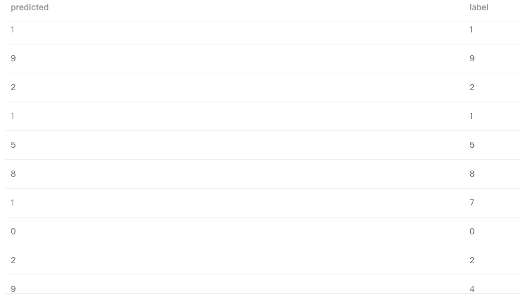

# 模型部署

在 Byzer 中，我们可以使用和内置算法一样的方式将一个基于 Byzer-python 训练出的 AI 模型注册成一个 UDF 函数，这样可以将模型应用于批、流，以及 Web 服务中。接下来我们将展示 Byzer-python 基于 Ray 从模型训练再到模型部署的全流程 demo。

#### 数据准备

首先，准备 mnist 数据集（需要安装 `tensorflow` 和 `keras`）：

```sql
!python env "PYTHON_ENV=source activate dev";
!python conf "schema=st(field(image,array(long)),field(label,long),field(tag,string))";
!python conf "runIn=driver";
!python conf "dataMode=model";

run command as Ray.`` where 
inputTable="command"
and outputTable="mnist_data"
and code='''
from pyjava.api.mlsql import RayContext, PythonContext
from keras.datasets import mnist

ray_context = RayContext.connect(globals(), None)

(x_train, y_train),(x_test, y_test) = mnist.load_data()

train_images = x_train.reshape((x_train.shape[0], 28 * 28))
test_images = x_test.reshape((x_test.shape[0], 28 * 28))

train_data = [{"image": image.tolist(), "label": int(label), "tag": "train"} for (image, label) in zip(train_images, y_train)]
test_data = [{"image": image.tolist(), "label": int(label), "tag": "test"} for (image, label) in zip(test_images, y_test)]
context.build_result(train_data + test_data)
''';

save overwrite mnist_data as delta.`ai_datasets.mnist`;
```

上面的 Byzer-python 脚本，获取keras自带的 mnist 数据集，再将数据集保存到数据湖中。

#### 训练模型

接着就开始拿测试数据 minist 进行训练，下面是模型训练代码：

```sql
-- 获取训练数据集
load delta.`ai_datasets.mnist` as mnist_data;
select image, label from mnist_data where tag="train" as mnist_train_data;

!python env "PYTHON_ENV=source activate dev";
!python conf "schema=file";
!python conf "dataMode=model";
!python conf "runIn=driver";

run command as Ray.`` where 
inputTable="mnist_train_data"
and outputTable="mnist_model"
and code='''
import ray
import os
import tensorflow as tf
from pyjava.api.mlsql import RayContext
from pyjava.storage import streaming_tar
import numpy as np


ray_context = RayContext.connect(globals(),"10.1.3.197:10001")
data_servers = ray_context.data_servers()

train_dataset = [item for item in RayContext.collect_from(data_servers)]

x_train = np.array([np.array(item["image"]) for item in train_dataset])
y_train = np.array([item["label"] for item in train_dataset])

x_train = x_train.reshape((len(x_train),28, 28))

model = tf.keras.models.Sequential([
  tf.keras.layers.Flatten(input_shape=(28, 28)),
  tf.keras.layers.Dense(128, activation='relu'),
  tf.keras.layers.Dropout(0.2),
  tf.keras.layers.Dense(10, activation='softmax')
])

model.compile(optimizer='adam',
              loss='sparse_categorical_crossentropy',
              metrics=['accuracy'])

model.fit(x_train, y_train, epochs=5)

model_path = os.path.join("tmp","minist_model")
model.save(model_path)
model_binary = [item for item in streaming_tar.build_rows_from_file(model_path)]

ray_context.build_result(model_binary)
''';
```

最后把模型保存至数据湖里：

```sql
save overwrite mnist_model as delta.`ai_model.mnist_model`;
```

#### 将模型注册成 UDF 函数

训练好模型之后，我们就可以用 Byzer-lang 的 Register 语法将模型注册成基于 Ray 的服务了，下面是模型注册的代码：

```sql
!python env "PYTHON_ENV=source activate dev";
!python conf "schema=st(field(content,string))";
!python conf "mode=model";
!python conf "runIn=driver";
!python conf "rayAddress=10.1.3.197:10001";


-- 加载前面训练好的tf模型
load delta.`ai_model.mnist_model` as mnist_model;

-- 把模型注册成udf函数
register Ray.`mnist_model` as model_predict where 
maxConcurrency="8"
and debugMode="true"
and registerCode='''

import ray
import numpy as np
from pyjava.api.mlsql import RayContext
from pyjava.udf import UDFMaster,UDFWorker,UDFBuilder,UDFBuildInFunc

ray_context = RayContext.connect(globals(), context.conf["rayAddress"])

# 预测函数
def predict_func(model,v):
    test_images = np.array([v])
    predictions = model.predict(test_images.reshape((1,28*28)))
    return {"value":[[float(np.argmax(item)) for item in predictions]]}

# 将预测函数提交到 ray_context
UDFBuilder.build(ray_context,UDFBuildInFunc.init_tf,predict_func)

''' and 
predictCode='''

import ray
from pyjava.api.mlsql import RayContext
from pyjava.udf import UDFMaster,UDFWorker,UDFBuilder,UDFBuildInFunc

ray_context = RayContext.connect(globals(), context.conf["rayAddress"])

# 
UDFBuilder.apply(ray_context)

''';
```

> 这里 `UDFBuilder` 与 `UDFBuildInFunc` 都是 Pyjava 提供的高阶 API，用来将 Python 脚本注册成 UDF 函数。

#### 使用模型做预测

Byzer 提供了类 SQL 语句做批量（Batch）查询，加载您的数据集，即可对数据进行预测。

```sql
load delta.`ai_datasets.mnist` as mnist_data;
select cast(image as array<double>) as image, label as label from mnist_data where tag = "test" limit 100 as mnist_test_data;
select model_predict(array(image))[0][0] as predicted, label as label  from  mnist_test_data as output;
```



后续可以直接调用 Byzer-engine 的 Rest API， 使用注册好的 UDF 函数对您的数据集作预测。
