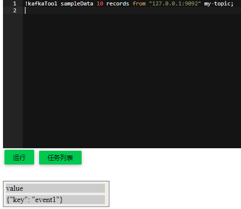

# Kafka 小工具集锦

流式程序的一大特点就是调试没有批那么方便。为此，我们提供一些工具方便用户探索 Kafka 里的数据：

### 1. 查看 Kafka 最新 N 条数据
```sql
!kafkaTool sampleData 10 records from "127.0.0.1:9092" my-topic;
```

这个命令表示我要采集 10 条数据，来源是 Kafka 集群"127.0.0.1:9092"，主题( topic ) 是wow。



### 2. 自动推测 Kafka 的 Schema

```sql
!kafkaTool schemaInfer 10 records from "127.0.0.1:9092" my-topic;
```

句法格式和前面一致，唯一区别是换了个命令，把 sampleData 换成 schemaInfer. 目前只支持 json 格式的 Kafka 消息。

### 3. 查看流式程序的 checkpoint 目录的最新 offset

```sql
!kafkaTool streamOffset /tmp/ck;
```