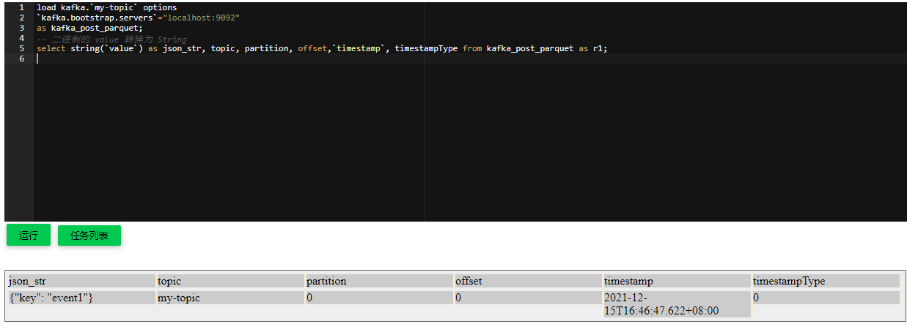

# 消费 Kafka 数据

Byzer-lang 目前显式支持 Kafka 以及 MockStream. MockStream 主要用于模拟数据源，测试场景中应用的比较多。

> 值得注意的是，Byzer-lang 支持 Kafka 0.10 及以上版本，而原生的 Structured Streaming 只支持0.10版本的    Kafka.


## 消费 Kafka 数据
开始之前，先准备 Kafka 数据。您可以先创建一个名为 my-topic 的 topic 。
> 请参考 [Kafka 开发环境搭建](./kafka_local_install.md) 安装 Kafka 。

```shell
cd cd /work/kafka_2.11-0.10.0.1
./kafka-topics.sh --create --partitions 1 --replication-factor 1 --topic my-topic --zookeeper localhost:2181
./kafka-topics.sh --describe --topic my-topic --zookeeper localhost:2181
```

然后调用 Kafka 提供的工具，创建一条测试数据。
```shell
./kafka-console-producer.sh --topic my-topic --broker-list localhost:9092
```
在命令行提示符后，输入以下，再按 Ctrl - c 退出。
```text
{"key": "event1"}
```
我们再使用 kafka 提供的消费者工具，可以看出 topic 中已经有一条消息，按 Ctrl - C 退出。
```shell
./kafka-console-consumer.sh --topic my-topic --from-beginning --zookeeper localhost:2181
```

好！费了一番力气后，我们终于可以使用 Byzer-lang 消费 Kafka 数据了。

```sql

load kafka.`my-topic` options
`kafka.bootstrap.servers`="localhost:9092"
as kafka_post_parquet;
-- 二进制的 value 转换为 String
select string(`value`), topic, partition, offset,`timestamp`, timestampType from kafka_post_parquet as ddd;

```



可以看出， Byzer-lang 返回 Kafka 消息, topic, partition, offset, timestamp 等重要信息。

获取了数据之后，Byzer-lang Stream 支持的输出数据源有：

1. 文件写入(比如 parquet, orc, json, csv 等等)
2. Kafka 写入
3. 以及 MySQL 写入。

以 MySQL 为例，具体使用如下：

```sql
-- 获取 json key 元素的值
select get_json_object(json_str, "$.key") as json_val from r1 as r2;
-- 连接本机 MySQL， 根据你的情况修改 数据库连接信息
connect jdbc where  
driver="com.mysql.jdbc.Driver"
and url="jdbc:mysql://127.0.0.1:3306/notebook"
and user="root"
and password="root"
as mysql1;
-- Append 模式写入 MySQL 表 test1
save append table21  
as streamJDBC.`mysql1.test1` 
options mode="Complete"
and `driver-statement-0`="create table  if not exists test1(k TEXT,c BIGINT)"
and `statement-0`="insert into wow.test1(k,c) values(?,?)"
and duration="3"
and checkpointLocation="/tmp/cpl3";
```

只有 save 语法会触发整个流的提交和执行。这里面有几个核心的参数：

1. duration，执行周期，单位为秒,如果是0,则执行完立马执行下一个周期。
2. checkpointLocation 流重启后恢复用
3. mode， 三种模式，Update,Append,Complete,请参考structured streaming里这三种模式的区别。

## 模拟输入数据源

为了方便测试，我们提供了一个Mock输入，来模拟Kafka输入。

```
-- mock some data.
set data='''
{"key":"yes","value":"no","topic":"test","partition":0,"offset":0,"timestamp":"2008-01-24 18:01:01.001","timestampType":0}
{"key":"yes","value":"no","topic":"test","partition":0,"offset":1,"timestamp":"2008-01-24 18:01:01.002","timestampType":0}
{"key":"yes","value":"no","topic":"test","partition":0,"offset":2,"timestamp":"2008-01-24 18:01:01.003","timestampType":0}
{"key":"yes","value":"no","topic":"test","partition":0,"offset":3,"timestamp":"2008-01-24 18:01:01.003","timestampType":0}
{"key":"yes","value":"no","topic":"test","partition":0,"offset":4,"timestamp":"2008-01-24 18:01:01.003","timestampType":0}
{"key":"yes","value":"no","topic":"test","partition":0,"offset":5,"timestamp":"2008-01-24 18:01:01.003","timestampType":0}
''';

-- load data as table
load jsonStr.`data` as datasource;

-- convert table as stream source
load mockStream.`datasource` options 
stepSizeRange="0-3"
as newkafkatable1;
```

通过set 以及load语法我们制造了一批数据，然后呢，我们使用 mockStream 来加载这些数据，mockStream
会每个周期发送0到3条数据出来，这个通过 stepSizeRange 进行控制。

这样我们就可以脱离 Kafka 从而实现方便的代码测试。当然，你肯定很像知道 newkafkatable1 也就是我们加载完 kafka 后的数据该怎么处理，
和普通的批处理是类似的：

```sql
select cast(key as string) as k,count(*) as c  from newkafkatable1 group by k
as table21;
```

下面是一个典型的流式程序：

```sql
-- the stream name, should be uniq.
set streamName="streamExample";

-- connect mysql as the data sink.
-- Please change mysql connection string accordingly. 
connect jdbc where  
driver="com.mysql.jdbc.Driver"
and url="jdbc:mysql://127.0.0.1:13306/notebook?useSSL=false"
and driver="com.mysql.jdbc.Driver"
and user="root"
and password="root"
as mysql1;


-- mock some data.
set data='''
{"key":"yes","value":"no","topic":"test","partition":0,"offset":0,"timestamp":"2008-01-24 18:01:01.001","timestampType":0}
{"key":"yes","value":"no","topic":"test","partition":0,"offset":1,"timestamp":"2008-01-24 18:01:01.002","timestampType":0}
{"key":"yes","value":"no","topic":"test","partition":0,"offset":2,"timestamp":"2008-01-24 18:01:01.003","timestampType":0}
{"key":"yes","value":"no","topic":"test","partition":0,"offset":3,"timestamp":"2008-01-24 18:01:01.003","timestampType":0}
{"key":"yes","value":"no","topic":"test","partition":0,"offset":4,"timestamp":"2008-01-24 18:01:01.003","timestampType":0}
{"key":"yes","value":"no","topic":"test","partition":0,"offset":5,"timestamp":"2008-01-24 18:01:01.003","timestampType":0}
''';

-- load data as table
load jsonStr.`data` as datasource;

-- convert table as stream source
load mockStream.`datasource` options 
stepSizeRange="0-3"
as newkafkatable1;

-- aggregation 
select cast(key as string) as k,count(*) as c  from newkafkatable1 group by k
as table21;

-- output the the result to console.
-- save append table21  
-- as console.`` 
-- options mode="Complete"
-- and duration="10"
-- and checkpointLocation="/tmp/cpl3";

-- save the data to mysql.
save append table21  
as streamJDBC.`mysql1.test1` 
options mode="Complete"
and `driver-statement-0`="create table  if not exists test1(k TEXT,c BIGINT)"
and `statement-0`="insert into notebook.test1(k,c) values(?,?)"
and duration="3"
and checkpointLocation="/tmp/cpl3";
```

注意：

> 任何一个流程序都需要一个唯一的标识符，通过  set streamName="streamExample"; 来设置。

如果你不想有任何依赖，就是想跑一个例子看看，可以使用如下的语句：

```sql
-- the stream name, should be unique.
set streamName="streamExample-1";

-- mock some data.
set data='''
{"key":"yes","value":"a,b,c","topic":"test","partition":0,"offset":0,"timestamp":"2008-01-24 18:01:01.001","timestampType":0}
{"key":"yes","value":"d,f,e","topic":"test","partition":0,"offset":1,"timestamp":"2008-01-24 18:01:01.002","timestampType":0}
{"key":"yes","value":"k,d,j","topic":"test","partition":0,"offset":2,"timestamp":"2008-01-24 18:01:01.003","timestampType":0}
{"key":"yes","value":"m,d,z","topic":"test","partition":0,"offset":3,"timestamp":"2008-01-24 18:01:01.003","timestampType":0}
{"key":"yes","value":"o,d,d","topic":"test","partition":0,"offset":4,"timestamp":"2008-01-24 18:01:01.003","timestampType":0}
{"key":"yes","value":"m,m,m","topic":"test","partition":0,"offset":5,"timestamp":"2008-01-24 18:01:01.003","timestampType":0}
''';

-- load data as table
load jsonStr.`data` as datasource;

-- convert table as stream source
load mockStream.`datasource` options 
stepSizeRange="0-3"
and valueFormat="csv"
and valueSchema="st(field(column1,string),field(column2,string),field(column3,string))"
as newkafkatable1;

-- aggregation 
select column1,column2,column3,kafkaValue from newkafkatable1 
as table21;

-- output the the result to console.
save append table21  
as console.`` 
options mode="Append"
and duration="10"
and checkpointLocation="/tmp/cpl3";
```

输出结果如下：


```text
-- 若配置了 Log ，输出到 Log 文件中
-------------------------------------------
Batch: 6
-------------------------------------------
+-------+-------+-------+--------------------+
|column1|column2|column3|          kafkaValue|
+-------+-------+-------+--------------------+
|      m|      m|      m|[yes, 0, 5, 2008-...|
+-------+-------+-------+--------------------+
```

注意：

> 使用 console，每次重启你需要删除 checkpointLocation
