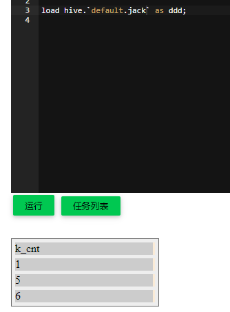

# 如何对流的结果以批的形式保存

Byzer-lang 对流的数据源支持有限。如果我想流的数据保存到ES中，但是没有相应的流式 ES 数据源的实现该怎么办？为了解决这个问题，
Byzer-lang 提供了一个 'custom' 流式数据源，可以方便的让你用批的方式操作流的结果数据。

我们来看看具体的示例代码：

```sql
-- the stream name, should be unique.
set streamName="streamExample";


-- mock some data.
set data='''
{"key":"yes","value":"no","topic":"test","partition":0,"offset":0,"timestamp":"2008-01-24 18:01:01.001","timestampType":0}
{"key":"yes","value":"no","topic":"test","partition":0,"offset":1,"timestamp":"2008-01-24 18:01:01.002","timestampType":0}
{"key":"yes","value":"no","topic":"test","partition":0,"offset":2,"timestamp":"2008-01-24 18:01:01.003","timestampType":0}
{"key":"yes","value":"no","topic":"test","partition":0,"offset":3,"timestamp":"2008-01-24 18:01:01.003","timestampType":0}
{"key":"yes","value":"no","topic":"test","partition":0,"offset":4,"timestamp":"2008-01-24 18:01:01.003","timestampType":0}
{"key":"yes","value":"no","topic":"test","partition":0,"offset":5,"timestamp":"2008-01-24 18:01:01.003","timestampType":0}
''';

-- load data as table
load jsonStr.`data` as datasource;

-- convert table as stream source
load mockStream.`datasource` options 
stepSizeRange="0-3"
as newkafkatable1;

-- aggregation 
select cast(value as string) as k  from newkafkatable1
as table21;

-- run command as  MLSQLEventCommand.`` where
--       eventName="started,progress,terminated"
--       and handleHttpUrl="http://127.0.0.1:9002/jack"
--       and method="POST"
--       and params.a=""
--       and params.b="";
-- output the the result to console.


save append table21  
as custom.`` 
options mode="append"
and duration="15"
and sourceTable="jack"
and code='''
select count(*) as c from jack as newjack;
save append newjack as parquet.`/tmp/jack`; 
'''
and checkpointLocation="/tmp/cpl15";

```

我们关注点放在：

```sql
save append table21  
as custom.`` 
options mode="append"
and duration="15"
and sourceTable="jack"
and code='''
select count(*) as c from jack as newjack;
save append newjack as parquet.`/tmp/jack`; 
'''
and checkpointLocation="/tmp/cpl15";
```

有几个点需要注意：

1. 数据源名称是 custom
2. 我们需要将结果表通过 sourceTable 重新取名，这里我们把 table21 取名为jack,然后在子代码中使用。
3. code 里允许你用批的形态操作jack表。

这样，我们就能很方便的将大部分数据写入到支持批的数据源中了。

## Hive分区表写入

如果我们希望把数据写入 Hive 分区表怎么办？ 修改上文保存数据代码，使用动态分区，可以按如下方式写：

```sql
-- 解析 table21 的 json 字符串 
select get_json_object(k, "$.key") as ke, get_json_object(k, "$.value") valu from table21 AS table22;

-- Aggregation 
select count(1) as k_cnt, ke FROM table22 GROUP BY ke AS table23;

-- 以 ke 为分区键， 保存到 Hive default.jack 表
save append table23
as custom.``
options mode="complete"
and duration="15"
and sourceTable="jack"
and code='''
save append jack as hive.`default.jack` partitionBy ke;
'''
and checkpointLocation="/tmp/cpl16";
```
查看 Hive 表数据
```sql
load hive.`default.jack` as ddd;
```


另外也可以使用 hive 原生 insert 语句,例如下面的例子

```
set streamName="streamExample-hive27";
-- 开启 Hive 动态分区 
set hive.exec.dynamic.partition=true where type="conf";
set hive.exec.dynamic.partition.mode=nostrict  where type="conf";

-- mock some data.
set data='''
{"key":"yes","value":"no","topic":"test","partition":0,"offset":0,"timestamp":"2008-01-24 18:01:01.001","timestampType":0}
{"key":"yes","value":"no","topic":"test","partition":0,"offset":1,"timestamp":"2008-01-24 18:01:01.002","timestampType":0}
{"key":"yes","value":"no","topic":"test","partition":0,"offset":2,"timestamp":"2008-01-24 18:01:01.003","timestampType":0}
{"key":"yes","value":"no","topic":"test","partition":0,"offset":3,"timestamp":"2008-01-24 18:01:01.003","timestampType":0}
{"key":"yes","value":"no","topic":"test","partition":0,"offset":4,"timestamp":"2008-01-24 18:01:01.003","timestampType":0}
{"key":"yes","value":"no","topic":"test","partition":0,"offset":5,"timestamp":"2008-01-24 18:01:01.003","timestampType":0}
''';

-- load data as table
load jsonStr.`data` as datasource;

-- convert table as stream source
load mockStream.`datasource` options 
stepSizeRange="0-3"
as newkafkatable1;

-- aggregation 
select cast(value as string) as k  from newkafkatable1
as table21;

select get_json_object(k, "$.key") as ke, get_json_object(k, "$.value") valu from table21 AS table22;

select ke, count(1) as k_cnt, "p1" as part_key FROM table22 GROUP BY ke AS table23;

save append table23
as custom.``
options mode="complete"
and duration="15"
and sourceTable="jack"
and code='''
CREATE TABLE IF NOT EXISTS default.jack_2 (ke STRING, k_cnt INT) PARTITIONED BY (part_key STRING);
insert OVERWRITE table default.jack_2 partition(part_key)
select * from jack;
'''
and checkpointLocation="/tmp/cpl27";
```
依然使用 ```load``` 语句查看 Hive 表数据
```sql
load hive.`default.jack_2` as ddd;
```

> 使用原生 Hive INSERT 语句时，需要先在 Hive 建表。

