# Byzer对接RSS(Remote Shuffle Service)和Gluten向量化引擎

最近在一些项目中发现，目前的大数据系统要么是依赖yarn，要么是依赖k8s。无论是其中的哪一种都需要非常高的硬件成本和维护成本。而且spark目前的shuffle有时会不太稳定，如果byzer已client模式启动一个高配置的客户端，byzer客户端基本上是永久占用资源。所以可能在大量时间段，白白浪费许多的计算资源。

所以我有了一个想法，是否可以把shuffle service给抽离出来呢，这样意味着每个byzer的engine都可以使用一个不太高的配置，大家可以一起复用shuffle服务。

下面是Shuffle的一些痛点，
- 现有Shuffe无法使计算做到serverless，在机器资源被抢占时会导致Shuffle数据的重新计算。
- Shuffle Partition会导致大量的Shufe连接和网络小包，大规模场景下极容易发生超时问题。
- Shufhe过程存在写放大和随机问题，当Shufe数据过大时，会严重影响集群性能和稳定性。
- Spark Shuffle服务和NodeManager在同一进程，负载较高时极易导致NodeManager重启，影响Yarn调度。

同时，我本人所做的很多项目其实偏分析类，并不是像互联网一样有非常大的数据量，byzer的易拓展和简单的语法，更方便我们开发人员和业务人员一起使用, 同时RSS的推出可以让我们更加方便的拓展资源和维护。

关于技术选型，Remote Shuffle Service(RSS)目前看到了2种Apache项目。一个是[Apache Celeborn](https://github.com/apache/incubator-celeborn),另一个是[Apache Uniffle](https://github.com/apache/incubator-uniffle), 考虑到Celeborn的star数比较多，而且貌似还能直接对接向量化引擎[Gluten](https://github.com/oap-project/gluten)，所以我这里就直接选择Celeborn了。

顺带一提，大家也可以自行探索下Byzer对接Uniffle, 然后出一个教程，感谢脸=.=。

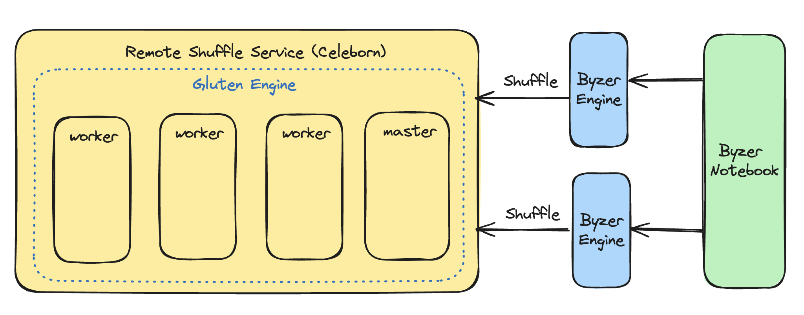
这个是我们新的架构图，byzer-notebook对接多个byzer-engine,然后byzer-engine对接RSS服务，同时RSS配置有Velox Engine。

下图是我的系统版本, JDK使用1.8:

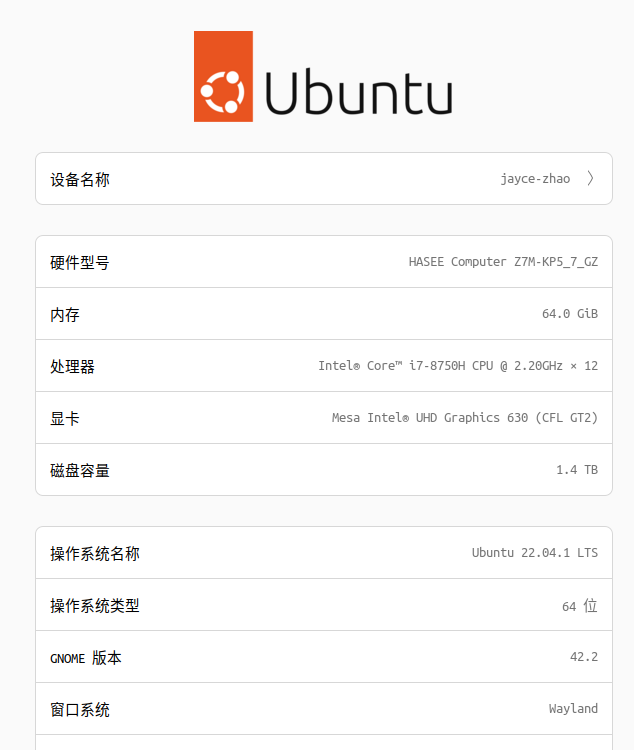

废话太多了，我们直接开始。首先，我们先看下Gluten的仓库，看下Gluten怎么结合Celeborn,这里是个天坑，目前Gluten只能支持指定版本的Celeborn，不然可能因为Api异常报出一些Warning。

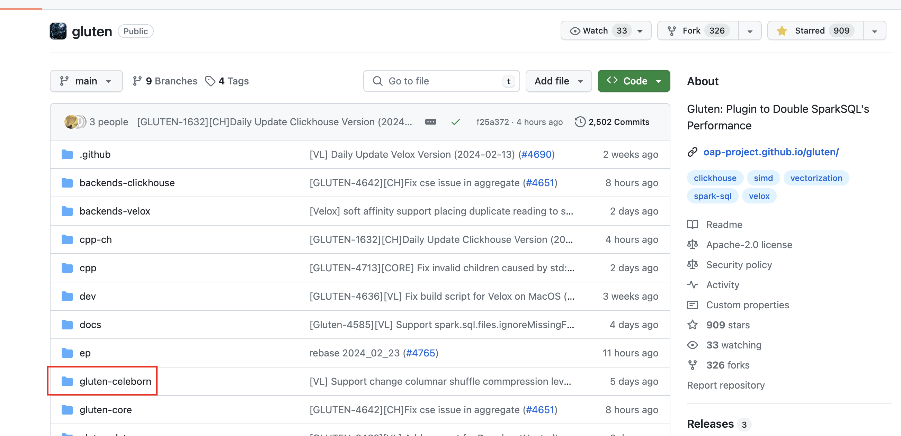
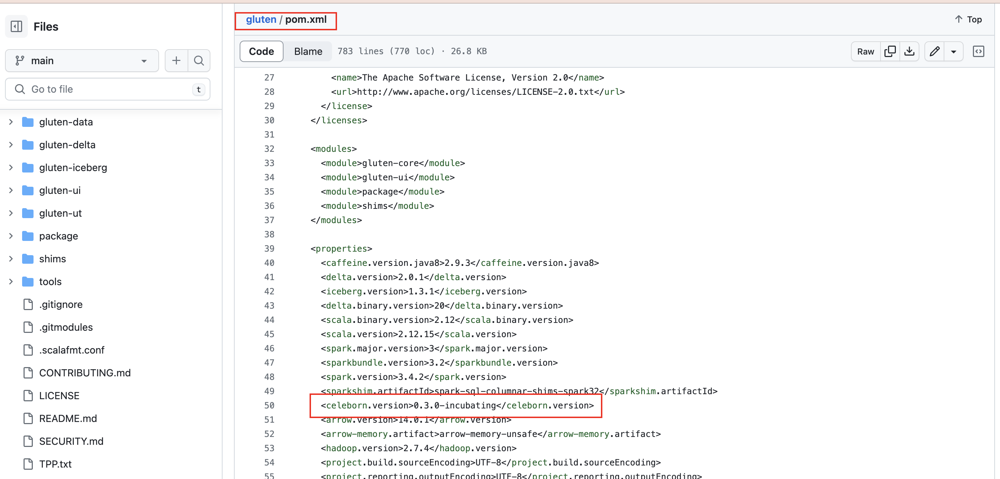

Ok, 这边我们确定了celeborn可以支持的版本。

## Celeborn

### Download Celeborn
```shell
wget https://www.apache.org/dyn/closer.lua/incubator/celeborn/celeborn-0.3.0-incubating/apache-celeborn-0.3.0-incubating-bin.tgz

tar -zxvf apache-celeborn-0.3.0-incubating-bin.tgz
```

### Configure Celeborn Home
```shell
export CELEBORN_HOME=<Decompressed path>
```

### Configure Logging and Storage

#### Configure Logging
```shell
cd $CELEBORN_HOME/conf
cp log4j2.xml.template log4j2.xml
```
#### Configure Storage
```shell
cd $CELEBORN_HOME/conf
echo "celeborn.worker.storage.dirs=$CELEBORN_HOME/shuffle" > celeborn-defaults.conf
```
### Start Celeborn Service

#### Start Master
```shell
cd $CELEBORN_HOME
./sbin/start-master.sh
```
You should see Master's ip:port in the log:
```shell
INFO [main] NettyRpcEnvFactory: Starting RPC Server [MasterSys] on 192.168.1.10:9097 with advisor endpoint 192.168.1.10:9097
```

#### Start Worker

Use the Master's IP and Port to start Worker:
```shell
cd $CELEBORN_HOME
./sbin/start-worker.sh celeborn://192.168.1.10:9097
```

You should see the following message in Worker's log:
```shell
INFO [main] MasterClient: connect to master 192.168.1.10:9097.
INFO [main] Worker: Register worker successfully.
INFO [main] Worker: Worker started.
```

## Gluten

### Download Gluten

```shell
git clone https://github.com/oap-project/gluten.git
```

### Compile Gluten with spark

```shell
mvn clean package -Pbackends-velox -Pspark-3.3 -Prss -DskipTests
```
编译成功之后，可以在gluten/package/target目录下找到`gluten-velox-bundle-spark3.3_2.12-ubuntu_22.04-1.1.0-SNAPSHOT.jar`文件，官方文档中提到还有一个`gluten-thirdparty-lib-xx-xx.jar`，实际上新版本已经不用这个文件了。

然后官网有提到把下面配置，添加到`spark-defaults.conf`中，我喜欢直接在提交命令中指定配置，所以这边就不配置了，你们可以参考。

```shell
spark.shuffle.manager org.apache.spark.shuffle.gluten.celeborn.CelebornShuffleManager

# celeborn master
spark.celeborn.master.endpoints clb-master:9097

spark.shuffle.service.enabled false

# options: hash, sort
# Hash shuffle writer use (partition count) * (celeborn.push.buffer.max.size) * (spark.executor.cores) memory.
# Sort shuffle writer uses less memory than hash shuffle writer, if your shuffle partition count is large, try to use sort hash writer.  
spark.celeborn.client.spark.shuffle.writer hash

# We recommend setting spark.celeborn.client.push.replicate.enabled to true to enable server-side data replication
# If you have only one worker, this setting must be false 
# If your Celeborn is using HDFS, it's recommended to set this setting to false
spark.celeborn.client.push.replicate.enabled true

# Support for Spark AQE only tested under Spark 3
# we recommend setting localShuffleReader to false to get better performance of Celeborn
spark.sql.adaptive.localShuffleReader.enabled false

# If Celeborn is using HDFS
spark.celeborn.storage.hdfs.dir hdfs://<namenode>/celeborn

# If you want to use dynamic resource allocation,
# please refer to this URL (https://github.com/apache/incubator-celeborn/tree/main/assets/spark-patch) to apply the patch into your own Spark.
spark.dynamicAllocation.enabled false
```

## byzer-lang 

### Download Byzer
```shell
wget https://download.byzer.org/latest/byzer-lang-all-in-one-linux-amd64-3.3.0-2.4.0-SNAPSHOT.tar.gz

tar -zxvf byzer-lang-all-in-one-linux-amd64-3.3.0-2.4.0-SNAPSHOT.tar.gz

mv byzer-lang-all-in-one-linux-amd64-3.3.0-2.4.0-SNAPSHOT byzer-lang
```

### Update Byzer jar(新版本发布可以跳过)

现在byzer最新版本还没release到这个url，所以需要手动更新下新的byzer jar包，让byzer可以支持gluten。

```shell
git clone https://github.com/byzer-org/byzer-lang.git
cd byzer-lang
mvn clean package -Passembly -Pdisable-java8-doclint -Plocal -Pshade -DskipTests
```
编译完成后有一个`byzer-lang-3.3.0-2.4.0-SNAPSHOT.tar.gz`文件，解压后把`main/byzer-lang-3.3.0-2.12-2.4.0-SNAPSHOPT.jar`替换到byzer-lang-all-in-one的main目录下

### 设置Gluten和Celeborn

- 把gluten-velox-bundle-spark3.3_2.12-ubuntu_22.04-1.1.0-SNAPSHOT.jar从gluten/package/目录下拷贝到byzer-lang/spark/下

- 把celeborn-client-spark-3-shaded_2.12-0.3.0-incubating.jar从celeborn/spark/目录下拷贝到byzer-lang/spark/下

### 启动byzer-lang

PS: 请自行更改byzer的目录
```shell
nohup java -Xms10g -Xmx10g -cp /home/jayce/bigdata/byzer-lang-all-in-one-linux-amd64-3.3.0-2.4.0-SNAPSHOT/main/byzer-lang-3.3.0-2.12-2.4.0-SNAPSHOT.jar:/home/jayce/bigdata/byzer-lang-all-in-one-linux-amd64-3.3.0-2.4.0-SNAPSHOT/spark/*:/home/jayce/bigdata/byzer-lang-all-in-one-linux-amd64-3.3.0-2.4.0-SNAPSHOT/libs/*:/home/jayce/bigdata/byzer-lang-all-in-one-linux-amd64-3.3.0-2.4.0-SNAPSHOT/plugin/* \
tech.mlsql.example.app.LocalSparkServiceApp \
-streaming.plugin.clzznames tech.mlsql.plugins.ds.MLSQLExcelApp,tech.mlsql.plugins.assert.app.MLSQLAssert,tech.mlsql.plugins.shell.app.MLSQLShell,tech.mlsql.plugins.mllib.app.MLSQLMllib tech.mlsql.plugins.objectstore.oss.ByzerAliyunOSS \
-streaming.spark.service true \
-streaming.job.cancel true \
-streaming.driver.port 9003 \
-streaming.platform spark \
-streaming.name Byzer-lang-desktop \
-streaming.thrift false \
-spark.driver.memory 10g \
-spark.scheduler.mode FAIR \
-spark.sql.crossJoin.enabled false \
-spark.driver.maxResultSize 5g \
-spark.local.dir ./tmp \
-streaming.master local[*] \
-spark.mlsql.path.schemas file \
-spark.sql.hive.thriftServer.singleSession true \
-spark.plugins io.glutenproject.GlutenPlugin \
-spark.memory.offHeap.enabled true \
-spark.memory.offHeap.size 20g \
-spark.gluten.loadLibFromJar false \
-spark.celeborn.master.endpoints 192.168.1.12:9097 \
-spark.celeborn.client.push.replicate.enabled false \
-spark.sql.adaptive.localShuffleReader.enabled false \
-spark.dynamicAllocation.enabled false \
-spark.shuffle.manager org.apache.spark.shuffle.gluten.celeborn.CelebornShuffleManager \
-byzer.server.mode all-in-one \
-spark.serializer org.apache.spark.serializer.KryoSerializer \
-streaming.rest true \
-streaming.enableHiveSupport false > /home/jayce/bigdata/byzer-lang-all-in-one-linux-amd64-3.3.0-2.4.0-SNAPSHOT/logs/byzer.out &
```

byzer.log，我们可以看到向量化引擎启动成功了。
```shell
24/02/26 00:16:40  WARN Utils: Your hostname, jayce-zhao resolves to a loopback address: 127.0.1.1; using 192.168.1.10 instead (on interface wlo1)
24/02/26 00:16:40  WARN Utils: Set SPARK_LOCAL_IP if you need to bind to another address
24/02/26 00:16:40  INFO SparkRuntime: register HiveSqlDialect.....
24/02/26 00:16:40  INFO SparkRuntime: create Runtime...
24/02/26 00:16:40  INFO SparkRuntime: PSExecutor configured...
24/02/26 00:16:40  INFO log: Logging initialized @1733ms
24/02/26 00:16:40  WARN NetTool: Your hostname, jayce-zhao resolves to a loopback address: 127.0.1.1; using 192.168.1.10 instead (on interface wlo1)
24/02/26 00:16:40  WARN NetTool: Set LOCAL_IP if you need to bind to another address
24/02/26 00:16:40  INFO Server: jetty-9.2.z-SNAPSHOT
24/02/26 00:16:40  INFO ServerConnector: Started ServerConnector@7cf6a5f9{HTTP/1.1}{192.168.1.10:40065}
24/02/26 00:16:40  INFO Server: Started @1818ms
24/02/26 00:16:40  INFO NetTool: Successfully started service 'driver-log-server' on port 40065.
24/02/26 00:16:40  INFO SparkRuntime: DriverLogServer is started in http://192.168.1.10:40065/v2/writelog with token:2010f8cd-8dcc-42ea-acfe-45b08b9c88f2
24/02/26 00:16:40  INFO SparkContext: Running Spark version 3.3.0
24/02/26 00:16:41  WARN NativeCodeLoader: Unable to load native-hadoop library for your platform... using builtin-java classes where applicable
24/02/26 00:16:41  WARN SparkConf: Note that spark.local.dir will be overridden by the value set by the cluster manager (via SPARK_LOCAL_DIRS in mesos/standalone/kubernetes and LOCAL_DIRS in YARN).
24/02/26 00:16:41  INFO ResourceUtils: ==============================================================
24/02/26 00:16:41  INFO ResourceUtils: No custom resources configured for spark.driver.
24/02/26 00:16:41  INFO ResourceUtils: ==============================================================
24/02/26 00:16:41  INFO SparkContext: Submitted application: Byzer-lang-desktop
24/02/26 00:16:41  INFO ResourceProfile: Default ResourceProfile created, executor resources: Map(cores -> name: cores, amount: 1, script: , vendor: , memory -> name: memory, amount: 1024, script: , vendor: , offHeap -> name: offHeap, amount: 20480, script: , vendor: ), task resources: Map(cpus -> name: cpus, amount: 1.0)
24/02/26 00:16:41  INFO ResourceProfile: Limiting resource is cpu
24/02/26 00:16:41  INFO ResourceProfileManager: Added ResourceProfile id: 0
24/02/26 00:16:41  INFO SecurityManager: Changing view acls to: jayce
24/02/26 00:16:41  INFO SecurityManager: Changing modify acls to: jayce
24/02/26 00:16:41  INFO SecurityManager: Changing view acls groups to: 
24/02/26 00:16:41  INFO SecurityManager: Changing modify acls groups to: 
24/02/26 00:16:41  INFO SecurityManager: SecurityManager: authentication disabled; ui acls disabled; users  with view permissions: Set(jayce); groups with view permissions: Set(); users  with modify permissions: Set(jayce); groups with modify permissions: Set()
24/02/26 00:16:41  INFO Utils: Successfully started service 'sparkDriver' on port 36299.
24/02/26 00:16:41  INFO SparkEnv: Registering MapOutputTracker
24/02/26 00:16:41  INFO SparkEnv: Registering BlockManagerMaster
24/02/26 00:16:41  INFO SparkEnv: Registering BlockManagerMasterHeartbeat
24/02/26 00:16:41  INFO SparkEnv: Registering OutputCommitCoordinator
24/02/26 00:16:42  INFO Utils: Successfully started service 'SparkUI' on port 4040.
24/02/26 00:16:42  INFO GlutenDriverPlugin: Gluten build info:
==============================================================
Backend: Velox
Backend Branch: HEAD
Backend Revision: a4899ec54b92acb09fa9392b4a150f4115a88ad3
Backend Revision Time: 2023-12-22 14:21:35 +0800
GCC Version: gcc (Ubuntu 11.4.0-1ubuntu1~22.04) 11.4.0
Gluten Branch: main
Gluten Build Time: 2023-12-27T06:35:19Z
Gluten Repo URL: https://github.com/oap-project/gluten.git
Gluten Revision: 6de797b98dda81c0eae2855fdbdda26e5cdc69aa
Gluten Revision Time: 2023-12-20 15:44:58 +0800
Gluten Version: 1.1.0-SNAPSHOT
Hadoop Version: 2.7.4
Java Version: 1.8.0_352
Scala Version: 2.12.15
Spark Version: 3.3.1
==============================================================
24/02/26 00:16:42  INFO SparkDirectoryUtil: Created local directory at /home/jayce/bigdata/apache-celeborn-0.3.0-incubating-bin/spark/tmp/gluten-7cbad042-6dae-4f95-82ca-2809bc777c16
24/02/26 00:16:42  INFO JniWorkspace: Creating JNI workspace in root directory /home/jayce/bigdata/apache-celeborn-0.3.0-incubating-bin/spark/tmp/gluten-7cbad042-6dae-4f95-82ca-2809bc777c16/jni/234557cf-bfe6-4d9e-8ee7-1f949946bb0b
24/02/26 00:16:42  INFO JniWorkspace: JNI workspace /home/jayce/bigdata/apache-celeborn-0.3.0-incubating-bin/spark/tmp/gluten-7cbad042-6dae-4f95-82ca-2809bc777c16/jni/234557cf-bfe6-4d9e-8ee7-1f949946bb0b/gluten-7912610053788986322 created in root directory /home/jayce/bigdata/apache-celeborn-0.3.0-incubating-bin/spark/tmp/gluten-7cbad042-6dae-4f95-82ca-2809bc777c16/jni/234557cf-bfe6-4d9e-8ee7-1f949946bb0b
24/02/26 00:16:42  INFO JniLibLoader: Trying to load library libarrow.so.1400.1.0
24/02/26 00:16:42  INFO JniLibLoader: Library /home/jayce/bigdata/apache-celeborn-0.3.0-incubating-bin/spark/tmp/gluten-7cbad042-6dae-4f95-82ca-2809bc777c16/jni/234557cf-bfe6-4d9e-8ee7-1f949946bb0b/gluten-7912610053788986322/libarrow.so.1400.1.0 has been loaded using path-loading method
24/02/26 00:16:42  INFO JniLibLoader: Library /home/jayce/bigdata/apache-celeborn-0.3.0-incubating-bin/spark/tmp/gluten-7cbad042-6dae-4f95-82ca-2809bc777c16/jni/234557cf-bfe6-4d9e-8ee7-1f949946bb0b/gluten-7912610053788986322/libarrow.so.1400.1.0 has been loaded
24/02/26 00:16:42  INFO JniLibLoader: Symbolic link /home/jayce/bigdata/apache-celeborn-0.3.0-incubating-bin/spark/tmp/gluten-7cbad042-6dae-4f95-82ca-2809bc777c16/jni/234557cf-bfe6-4d9e-8ee7-1f949946bb0b/gluten-7912610053788986322/libarrow.so.1400 created for library /home/jayce/bigdata/apache-celeborn-0.3.0-incubating-bin/spark/tmp/gluten-7cbad042-6dae-4f95-82ca-2809bc777c16/jni/234557cf-bfe6-4d9e-8ee7-1f949946bb0b/gluten-7912610053788986322/libarrow.so.1400.1.0
24/02/26 00:16:42  INFO JniLibLoader: Successfully loaded library libarrow.so.1400.1.0
24/02/26 00:16:42  INFO JniLibLoader: Trying to load library libparquet.so.1400.1.0
24/02/26 00:16:42  INFO JniLibLoader: Library /home/jayce/bigdata/apache-celeborn-0.3.0-incubating-bin/spark/tmp/gluten-7cbad042-6dae-4f95-82ca-2809bc777c16/jni/234557cf-bfe6-4d9e-8ee7-1f949946bb0b/gluten-7912610053788986322/libparquet.so.1400.1.0 has been loaded using path-loading method
24/02/26 00:16:42  INFO JniLibLoader: Library /home/jayce/bigdata/apache-celeborn-0.3.0-incubating-bin/spark/tmp/gluten-7cbad042-6dae-4f95-82ca-2809bc777c16/jni/234557cf-bfe6-4d9e-8ee7-1f949946bb0b/gluten-7912610053788986322/libparquet.so.1400.1.0 has been loaded
24/02/26 00:16:42  INFO JniLibLoader: Symbolic link /home/jayce/bigdata/apache-celeborn-0.3.0-incubating-bin/spark/tmp/gluten-7cbad042-6dae-4f95-82ca-2809bc777c16/jni/234557cf-bfe6-4d9e-8ee7-1f949946bb0b/gluten-7912610053788986322/libparquet.so.1400 created for library /home/jayce/bigdata/apache-celeborn-0.3.0-incubating-bin/spark/tmp/gluten-7cbad042-6dae-4f95-82ca-2809bc777c16/jni/234557cf-bfe6-4d9e-8ee7-1f949946bb0b/gluten-7912610053788986322/libparquet.so.1400.1.0
24/02/26 00:16:42  INFO JniLibLoader: Successfully loaded library libparquet.so.1400.1.0
24/02/26 00:16:42  INFO JniLibLoader: Trying to load library libgluten.so
24/02/26 00:16:42  INFO JniLibLoader: Library /home/jayce/bigdata/apache-celeborn-0.3.0-incubating-bin/spark/tmp/gluten-7cbad042-6dae-4f95-82ca-2809bc777c16/jni/234557cf-bfe6-4d9e-8ee7-1f949946bb0b/gluten-7912610053788986322/libgluten.so has been loaded using path-loading method
24/02/26 00:16:42  INFO JniLibLoader: Library /home/jayce/bigdata/apache-celeborn-0.3.0-incubating-bin/spark/tmp/gluten-7cbad042-6dae-4f95-82ca-2809bc777c16/jni/234557cf-bfe6-4d9e-8ee7-1f949946bb0b/gluten-7912610053788986322/libgluten.so has been loaded
24/02/26 00:16:42  INFO JniLibLoader: Successfully loaded library libgluten.so
24/02/26 00:16:43  INFO JniLibLoader: Trying to load library libvelox.so
24/02/26 00:16:43  INFO JniLibLoader: Library /home/jayce/bigdata/apache-celeborn-0.3.0-incubating-bin/spark/tmp/gluten-7cbad042-6dae-4f95-82ca-2809bc777c16/jni/234557cf-bfe6-4d9e-8ee7-1f949946bb0b/gluten-7912610053788986322/libvelox.so has been loaded using path-loading method
24/02/26 00:16:43  INFO JniLibLoader: Library /home/jayce/bigdata/apache-celeborn-0.3.0-incubating-bin/spark/tmp/gluten-7cbad042-6dae-4f95-82ca-2809bc777c16/jni/234557cf-bfe6-4d9e-8ee7-1f949946bb0b/gluten-7912610053788986322/libvelox.so has been loaded
24/02/26 00:16:43  INFO JniLibLoader: Successfully loaded library libvelox.so
24/02/26 00:16:43  INFO GlutenDriverEndpoint: Initialized GlutenDriverEndpoint, address: 192.168.1.10:36299.
24/02/26 00:16:43  INFO DriverPluginContainer: Initialized driver component for plugin io.glutenproject.GlutenPlugin.
24/02/26 00:16:43  WARN FairSchedulableBuilder: Fair Scheduler configuration file not found so jobs will be scheduled in FIFO order. To use fair scheduling, configure pools in fairscheduler.xml or set spark.scheduler.allocation.file to a file that contains the configuration.
24/02/26 00:16:43  INFO ExecutorPluginContainer: Initialized executor component for plugin io.glutenproject.GlutenPlugin.
24/02/26 00:16:43  INFO PSExecutorPlugin: PSExecutorPlugin starting.....
24/02/26 00:16:43  INFO GlutenExecutorEndpoint: Initialized GlutenExecutorEndpoint.
24/02/26 00:16:43  INFO GlutenDriverEndpoint: Registered executor NettyRpcEndpointRef(spark://GlutenExecutorEndpoint@192.168.1.10:36299) (192.168.1.10:36299) with ID driver
24/02/26 00:16:43  INFO Utils: Successfully started service 'PSExecutorBackend' on port 44407.
24/02/26 00:16:43  INFO ExecutorPluginContainer: Initialized executor component for plugin org.apache.spark.ps.cluster.PSExecutorPlugin.
24/02/26 00:16:43  INFO Utils: Successfully started service 'org.apache.spark.network.netty.NettyBlockTransferService' on port 45883.
24/02/26 00:16:43  INFO NettyBlockTransferService: Server created on 192.168.1.10:45883
24/02/26 00:16:43  INFO GlutenDriverPlugin: Gluten SQL Tab has attached.
24/02/26 00:16:43  INFO JobManager: JobManager started with initialDelay=30 checkTimeInterval=5
24/02/26 00:16:43  INFO SparkRuntime: PSDriver starting...
24/02/26 00:16:43  INFO PSDriverBackend: setup ps driver rpc env: 192.168.1.10:7778 clientMode=false
24/02/26 00:16:43  INFO Utils: Successfully started service 'PSDriverEndpoint' on port 7778.
24/02/26 00:16:43  INFO SparkRuntime: mlsql server start with configuration!
24/02/26 00:16:43  INFO SparkRuntime: -------------------------------------------------------------------------------------------------------------------------------------------------------------------------------------------------------------
24/02/26 00:16:43  INFO SparkRuntime: |streaming.plugin.clzznames                   |tech.mlsql.plugins.ds.MLSQLExcelApp,tech.mlsql.plugins.assert.app.MLSQLAssert,tech.mlsql.plugins.shell.app.MLSQLShell,tech.mlsql.plugins.mllib.app.MLSQLMllib|
24/02/26 00:16:43  INFO SparkRuntime: |spark.serializer                             |org.apache.spark.serializer.KryoSerializer                                                                                                                   |
24/02/26 00:16:43  INFO SparkRuntime: |streaming.job.cancel                         |true                                                                                                                                                         |
24/02/26 00:16:43  INFO SparkRuntime: |spark.shuffle.manager                        |org.apache.spark.shuffle.gluten.celeborn.CelebornShuffleManager                                                                                              |
24/02/26 00:16:43  INFO SparkRuntime: |spark.driver.maxResultSize                   |5g                                                                                                                                                           |
24/02/26 00:16:43  INFO SparkRuntime: |spark.sql.adaptive.localShuffleReader.enabled|false                                                                                                                                                        |
24/02/26 00:16:43  INFO SparkRuntime: |spark.sql.crossJoin.enabled                  |false                                                                                                                                                        |
24/02/26 00:16:43  INFO SparkRuntime: |streaming.enableHiveSupport                  |false                                                                                                                                                        |
24/02/26 00:16:43  INFO SparkRuntime: |streaming.name                               |Byzer-lang-desktop                                                                                                                                           |
24/02/26 00:16:43  INFO SparkRuntime: |spark.memory.offHeap.enabled                 |true                                                                                                                                                         |
24/02/26 00:16:43  INFO SparkRuntime: |spark.scheduler.mode                         |FAIR                                                                                                                                                         |
24/02/26 00:16:43  INFO SparkRuntime: |spark.celeborn.client.push.replicate.enabled |false                                                                                                                                                        |
24/02/26 00:16:43  INFO SparkRuntime: |streaming.rest                               |true                                                                                                                                                         |
24/02/26 00:16:43  INFO SparkRuntime: |byzer.server.mode                            |all-in-one                                                                                                                                                   |
24/02/26 00:16:43  INFO SparkRuntime: |spark.driver.memory                          |10g                                                                                                                                                          |
24/02/26 00:16:43  INFO SparkRuntime: |streaming.thrift                             |false                                                                                                                                                        |
24/02/26 00:16:43  INFO SparkRuntime: |streaming.master                             |local[*]                                                                                                                                                     |
24/02/26 00:16:43  INFO SparkRuntime: |streaming.driver.port                        |9003                                                                                                                                                         |
24/02/26 00:16:43  INFO SparkRuntime: |streaming.spark.service                      |true                                                                                                                                                         |
24/02/26 00:16:43  INFO SparkRuntime: |spark.memory.offHeap.size                    |20g                                                                                                                                                          |
24/02/26 00:16:43  INFO SparkRuntime: |streaming.platform                           |spark                                                                                                                                                        |
24/02/26 00:16:43  INFO SparkRuntime: |spark.gluten.loadLibFromJar                  |false                                                                                                                                                        |
24/02/26 00:16:43  INFO SparkRuntime: |spark.sql.hive.thriftServer.singleSession    |true                                                                                                                                                         |
24/02/26 00:16:43  INFO SparkRuntime: |spark.mlsql.path.schemas                     |file                                                                                                                                                         |
24/02/26 00:16:43  INFO SparkRuntime: |spark.celeborn.master.endpoints              |192.168.1.12:9097                                                                                                                                            |
24/02/26 00:16:43  INFO SparkRuntime: |streaming.datalake.path                      |/work/juicefs/byzer-lang-1/delta                                                                                                                             |
24/02/26 00:16:43  INFO SparkRuntime: |spark.local.dir                              |./tmp                                                                                                                                                        |
24/02/26 00:16:43  INFO SparkRuntime: |spark.dynamicAllocation.enabled              |false                                                                                                                                                        |
24/02/26 00:16:43  INFO SparkRuntime: |spark.plugins                                |io.glutenproject.GlutenPlugin                                                                                                                                |
24/02/26 00:16:43  INFO SparkRuntime: -------------------------------------------------------------------------------------------------------------------------------------------------------------------------------------------------------------
24/02/26 00:16:43  INFO SparkSessionCacheManager: Scheduling SparkSession cache cleaning every 60 seconds
24/02/26 00:16:43  INFO SparkRuntime: register functions.....
24/02/26 00:16:43  INFO SharedState: spark.sql.warehouse.dir is not set, but hive.metastore.warehouse.dir is set. Setting spark.sql.warehouse.dir to the value of hive.metastore.warehouse.dir.
24/02/26 00:16:43  INFO SharedState: Warehouse path is 'file:/tmp/user/hive/warehouse'.
24/02/26 00:16:46  WARN SimpleFunctionRegistry: The function array_intersect replaced a previously registered function.
24/02/26 00:16:46  WARN SimpleFunctionRegistry: The function bytestringasgb replaced a previously registered function.
24/02/26 00:16:46  WARN SimpleFunctionRegistry: The function uuid replaced a previously registered function.
24/02/26 00:16:46  INFO SparkRuntime: register functions.....
24/02/26 00:16:46  WARN SimpleFunctionRegistry: The function rest_request replaced a previously registered function.
24/02/26 00:16:46  INFO SparkRuntime: register functions.....
24/02/26 00:16:46  WARN SimpleFunctionRegistry: The function aes_decrypt replaced a previously registered function.
24/02/26 00:16:46  WARN SimpleFunctionRegistry: The function aes_encrypt replaced a previously registered function.
24/02/26 00:16:46  INFO MLSQLStreamManager: Start streaming job monitor....
24/02/26 00:16:46  INFO StateStoreCoordinatorRef: Registered StateStoreCoordinator endpoint
24/02/26 00:16:48  INFO PSExecutorBackend: Connecting to driver: spark://ps-driver-endpoint@192.168.1.10:7778
24/02/26 00:16:48  INFO TransportClientFactory: Successfully created connection to /192.168.1.10:7778 after 31 ms (0 ms spent in bootstraps)
24/02/26 00:16:48  INFO PSExecutorBackend: 0@192.168.1.10 register with driver: spark://ps-driver-endpoint@192.168.1.10:7778 success
24/02/26 00:16:48  INFO impl: scan service package => null
24/02/26 00:16:48  INFO impl: load service in ServiceFramwork.serviceModules =>0
24/02/26 00:16:48  INFO impl: total load service  =>7
24/02/26 00:16:49  INFO impl: controller load :    streaming.rest.RestController
24/02/26 00:16:49  INFO impl: controller load :    streaming.rest.RestPredictController
24/02/26 00:16:49  INFO impl: controller load :    streaming.rest.HealthController
24/02/26 00:16:49  INFO Server: jetty-9.2.z-SNAPSHOT
24/02/26 00:16:49  INFO PluginHook: Load build-in plugins....
24/02/26 00:16:49  INFO ServerConnector: Started ServerConnector@2e1e8ba3{HTTP/1.1}{0.0.0.0:9003}
24/02/26 00:16:49  INFO Server: Started @10436ms
24/02/26 00:16:50  INFO DelegatingLogStore: LogStore `LogStoreAdapter(io.delta.storage.HDFSLogStore)` is used for scheme `file`
24/02/26 00:16:50  INFO DeltaLog: Creating initial snapshot without metadata, because the directory is empty
24/02/26 00:16:50  INFO InitialSnapshot: [tableId=cb4adbad-148c-47a7-9c6d-a538d6b2033b] Created snapshot InitialSnapshot(path=file:/work/juicefs/byzer-lang-1/delta/__instances__/Byzer-lang-desktop/__mlsql__/config/_delta_log, version=-1, metadata=Metadata(d493aeb8-944c-4dd1-aefb-cc6e7faec1e6,null,null,Format(parquet,Map()),null,List(),Map(),Some(1708877810662)), logSegment=LogSegment(file:/work/juicefs/byzer-lang-1/delta/__instances__/Byzer-lang-desktop/__mlsql__/config/_delta_log,-1,List(),List(),None,-1), checksumOpt=None)
24/02/26 00:16:50  INFO SparkShimLoader: Loading Spark Shims for version: 3.3.0
24/02/26 00:16:50  WARN SparkShimProvider: Spark runtime version 3.3.0 is not matched with Gluten's fully tested version 3.3.1
24/02/26 00:16:50  INFO SparkShimLoader: Using Shim provider: List(io.glutenproject.sql.shims.spark33.SparkShimProvider@320ca97c)
24/02/26 00:16:50  INFO FilterExecTransformer: Validation failed with exception for plan: FilterExecTransformer, due to:
24/02/26 00:16:50  INFO GlutenFallbackReporter: Validation failed for plan: Filter[QueryId=1], due to: Not supported: tech.mlsql.store.DeltaLakeDBStore$$Lambda$2278/1962233742@138a51d5.apply. class org.apache.spark.sql.catalyst.expressions.objects.Invoke.
24/02/26 00:16:51  INFO CodeGenerator: Code generated in 149.366837 ms
24/02/26 00:16:51  INFO SparkContext: Starting job: collect at DeltaLakeDBStore.scala:24
24/02/26 00:16:51  INFO SnapshotTimer: Scheduler MLSQL state every 3 seconds
24/02/26 00:16:52  INFO MLSQLExcelApp: Load ds: tech.mlsql.plugins.ds.MLSQLExcel
24/02/26 00:16:54  INFO DelegatingLogStore: LogStore `LogStoreAdapter(io.delta.storage.HDFSLogStore)` is used for scheme `file`
24/02/26 00:16:54  INFO DeltaLog: Creating initial snapshot without metadata, because the directory is empty
24/02/26 00:16:54  INFO InitialSnapshot: [tableId=3ec1adac-dbf5-4932-96e6-4999ee8e5718] Created snapshot InitialSnapshot(path=file:/work/juicefs/byzer-lang-1/delta/__instances__/Byzer-lang-desktop/__mlsql__/plugins/_delta_log, version=-1, metadata=Metadata(4d6ebf2a-e757-4548-b2c7-6818266b8dec,null,null,Format(parquet,Map()),null,List(),Map(),Some(1708877814394)), logSegment=LogSegment(file:/work/juicefs/byzer-lang-1/delta/__instances__/Byzer-lang-desktop/__mlsql__/plugins/_delta_log,-1,List(),List(),None,-1), checksumOpt=None)
24/02/26 00:16:54  INFO DelegatingLogStore: LogStore `LogStoreAdapter(io.delta.storage.HDFSLogStore)` is used for scheme `file`
24/02/26 00:16:54  INFO DeltaLog: Creating initial snapshot without metadata, because the directory is empty
24/02/26 00:16:54  INFO InitialSnapshot: [tableId=92692d9e-2232-427b-aa01-6f6a16aef3d9] Created snapshot InitialSnapshot(path=file:/work/juicefs/byzer-lang-1/delta/__instances__/Byzer-lang-desktop/__mlsql__/etRecord/_delta_log, version=-1, metadata=Metadata(0820cb57-dbb1-415e-a300-3fb09d0f7c24,null,null,Format(parquet,Map()),null,List(),Map(),Some(1708877814427)), logSegment=LogSegment(file:/work/juicefs/byzer-lang-1/delta/__instances__/Byzer-lang-desktop/__mlsql__/etRecord/_delta_log,-1,List(),List(),None,-1), checksumOpt=None)
24/02/26 00:16:54  INFO DelegatingLogStore: LogStore `LogStoreAdapter(io.delta.storage.HDFSLogStore)` is used for scheme `file`
24/02/26 00:16:54  INFO DeltaLog: Creating initial snapshot without metadata, because the directory is empty
24/02/26 00:16:54  INFO InitialSnapshot: [tableId=7db0cb91-7d27-4321-a307-2c53a9d50373] Created snapshot InitialSnapshot(path=file:/work/juicefs/byzer-lang-1/delta/__instances__/Byzer-lang-desktop/__mlsql__/dsRecord/_delta_log, version=-1, metadata=Metadata(274a62f2-4143-41c3-87e1-3c60735d2a0d,null,null,Format(parquet,Map()),null,List(),Map(),Some(1708877814463)), logSegment=LogSegment(file:/work/juicefs/byzer-lang-1/delta/__instances__/Byzer-lang-desktop/__mlsql__/dsRecord/_delta_log,-1,List(),List(),None,-1), checksumOpt=None)
24/02/26 00:16:54  INFO DelegatingLogStore: LogStore `LogStoreAdapter(io.delta.storage.HDFSLogStore)` is used for scheme `file`
24/02/26 00:16:54  INFO DeltaLog: Creating initial snapshot without metadata, because the directory is empty
24/02/26 00:16:54  INFO InitialSnapshot: [tableId=80a40c64-0df4-487c-b76e-7f230c84f8ed] Created snapshot InitialSnapshot(path=file:/work/juicefs/byzer-lang-1/delta/__instances__/Byzer-lang-desktop/__mlsql__/appRecord/_delta_log, version=-1, metadata=Metadata(5c1247a8-2061-4d7b-957a-b0f8c7ba3b59,null,null,Format(parquet,Map()),null,List(),Map(),Some(1708877814491)), logSegment=LogSegment(file:/work/juicefs/byzer-lang-1/delta/__instances__/Byzer-lang-desktop/__mlsql__/appRecord/_delta_log,-1,List(),List(),None,-1), checksumOpt=None)
```

Gluten SQL in Spark UI
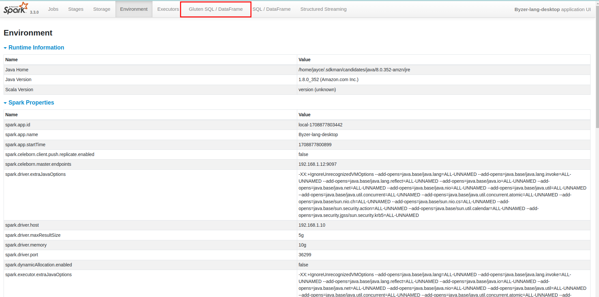

Gluten Config in Spark Configuration
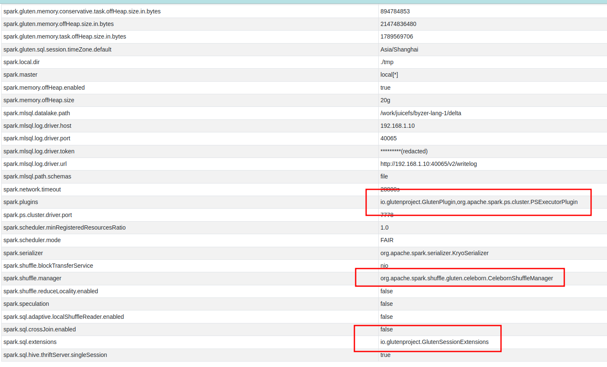

## Install [Byzer Notebook](https://docs.byzer.org/#/byzer-notebook/zh-cn/)


## Runing Test

### load ratings data from local
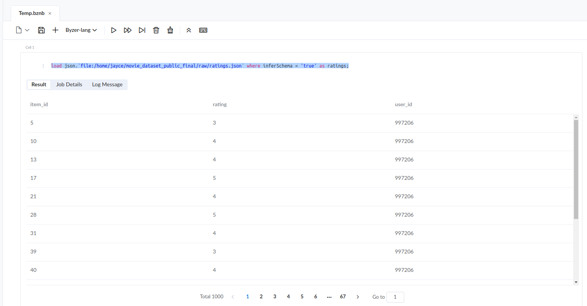

### load reviews data from local
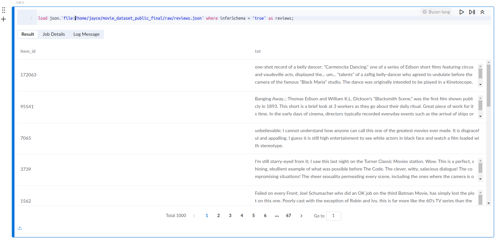

### run shuffle test
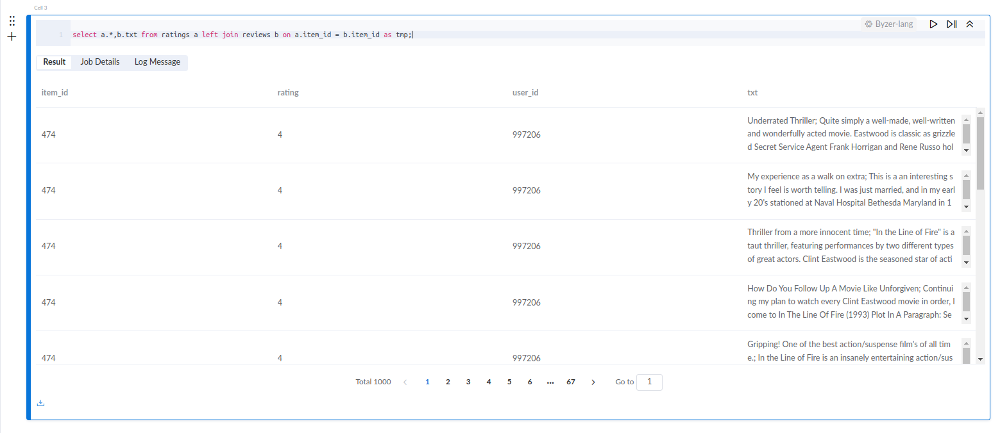

### watch velox from spark ui
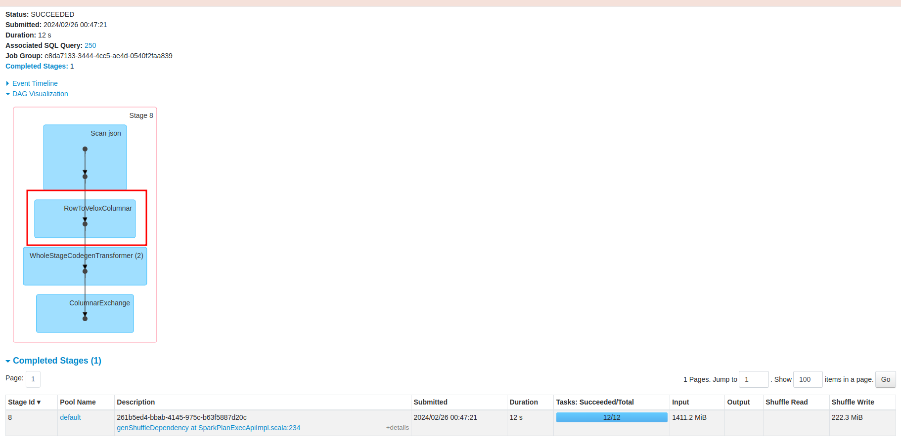

### watch shuffle from spark ui
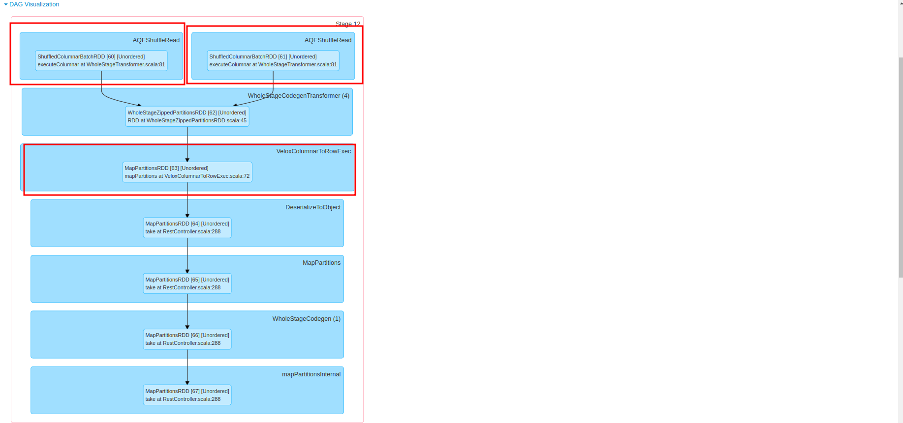

### watch celeborn logs
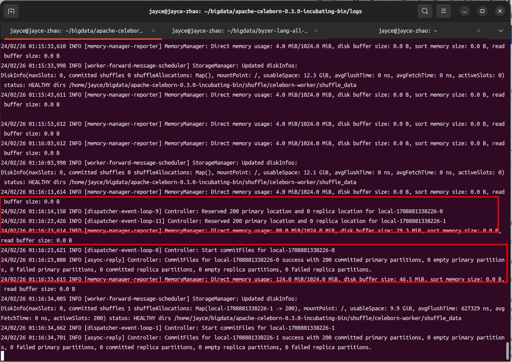

好了，到目前为之。我们已经完成了byzer接入RSS Celeborn服务和Gluten向量化引擎。

关于性能的Benchmark等后续有时间我们在测，谢谢浏览


