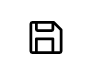
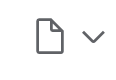

# 使用 Notebook

## 工具栏介绍

## 运行笔记本

## 切换脚本模式

的地方释放根深蒂固是非观是非观风格 这是一个图标   

的地方释放根深蒂固是非观是非观风格 这是一个图标

 的地方释放根深蒂固是非观是非观风格 这是一个图标

的地方释放根深蒂固是非观是非观风格 这是一个图标 

的地方释放根深蒂固是非观是非观风格 这是一个图标

的地方释放根深蒂固是非观是非观风格 这是一个图标

的地方释放根深蒂固是非观是非观风格 这是一个图标

的地方释放根深蒂固是非观是非观风格 这是一个图标

