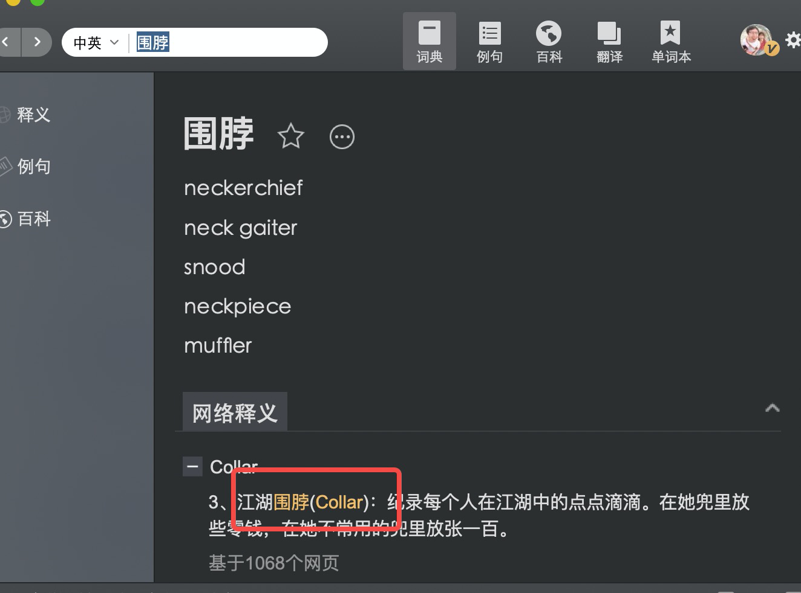

# Kolo 取名背后的故事

Kolo 创始人：[祝海林（William Zhu）](https://github.com/allwefantasy) 

在白泽社区建立的时候，我们说我们既然要搞一个编程语言，那就来取一个很酷的编程语言的名字吧。下面是 William 讲述的 Kolo-Lang 取名的故事

> Kolo 的前身是 MLSQL， MLSQL 的前身是 StreamingPro，名字自身体现了一种演化。

当时在取名的时候，我首先想到我们家的猫，但是很遗憾的是，我们家猫的名字本身就是一个现存的语言的名字： Python (如果以后我养第二只猫或者养一只狗的话，可能会给他取名叫 Kolo 了)。 既然在猫身上找不到主意了，我就有一点一筹莫展了。然后小伙伴们建议我说，要不让媛媛（我妻子）给你想想办法。 然后我就去找媛媛，问她有什么意义非凡的东西么，媛媛眨巴眨巴眼睛，然后和我说：

“如果非要说有什么对我意义非凡的 我觉得还是诗（备注：我年轻时给他写过很多诗歌），但其实我第一个想到的是围脖 我们第一次遇见的时候， 去 W 老家的大巴车上我睡觉手冷 你把围脖围在我手上给我暖手”。

然后我就去查围脖的英文单词，**Collar**，  不过这个单词有点复杂，我就将其简化了下，变成**Kolo**，发音是类似的。 后面我又去查了下字典，**Kolo** 竟然还有塞尔维亚舞蹈的含义，觉得非常不错。后面越看越喜欢，所以就定下了 Kolo 作为语言的名字。

**小故事背后的小故事（不是）**

后面才发现，这个 **Collar** 不是围脖，是衣领的意思。有道词典，你给我过来。。。。。