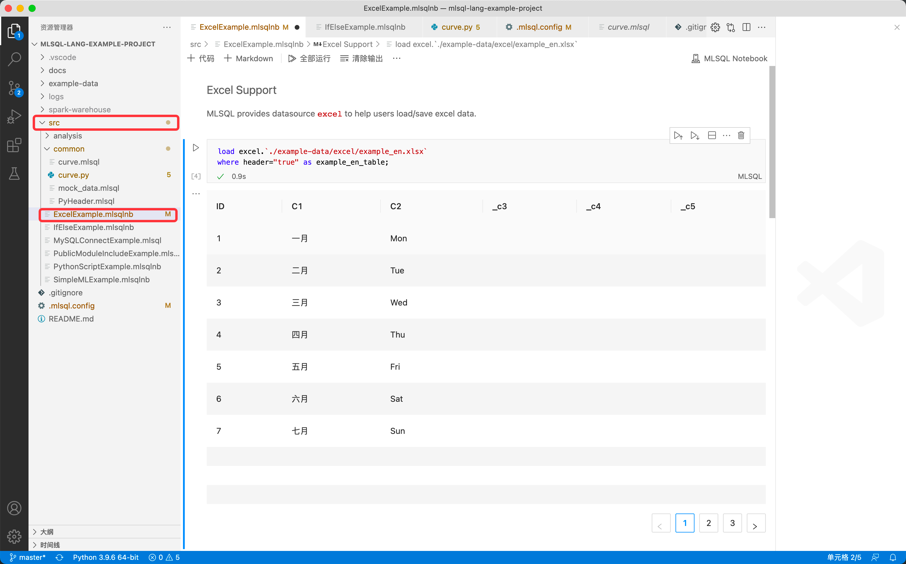
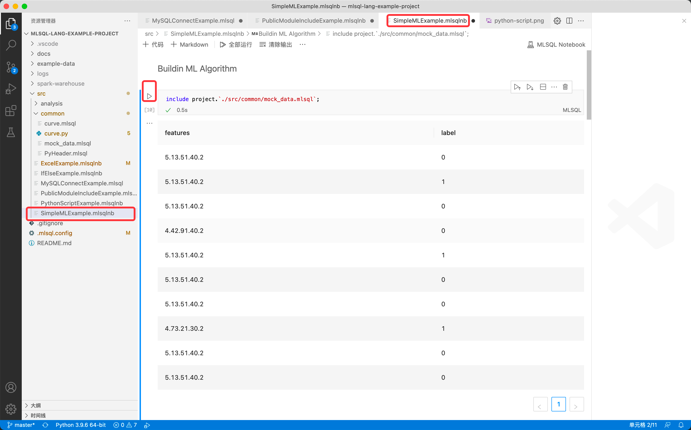

## Kolo-lang 桌面版使用 (Mac/Linux)

### 前置条件
1. 安装 [Visual Studio Code](https://code.visualstudio.com/)
2. 安装 [JDK8-Mac](https://www.openlogic.com/openjdk-downloads?field_java_parent_version_target_id=416&field_operating_system_target_id=431&field_architecture_target_id=391&field_java_package_target_id=396) 或者 [JDK8-Linux](https://www.openlogic.com/openjdk-downloads?field_java_parent_version_target_id=416&field_operating_system_target_id=426&field_architecture_target_id=391&field_java_package_target_id=396)

> 在Mac/Linux环境中验证测试过,但是在 Windows 环境尚未被验证过，因此建议您仅在 Linux 和 Mac 环境中使用.

安装Java的过程中，留意下安装目录：

比如在Mac下，对应的目录为：

/Library/Java/JavaVirtualMachines/openlogic-openjdk-8.jdk/Contents/Home

### 安装步骤

Kolo-lang VSCode 插件有两种安装方式，包含本地安装和从插件市场安装。具体步骤如下：

- 本地安装

    1. 从 [下载站点](http://mlsql-downloads.kyligence.io/2.1.0/) 下载 mlsql-<latest_version>.vsix 文件
  > latest_version 表示最新版本，例如0.0.5

    2. 打开 VSCode -> 左侧面板选择`拓展` -> 选择 `从 VSIX 安装` -> 选择刚下载的 mlsql-<latest_version>.vsix 目录进行安装

       

- 从 VSCode 插件 Market 安装

    1. 从 VSCode 的插件市场里搜索 `MLSQL` 并安装此插件 （友情提示，此处开VPN加持，Market响应速度会更快）注意，市场里的是不包含 kolo-lang的，所以需要后续两步。

       
    2. 从 [此处](https://mlsql-downloads.kyligence.io/2.1.0/) 下载 mlsql-app_2.4-2.1.0-darwin-amd64.tar.gz，并解压
    3. 在 .mlsql.config 文件配置 engine.home 指向 mlsql-app_2.4-2.1.0-darwin-amd64.tar.gz 的解压目录。

> 请注意:
> 1. 请使用 mslql-lang-vscode-plugin 0.0.4 及以上版本
> 2. Windows 环境版本还未被验证过，因此建议您在 Linux 和 Mac 的环境下使用
> 3. 插件源码参考 [mlsql-lang-vscode-plugin/github](https://github.com/allwefantasy/mlsql-lang-vscode-plugin)

### 特别注意

只有打开了`.mlsql`结尾的文件，插件才会被初始化。

### 配置 .mlsql.config文件 （可选）

请确保你本机已经安装了Java,如果系统无法自动识别，你可以通过添加 `.mlsql.config` 文件来手动配置`java.home`来告知系统。
`.mlsql.config` 位于你的 kolo-lang 项目根目录,每个项目都可以有不同的配置。

1. 根据下方图片，在.mlsql.config里配置两个变量，*java.home* 和 *engine.home*（engine.home仅需从市场安装的才需要）

   > java.home 为本机 java 的安装目录，engine.home 为步骤1 中下载文件的解压目录（P.S. bin目录无需配置在 engin.home 里，只需要配置 bin 所在的目录）

   

3. 如果你是第一次创建该文件，为了使配置生效，在 VSCode 里按住 `shift+command+p`，先选择【开发人员：重新加载窗口】确保 mlsql.config 文件生效，然后再选择 MLSQL RUN 即可编译和执行.mlsql文件

   

### 示例

您可以从 [此处](https://github.com/allwefantasy/mlsql-lang-example-project) 下载 Kolo-lang VSCode 插件的样例项目
在执行之前，可以先执行 `./src/common/PyHeader.mlsql` 文件进行 python env 的设置。
1. **ExcelExample**

   

2. **IfElseExample**

   

3. **SimpleMLExample**

   

4. **PythonScriptExample**

   

5. **PublicModuleIncludeExample**

   