# Byzer-python Tutorial

| **Version** | **Author** | **Date** | **Comment** |
| ------ | ------ | ------ |------ |
| V 1.0 | Andie Huang (ckeys1993@gmail.com) | 2022/01/11 | first version|


Byzer-lang 可以通过 Byzer-python 去拥抱Python生态。利用 Byzer-python, 用户不仅仅可以进行使用Python 进行 ETL 处理，比如可以将一个 Byzer 表转化成一个分布式 Pandas (base on Dask)来操作， 也可以使用 Byzer-python 高阶API 来完成数据处理。此外，用户还能实现对各种机器学习框架的支持 比如 Tensorflow, Sklearn, PyTorch。

Byzer-python 核心在于，实现了 Byzer 表在Python中的无缝衔接， 用户可以通过 Byzer-python API 获取表，处理完成后输出表， 表的形态甚至支持模型目录。

## 体验环境

用户有如下几种渠道快速体验：
1. 官网提供了在线Lab供用户学习使用Byzer-lang. 可访问网址：https://www.byzer.org
2. 使用docker进行快速体验，文档地址：https://docs.byzer.org/#/byzer-lang/zh-cn/introduction/get_started 。或按如下方式启动容器后，请访问http://127.0.0.1:9002 进入 Byzer Notebook。

```shell
export MYSQL_PASSWORD=${1:-root}
export SPARK_VERSION=${SPARK_VERSION:-3.1.1}

docker run -d \
-p 3306:3306 \
-p 9002:9002 \
-p 9003:9003 \
-e MYSQL_ROOT_HOST=% \
-e MYSQL_ROOT_PASSWORD="${MYSQL_PASSWORD}" \
--name byzer-sandbox-${SPARK_VERSION}-${MLSQL_VERSION} \
byzer/byzer-sandbox:${SPARK_VERSION}-lastest
```

3. 使用桌面版本。参考该链接： https://github.com/allwefantasy/mlsql-lang-example-project
4. 用户也可以自行在官网下载相关包，然后手动部署在 Yarn/K8s 等系统上。

其中3，4需要安装 Python 相关环境。可参考本周后续章节。

## Hello World

### 极简例子

```python
#%python
#%input=command
#%output=output
#%schema=st(field(hello,string))
#%runIn=driver
#%dataMode=model
#%cache=false
#%env=source /opt/miniconda3/bin/activate ray1.8.0

context.build_result([{"hello":"world"}])
```


将这段代码拷贝到 Byzer Notebook 执行就可以看到输出的结果。 
这段代码分成两部分：

1. #% 开始的语句为注解
2. 其他部分为 Byzer-python  代码

该脚本中注解的含义为：
1. Byzer-python 脚本运行在哪(runIn)
2. Byzer-python 的输入数据表是什么(input, 例子中command则表示一张空表)
3. Byzer-python 的输出表名叫什么(output)
4. 数据模式是什么（dataMode）
5. Byzer-python 输出格式是什么(schema)
6. Byzer-python 结果是不是要缓存（cache）
7. Byzer-python 的虚拟环境是什么(env)

通常一定需要设置的注解是：
1. env
2. input
3. output
4. schema
5. dataMode 应该都设置为 `model` 只有在特定 API情况下才设置为 `data` 


> 注解 的生命周期是 session, 也就是用户的整个生命周期。用户需要在每次使用 Byzer-python 时都要在Byzer Notebook cell 中声明覆盖。


上面的示例 Byzer-python 代码是通过注解来完成的。也可以通过原生的 Byzer 代码来书写：

```python
-- Python hello world

!python conf "schema=st(field(hello,string))";
!python conf "dataMode=model";
!python conf "runIn=driver";
!python conf "cache=false";
!python env "PYTHON_ENV=source /opt/miniconda3/bin/activate ray1.8.0";

run command as Ray.`` where 
inputTable="command"
and outputTable="output"
and code='''
context.build_result([{"hello":"world"}])
''';
```

可以看到，写原生的 Byzer 代码会显得比较麻烦。如果是在 Notebook 环境下（Web 或者 桌面），推荐第一种写法。后面的例子也都会以第一种写法为准。

### 加个输入吧

在上面的例子，没有输入（输入指定了一张空表 `command` ）。 这次尝试加点数据。

```sql
select 1 as a as mockTable;
```

然后给 a 字段加1：

```python
#%python
#%input=mockTable
#%output=mockTable2
#%schema=st(field(a,long))
#%runIn=driver
#%dataMode=model
#%cache=true
#%env=source /opt/miniconda3/bin/activate ray1.8.0

from pyjava.api.mlsql import PythonContext,RayContext

# type hint
context:PythonContext = context

ray_context = RayContext.connect(globals(),None)

def add_one():
    for item in ray_context.collect():
        item["a"] = item["a"] + 1
        yield item

context.build_result(add_one())
```

通过注解，指定了 `mockTable` 作为输入。同时输出为 `mockTable2`, 这意味着，可以后续在  Byzer 代码中使用  `mockTable2`:

```sql
select * from mockTable2 as output;
```

在书写 Byzer-python 代码时，默认会有个变量叫 `context` 无需声明即可使用。 `context` 用来构建输出。为了方便代码提示，用户通常需要加一句冗余代码：

```sql
context:PythonContext = context
```

Byzer-python 通过下面的代码来完成系统初始化

```sql
ray_context = RayContext.connect(globals(),None)
```

第二参数是 `None` ，表示 Byzer-python 会单机运行。 如果需要分布式运行，需要指定 Ray 集群地址。


初始化后，用户就可以通过  `ray_context` 来获取输入。获取的方式有很多，在上面的示例中，使用`ray_context.collect()` 方法来获取一个 `dict` 格式的 `generator` 。


> 注意，ray_context.collect() 得到的数据集只能迭代一次。


为了能够实现给 `a`  字段加 `1` 的操作，定义一个函数 `add_one` 来对数据进行更改，并且重新生成一个 `generator` 传递给 `context.build_result` 实现将 Byzer-python处理的结果集返回给 Byzer 引擎。 `build_result` 函数接受包含 `Dict`的 `generator` 和 `list`。

### 来个分布式的吧

上面的例子在初始化语句 `ray_context = RayContext.connect(globals(),None) ` 第二个参数都被设置为 `None` 了，所以是单机执行的。现在看看如何让 Byzer-python 分布式执行任务。


> 该例子需要有Ray集群。请参考本文Ray部分看如何启动。


第一步，制造一些数据：

```python
-- distribute python hello world

set jsonStr='''
{"Busn_A":114,"Busn_B":57},
{"Busn_A":55,"Busn_B":134},
{"Busn_A":27,"Busn_B":137},
{"Busn_A":101,"Busn_B":129},
{"Busn_A":125,"Busn_B":145},
{"Busn_A":27,"Busn_B":60},
{"Busn_A":105,"Busn_B":49}
''';

load jsonStr.`jsonStr` as data;
```

接着使用 Byzer-python 对 `data` 表进行处理：

```python
#%python
#%input=data
#%output=mockTable2
#%schema=st(field(ProductName,string),field(SubProduct,string))
#%runIn=driver
#%dataMode=data
#%cache=true
#%env=source /opt/miniconda3/bin/activate ray1.8.0

from pyjava.api.mlsql import PythonContext,RayContext

# type hint
context:PythonContext = context

ray_context = RayContext.connect(globals(),"127.0.0.1:10001")

def echo(row):
    row1 = {}
    row1["ProductName"]=str(row['Busn_A'])+'_jackm'
    row1["SubProduct"] = str(row['Busn_B'])+'_product'
    return row1

ray_context.foreach(echo)
```

这个例子稍微复杂点，和第一个例子的不同之处有两个。
第一个是 `dataMode` 改成了 `data` 。前面的例子都是 `model` .  


> 当前只有在使用了 ray_context.foreach 和  ray_context.map_iter API 时需要将dataMode 修改成 data.


第二个，在 下面的语句中：

```python
ray_context = RayContext.connect(globals(),None)
```

第二个参数 `None` 被修改成了 `Ray集群` 地址：

```python
ray_context = RayContext.connect(globals(),"127.0.0.1:10001")
```

通过 Byzer-python  的高阶API ， 用户通过设置一个按行处理的回调函数（示例为 `echo`），然后将函数传递给 `ray_context.foreach(echo)` 就可以了。

从上面的代码可以看到，用户可以随时使用一段  Byzer-python 代码处理表，然后输出成新表，衔接非常丝滑。

### 硬件感知能力

依然以上面的 `data` 数据集为例， 在这个例子里，我们使用 Byzer-python 做分布式 count。

具体代码如下：

```python
#%python
#%input=data
#%schema=st(field(count,long))
#%env=source /opt/miniconda3/bin/activate ray1.8.0

import ray
from pyjava.api.mlsql import PythonContext, RayContext
from pyjava import rayfix
from typing import List

context: PythonContext = context

ray_contex = RayContext.connect(globals(), "127.0.0.1:10001")

data_refs:List[str] = ray_contex.data_servers()

@ray.remote(num_cpus=8,num_gpus=1)
@rayfix.last
def count_worker(data_ref:str):
    data = RayContext.collect_from([data_ref])
    counter = 0
    for _ in data:
        counter += 1
    return counter    

job_refs = [count_worker.remote(data_ref) for data_ref in data_refs ]
sums = [ray.get(job_ref) for job_ref in job_refs]
final_count = sum(sums)
context.build_result([{"count":final_count}])
```

在这里例子, 定义了一个 `count_worker` 方法，在该方法里，通过注解 `@ray.remote(num_cpus=8,num_gpus=1)`  完成了两件事：
1. 这是一个远程方法
2. 调度器需要找一个满足 cpu 核心为8, GPU数为1的节点 运行这个远程方法。


> 为了避免找不到足够资源的node，我们可以在启动时设置好资源，例如：ray start --head --num-cpus=8 --num-gpus=1


data_refs 是一个数组,表示的是数据切片引用。假设数组长度是 4, 那么通过下面的语句：

```python
job_refs = [count_worker.remote(data_ref) for data_ref in data_refs ]
```

Byzer-python 会启动四个满足资源要求的 python进程运行 `count_worker` 方法，最后把结果进行 sum 返回。

## Byzer-python 带来了什么

在前面的示例，Byzer-python 提供了如下的能力：
1. 通过注解来完成环境设置
2. 获取 Byzer-lang 任意视图的数据引用，可以精确到数据分片。
3. 处理结果可以输出成一张表
4. 提供了高阶 API 做数据处理
5. 提供了分布式编程范式，只需要对 `函数` 或者 `类` 添加注解 `@ray.remote` 即可
6. 提供了硬件感知能力

## Byzer-python 原理

Byzer-lang  拥有 Hypebrid Runtime (`Spark + Ray`)  ，其中Ray 是可插拔的。具体语言架构图如下：  
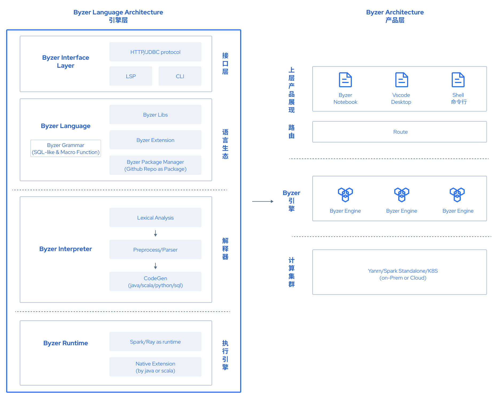
Byzer-python 主要依赖于Hypebrid Runtime  中的Ray部分。通过如下方式实现和 Ray的交互：
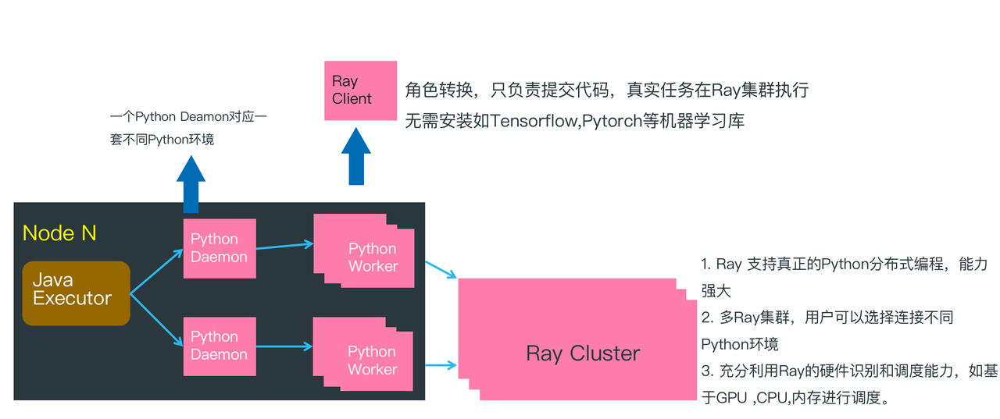


在第一个 Hello World 例子中，  其实是在Java Executor 节点执行的，然后会把 Byzer-python 代码传递给 Python Worker 执行。此时因为没有连接 Ray集群，所以逻辑处理工作是在 Python Worker 中完成的，并且是单机执行的。

在分布式的 Hello World 示例中， 通过连接 Ray Cluster, Python Worker 转化为 Ray Client,只负责把  Byzer-python 代码转化为任务提交个给 Ray Cluster, 所以Python Worker 很轻量，除了基本的 Ray，Pyjava 等库以外，不需要安装额外的一些 Python 依赖库。


> 在前面的示例中，当通过 #%env=source /opt/miniconda3/bin/activate ray1.8.0  设置环境时，本质上是设置 Python worker 的环境。


简单总结下：

1. 如果用户没有使用 Ray，那么需要在 Python worker (Byzer spark runtime的driver或者executor节点) 配置 Python 环境。注解 ` #%runIn `可以控制python worker 是运行在 `driver` 节点还是` executor`节点。 注解  `#%env` 可以控制使用节点上哪个虚拟环境。如果没有虚拟环境，配置为 `:` 即可。
2. 如果用户使用了 Ray，那么也需要配置Ray环境里的Python环境，并且需要和 Spark runtime 里的 Ray/Pyjava 保持版本一致。

考虑到 Java Executor 节点很多，不易于管理，所以我们也支持让 Driver 节点接受 Python 任务，从而简化 Spark 侧的环境配置。

## Byzer-python 环境配置

当探讨  Byzer-python 环境安装时，会指两个部分，
1. 第一个是 Byzer-lang Engine 的 Driver 节点 (Executor 很多，环境管理会复杂些，推荐 runIn 设置为 driver)
2. 第二个是 Ray 集群的 Python 依赖环境

在 Driver 侧，用户可以使用 Conda 来进行环境管理。

1. Conda 安装 python
    创建一个名字为 dev ，python 版本为3.6的一个python环境

    ```shell
    conda create -n dev python=3.6.13
    ```

    激活 dev 的 python 环境，并在 dev 环境下安装所需依赖包

    ```shell
    source actviate dev
    ```

    当然，activate如果没有软连接或者设置环境变量，会出现 `command not found: activate` 的错误。 这个需要指定 activate 的绝对路径就可以解决。比如，我的 activate 的绝对路径是 `/usr/local/Caskroom/miniconda/base/bin/activate`, 所以激活命令可以是

    ```shell
    source /usr/local/Caskroom/miniconda/base/bin/activate dev
    ```

2. Python 依赖包安装
    
   ```
   pyarrow==4.0.1
   ray[default]==1.8.0
   aiohttp==3.7.4
   pandas>=1.0.5; python_version < '3.7'
   pandas>=1.2.0; python_version >= '3.7'
   requests
   matplotlib~=3.3.4
   uuid~=1.30
   pyjava
   ```
   Ray 侧也需要有这些基础依赖。考虑到Ray是可插拔的，除了这些依赖，用户可以自主安装其他依赖，然后在实际书写 Byzer-lang 的时候通过集群地址连接到适合自己环境要求的Ray集群上。

## Byzer-python 注解

### 基本注解

```
1. #%python 表明这是一个描写 python script 的 cell. 
2. #%input=table1 表明了这段 python script 的数据输入是table1
3. #%output=b_output  表明这段 python script 的结果表表明是b_output，可以不指定，会随机产生一个结果表名.
4. #%schema=st(field(a,long)) python 是一个弱类型的语言，因此我们需要告知系统 python 的结果数据结构.
5. #%dataMode=model ，分别有 model|data 两种模式，如果你使用`ray_context.foreach`,`ray_context.map_iter` 那么需要设置dataMode为`data`，否则的话设置 dataMode 为`model`
6. #%env=source xxx/anaconda3/bin/activate ray1.8.0` 选择 python 的环境，ray1.8.0是conda的python环境的名字.
7. #%runIn=driver | executor 接着指定Python代码是在Driver还是在Executor端跑，推荐Driver跑.
8. #%cache=true  因为Python产生的表只能消费一次。为了方便后续可能多次消费，可以开启cache 为true，从而缓存该表。
```

注意：这些注解都是 session 级别有效。所以需要每次使用时指定。

### schema 定义

用户需要对 Byzer-python 的输出表进行 schema 定义。 这个应该是当前 Byzer-python 最繁琐的地方。 Schema 定义一共支持三种方式。

#### Simple Schema 格式

这是 Byzer-lang 为了简化 schema 书写而单独定义的一套 schema 语法。比如 `st(field(count,long))` 最外层一定是 `st()`  st 表示 struct type.  st 里面是 字段的罗列，在这个例子里，`field(count,long)` 表示有一个字段叫  `count` 类型是 long 类型。

支持的类型包括：

1. st
2. field
3. string
4. double
5. binary
6. date （该类型暂不可用）
7. map （该类型暂不可用）
8. array
9. long 
10. boolean
11. byte
12. decimal

定义示例：

```sql
st(field(column1,map(string,string)))
```

或者：

```sql
st(field(column1,map(string,array(st(field(columnx,string))))))
```


> 在 Byzer-lang 2.2.0 版本以及以前的版本， map 和 date 数据类型的支持还有些问题。浮点数统一使用 double 类型，整数统一使用 long 类型。


#### Json Schema 格式

使用 Json  定义 schema 功能最全，但是写起来复杂,示例如下：

```sql
#%schema={"type":"struct","fields":[{"name":"id","type":"integer","nullable":true,"metadata":{}},{"name":"diagnosis","type":"string","nullable":true,"metadata":{}},{"name":"radius_mean","type":"double","nullable":true,"metadata":{}}]}
```

上面定义了三个字段， id, diagnosis, radius_mean。 用户可以通过如下命令获取任何一张表的 json 格式 schema:

```
!desc newdata json;
```

#### DDL Schema 格式

用户也可以用标准的符合 MySQL 的 create 语句来定义 schema 格式。

```
#%schema=CREATE TABLE t1 (c1 INT,c2 INT) ENGINE NDB
```

## Byzer-python API 介绍

### 简介

前面的示例中，用户看到了类似 `RayContext`,`PythonContext` 等对象。这些对象帮助用户进行输入和输出的控制。用户书写  Byzer-python 代码基本是三步走：


1. 创建RayContext:

```sql
ray_context = RayContext.connect(globals(),None)
```

2. 获取数据（可选）

获取所有数据：

```sql
items = ray_context.collect()
```

通过分片来获取数据：

```sql
data_refs = ray_context.data_servers()
data = [RayContext.collect_from([data_ref]) for data_ref in data_refs]
```

注意，`data_refs` 是字符串数组，每个元素是一个 `ip:port` 的形态.  可以使用 `RayContext.collect_from` 单独获取每个数据分片。

如果数据规模不大，也可以直接获取pandas格式数据。

```sql
data = RayContext.to_pandas()
```

如果数据规模大，可以转化为 Dask 数据集来进行操作：

```sql
data = ray_context.to_dataset().to_dask()
```

3. 构建新的结果数据输出

```sql
context.build_result([])
```

现在专门介绍下两个 API 用来做数据分布式处理。

### ray_context.foreach

如果已经连接了Ray,那么可以直接使用高阶API `ray_context.foreach`

```sql
set jsonStr='''
{"Busn_A":114,"Busn_B":57},
{"Busn_A":55,"Busn_B":134},
{"Busn_A":27,"Busn_B":137},
{"Busn_A":101,"Busn_B":129},
{"Busn_A":125,"Busn_B":145},
{"Busn_A":27,"Busn_B":60},
{"Busn_A":105,"Busn_B":49}
''';
load jsonStr.`jsonStr` as data;
```

```python
#%env=source /usr/local/Caskroom/miniconda/base/bin/activate dev2
#%python
#%input=data
#%dataMode=data
#%schema=st(field(ProductName,string),field(SubProduct,string))
from pyjava.api.mlsql import RayContext,PythonContext

context:PythonContext = context
ray_context = RayContext.connect(globals(),"127.0.0.1:10001")
def echo(row):
    row1 = {}
    row1["ProductName"]=str(row['Busn_A'])+'_jackm'
    row1["SubProduct"] = str(row['Busn_B'])+'_product'
    return row1

buffer = ray_context.foreach(echo)
```
foreach接受一个回调函数，函数的入参是一条记录。用户无需显示的申明如何获取数据，只要实现回调函数即可。

### ray_context.map_iter

我们也可以获得一批数据，可以使用`ray_context.map_iter`。

系统会自动调度多个任务到Ray上并行运行。 map_iter会根据表的分片大小启动相应个数的task,如果你希望通过map_iter拿到所有的数据，而非部分数据，可以先对表做重新分区

```python
#%env=source /usr/local/Caskroom/miniconda/base/bin/activate dev2
#%python
#%input=data
#%dataMode=data
#%schema=st(field(ProductName,string),field(SubProduct,string))

import ray
from pyjava.api.mlsql import RayContext
import numpy as np;
import time
ray_context = RayContext.connect(globals(),"127.0.0.1:10001")
def echo(rows):
    count = 0
    for row in rows:
      row1 = {}
      row1["ProductName"]="jackm"
      row1["SubProduct"] = str(row["Busn_A"])+'_'+str(row["Busn_B"])
      count = count + 1
      if count%1000 == 0:
          print("=====> " + str(time.time()) + " ====>" + str(count))
      yield row1

ray_context.map_iter(echo)
```

### 将表转化为分布式 pandas

如果用户喜欢使用 Pandas API ,而数据集又特别大，也可以将数据转换为分布式 Pandas(on Dask) 来做进一步处理：

```python
#%python
#%input=mockData
#%schema=st(field(count,long))
#%runIn=driver
#%mode=model
#%env=source /opt/miniconda3/bin/activate ray1.8.0

from pyjava.api.mlsql import PythonContext,RayContext

# type hint
context:PythonContext = context

ray_context = RayContext.connect(globals(),"127.0.0.1:10001")
df = ray_context.to_dataset().to_dask()
c = df.shape[0].compute()

context.build_result([{"count":c}])
```

注意，该 API 需要使用功能 Ray。

### 将目录转化为表

这个功能在做算法训练的时候特别有用。比如模型训练完毕后，一般是保存在训练所在的节点上的。需要将其转化为表，然后保存到数据湖里去。具体技巧如下:

第一步，通过 Byzer-python 读取目录，转化为表：

```python
#%python
#%input=final_cifar10
#%output=cifar10_model
#%cache=true
#%schema=file
#%dataMode=model
#%env=source /opt/miniconda3/bin/activate ray1.8.0

from pyjava.storage import streaming_tar
.....
model_path = os.path.join("/","tmp","minist_model")
self.model.save(model_path)
model_binary = [item for item in streaming_tar.build_rows_from_file(model_path)]
ray_context.build_result(model_binary)
```


将 Byzer-python 产生的表保存到数据湖里去（delta）

```sql
save overwrite cifar10_model as delta.`ai_model.cifar_model`;
```

## Ray 的介绍

Ray 的详细框架介绍,  下面这张图展示了 Ray 的主要架构。GCS 作为集中的服务端，是 Worker 之间传递消息的纽带。每个 Server 都有一个共用的 Object Store，通过 Apache Arrow/Plasma 的方式存储数据及数据通信。 Local Scheduler 是 Node 内部的调度，同时通过 GCS 来和其他 Node 上的 Worker 通信。

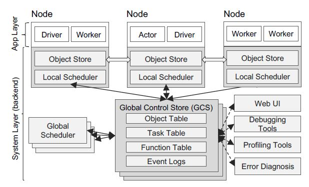

那么如何启动一个 ray 的 server 呢？首先要创建一个 python 环境 （具体看 Conda 安装 python 部分），然后在 python 环境中安装 ray （>=1.8.0）

### 单机安装

在本文 **环境** 部分我们已经安装好Ray了。

### 单机启动 

通过 Ray 命令在机器上启动 Ray：


> ray start --head # 该命令的意思是执行该命令的机器是 ray 集群的 head 节点（类似 driver/master 节点）


这样就可以在控制台上看到成功启动 ray 的结果

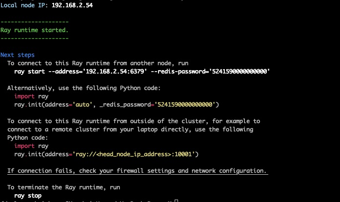

如果需要 dashboard 支持， 可以再加一个参数  `--include-dashboard true` 这样启动后就可以根据提示访问 Ray 的管理页面。默认地址：  `http://127.0.0.1:8265`

### 集群启动

Master 机器

```shell
ray start --head 
```

Worker 机器 (每一个 slave 的节点都需要执行这个命令)

```shell
ray start --address='<client ip address>:6379'
```

在 Byzer-python 中，只需要在初始化语句中的第二个参数中指定 head 节点的 ip 地址，head 节点收到任务后 ray 的管理器会将任务分发到 server 节点。示例如下：

```python
from pyjava.api.mlsql import RayContext,PythonContext
ray_context = RayContext.connect(globals(), '<head_node_ip_address>:10001')  
```

### Byzer notebook 的使用


> 注意事项1： Byzer Notebook 中，  通常一个 Byzer-python Cell 就是一个独立的小黑盒
，输入是表，产出也是表。不同的  Byzer-python Cell 之间的信息都是隔离的。如果希望两个
 Cell 的代码能实现交互，可以通过产出的表进行交互。这点和传统的 Python 类型的 Notebook
不同。

> 注意事项2： Byzer Notebook中， Byzer-python Cell 产出的表只能被消费使用一次。 如果
希望后续多次使用， 可以添加注解 %#cache=true  来进行缓存。 缓存会放在用户 主目录 中的
临时目录中。

首先，在 Byzer 或者 Byzer-lang 的桌面版里， Cell 需要指定命令激活 python 环境， Byzer-lang 是通过识别注释代码感知。 代码如下 

```shell
!python env "PYTHON_ENV= source activate dev"
```

```shell
source activate dev 
#可以换成绝对路径 source /usr/local/Caskroom/miniconda/base/bin/activate dev
```

OR

```python
#%env=source activate dev
#%python
```
由于在 Byzer-lang 里操作的都是二维宽表，而 python 代码的执行是基于跨进程通信的，进程之间也是通过宽表进行通信。因此，需要定义 python 进程返回结果的字段结构。

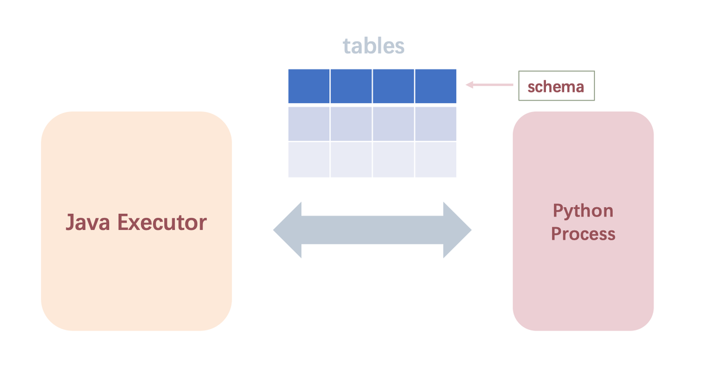

下面是指定由 JAVA 端到 python 端的输入数据的定义，以及 python 端数据输出到 JAVA 端的结构定义
下面代码 input 指定了输入数据表 data1 （P.S. 该输入数据必须是在 Byzer-lang 里执行产生过的）
Schema 指定了输出数据以宽表的形式返回到 JAVA 端，第一列是 content 字段，第二列是 mime 字段

```python
#%input=data1
#%schema=st(field(content,string),field(mime,string))
```
OR

```python
!python conf "schema=st(field(content,string),field(mime,string))";
```

### 案例展示
##### 如何使用 Byzer-python 获取数据

在下面的示例里，获取 python 库内置的 breast_cancer 数据集

```python
#%python
#%input=command
#%output=b_output
#%cache=true
#%schema=st(field(features,array(double)),field(label,long)))
#%dataMode=model
#%env=source /Users/allwefantasy/opt/anaconda3/bin/activate ray1.7.0

from sklearn.datasets import load_breast_cancer
from pyjava.api.mlsql import RayContext,PythonContext

context: PythonContext = context
ray_context = RayContext.connect(globals(), None)
train_x, train_y = load_breast_cancer(return_X_y=True)
rows = [{"features":row[0],"label":row[1]} for row in zip(train_x.tolist(),train_y.tolist())]
context.build_result(rows)
```
然后保存到数据湖里供下次使用。

```sql
save overwrite b_output as delta.`data.breast_cancer`;
```
在上面的示例，数据都是放到内存的，那么如何采用迭代器模式。详细的例子可以看用boto3 sdk 读取 Aws Athena 数据的例子（如何将Python代码包装成库）。

```python
#%python
#%input=command
#%output=b_output
#%cache=true
#%schema=st(field(features,array(double)),field(label,long)))
#%dataMode=model
#%env=source /Users/allwefantasy/opt/anaconda3/bin/activate ray1.7.0

from sklearn.datasets import load_breast_cancer
from pyjava.api.mlsql import RayContext,PythonContext

context: PythonContext = context
ray_context = RayContext.connect(globals(), None)
-- suppose the train_x/train_y is also batch by batch
train_x, train_y = load_breast_cancer(return_X_y=True)
def generate_rows():
    for row in zip(train_x,train_y):
        yield {"features":row[0],"label":row[1]}

context.build_result(generate_rows())
```
#### 数据处理
##### Step. 1  Byzer-lang 端构建数据表 data1

```sql
set jsonStr='''
{"features":[5.1,3.5,1.4,0.2],"label":0.0},
{"features":[5.1,3.5,1.4,0.2],"label":1.0}
{"features":[5.1,3.5,1.4,0.2],"label":0.0}
{"features":[4.4,2.9,1.4,0.2],"label":0.0}
{"features":[5.1,3.5,1.4,0.2],"label":1.0}
{"features":[5.1,3.5,1.4,0.2],"label":0.0}
{"features":[5.1,3.5,1.4,0.2],"label":0.0}
{"features":[4.7,3.2,1.3,0.2],"label":1.0}
{"features":[5.1,3.5,1.4,0.2],"label":0.0}
{"features":[5.1,3.5,1.4,0.2],"label":0.0}
''';
load jsonStr.`jsonStr` as data;
select features[0] as a ,features[1] as b from data
as data1;
```
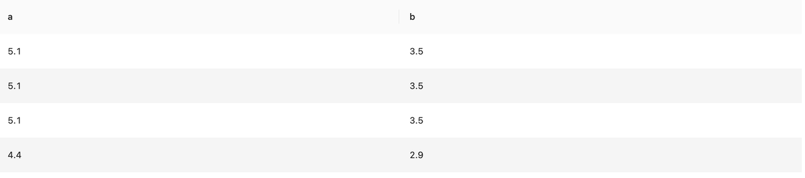

##### Step. 2 Byzer-python 做数据处理

> Note. 从 java 端接受的数据格式也是list(dict)，也就是说，每一行的数据都以字典的数据结构
存储。比如data1的数据，在 python 端拿到的结构就是[{'a':'5.1','b':'3.5'}, {'a':'5.1'
,'b':'3.5'}, {'a':'5.1','b':'3.5'} ...] 基于这个数据结构，我们可以在 python 端对输
入数据进行数据处理

```python
#%env=source /usr/local/Caskroom/miniconda/base/bin/activate dev
#%python
#%input=data1
#%schema=st(field(content,string),field(test,string))


import ray
from pyjava.api.mlsql import RayContext,PythonContext


context:PythonContext = context
## 获取ray_context,如果需要使用Ray，那么第二个参数填写Ray地址
## 否则设置为None就好。
ray_context = RayContext.connect(globals(),None)
# 从 java 端获取数据，数据格式是 list(dict())
datas = RayContext.collect_from(ray_context.data_servers())
res = []
## 对数据进行处理


# for row in datas:
#     new_row = {}
#     new_row['content'] = 'hello' + str(row['a']) # content 对应定义的 content 列
#     new_row['test'] = str(row['b']) # test 对应定义的 test 列
#     res.append(new_row)


# 也可以这么写
def foo(row):
    new_row = {}
    new_row['content'] = 'hello' + str(row['a']) # content 对应定义的 content 列
    new_row['test'] = str(row['b']) # test 对应定义的 test 列
    return new_row


res = [foo(row) for row in datas]


## 构造结果数据返回
context.build_result(res)
```
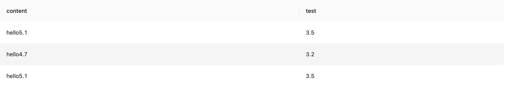

#### 使用 Byzer-python  做分布式处理 (需要用户启动 Ray)

```python
#%env=source /usr/local/Caskroom/miniconda/base/bin/activate dev
#%python
#%input=data1
#%schema=st(field(content,string),field(test,string))


import ray
from pyjava import rayfix
from pyjava.api.mlsql import RayContext,PythonContext


context:PythonContext = context
## 获取ray_context,如果需要使用Ray，那么第二个参数填写Ray地址
## 否则设置为None就好。
ray_context = RayContext.connect(globals(), url="127.0.0.1:10001")
# 从 java 端获取数据，数据格式是 list(dict())
res = []
## 对数据基于Ray进行分布式处理
@ray.remote
@rayfix.last
def foo(servers):
    datas = RayContext.collect_from(servers)
    res = []
    for row in datas:
        new_row = {}
        new_row['content'] = 'hello' + str(row['a']) # content 对应定义的 content 列
        new_row['test'] = str(row['b']) # test 对应定义的 test 列
        res.append(new_row)
    return res


data_servers = ray_context.data_servers()
res =  ray.get(foo.remote(data_servers))
## 构造结果数据返回
context.build_result(res)
```
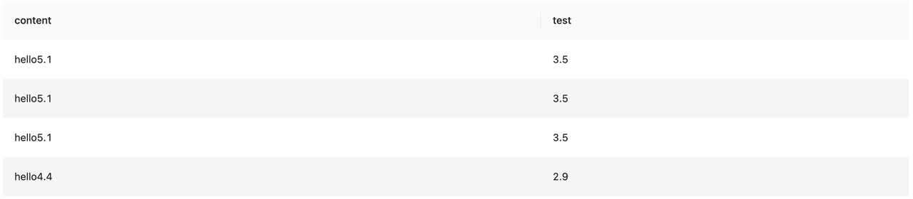

#### 模型训练（单机）


> 需要 Driver 侧安装  tensorflow

本例子对举了在 Byzer-lang 里利用 tensorflow 做最简单的线性回归的模型训练的例子，代码如下

```python
#%env=source /usr/local/Caskroom/miniconda/base/bin/activate dev
#%python
#%input=data1
#%schema=st(field(epoch,string),field(k,string), field(b,string))


import ray
from pyjava import rayfix
from pyjava.api.mlsql import RayContext,PythonContext
# import tensorflow as tf
ray_context = RayContext.connect(globals(), url="127.0.0.1:10001")

# 上面导包找不到placeholder模块时，换下面导入方式
import tensorflow.compat.v1 as tf
tf.disable_v2_behavior()

import numpy as np  # Python的一种开源的数值计算扩展
import matplotlib.pyplot as plt  # Python的一种绘图库

np.random.seed(5)  # 设置产生伪随机数的类型
sx = np.linspace(-1, 1, 100)  # 在-1到1之间产生100个等差数列作为图像的横坐标
# 根据y=2*x+1+噪声产生纵坐标
# randn(100)表示从100个样本的标准正态分布中返回一个样本值，0.4为数据抖动幅度
sy = 2 * sx + 1.0 + np.random.randn(100) * 0.4


def model(x, k, b):
    return tf.multiply(k, x) + b


def train():
    # 定义模型中的参数变量，并为其赋初值
    k = tf.Variable(1.0, dtype=tf.float32, name='k')
    b = tf.Variable(0, dtype=tf.float32, name='b')


    # 定义训练数据的占位符，x为特征值，y为标签
    x = tf.placeholder(dtype=tf.float32, name='x')
    y = tf.placeholder(dtype=tf.float32, name='y')
    # 通过模型得出特征值x对应的预测值yp
    yp = model(x, k, b)


    # 训练模型，设置训练参数(迭代次数、学习率)
    train_epoch = 10
    rate = 0.05


    # 定义均方差为损失函数
    loss = tf.reduce_mean(tf.square(y - yp))


    # 定义梯度下降优化器，并传入参数学习率和损失函数
    optimizer = tf.train.GradientDescentOptimizer(rate).minimize(loss)


    ss = tf.Session()
    init = tf.global_variables_initializer()
    ss.run(init)


    res = []
    # 进行多轮迭代训练，每轮将样本值逐个输入模型，进行梯度下降优化操作得出参数，绘制模型曲线
    for _ in range(train_epoch):
        for x1, y1 in zip(sx, sy):
            ss.run([optimizer, loss], feed_dict={x: x1, y: y1})
        tmp_k = k.eval(session=ss)
        tmp_b = b.eval(session=ss)
        res.append((str(_), str(tmp_k), str(tmp_b)))
    return res


res = train()
res = [{'epoch':item[0], 'k':item[1], 'b':item[2]} for item in res]
context.build_result(res)
```

结果展示了每一个 epoch 的斜率（k）和截距（b）的拟合数据
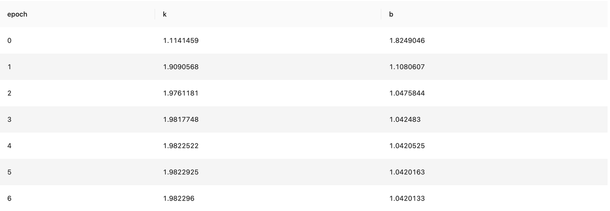

#### 模型训练 （分布式）


> 需要在  Ray 侧 安装 tensorflow

```python
#%env=source /usr/local/Caskroom/miniconda/base/bin/activate dev
#%python
#%input=data1
#%schema=st(field(epoch,string),field(k,string), field(b,string))


import ray
from pyjava import rayfix
from pyjava.api.mlsql import RayContext,PythonContext
# import tensorflow as tf
ray_context = RayContext.connect(globals(), url="127.0.0.1:10001")

@ray.remote
@rayfix.last
def train(servers):
    # 上面导包找不到placeholder模块时，换下面导入方式
    import numpy as np  # Python的一种开源的数值计算扩展
    import matplotlib.pyplot as plt  # Python的一种绘图库
    import tensorflow.compat.v1 as tf
    tf.disable_v2_behavior()
    np.random.seed(5)  # 设置产生伪随机数的类型
    sx = np.linspace(-1, 1, 100)  # 在-1到1之间产生100个等差数列作为图像的横坐标
    # 根据y=2*x+1+噪声产生纵坐标
    # randn(100)表示从100个样本的标准正态分布中返回一个样本值，0.4为数据抖动幅度
    sy = 2 * sx + 1.0 + np.random.randn(100) * 0.4
    # 定义模型中的参数变量，并为其赋初值
    k = tf.Variable(1.0, dtype=tf.float32, name='k')
    b = tf.Variable(0, dtype=tf.float32, name='b')
    # 定义训练数据的占位符，x为特征值，y为标签
    x = tf.placeholder(dtype=tf.float32, name='x')
    y = tf.placeholder(dtype=tf.float32, name='y')
    # 通过模型得出特征值x对应的预测值yp
    yp = tf.multiply(k, x) + b
    # 训练模型，设置训练参数(迭代次数、学习率)
    train_epoch = 10
    rate = 0.05
    # 定义均方差为损失函数
    loss = tf.reduce_mean(tf.square(y - yp))
    # 定义梯度下降优化器，并传入参数学习率和损失函数
    optimizer = tf.train.GradientDescentOptimizer(rate).minimize(loss)
    ss = tf.Session()
    init = tf.global_variables_initializer()
    ss.run(init)
    res = []
    # 进行多轮迭代训练，每轮将样本值逐个输入模型，进行梯度下降优化操作得出参数，绘制模型曲线
    for _ in range(train_epoch):
        for x1, y1 in zip(sx, sy):
            ss.run([optimizer, loss], feed_dict={x: x1, y: y1})
        tmp_k = k.eval(session=ss)
        tmp_b = b.eval(session=ss)
        res.append((str(_), str(tmp_k), str(tmp_b)))
    return res


data_servers = ray_context.data_servers()
res =  ray.get(train.remote(data_servers))
res = [{'epoch':item[0], 'k':item[1], 'b':item[2]} for item in res]
context.build_result(res)
```
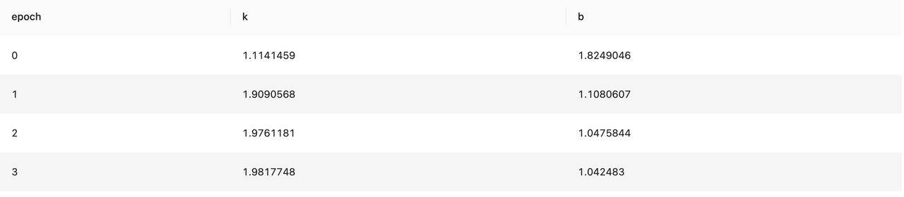

#### 利用 Byzer-python 进行报表绘制
```sql
set jsonStr='''
{"Busn_A":114,"Busn_B":57},
{"Busn_A":55,"Busn_B":134},
{"Busn_A":27,"Busn_B":137},
{"Busn_A":101,"Busn_B":129},
{"Busn_A":125,"Busn_B":145},
{"Busn_A":27,"Busn_B":60},
{"Busn_A":105,"Busn_B":49}
''';
load jsonStr.`jsonStr` as data;
```

```python
#%env=source /usr/local/Caskroom/miniconda/base/bin/activate dev2
#%python
#%input=data
#%schema=st(field(content,string),field(mime,string))
from pyjava.api.mlsql import RayContext,PythonContext
from pyecharts import options as opts
import os
from pyecharts.charts import Bar
# 这句是为了代码提示
context:PythonContext = context
ray_context = RayContext.connect(globals(),None)
data = ray_context.to_pandas()
data_a = data['Busn_A']
data_b = data['Busn_B']
# 基本柱状图
bar = Bar()
bar.add_xaxis(["衬衫", "毛衣", "领带", "裤子", "风衣", "高跟鞋", "袜子"])
# bar.add_yaxis("商家A", data_a)
# bar.add_yaxis("商家B", data_b)
bar.add_yaxis("商家A", list(data_a))
bar.add_yaxis("商家B", list(data_b))
bar.set_global_opts(title_opts=opts.TitleOpts(title="某商场销售情况"))
bar.render('bar_demo.html')  # 生成html文件
html = ""
with open("bar_demo.html") as file:
   html = "\n".join(file.readlines())
os.remove("bar_demo.html")
context.build_result([{"content":html,"mime":"html"}])
```
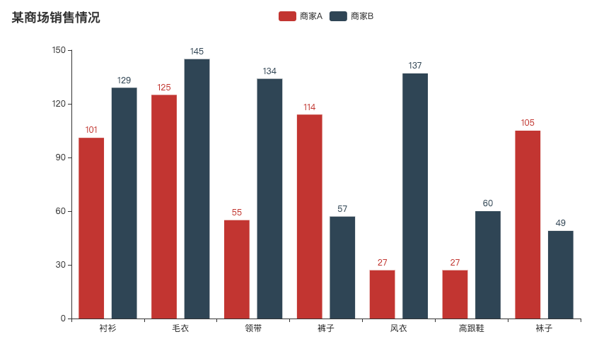
#### 如何将Python代码包装成库


下面以开发 Athena 数据读取插件开发作为例子，介绍如何基于 boto3 的 SDK，用 Byzer 脚本开发 ET。

首先，我们先展示最后的使用形式（如下）


> 其中set部分是lib-core里的save_data所需要的一些参数，schema是数据返回到 Byzer 端的schema设置。rayAddress，access_id，access_key，region，database，s3_bucket，s3_key，query分别是适用query_schema所必需的参数

```sql
set schema="st(field(schemadef,string))";
set rayAddress="127.0.0.1:10001"; -- The head node IP address in ray cluster
set access_id = ' *** ';
set access_key = '***';
set region = 'eu-west-1';
set database = 'andie_database';
set s3_bucket = 'andie-huang';
set s3_key='test';
set query = 'SELECT * FROM test_table2';

include lib.`gitee.com/andiehuang/lib-core` 
where force="true"
and alias="andielib";
include local.`andielib.datasource.athena.query_schema`;
```
从上面的 Byzer 脚本代码可以知道，我们把核心代码逻辑放在了 lib-core 这个库里，然后通过 Byzer 的 include 语法进行对 core-lib 的 datasource/athena 目录下 query_schema 的引用，下面我们详细介绍一下 query_schema 的开发。

我们通过 context.conf 去获取 Byzer Engine 下通过 set 语法设置的变量（包括 `rayAddress，access_id，access_key，region，database，s3_bucket，s3_key，query`）因此，在执行 query_schema 之前，这些参数是需要事先 set，执行的过程中才可能传到 context.conf 中

接下来我们通过 conf 获取对应的参数，利用 boto3 的sdk 根据 query 去检查任务的状态，如果成功，我们去获取 query 语句下返回的数据的schema， 构造 Byzer 端可识别的 schema 格式（例如 `st(field(** ,<type>),field(**,<type>))`）返回。 比如，我们在 query_schema 中，我们只定义了返回数据只有一列，这一列就是 schemadef， 类型是string，因为我们会把 Athena 查询返回的数据 Schema 构造成 Byzer 可识别的 schema 格式，以 string 的格式返回

```python
'''
@FileName       :query_schema.py
@Author         : andie.huang
@Date           :2021/11/23
'''

from pyjava.api.mlsql import RayContext, PythonContext
from pyjava.api import Utils
import os
import sys
import csv
import boto3
import botocore
import time
import pandas as pd
from retrying import retry
import configparser
import io

context:PythonContext = context
conf = context.conf
ray_context = RayContext.connect(globals(), conf["rayAddress"])

access_id = conf['access_id']
access_key = conf['access_key']
region = conf['region']

database = conf['database']
s3_bucket = conf['s3_bucket']
suffix = conf['s3_key']

query = conf['query']

athena = boto3.client('athena', aws_access_key_id=access_id, aws_secret_access_key=access_key, region_name=region)
s3 = boto3.client('s3', aws_access_key_id=access_id, aws_secret_access_key=access_key, region_name=region)

s3_output = 's3://' + s3_bucket + '/' + suffix


@retry(stop_max_attempt_number=10, wait_exponential_multiplier=300, wait_exponential_max=1 * 60 * 1000)
def poll_status(athena, _id):
    result = athena.get_query_execution(QueryExecutionId=_id)
    state = result['QueryExecution']['Status']['State']
    if state == 'SUCCEEDED':
        return result
    elif state == 'FAILED':
        return result
    else:
        raise Exception


def get_column_schema(result):
    type_map = {'boolean': 'boolean', 'tinyint': 'byte', 'smallint': 'short', 'integer': 'integer',
                'date': 'date', 'bigint': 'long', 'float': 'float', 'double': 'double', 'decimal': 'decimal',
                'binary': 'binary',
                'varchar': 'string', 'string': 'string'}
    column_info = result['ResultSet']['ResultSetMetadata']['ColumnInfo']
    schema = 'st({})'
    fileds = []
    for col in column_info:
        tmp = "field({},{})"
        col_name = col['Name']
        col_type = str(col['Type']).lower()
        spark_type = 'string'
        fileds.append(tmp.format(col_name, spark_type))
    return schema.format(','.join(fileds))


response = athena.start_query_execution(
    QueryString=query,
    QueryExecutionContext={
        'Database': database
    },
    ResultConfiguration={
        'OutputLocation': s3_output
    }
)
QueryExecutionId = response['QueryExecutionId']

result = poll_status(athena, QueryExecutionId)
ret1 = None
if result['QueryExecution']['Status']['State'] == 'SUCCEEDED':
    file_name = QueryExecutionId + '.csv'
    key = suffix + '/' + file_name
    obj = None
    try:
        result = athena.get_query_results(QueryExecutionId=QueryExecutionId)
        ret1 = get_column_schema(result)
        context.build_result([{'schemadef': ret1}])
    except Exception as e:
        print(e)
```
值得注意的是， 本例并未涉及到返回数据量比较大的情况。比如，从 Athena 返回 Query 查询的结果量太大，导致内存会爆。 因此，我们需要用 iterator 的方式让 context 去构造返回结果给 Byzer 端。 下面我们举一个🌰

下面这段代码，athena 是一个通过 boto3 的 client， _id 是 athena 执行的任务 id， 如果athena的返回结果带 next_token， 就会从标记位开始继续往下读(具体可以参考 boto3 SDK的详细介绍)。脚本会在 while true 的循环里不断读取 batch_size 大小的 Athena 的数据，然后返回用 yiled 返回迭代器，直到数据中止。

```python
def get_query_result(athena, _id, next_token=None, batch_size=512):
    final_data = None
    while True:
        if next_token is None:
            result = athena.get_query_results(QueryExecutionId=_id, MaxResults=batch_size)
        else:
            result = athena.get_query_results(QueryExecutionId=_id, MaxResults=batch_size, NextToken=next_token)
        next_token = result['NextToken'] if result is not None and 'NextToken' in result else None
        result_meta = result['ResultSet']['ResultSetMetadata']['ColumnInfo']
        raw_data = result['ResultSet']['Rows']
        final_data = process_athena_rows(raw_data, result_meta)
        for row in final_data:
            yield row
        if next_token is None:
            break
```
## FAQ

### Byzer Notebook 和 Jupyter Notebook 区别
Byzer Notebook 是 Byzer 团队完全自主开发的专为 Byzer-lang 设计的Notebook。 Jupyter Notebook 则适合跑 Python 等语言。当然，经过适配，Jupyter 也可以跑 Byzer 语言。

### Byzer 中的 Python 和 Jupyter 中的 Python 或者 PySpark 有啥区别么
在 Byzer 中，Python 只是一段脚本片段，他是运行在 Byzer runtime 沙盒里的，所以他可以很好的访问 Byzer 代码中的表，并且产生的结果可以进一步被 Byzer 中其他代码访问。而且如果使用了 Ray,他是分布式执行的。
