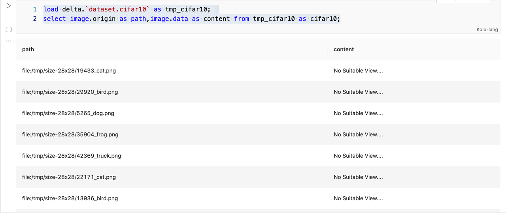
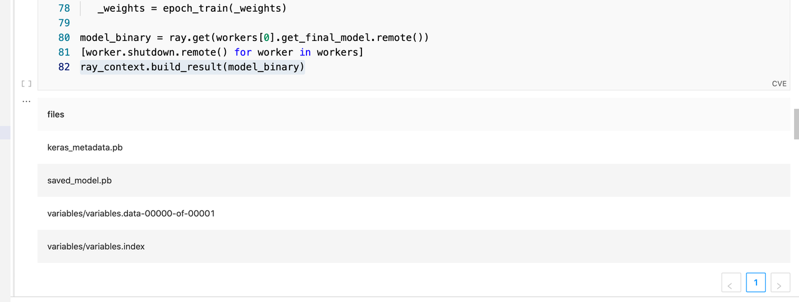
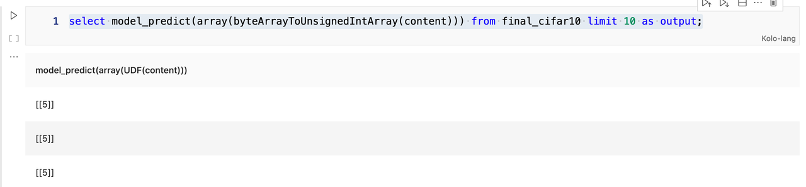

# Byzer-lang Cifar10 Deeplearning Demo

| **Version** | **Author** | **Date** | **Comment** |
| ------ | ------ | ------ |------ |
| V 1.0 | William Zhu (hailin.zhu@byzer.org) <br> Andie Huang (ckeys1993@gmail.com) |2022/01/20 | first version|


这篇文章分成五个部分:
1. 准备Cifar10图片数据集 
2. 分布式对图片预处理 
3. 使用Tenforflow进行分布式模型训练 
4. 将模型转化为UDF函数，从而能够应用在批，流，API等场景中

## 准备Cifar10 图片数据集

桌面版默认集成了mlsql-shell插件。如果你是自己部署的 Byzer Notebook 以及 Byzer-engine，那 么需要通过如下方式安装插件

```shell
 !plugin app remove "mlsql-shell-3.0"; 
 !plugin app add - "mlsql-shell-3.0";
```

在拥有了如上插件后，我们就是使用功能 `!sh` 执行shell命令了。

```shell
!sh wget "https://github.com/allwefantasy/spark-deep-learning-toy/releases/download/v0.01/cifar.tgz";
```

通过上面的指令下载好图片后，接着进行解压，然后拷贝到我们的引擎的存储上：

```shell
!sh mkdir -p /tmp/cifar10 /tmp/cifar10raw; 
!sh tar -xf "cifar.tgz" "-C" "/tmp/cifar10raw";
!copyFromLocal /tmp/cifar10raw /tmp/cifar10;
```

此时，如果你使用如下命令应该就可以查看到数据集：

```shell
 !hdfs -ls /tmp/;
```

## 分布式对图片预处理

该部分代码会使用Byzer-python。 如果是私有部署，请务必查看 Byzer-python 指南  来了解相关配置。

我们先来加载图片，加载方式比较简单，我们按二进制文件来进行加载（也可以按图片加载）

```sql
 load binaryFile.`/tmp/cifar10/cifar/train/*.png` as cifar10;
```

考虑到图片加载是一个比较费时的操作，同时我们要控制并行度，所以我们先重新设置下并行度，然后在保存到数据湖里：

```sql
 run cifar10 as TableRepartition.`` where partitionNum="4" as newCifar10;
 save overwrite newCifar10 as delta.`data.raw_cifar10` where mergeSchema="true";
```

现在可以看加载下数据湖里的数据，并且统计下图片数量：

```sql
load delta.`data.raw_cifar10` as raw_cifar10_table;
select count(*) from raw_cifar10_table  as output;
```

统计结果应该是五万条数据。

现在，我们希望把图片转化为28*28的大小，这个时候我们可以利用open-cv来完成：

```python
#%python
#%input=raw_cifar10_table
#%output=cifar10_resize
#%cache=true
#%schema=st(field(content,binary),field(path,string))
#%dataMode=data
#%env=source /opt/miniconda3/bin/activate ray1.8.0

from pyjava.api.mlsql import RayContext

ray_context = RayContext.connect(globals(),"127.0.0.1:10001")
def resize_image(row):
   import io,cv2,numpy as np
   new_row = {}
   image_bin = row["content"]
   oriimg = cv2.imdecode(np.frombuffer(io.BytesIO(image_bin).getbuffer(),np.uint8),1)
   newimage = cv2.resize(oriimg,(28,28))
   is_success, buffer = cv2.imencode(".png", newimage)
   io_buf = io.BytesIO(buffer)
   new_row["content"]=io_buf.getvalue()
   new_row["path"]= row["path"]
   return new_row

ray_context.foreach(resize_image)
```

上面的代码，我们连接一个本地Ray集群（127.0.0.1:10001）,并且确保Ray集群安装了`opencv-python`。接着，我们定义了一个resize_image方法，该方法会被每条记录回调，从而实现对图片的处理。 实际上，用户完全可以用Ray API自己完成这些工作，但是Byzer提供了良好的API方便大家做相关的处理。

现在，我们得到了一张表 cifar10_resize,现在开心的保存到数据湖里去：

```sql
save overwrite cifar10_resize as delta.`data.cifar10x28x28`;
```

为了方便获取数组最后一个元数，我们定义了新的UDF arrayLast函数：

```sql
register ScriptUDF.`` as arrayLast where
lang="scala"
and code='''def apply(a:Seq[String])={
        a.last
}'''
and udfType="udf";
```

我们对从路径抽取出文件名，最后，我们把二进制文件还原为图片文件保存到文件系统里去。

```sql
select arrayLast(split(path,"/")) as fileName,content
from cifar10_resize
as final_dataset;

save overwrite final_dataset as image.`/tmp/size-28x28`
where imageColumn="content"
and fileName="fileName";
```

## 使用 Tensorlfow 进行分布式训练

上面，我们把五万张图片缩放为 28*28的规格。现在，我们要加载这些图片，因为要反复调试，所以我们把加载后的结果保存到数据湖里，方便后续反复使用。

```
-- 加载 ResizeImage.mlsqlnb已经预处理好的图片数据

-- 因为涉及到list 目录，所以比较慢，我们可以把加载的结果保存下

load image.`/tmp/size-28x28/*.png` where implClass="image" as cifar10; 

save overwrite cifar10 as delta.`dataset.cifar10` where fileNum="4" 
and overwriteSchema="true";
```

加载图片看下结果：

```
load delta.`dataset.cifar10` as tmp_cifar10;
select image.origin as path,image.data as content from tmp_cifar10 as cifar10;
```



接下来，我们要从路径中抽取分类，并且把分类转化为数字：
```sql
-- extract catagory from path
select split(arrayLast(split(path,"/")),"_")[1] as labelName,content
from cifar10
as tmp_cifar10;

-- mapping catagory to index (0-9)
train tmp_cifar10 as StringIndex.`/tmp/labelToIndex` where inputCol="labelName"
and outputCol="label"
as final_cifar10;
```

现在，可以利用Tensorflow库进行分布式训练了：

```python
#%python
#%input=final_cifar10
#%output=cifar10_model
#%cache=true
#%schema=file
#%dataMode=model
#%env=source /opt/miniconda3/bin/activate ray1.8.0

from functools import reduce
import os
import ray
import numpy as np
from tensorflow.keras import models,layers
from tensorflow.keras import utils as np_utils
from pyjava.api.mlsql import RayContext
from pyjava.storage import streaming_tar


ray_context = RayContext.connect(globals(),"127.0.0.1:10001")
data_servers = ray_context.data_servers()
replica_num = len(data_servers)
print(f"total workers {replica_num}")
def data_partition_creater(data_server):
    temp_data = [item for item in RayContext.collect_from([data_server])]
    
    train_images = np.array([np.array(list(item["content"])) for item in temp_data])    
    train_labels = np_utils.to_categorical(np.array([item["label"] for item in temp_data]))
    train_images = train_images.reshape((len(temp_data),28*28*3))
    return train_images,train_labels    

def create_tf_model():    
    network = models.Sequential()
    network.add(layers.Dense(512,activation="relu",input_shape=(28*28*3,)))
    network.add(layers.Dense(10,activation="softmax"))
    network.compile(optimizer="sgd",loss="categorical_crossentropy",metrics=["accuracy"])
    return network

@ray.remote
class Network(object):
    def __init__(self,data_server):
        self.model = create_tf_model()
        # you can also save the data to local disk if the data is 
        # not fit in memory        
        self.train_images,self.train_labels = data_partition_creater(data_server)


    def train(self):
        history = self.model.fit(self.train_images,self.train_labels,batch_size=128)
        return history.history

    def get_weights(self):
        return self.model.get_weights()

    def set_weights(self, weights):
        # Note that for simplicity this does not handle the optimizer state.
        self.model.set_weights(weights)

    def get_final_model(self):
        model_path = os.path.join("/","tmp","minist_model")
        self.model.save(model_path)
        model_binary = [item for item in streaming_tar.build_rows_from_file(model_path)]
        return model_binary
    def shutdown(self):
        ray.actor.exit_actor()

workers = [Network.remote(data_server) for data_server in data_servers]
ray.get([worker.train.remote() for worker in workers])
_weights = ray.get([worker.get_weights.remote() for worker in workers])

def epoch_train(weights):  
    sum_weights = reduce(lambda a,b: [(a1 + b1) for a1,b1 in zip(a,b)],weights)
    averaged_weights = [layer/replica_num for layer in sum_weights]
    ray.get([worker.set_weights.remote(averaged_weights) for worker in workers])
    ray.get([worker.train.remote() for worker in workers])
    return ray.get([worker.get_weights.remote() for worker in workers])

for epoch in range(6):
   _weights = epoch_train(_weights)

model_binary = ray.get(workers[0].get_final_model.remote())
[worker.shutdown.remote() for worker in workers]
ray_context.build_result(model_binary)
```

请确保你在Ray集群里安装了 tensorflow 。

我们仔细讲解下上面的Python代码。首先，

```python
data_servers = ray_context.data_servers()
```

通过上面这段代码，我们可以拿到一个数据集的切片引用。比如在我们当前的例子里，有四个切片，也就是一个数据集被分成了四份，每一份都可以通过下面的代码来获取：

```python
RayContext.collect_from([data_server])
```

我们定义了data_partition_creater函数，该函数用来获取数据切片的数据以及转化为tensorflow能认的格式。create_tf_model 函数则是创建一个神经网络。他们都会在 class Network中被使用，而Network是remote类，这意味着他们会在不同的进程中被初始化。

```python
workers = [Network.remote(data_server) for data_server in data_servers]
ray.get([worker.train.remote() for worker in workers])
```

上面两行代码中的第一行，我们新建了四个Network实例，这四个network实例会处于Ray集群的不同Python进程中。创建完实例后，我们调用实例的train方法进行训练。通过ray.get 来进行等待。这样我们就得到了第一轮参数：

```python
_weights = ray.get([worker.get_weights.remote() for worker in workers])
```

我们将这四组参数加权平均，作为下一轮的基准参数。这本质上相当于自己用Ray实现了一个Parameter Server。 对应的代码在 epoch_train 函数里。 最后，我们将模型以二进制流返回给引擎。

Python代码执行完成后，我们会把二进制流以目录结构的方式展示给用户：



现在，我们把模型保存到数据湖里去：

```python
save overwrite cifar10_model as delta.`ai_model.cifar_model`;
```

至此，我们以Parameter Server的模式完成了模型的分布式训练。

## 模型部署
一般模型都要部署到三个场景中：

1. 批

2. 流

3. API


我们通过将模型转化为UDF来完成模型的全景部署。

首先，加载模型：

```
load delta.`ai_model.cifar_model` as cifar_model;
```

接着，我们将模型注册成UDF函数：

```python
!python conf "rayAddress=127.0.0.1:10001";
!python conf "schema=file";
!python env "PYTHON_ENV=source /opt/miniconda3/bin/activate ray1.8.0";
!python conf "dataMode=model";
!python conf "runIn=driver";

register Ray.`cifar_model` as model_predict where 
maxConcurrency="2"
and debugMode="true"
and registerCode='''

import ray
import numpy as np
from pyjava.api.mlsql import RayContext
from pyjava.udf import UDFMaster,UDFWorker,UDFBuilder,UDFBuildInFunc

ray_context = RayContext.connect(globals(), context.conf["rayAddress"])

def predict_func(model,v):
    train_images = np.array([v])
    train_images = train_images.reshape((1,28*28*3))
    predictions = model.predict(train_images)
    return {"value":[[float(np.argmax(item)) for item in predictions]]}

UDFBuilder.build(ray_context,UDFBuildInFunc.init_tf,predict_func)

''' and 
predictCode='''

import ray
from pyjava.api.mlsql import RayContext
from pyjava.udf import UDFMaster,UDFWorker,UDFBuilder,UDFBuildInFunc

ray_context = RayContext.connect(globals(), context.conf["rayAddress"])
UDFBuilder.apply(ray_context)

'''
;
```

registerCode 部分，本质上我们只要提供一个预测函数即可，该函数系统会传递两个参数进来，一个是模型，一个是数据。用户要完成如何将两者结合的的逻辑。 第二段代码predictCode则完全是模板代码，复制黏贴就可以。

其中值得注意的是，

>maxConcurrency="2"

该参数配置了请求并发度。这无论在批还是流，或者API服务里都很重要。如果要满足不通场景，用户可以注册多次从而分别给不同场景提供合理的并发能力。

现在我们得到了一个函数叫`model_predict `,他可以对图片进行分类预测了。

不过考虑到我们需要把binary转化为无符号数字数组，所以我们需要有一个函数完成这个事情，所以我们可以创建一个叫byteArrayToUnsignedIntArray 函数。

```sql
register ScriptUDF.`` as byteArrayToUnsignedIntArray 
where lang="scala"
and code='''def apply(a:Array[Byte])={
      a.map(_ & 0xFF).map(_.toDouble).toArray
}'''
and udfType="udf";
```

现在，可以做预测了：

```sql
select model_predict(array(byteArrayToUnsignedIntArray(content))) from final_cifar10 limit 10 as output;
```

输出结果如下：



## 总结

通过上面这个案例，通过使用Byzer-lang,我们仅仅需要少量的python代码，就可以完成较为复杂的数据加载，汇总，预处理，分布式训练，模型部署等整个AI的pipeline。 SQL和Python之间无缝衔接，并且无论SQL还是Python都实现了分布式，这个能力是非常强大的。

## 附录1 环境安装

请严格安照如下版本安装依赖库（重点关注aiohttp的版本为3.7.4），同时需要在 Byzer Driver 侧和 Ray 侧安装 

```shell
pyarrow==4.0.1
ray[default]==1.8.0
aiohttp==3.7.4
pandas>=1.0.5; python_version < '3.7'
pandas>=1.2.0; python_version >= '3.7'
requests
matplotlib~=3.3.4
uuid~=1.30
pyjava
opencv-python
```

可使用如下命令安装：

```shell
# 创建独立的ray环境
conda create --name ray1.8.0 python=3.7.10
# 使用环境ray1.8.0
conda activate ray1.8.0
# 安装依赖
pip install pyarrow==4.0.1 "ray[default]==1.9.0" aiohttp==3.7.4 "pandas>=1.0.5" requests "matplotlib~=3.3.4" "uuid~=1.30" pyjava opencv-python
```

## 附录2 常见错误

如果执行过程中出现如下异常，详情如下：

```
Packet for query is too large (22712770 > 4194304). 
You can change this value on the server by 
setting the max_allowed_packet' variable.

```

请添加如下 MySQL 参数(也可以在 MySQL 命令行中动态配置)

```
[mysqld]
max_allowed_packet=200M
```