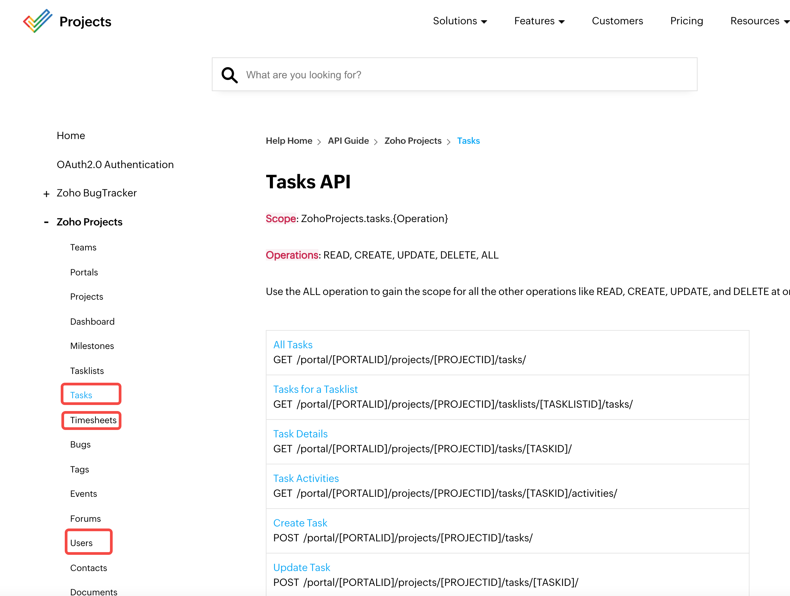

# 教你通过 Byzer 处理 Zoho Projects 数据
| **Version** | **Author** | **Date** | **Comment** |
| ------ | ------ | ------ |------ |
| V 1.0 | Cheng Wang (cheng.wang@byzer.org) | 2022/01/20 |  |

​        一直都在关注 Byzer Notebook 的功能，还没有仔细的看过 Byzer-lang 的语法，大致上的印象就是感觉很像 sql，然后看产品介绍时候的 Demo，竟然还能做 AI，这个是我从来没有接触过的并且一直认为十分之高大上的东西哈哈哈。正好前段时间有这样一个机会可以自己从零开始上手，对自己来说是一个难得的机会。

### 1、工程调研

​        每个项目组对工时和进度的记录方式都各不相同，这些数据散落在各个不同的地方，难以处理并且不利于统筹全局。

​        为了解决这个问题，现在我们统一使用 zoho 记录工时、进度以及人员信息。

​        zoho 是一款高效的项目管理软件，可以通过里程碑、任务列表等方式，帮助我们将各个庞大的任务群进行细分，使得管理时的条理更加清晰，可以说是最大程度的满足了我们管理项目工时从而统计项目成本的需求。

​        根据 zoho 官方提供的 [API](https://www.zoho.com/projects/help/rest-api/zohoprojectsapi.html)，我们可以非常轻松的找到我们最终需要的任务、工时以及人员信息的数据分别在 Tasks、Timesheets、Users 条目中。

​        但是根据其 API，我们还需要两个参数，就是 PORTAILID 和 PROJECTID，这两个参数从哪里来呢？再找找，发现在 Portals 和 Projects 条目中我们可以获取。



​        除此以外，我们还可以注意到，在每个条目中，官方还提供了 Scope 这个参数，这个参数的作用又是什么呢？我们接着看。

​        API 中提空的并不是完整的 URL，BASE URL 是缺失的，看看 Home 中有没有什么提示。第一段就有，针对使用不同模块的 API，对应了不同的 BASE URL。我们这里需要使用的是 https://projectsapi.zoho.com/restapi。


​        但是到目前为止，我们仅仅是找到了我们的目标 API，还没有对应的鉴权方式，官网中有一个很清晰的标题给到了相关的信息并提供的认证的详细方式，如下图：


​        OAuth 2.0 是一个基于令牌的授权框架，支持对第三方应用程序的有限访问，作为代表用户的中介，提供受控访问，即只访问由用户认证的资源，而阻塞其他资源，这加强了安全性，同时也将用户数据的危害降到最低。这是当下非常流行的一种鉴权方式。

​        有了 zoho 这个工具，再加上 Byzer 这个利器去做一个 ETL（当然同时还有其他模块），整合后上传到 Azure 对象存储中，最后再添加进调度系统，这样就极大程度的简化了分析数据前的操作流程，并且做到了自动化，降低了维护的成本。

​        至此为止，整个工程的大致流程也变得十分清晰。整体流程如下：


​        

​        简单的说，就是去 zoho 获取一堆数据(extract)，然后把这些数据处理成我们需要的格式(transform)，最后把结果交出来(load)的过程。

### 2、OAuth2

​       (想要抽取数据，首先就得解决认证的问题，目前大多都是使用的 oauth2 认证，不同的产品可能存在一些细节或者流程有些许的差异，这里就以 zoho 为例了。)

​       OAuth 2.0 是一个基于令牌的授权框架，允许对第三方应用程序进行有限访问。 OAuth 代表用户充当中介并提供受控访问，即仅访问由用户验证的资源并阻止其余资源。 这增强了安全性，并且用户数据的妥协最小化。——这是官网的一段描述，具体的实现分为以下几步。

1. 在 [zoho](https://accounts.zoho.com/developerconsole) 添加一个用户，并且填上两个 url，这个 redirect(callback) url 是后面用来获取返回给我们的一个 code 字段的。


2. 在 zoho 的 [api](https://www.zoho.com/projects/help/rest-api/zohoprojectsapi.html) 中找到自己需要用到的 scope (可多选) 以及使用的增删改查权限(5 选 1)


3. 然后就到请求用户的权限这一步了，请求地址为 https://accounts.zoho.com/oauth/v2/auth


有几点需要注意一下：

​      <1> access_type 可设置为 **online** 和 **offline**，如果为 online 模式的话，只会返回 access_token，使用期限为 1 小时，如果为 offline 模式，将会同时返回 access_token 和 refresh_token，refresh_token 如果不主动注销，将永久有效，在 access_token 失效后可以用 refresh_token 刷新 access_token

​      <2> 如果希望多个 refresh_token 能同时使用，需要设置 prompt 为 consent

​      <3> 最重要的一点，并不要在 postman 中请求这个 api，因为我们需要的参数在 redirect(callback) url 中，把这个请求写在 postman 中的理由就是方便我修改参数。我们要做的是在浏览器的地址栏输入整个 url，点击接受之后会重定向到 redirect(callback) url，此时地址栏中有一个 code 就是用来生成 refresh_token 的参数


4. Post 请求 api 获取 refresh_token，然后就可以通过 refresh_token 刷新 access_token 了


### 3、获取数据（extract）

​        获取到了我们需要的 access_token 就可以试试调用 API 了。我们首先在 Postman 中进行尝试，参数如下：


​       成功获取到了返回，我们需要的 PORTAILID 也在其中。


​        在 Byzer 中也试试，请求成功了，但是获取到的返回却是一个 BASE64 编码后的字符串，再对这个字符串使用 Spark sql 的 string 函数进行解码，获取结果。


​        根据这个方法调用其他 API，就可以获取到我们所有需要的数据了。

### 4、请求方式

​      抽取数据大部分都是在请求 api，Byzer-lang 提供了很好的支持。源于 Everything is a table 的理念，Byzer-lang 创造性地支持将 rest api 作为数据源，并将返回值注册为一张表

​      <1> 第一种方式是 Byzer-lang 自带的方式：[RestAPI](https://docs.byzer.org/#/byzer-lang/zh-cn/datasource/restapi?id=rest-api)

```sql
-- 刷新ZOHO token
SET ZOHO_URL="https://accounts.zoho.com/oauth/v2/token";
SET REFRESH_TOKEN="***************";
SET CLIENT_ID="***************";
SET CLIENT_SECRET="***************";

LOAD Rest.`$ZOHO_URL?refresh_token=$REFRESH_TOKEN&client_id=$CLIENT_ID&client_secret=$CLIENT_SECRET&grant_type=refresh_token`
WHERE `config.connect-timeout`="10s"
AND `config.method`="POST"
AND `config.retry`="3"
AND `header.content-type`="application/json"
AS zoho_token;
```

​      <2> 系统[内置 UDF](https://docs.byzer.org/#/byzer-lang/zh-cn/udf/built_in_udf/http)

​      <3> 如果以上两种都不能满足我们的需求，还可以使用[自定义 UDF](https://docs.byzer.org/#/byzer-lang/zh-cn/udf/extend_udf/README) 的方式，如下是 [Scala](https://docs.byzer.org/#/byzer-lang/zh-cn/udf/extend_udf/scala_udf) 代码的例子，此外还支持 [Python](https://docs.byzer.org/#/byzer-lang/zh-cn/udf/extend_udf/python_udf) 和 [Java](https://docs.byzer.org/#/byzer-lang/zh-cn/udf/extend_udf/java_udf) 代码

```scala
-- http请求工具
register ScriptUDF.`` as http_client where  
lang="scala"
and udfType="udf"
and code='''


def apply(url:String, httpMethod:String, params:Map[String, String], headers:Map[String,String]) : Array[Byte]= {

import org.apache.http.client.fluent.Request
import org.apache.http.entity.StringEntity
import org.apache.http.util.EntityUtils
import org.apache.spark.sql.mlsql.session.MLSQLException

import java.net.URLEncoder
import scala.collection.mutable.ArrayBuffer
      val request = httpMethod match {
        case "get" =>
          val paramsBuf = ArrayBuffer[(String, String)]()
          params.foreach { case (k, v) =>
            paramsBuf.append((k, URLEncoder.encode(v, "utf-8")))
          }

          val finalUrl = if (paramsBuf.length > 0) {
            val urlParam = paramsBuf.map { case (k, v) => s"${k}=${v}" }.mkString("&")
            if (url.contains("?")) {
              url + urlParam
            } else {
              url + "?" + urlParam
            }
          } else url
          Request.Get(finalUrl)
        case v => throw new MLSQLException(s"HTTP method ${v} is not support yet")
      }

      headers.foreach { case (k, v) =>
        request.addHeader(k, v)
      }

      val response = (httpMethod, headers.getOrElse("Content-Type", "application/x-www-form-urlencoded")) match {
        case ("get", _) =>
          Thread.sleep(1500)
          request.execute()
        case (_, v) =>
          throw new MLSQLException(s"content-type ${v}  is not support yet")
      }

      val httpResponse = response.returnResponse()
      val status = httpResponse.getStatusLine.getStatusCode.toString
      val content = EntityUtils.toByteArray(
        if(httpResponse.getEntity==null) new StringEntity("") else httpResponse.getEntity
      )
      content
    }
''';
```

### 5、处理数据（transform）

​      <1> [SparkSQL](https://spark.apache.org/docs/latest/api/sql/)

​            SparkSQL 的函数在 Byzer-lang 中可以正常使用，以 explode 和 transform 为例


```sql
-- 将内容转为多行
SELECT
    explode(transform(content_1.tasks, (item, i) -> item)) AS task,
    PROJECT_ID,
    PROJECT_NAME,
    CRM_Project_ID,
    Area,
    Health,
    Layout
FROM all_task_2 AS all_task_3;
```

​      <2> 自定义 UDF —— 同 “请求方式” 中的 <2> 和 <3>

​      <3> [Python 脚本](https://docs.byzer.org/#/byzer-lang/zh-cn/python/etl?id=byzer-python-代码说明)

```python
#%python
#%input=projects_list_fields
#%output=projects_list_fields_python
#%schema=st(field(PROJECT_ID,string),field(PROJECT_NAME,string),field(CUSTOM_FIELDS,string),field(LAYOUT_DETAILS,string))
#%runIn=driver
#%dataMode=data
#%cache=true
#%env=source activate dev

from pyjava.api.mlsql import PythonContext,RayContext

# type hint
context:PythonContext = context

ray_context = RayContext.connect(globals(),None)

def completion(row):
    result = row
    result["CUSTOM_FIELDS"] = str(result["CUSTOM_FIELDS"]) if result.get("CUSTOM_FIELDS", None) else "{}"
    return result

ray_context.foreach(completion)
```

### 6、导出数据（load）

​      数据处理完成后，我们可以使用 [Save](https://docs.byzer.org/#/byzer-lang/zh-cn/grammar/save) 语法将数据保存起来。保存的类型也有多种选择：[Parquet、JSON、Text、XML、Csv](https://docs.byzer.org/#/byzer-lang/zh-cn/datasource/file?id=本地文件hdfs)、[Excel](https://docs.byzer.org/#/byzer-lang/zh-cn/developer/extension/ds_dev)、[Delta](https://docs.byzer.org/#/byzer-lang/zh-cn/datahouse/delta_lake?id=delta-加载和存储以及流式支持) 等

```sql
SAVE overwrite zoho_token AS parquet.`/xxx/xxx/xxx`;
LOAD parquet.`/xxx/xxx/xxx` as zoho_token;
```

```sql
SAVE overwrite result AS delta.`xxx.xxx `;
LOAD delta.`xxx. xxx ` AS workload_parquet;
```

```sql
SAVE overwrite result AS excel.`/xxx/xxx.xlsx` where header="true";
LOAD excel.`/xxx/xxx.xlsx` where header="true" as zoho_projects_workload;
```

### 7、总结

​      在使用 Byzer-lang 进行 ETL 的过程中获得一些小技巧，总结一下

#####       非空处理

在处理某些字段时，可能有的数据有这个字段，有的数据不存在，可能按照某些条件查出来的数据全都没有这个字段，这样的话就会报错

```sql
SELECT '''{
    "name":"gtq",
    "profile":{
        "id":1234,
        "title":"CTO(Chief Talk Officer)"
    },
    "award":null
}''' AS data AS table1;

RUN table1 AS JsonExpandExt.`` WHERE inputCol="data" AND structColumn="true" AS table2;

SELECT 
    data.name AS name, 
    data.profile.title AS title,
    data.award.detail AS award
FROM table2 AS output;
```

```
Can't extract value from data#4496.award: need struct type but got string; line 4 pos 4
```

###### 方案一

​        本质是因为数据自身的问题。data.award 记录全部为 null， 所以系统会自动将其推测成类型。

而在后续处理逻辑中，我们却将 data.award 当做一个 struct 来进行处理。

譬如，如果有一条记录有完整的 schema，那么使用if函数等进行 null 判定是不会报错的。如下示例代码是可以正常运行的。

```sql
SELECT '''{
    "name":"gtq",
    "profile":{
        "id":1234,
        "title":"CTO(Chief Talk Officer)"
    },
    "award":null
}''' AS data 
UNION
SELECT '''{
    "name":"gtq",
    "profile":{
        "id":1234,
        "title":"CTO(Chief Talk Officer)"
    },
    "award":{"detail":"jack"}
}''' AS data AS table1;


run table1 as JsonExpandExt.`` where inputCol="data" and structColumn="true" as table2;

SELECT 
    if(data.award is null, null, data.award.detail) AS award 
FROM table2 AS output;
```

​        如果 data.award 全是 null，从而被推测为 string 字段，再不增加任何辅助 ET 的情况下，可以使用如下代码

```sql
SELECT '''{
    "name":"gtq",
    "profile":{
        "id":1234,
        "title":"CTO(Chief Talk Officer)"
    },
    "award":null
}''' AS data 
UNION
SELECT '''{
    "name":"gtq",
    "profile":{
        "id":1234,
        "title":"CTO(Chief Talk Officer)"
    },
    "award":null
}''' AS data AS tableM;


RUN tableM AS JsonExpandExt.`` WHERE inputCol="data" AND structColumn="true" AS table2M;

SET count = `select count(*) from table2M where data.award is not null` WHERE type="sql";

-- 判断是不是都为null,如果都为null, data.award 被推测为string
!if ''' :count == 0 ''';
!then;

    SELECT null AS award,data.name FROM table2M AS finalTable;
!else;
    SELECT if(data.award is null, null, data.award.detail) AS award 
     FROM table2M AS finalTable;
!fi;

SELECT * FROM finalTable AS output;
```

###### 方案二

​        上面是一种方案。第二种方案也稍微有点技巧，比如

```sql
SELECT '''{
    "name":"gtq",
    "profile":{
        "id":1234,
        "title":"CTO(Chief Talk Officer)"
    },
    "award":null
}''' AS data 
UNION
SELECT '''{
    "name":"gtq",
    "profile":{
        "id":1234,
        "title":"CTO(Chief Talk Officer)"
    },
    "award":null
}''' AS data AS tableM;


RUN tableM AS JsonExpandExt.`` WHERE inputCol="data" AND structColumn="true" AS table2M;

SET count = `select count(*) from table2M where data.award is not null` WHERE type="sql";

-- 判断是不是都为null,如果都为null, data.award 被推测为string
!if ''' :count == 0 ''';
!then;

    SELECT map("detail","") AS award,data FROM table2M AS finalTable;

!fi;

SELECT award.detail,  data.name FROM finalTable AS output;
```

​       本质上是通过判断，手动补全下数据，但不是补全在data 字段里，而是把 award 单独出来了。

###### 方案三

​         第三个解决方案是，我们也可以提供一个 ET，给定一个 schema，强制修改原来的 schema 让其正确，然后这样解析 SQL 时就可以用 If 函数，不会报错，否则明明是 String 该类型，然后你还作为 struct 使用，SQL 解析时就过去不。

```sql
SELECT '''{
    "name":"gtq",
    "profile":{
        "id":1234,
        "title":"CTO(Chief Talk Officer)"
    },
    "award":null
}''' AS data 
UNION
SELECT '''{
    "name":"gtq",
    "profile":{
        "id":1234,
        "title":"CTO(Chief Talk Officer)"
    },
    "award":null
}''' AS data AS tableM;


RUN tableM AS JsonExpandExt.`` WHERE inputCol="data" AND structColumn="true" AS table2M;

RUN table2M AS ReplaceColumnExt.`` WHERE col="data.award" AND 
colType="st(field(detail,string))"  AND if=''' fieldType(data.award)=="string" ''' AS table2;

SELECT if(data.award is null, null, data.award.detail) AS award 
FROM table2M AS finalTable;

SELECT * FROM table2 AS output;
```

###### 方案四

​        使用 python 脚本处理数据，把需要的字段 的值 由 null 改为 空对象

​        param: input    输入的 table

​        param: output    输出的 table

```sql
#%python
#%input=projects_list_fields
#%output=projects_list_fields_python
#%schema=st(field(PROJECT_ID,string),field(PROJECT_NAME,string),field(CUSTOM_FIELDS,string),field(LAYOUT_DETAILS,string))
#%runIn=driver
#%dataMode=data
#%cache=true
#%env=source activate dev

from pyjava.api.mlsql import PythonContext,RayContext

# type hint
context:PythonContext = context

ray_context = RayContext.connect(globals(),None)

def completion(row):
    result = row
    result["CUSTOM_FIELDS"] = str(result["CUSTOM_FIELDS"]) if result.get("CUSTOM_FIELDS", None) else "{}"
    return result

ray_context.foreach(completion)
```

​        但是该方法还是有个问题，如果传入的 table 中需要的字段全部为 null，那么还是会报错，必须只要有一条数据的需要处理的字段非空。

##### 请求接口次数的限制

​        zoho 的 api 有一个限制，就是 2 分钟内最多请求同一个 api 120次，超出次数将不会再返回结果如何解决这个问题呢？

​        在 “请求方式” 这一节的自定义 UDF 中我们已经能看到 `Thread.sleep(1500)` 这样的代码，但是仅仅写这一行是不够的，Byzer-lang 采取并发的方式，多个任务是同时执行的，在这里加线程休眠等同于所有的任务同时执行，执行完成后所有的任务再同时休眠 1500 毫秒。

​        解决方法也很简单，在发送请求前先转为 1 个分区就行了。

​        http_client 是一个自定义 UDF

```sql
-- 转成一个分区
RUN full_date_project_list AS TableRepartition.`` WHERE partitionNum="1" AS full_date_project_list;

-- 请求时间表
SELECT 
    http_client(
        concat(
            "https://projectsapi.zoho.com/restapi/portal/${PORTAL_ID}/projects/",
            string(PROJECT_ID),
            concat(
                "/logs/?users_list=all&view_type=custom_date&date=",
                end_date,
                concat(
                    "&custom_date=%7Bstart_date%3A",
                    start_date,
                    "%2Cend_date%3A",
                    end_date,
                    "%7D"
                ),
                "&bill_status=All&component_type=task"
            )
        )
        ,
        "get",
        map(),
        map("Authorization", "Zoho-oauthtoken ${TOKEN}")
    )
    AS content,
    PROJECT_ID
FROM full_date_project_list
AS time_sheet_1;
```

##### 脚本运行时间长

​        解决接口请求次数限制的问题后，新的问题随之出现，就是脚本运行结束的时间会变得十分漫长，这是为什么呢？

​        Byzer 在代码执行时，每一个 select 后面的 “as tableName” 其实是虚表，并不是真实存在的，后续使用到该虚表，会将获取虚表的过程再执行一遍以得到虚表的数据。

​        Byzer 的代码可以按照 load -> action 的方式分为一个个的节点，所以在 load Rest 或者其他 api 请求后，将数据保存下来，然后再处理数据，将可以避免找到虚表后再次执行 api 请求，因此可以大量节省时间。所以解决方式就是在每次请求之后，讲返回的数据保存起来，然后重新再加载出来，看似没必要的操作却能解决这个问题。

```sql
SELECT
    http_client(
        concat("https://projectsapi.zoho.com/restapi/portal/${PORTAL_ID}/projects/", PROJECT_ID, "/tasks/", id_string, "/"),
        "get",
        map(),
        map("Authorization", "Zoho-oauthtoken ${TOKEN}")
    ) AS content,
    PROJECT_ID,
    PROJECT_NAME,
    CRM_Project_ID,
    Area,
    Health,
    Layout
FROM all_task_7 AS all_task_8;

SAVE overwrite all_task_8 AS parquet.`/xxx/xxx/xxx`;
```

```sql
LOAD parquet.`/xxx/xxx/xxx` AS all_task_8;
```

