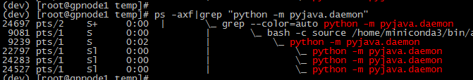
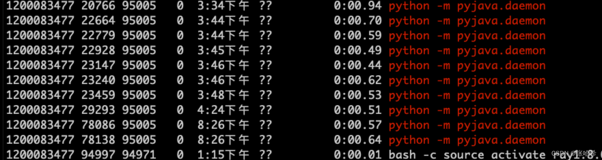
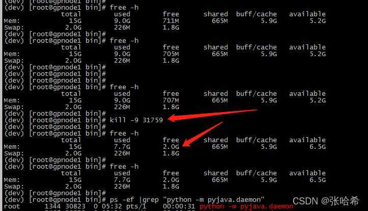
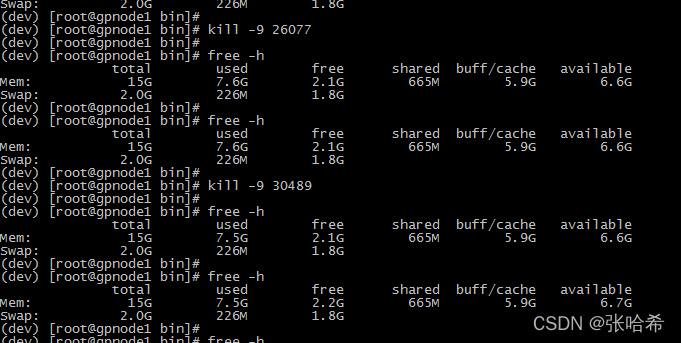
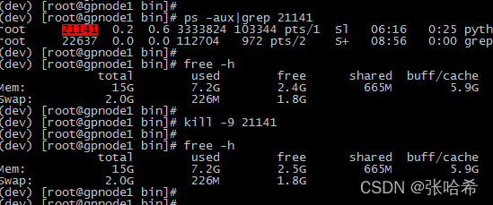
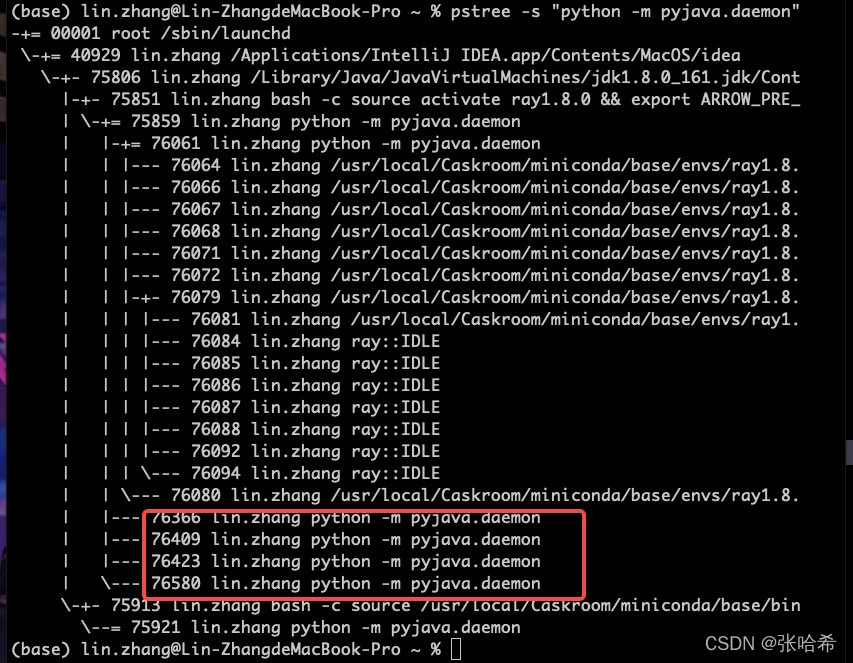
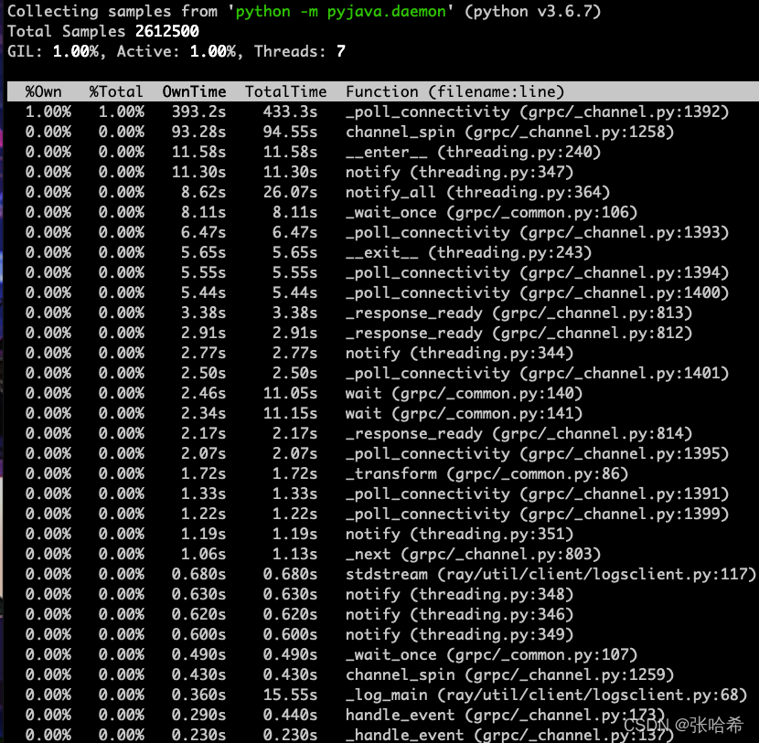
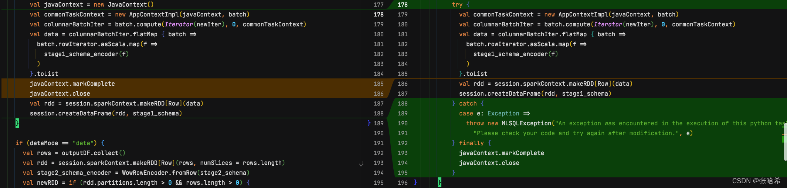

# Byzer-python Daemon进程暴增问题排查

| **Version** | **Author** | **Date** | **Comment** |
| ------ | ------ | ------ |------ |
| V 1.0 | hellozepp (lin.zhang@byzer.org) |2022/01/23 | first version|

## Byzer 介绍

Byzer 作为一门面向 Data 和 AI 的新一代编程语言。具体信息可以点击下面链接了解：https://docs.byzer.org/#/byzer-lang/zh-cn/introduction/byzer_lang_design

修复如下 Github issues：
https://github.com/byzer-org/byzer-lang/issues/1652


## 问题描述

后台发现 daemon 进程增长很快！而正常情况是一个`python env` 应该只有一个进程。

下图可以看到多个 daemon：



## 影响范围

大致从 `driver` 节点的系统资源分析了一下，发现问题比较严重，注意有以下几点：

- 进程常驻，不会自动销毁，会导致创建过多导致 CPU 过高
- 占用内存较高，跟 daemon 中任务使用的资源有关
- 大量 `IDEL` 进程，实际运行很短，然后就进入阻塞状态


下面是具体的分析过程。


经过大量验证，发现问题属于偶发现象，daemon 会长时间驻留内存，直到 `Byzer` 引擎重启。从下图可以看到，启动时间`3：34` 和 `8：26`都有泄露的进程，并且不会自动销毁。





于是我打算尝试 kill 进程后，对比基线看看对系统资源的影响。









可以发现，第一次 kill 直接释放了 1.4G 左右的内存，后面的任务没有释放那么多，但都是有不同程度的释放。 因为我执行的 python 任务有的是空跑，有的比较吃资源，应该跟 daemon 任务使用的资源是相关的。


查看当前进程资源和堆栈情况。


使用 `pstree`，查看相关进程：




发现几个特点，在 java 端使用 `bash -c` 创建 daemon 的进程只有一个，即问题大概率出现在`python` 侧。泄露的这些 daemon，都有相同的 `ppid`，应该是在 daemon 中 `fork` 出来的新进程，而且前面 `ps` 命令看到的状态 `S1`也印证了这一点。


通过使用 python 工具 `py-spy` 排查堆栈：

```Shell
sudo py-spy top --pid  76366
```

> `top`: 实时查看每个函数运行时间并统计


显示如下：





观察上图中实时统计的峰顶，发现是卡在了 `_poll_connectivity` 上面，对应的代码是下面这行：


```scala
while True:

    event = channel.watch_connectivity_state(connectivity,

                                             time.time() + 0.2)
```


google 了一下发现一个类似的讨论：

https://github.com/grpc/grpc/issues/3064

应该是进程阻塞在了完成队列上面。再往上追溯没有找到具体的调用了，需要后续对 `pyjava` 代码详细分析......


## 问题复现


因为该问题是偶发的，我尝试了比较多的方式复现该问题。一开始测试了正常的任务，包括不同的 `python env` 配置下 daemon 的表现，`dataMode`设置为 data 和 model 时的表现，`runIn` 在 driver 和 executor 时的表现，不同的`schema` 时的表现，发现如果代码逻辑正常daemon是不会增长的。于是看了下报错时任务的表现，定位到`schema`（即输出表结构）是错误的时候，且运行在 driver 端，会出现该问题。


设置一个错误的类型，并在 driver 执行（executor 抛异常不会导致 daemon 增长）：

```Python
!python env "PYTHON_ENV=source activate ray1.8.0";

!python conf "schema=st(field(top,map(string,string)))";

!python conf "runIn=driver";

!python conf "dataMode=model";


run command as Ray.`` where 

inputTable="command"

and outputTable="output"

and code='''

from pyjava.api.mlsql import RayContext, PythonContext

context.build_result([{"top": {"a": "string"}}])

''';
```


执行后会得到一个异常，堆栈信息如下：

```Kotlin
Error while decoding: java.lang.UnsupportedOperationException

createexternalrow(staticinvoke(class org.apache.spark.sql.catalyst.util.ArrayBasedMapData$, ObjectType(interface scala.collection.Map), toScalaMap, staticinvoke(class scala.collection.mutable.WrappedArray$, ObjectType(interface scala.collection.Seq), make, mapobjects(lambdavariable(MapObject, StringType, true, -1), lambdavariable(MapObject, StringType, true, -1).toString, input[0, map<string,string>, true].keyArray, None).array, true, false), staticinvoke(class scala.collection.mutable.WrappedArray$, ObjectType(interface scala.collection.Seq), make, mapobjects(lambdavariable(MapObject, StringType, true, -2), lambdavariable(MapObject, StringType, true, -2).toString, input[0, map<string,string>, true].valueArray, None).array, true, false), true, false), StructField(top,MapType(StringType,StringType,true),true))

java.lang.RuntimeException: Error while decoding: java.lang.UnsupportedOperationException

createexternalrow(staticinvoke(class org.apache.spark.sql.catalyst.util.ArrayBasedMapData$, ObjectType(interface scala.collection.Map), toScalaMap, staticinvoke(class scala.collection.mutable.WrappedArray$, ObjectType(interface scala.collection.Seq), make, mapobjects(lambdavariable(MapObject, StringType, true, -1), lambdavariable(MapObject, StringType, true, -1).toString, input[0, map<string,string>, true].keyArray, None).array, true, false), staticinvoke(class scala.collection.mutable.WrappedArray$, ObjectType(interface scala.collection.Seq), make, mapobjects(lambdavariable(MapObject, StringType, true, -2), lambdavariable(MapObject, StringType, true, -2).toString, input[0, map<string,string>, true].valueArray, None).array, true, false), true, false), StructField(top,MapType(StringType,StringType,true),true))

org.apache.spark.sql.catalyst.encoders.ExpressionEncoder$Deserializer.apply(ExpressionEncoder.scala:186)

tech.mlsql.ets.Ray.$anonfun$distribute_execute$20(Ray.scala:182)

scala.collection.Iterator$$anon$10.next(Iterator.scala:459)

scala.collection.Iterator$$anon$11.next(Iterator.scala:494)

scala.collection.Iterator.foreach(Iterator.scala:941)

scala.collection.Iterator.foreach$(Iterator.scala:941)

scala.collection.AbstractIterator.foreach(Iterator.scala:1429)

scala.collection.generic.Growable.$plus$plus$eq(Growable.scala:62)

scala.collection.generic.Growable.$plus$plus$eq$(Growable.scala:53)

scala.collection.mutable.ListBuffer.$plus$plus$eq(ListBuffer.scala:184)

scala.collection.mutable.ListBuffer.$plus$plus$eq(ListBuffer.scala:47)

scala.collection.TraversableOnce.to(TraversableOnce.scala:315)

scala.collection.TraversableOnce.to$(TraversableOnce.scala:313)

scala.collection.AbstractIterator.to(Iterator.scala:1429)

scala.collection.TraversableOnce.toList(TraversableOnce.scala:299)

scala.collection.TraversableOnce.toList$(TraversableOnce.scala:299)

scala.collection.AbstractIterator.toList(Iterator.scala:1429)

tech.mlsql.ets.Ray.distribute_execute(Ray.scala:180)

tech.mlsql.ets.Ray.train(Ray.scala:56)

tech.mlsql.dsl.adaptor.TrainAdaptor.parse(TrainAdaptor.scala:116)

streaming.dsl.ScriptSQLExecListener.execute$1(ScriptSQLExec.scala:408)

streaming.dsl.ScriptSQLExecListener.exitSql(ScriptSQLExec.scala:447)

streaming.dsl.parser.DSLSQLParser$SqlContext.exitRule(DSLSQLParser.java:296)

org.antlr.v4.runtime.tree.ParseTreeWalker.exitRule(ParseTreeWalker.java:47)

org.antlr.v4.runtime.tree.ParseTreeWalker.walk(ParseTreeWalker.java:30)

org.antlr.v4.runtime.tree.ParseTreeWalker.walk(ParseTreeWalker.java:28)

streaming.dsl.ScriptSQLExec$._parse(ScriptSQLExec.scala:160)

streaming.dsl.ScriptSQLExec$.parse(ScriptSQLExec.scala:147)

streaming.rest.RestController.$anonfun$script$1(RestController.scala:153)

tech.mlsql.job.JobManager$.run(JobManager.scala:74)

tech.mlsql.job.JobManager$$anon$1.run(JobManager.scala:91)

java.util.concurrent.ThreadPoolExecutor.runWorker(ThreadPoolExecutor.java:1149)

java.util.concurrent.ThreadPoolExecutor$Worker.run(ThreadPoolExecutor.java:624)

java.lang.Thread.run(Thread.java:748)
```


## 问题定位

看到多个daemon被创建第一反应是不是什么原因导致java侧创建python daemon的脚本被多次执行。


控制创建daemon的逻辑如下：

```Shell
private val pythonWorkers = mutable.HashMap[(String, Map[String, String]), PythonWorkerFactory]()


def createPythonWorker(pythonExec: String, envVars: Map[String, String], conf: Map[String, String]): java.net.Socket = {

  synchronized {

    val key = (pythonExec, envVars)

    pythonWorkers.getOrElseUpdate(key, new PythonWorkerFactory(pythonExec, envVars, conf)).create()

  }
```


可以看到，如果一个`python worker factory`已经创建了，就会被缓存到`pythonWorkers` 中。因为key只有pythonExec, envVars，没有 hint 中设置的 `python conf`，如果用户 pythonExec 中 `code` 和 `python env` 环境没有变化，就会取到创建好的 `python worker factory`，而 daemon进程相关信息就是保存在 factory 中的。*


经过断点调试，也确实印证了前面观察的结果，java 侧只创建了一次 daemon，因为相同`conda` 环境时，的的确确是从缓存中取到的，即使上一次执行报错。而不同的 `conda` 环境确实也会导致daemon增长，但属于正常且可控的。具体的代码逻辑梳理成了单独的文档：[Ray插件java侧代码走读](https://www.jianshu.com/p/3c36ae92f35b)


回过头来仔细看了一下异常堆栈，发现是在函数`stage1_schema_encoder`执行时报错（也是问题的所在），因为返回的结果不能转换为`map`结构。可以看代码如下：

```Kotlin
    val javaContext = new JavaContext()

    val commonTaskContext = new AppContextImpl(javaContext, batch)

    val columnarBatchIter = batch.compute(Iterator(newIter), 0, commonTaskContext)

    val data = columnarBatchIter.flatMap { batch =>

      batch.rowIterator.asScala.map(f =>

        stage1_schema_encoder(f)

      )

    }.toList

    javaContext.markComplete

    javaContext.close

    val rdd = session.sparkContext.makeRDD[Row](data)

    session.createDataFrame(rdd, stage1_schema)

}
```


而后面对于 javaContext 状态和关闭的操作因为异常没有被执行到，我于是 dig 到如下的错误case。


- 不更新 context 状态会导致 monitor 不会去杀掉僵尸的进程;
- 而不手动关闭，会导致 daemon 一直阻塞在完成队列上。


具体的 dig 流程在下面阐述。


### javaContext.markComplete


我们知道 Byzer 是会自动 check 和关闭无用 worker 的，但是如果状态没有被设置为完成或者异常，会导致monitor不会去自动杀掉任务，因为 while 条件`!context.isInterrupted && !context.isCompleted`永真，后续是否可以加一下任务超时控制？

```JavaScript
override def monitor(callback: () => Unit) = {

  (taskKillTimeout: Long, pythonExec: String, envVars: Map[String, String], worker: Socket) => {

    // Kill the worker if it is interrupted, checking until task completion.

    // TODO: This has a race condition if interruption occurs, as completed may still become true.

    while (!context.isInterrupted && !context.isCompleted) {

      Thread.sleep(2000)

    }

    if (!context.isCompleted) {

      Thread.sleep(taskKillTimeout)

      if (!context.isCompleted) {

        try {

          // Mimic the task name used in `Executor` to help the user find out the task to blame.

          val taskName = s"${context.partitionId}"

          logWarning(s"Incomplete task $taskName interrupted: Attempting to kill Python Worker")

          PythonWorkerFactory.destroyPythonWorker(pythonExec, envVars, worker)

        } catch {

          case e: Exception =>

            logError("Exception when trying to kill worker", e)

        }

      }

    }

  }

}
```


### javaContext.close


关闭方法也比较重要，dig 了一下发现是关闭 arrow vector 和 arrow allocator：

```Scala
val allocator =

  ArrowUtils.rootAllocator.newChildAllocator("toBatchIterator", 0, Long.MaxValue)


val root = VectorSchemaRoot.create(arrowSchema, allocator)

val unloader = new VectorUnloader(root)

val arrowWriter = ArrowWriter.create(root)


context match {

  case c: AppContextImpl => c.innerContext.asInstanceOf[JavaContext].addTaskCompletionListener { _ =>

    root.close()

    allocator.close()

  }
```


我于是做了如下修改（右边为修改后的代码）：

在将两行操作移到了 finally 位置，并设置一个比较容易理解的异常 message。


------

## Join Byzer Community

加入我们的slack channel！

https://join.slack.com/t/byzer-org/shared_invite/zt-10qgl60dg-lX4fFggaHyHB6GtUmer_xw