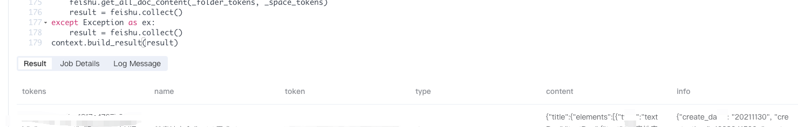

# 利用 Byzer-lang 实现飞书数据分析和处理
| Version | Author                                                       | Date      | Comment      |
| ------- | ------------------------------------------------------------ | --------- | ------------ |
| 1.0     | @Liting Song 宋丽婷 ([liting.song@byzer.org](mailto:liting.song@byzer.org)) | 2022/1/21 | first commit |

### 背景

飞书作为一个企业 Sass，企业会使用飞书文档和飞书知识库来管理文档任务，本次介绍的场景是根据飞书开发文档将公司内飞书云文档和知识库中的待办任务和已经完成的任务、文档相关的信息及相关人员的信息查询出来，然后发送飞书消息给对应的人

### 需求分析

根据[飞书文档 API](https://open.feishu.cn/document/ukTMukTMukTM/uUDN04SN0QjL1QDN/docs-overview) 云文档和飞书知识库的 API 对比我们的需求筛选需要的 API 获取结果。通过整理需要的 API 如下：
| function | url                                                       |
| ------- | ------------ |
| 云文档获取根目录 folderToken     | https://open.feishu.cn/open-apis/drive/explorer/v2/root_folder/meta  |
| 云文档获取目录下的文档列表     | https://open.feishu.cn/open-apis/drive/explorer/v2/folder/:folderToken/children  |
| 知识库获取知识空间列表     | https://open.feishu.cn/open-apis/wiki/v2/spaces
| 知识库获取知识空间节点信息     | https://open.feishu.cn/open-apis/wiki/v2/spaces/:space_id/nodes
| 获取单个文档富文本内容     | https://open.feishu.cn/open-apis/doc/v2/:docToken/content

飞书中的待办任务分布在云文档和知识库两个部分，先查出这两个部分的文档，再根据文档的 token 查出文档的内容，筛选出有 checkBox 字段且值 为 false 字段的文档，即是需要任务提醒列表， 具体步骤如下

1. 获取云文档根目录 folderToken，

2. 根据第一步的 folderToken 获取目录下的文档列表，通过查询出 type="doc" 的文件， 其中 type="doc" 的文件下还会存在子集，需要递归查询， 将所有 type="doc" 的文件整合成一个 Array。

3.  获取知识库空间的知识空间列表

4. 获取知识空间列表下的的节点信息，筛选出 obj_type 为 doc 的节点即文档

5. 将第二步的文档和第四步的文档列表合起来处理成一个列表，

6. 根据获取单个文档富文本内容 API 查询出文档的信息，包含（创建人，创建时间...）等信息

7. 筛选出有 checkBox 字段且值 为 checkBox 字段的文档即是需要任务提醒列表（任务列表）

8. 根据文档信息中列表中的 open_id 查询所有的用户信息

9. 根据用户信息中的 open_id 和 任务列表中的 open_id 关联，将待办任务和对应的用户信息整合到一张表中

### 数据获取和处理

数据获取部分基本上都是在进行 api 请求和数据的处理，Byzer-lang 提供了 Rest API 作为数据源，并将返回值注册为一张表，默认是 GET 请求，可以通过  form = { "key": "value"}  的形式进行传参，下面的例子是 POST 请求， 通过 body 形式传参，返回的是加密后的值，字段为content，进行处理前需要转化为 string 类型的数据，再通过 JsonExpandExt 转化为 struct 结构， 然后就可以根据自己的需求进行数据处理了，同时，Rest API 还支持进行分页查询。Rest API 使用详见 Byzer 文档
数据处理可以使用 SparkSQL 函数，注意，SparkSQL 版本要与当前环境的 Spark 版本匹配，否则可能出现某些函数不可用的情况

1. token 刷新
飞书是 oauth2 authorization_code 方式进行权限验证，先通过 url 获取 code， 然后再通过 Rest API  获取 refresh_token，进行 token 刷新

```sql
SET app_id = `select app_id from tokens` where type="sql" and mode="runtime";
SET app_access_token = `select app_access_token from app_token_result_2` where type="sql" and mode="runtime";
SET refresh_token = `select refresh_token from tokens` where type="sql" and mode="runtime";
LOAD Rest.`https://open.feishu.cn/open-apis/authen/v1/refresh_access_token` where
`config.connect-timeout`="10s"
and `config.method`="POST"
and `header.Authorization`="Bearer ${app_access_token}"
and `header.content-type`="application/json; charset=utf-8"
and `body`='''{
    "grant_type": "refresh_token",
    "refresh_token": "${refresh_token}"
}'''
as tokens;

select string(content) as content, status from tokens as tokens1;
run tokens1 as JsonExpandExt.`` where inputCol="content" and structColumn="true" as tokens2;
select content.data.access_token as access_token,  content.data.refresh_token as refresh_token from tokens2 as all_token;

```


2. 通过 Python 代码查出所有的飞书文档和飞书知识库中所有的文档（这里运行时间比较长可能会存在token 过期的情况，因此用python 代码完成前 6 步的分析）


Byzer-lang 中也是支持写 Python 代码的
其中 schema 是输出的数据包含的所有字段和类型， input 是入参，ouput 是出参，在 Byzer Notebook 中需要注意 如果需要使用 Python 代码输出的结果，则需要加上 cache=true 

```python
#%python
#%env=source /home/azureuser/miniconda3/bin/activate dev
#%schema=st(field(tokens,string), field(name,string),field(token,string),field(type,string),field(content,string),field(info,string))
#%dataMode=model
#%input=all_keys
#%output=contentsTb
#%cache=true
import json
import time
from requests import Session
from pyjava.api.mlsql import RayContext, PythonContext

context: PythonContext = context
ray_context = RayContext.connect(globals(), None)
data = ray_context.to_pandas()


class FeishuSession(Session):
    url_base = "https://open.feishu.cn/open-apis"
    APP_ACCESS_TOKEN_URL = "/auth/v3/app_access_token/internal"
    REFRESH_USER_TOKEN_URL = "/authen/v1/refresh_access_token"

    def __init__(self, tokens):
        super().__init__()
        self.tokens = dict()
        self._update_headers(tokens)

    def _update_headers(self, tokens):
        self.tokens = tokens
        self.headers.update({"Authorization": f'Bearer {self.tokens["access_token"]}'})

    def refresh_tokens(self):

        response_a = self.get(
            self.APP_ACCESS_TOKEN_URL,
            params=self.tokens
        )
        response = self.post(
            self.REFRESH_USER_TOKEN_URL,
            json={"grant_type": "refresh_token", "refresh_token": self.tokens["refresh_token"]},
            headers={
                "Authorization": f'Bearer {json.loads(response_a.content).get("app_access_token")}',
                "Content-Type": "application/json; charset=utf-8"
            }
        )
        data = json.loads(response.content)
        if not data.get("data"):
            raise Exception(f"refresh failed {data.get('msg', 'error')}")
        self.tokens.update({"refresh_token": data.get("data").get("refresh_token"),
                            "access_token": data.get("data").get("access_token")})
        self.headers.update({"Authorization": f'Bearer {self.tokens["access_token"]}'})
        context.log_client.log_to_driver("token has been refreshed")

    def get(self, url, **kwargs):
        return super(FeishuSession, self).get(self.url_base + url, **kwargs)

    def post(self, url, **kwargs):
        return super(FeishuSession, self).post(self.url_base + url, **kwargs)


class FeishuSync:
    GET_FILE = "/drive/explorer/v2/folder/{file_token}/children"
    WIKI_LIST = "/wiki/v2/spaces/{space_id}/nodes"
    DOC_CONTENT = "/doc/v2/{doc_token}/content"
    DOC_INFO = "/doc/v2/meta/{doc_token}"
    FOLDER_LIST = "/drive/explorer/v2/folder/{folder_token}/children"

    def __init__(self, tokens):
        self.session = FeishuSession(tokens)
        self.data = []
        self.max_retries = 3

    def _get(self, url, **kwargs):
        for i in range(1, self.max_retries):
            context.log_client.log_to_driver(f"GET {url} {kwargs.get('params')}")
            response = self.session.get(url, **kwargs)
            data = json.loads(response.content)
            if response.status_code == 200 and data.get("code") == 0:
                return data
            elif response.status_code == 400 and data.get("code", 0) in (99991677, 99991668):
                self.session.refresh_tokens()
                return json.loads(self.session.get(url, **kwargs).content)
            elif data.get('code') in (99991400, 93001):
                context.log_client.log_to_driver(f"Too freq call of in {url}, sleep and try again")
                time.sleep(60)
                return json.loads(self.session.get(url, **kwargs).content)
            elif response.status_code == 403:
                context.log_client.log_to_driver(data)
                return {}
            elif i == self.max_retries:
                context.log_client.log_to_driver(f"tried {self.max_retries} times for {url}")
                raise Exception(f'Error: {data.get("code")}')
        return {}

    def get_doc_content(self, doc_token_and_title: tuple):
        doc_token, title = doc_token_and_title
        if not doc_token:
            return
        url = self.DOC_CONTENT.format(doc_token=doc_token)
        data = self._get(url)
        return {"name": title, "token": doc_token, "type": "doc",
                "content": data.get("data", {}).get("content", ""),
                "info": self.get_doc_info(doc_token)}

    def get_doc_info(self, doc_token):
        url = self.DOC_INFO.format(doc_token=doc_token)
        data = self._get(url)
        return json.dumps(data.get("data", {}))

    def get_all_folder_docs(self, folder_tokens: list):
        docs = []
        for token in folder_tokens:
            self.get_folder_doc(token, docs)
        return docs

    def get_all_doc_content(self, folder_tokens, space_tokens):
        docs = self.get_all_folder_docs(folder_tokens)
        docs.extend(self.get_all_wiki_docs(space_tokens))
        result = map(self.get_doc_content, docs)
        self.data = [r for r in result if r]

    def get_all_wiki_docs(self, space_tokens: list):
        docs = []
        for token in space_tokens:
            self.get_wiki_doc(token, None, docs)
        return docs

    def get_folder_doc(self, folder_token, docs):
        url = self.FOLDER_LIST.format(folder_token=folder_token)
        data = self._get(url).get("data", {})
        if not data:
            return
        for child in data.get("children", {}).values():
            if child.get("type") == "doc":
                docs.append((child.get("token"), child.get("name")))
            elif child.get("type") == "folder":
                self.get_folder_doc(child.get("token"), docs)

    def get_wiki_doc(self, space_token: str, wiki_token, docs: list):
        if wiki_token is not None and not len(wiki_token):
            return
        url = self.WIKI_LIST.format(space_id=space_token)
        has_more, page_token = True, None
        while has_more:
            params = {"page_size": 50}
            if wiki_token:
                params["parent_node_token"] = wiki_token
            if page_token:
                params["page_token"] = page_token
            data = self._get(url, params=params).get("data", {})
            if not data:
                return
            has_more = data.get("has_more", False)
            if has_more:
                page_token = data.get("page_size", None)
            for item in data.get("items", []):
                if item.get("obj_type") == "doc":
                    docs.append((item.get("obj_token"), item.get("title")))
                    if item.get("has_child", False):
                        self.get_wiki_doc(space_token, item.get("node_token", ""), docs)

    def collect(self):
        if self.data:
            return [{"tokens": json.dumps(self.session.tokens), **doc} for doc in self.data]
        else:
            return [{"tokens": json.dumps(self.session.tokens), "name": "", "token": "", "type": "", "content": "", "info": ""}]


_tokens = json.loads(data["tokens"][0])
_folder_tokens = data["folder_tokens"][0].split(",")
_space_tokens = data["space_tokens"][0].split(",")
feishu = FeishuSync(_tokens)
try:

    feishu.get_all_doc_content(_folder_tokens, _space_tokens)
    result = feishu.collect()
except Exception as ex:
    result = feishu.collect()
context.build_result(result)
```

结果




1. 筛选出有待办任务的文档信息

```sql
select name, explode(content.body.blocks) as block, info from docs_list1 
as docs_list2;
select name, block.paragraph.elements, block.paragraph.style.list.type as checkBox, info from docs_list2 where
  block.type == "paragraph"
  and block.paragraph.style is not null 
  and block.paragraph.style.list is not null 
  and block.paragraph.style.list.type in ("checkBox")

as task_list;
```

4. 根据文档信息中列表中的 open_id 查询所有的用户信息
通过 Scala 代码注册 UDF 并使用

```scala
register ScriptUDF.`` as http_client where  
lang="scala"
and udfType="udf"
and code='''

def apply(url:String, httpMethod:String, headers:Map[String,String]) : Array[Byte]= {

import org.apache.http.client.fluent.Request
import org.apache.http.entity.StringEntity
import org.apache.http.util.EntityUtils
import org.apache.spark.sql.mlsql.session.MLSQLException

import java.net.URLEncoder
import scala.collection.mutable.ArrayBuffer
      val request = httpMethod match {
        case "get" =>
          Request.Get(url)
        case v => throw new MLSQLException(s"HTTP method ${v} is not support yet")
      }

      headers.foreach { case (k, v) =>
        request.addHeader(k, v)
      }

      val response = (httpMethod, headers.getOrElse("Content-Type", "application/json")) match {
        case ("get", _) =>
          request.execute()
        case (_, v) =>
          throw new MLSQLException(s"content-type ${v}  is not support yet")
      }

      val httpResponse = response.returnResponse()
      val status = httpResponse.getStatusLine.getStatusCode.toString
      val content = EntityUtils.toByteArray(
        if(httpResponse.getEntity==null) new StringEntity("") else httpResponse.getEntity
      )
      content
    }
''';
```

注册完 UDF 函数就可以愉快的进行使用了，这就可以根据 open_id 进行用户信息查询了

```sql
SET access_token = `select access_token from all_token` where type="sql" and mode="runtime";
select 
http_client(
    concat(
        'https://open.feishu.cn/open-apis/contact/v3/users/',
        open_id
    )
    , 
    "get",
    map('Authorization', "Bearer ${access_token}")) 
    as content
from task_list as task_list1;
select string(content) as content from task_list1 as task_list2;
run task_list2 as JsonExpandExt.`` where inputCol="content" and structColumn="true" as task_list3;
select content.data.user as user from task_list3 as users;
```
5. 根据用户信息中的 open_id 和 任务列表中的 open_id 关联，将待办任务和对应的用户信息整合到一张表中

```sql
select distinct 
user.name, 
user.email, 
user.mobile, 
user.user_id, 
user.status, 
user.employee_type, 
user.open_id, 
task_list.docTitle, 
task_list.content, 
task_list.endTime, 
task_list.checkBox, 
task_list.info.* 
from users join task_list on user.open_id=task_list.open_id
as user_list;
```

6. 发送邮件

```sql
set EMAIL_TITLE = "邮件标题";
set EMAIL_BODY = "任务即将";
set EMAIL_TO = "yourMailAddress@qq.com,yourMailAddress@163.com";

-- 使用配置账号的方式
run command as SendMessage.``
where method = "mail"
and from = "yourMailAddress@qq.com"
and to = "${EMAIL_TO}"
and subject = "${EMAIL_TITLE}"
and content = "${EMAIL_BODY}"
-- 设置邮件客户端使用的服务器域名、端口号
and smtpHost = "smtp.qq.com"
and smtpPort = "587"
-- 设置邮件客户端的协议TLS，如果使用SSL协议，请配置：`properties.mail.smtp.ssl.enable`= "true"
and `properties.mail.smtp.starttls.enable`= "true"
-- 设置邮件客户端的用户名、授权码
and userName = "yourMailAddress@qq.com"
and password="---"
;
```


以上是完成飞书任务提醒的主要步骤，数据可根据自己的需求进行处理

### 总结
在写代码的过程中发现脚本明明是简单的数据处理，结果返现运行的时间有时候会很长，这是因为 Byzer-lang 在执行代码时，每个  select  后面 as 的表名其实是个虚表，后面使用该表会再执行一遍获取虚表的过程。因此为了解决该问题可以在 api 请求后将数据保存下来，再进行数据处理，这样就可以节省时间。

```sql
save overwrite users as parquet.`/save_path `;
LOAD parquet.`/save_path` AS users1;
```


