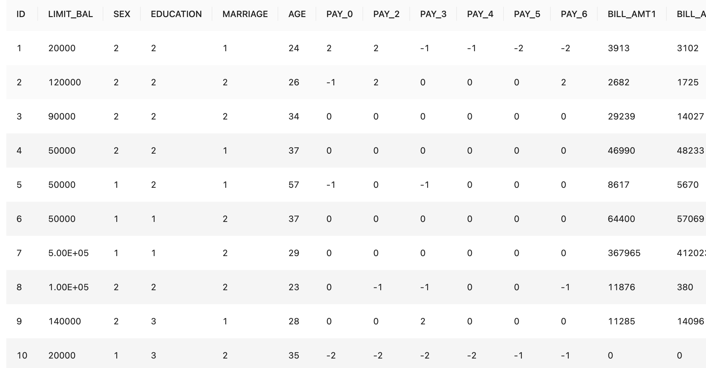
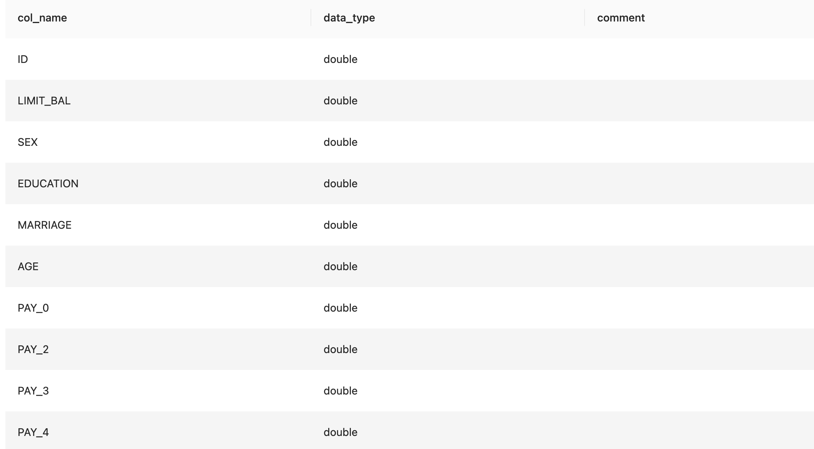
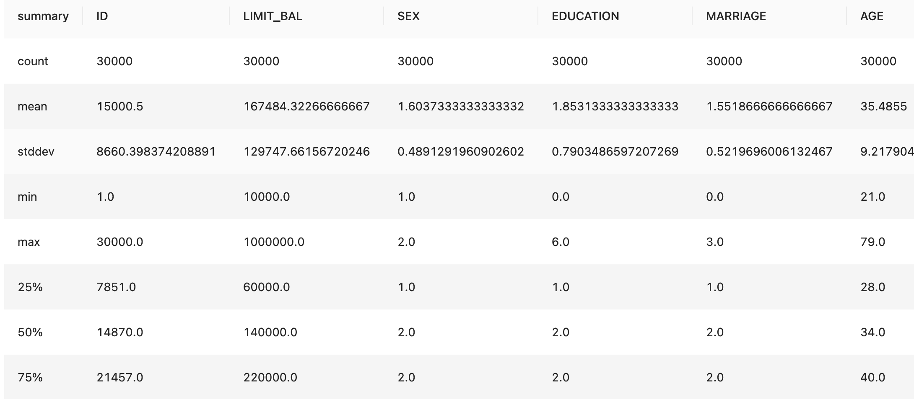
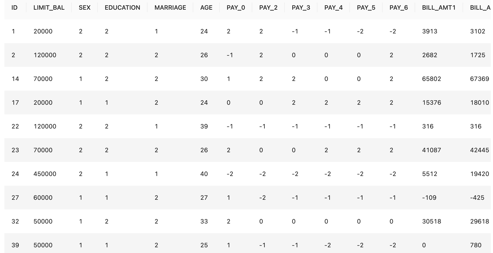
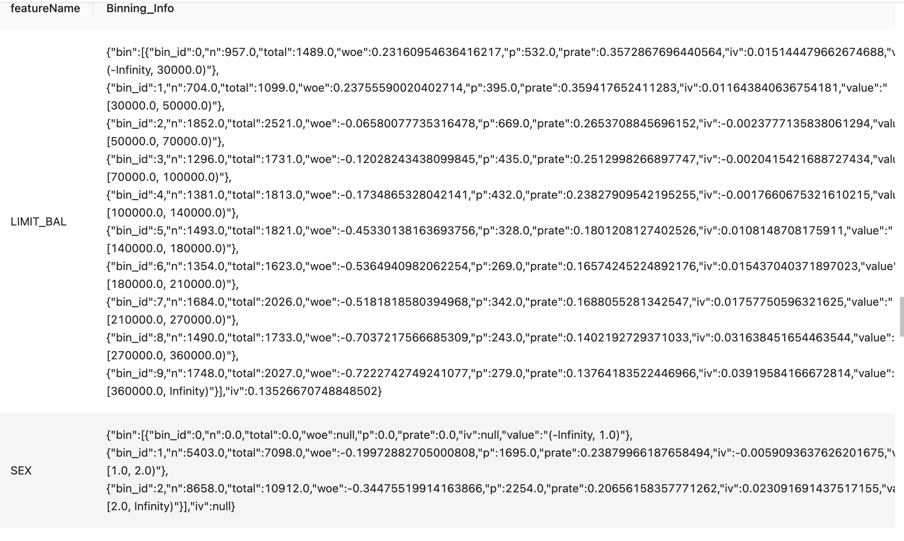
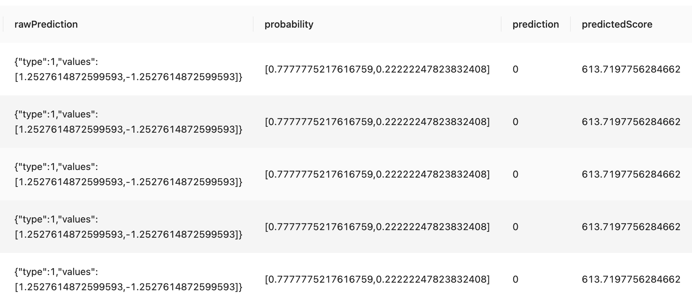
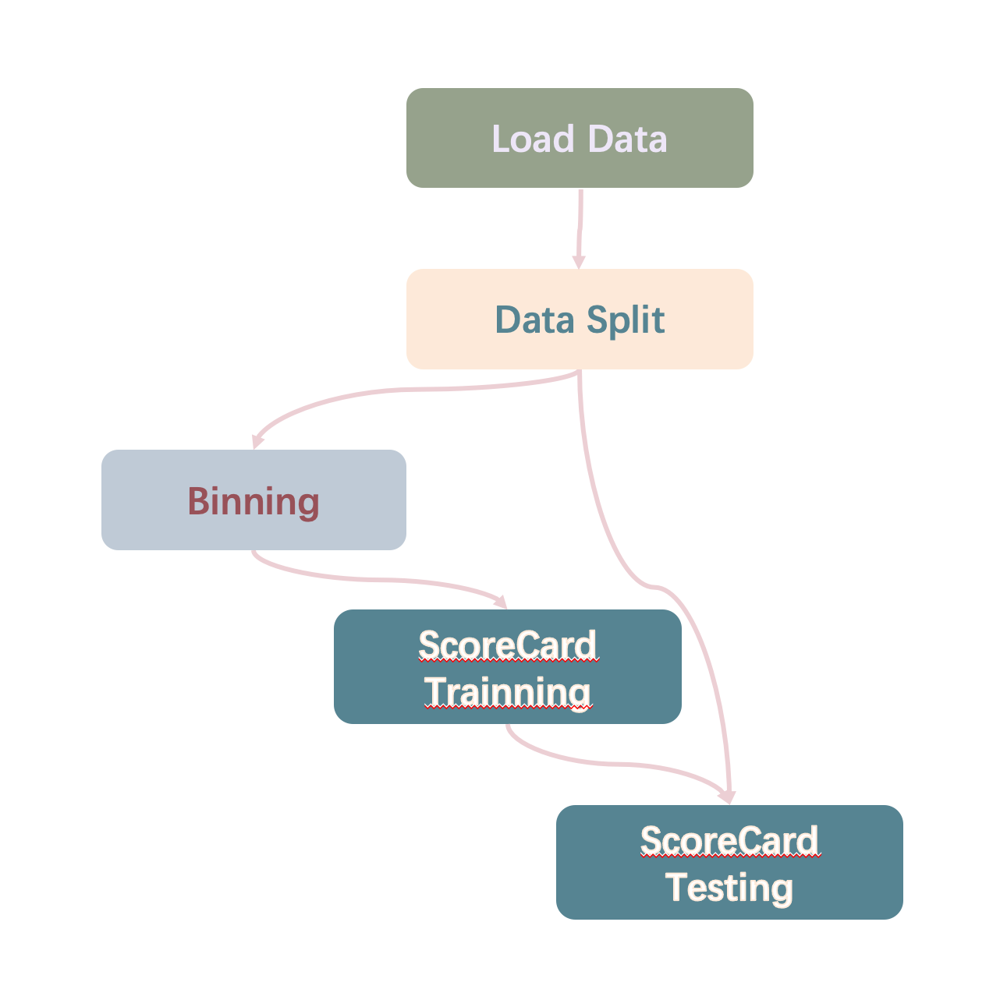

## 金融场景--信用评分卡建模


### 背景

评分卡是金融场景里非常常用的一种建模方法，通常是应用在信用风险评估场景。它并不是简单对应于某一种机器学习方法，而是一种通用的建模框架（解决方案）。评分卡的建模原理是将原始数据进行特征工程的变换，包括分箱，woe 和 iv 计算，然后使用线性模型（或者树模型）进行建模。

评分卡建模理论适用于信用评估领域，比如信用卡风险评估，贷款发放风控业务等。在其他领域，评分卡建模也可以作为其他方面的分数评估，比如软件工程过程中开发者的 reputation 计算，著名的支付宝芝麻信用打分等等场景。


### 数据准备

本次实验采用国外某机构开元的[数据集](https://www.kaggle.com/uciml/default-of-credit-card-clients-dataset?spm=a2c4g.11186623.0.0.4ad77696h6dq6X
) ，一共3w条数据，数据集包括将性别，教育程度，婚姻，年龄，历史信用卡消费情况账单等等。其中，payment.next.month 是目标列，我们将原数据的目标列重命名为 label ，其中 1 表示已经偿还了账单（好客户）， 0 表示还没有偿还账单（坏客户）。



重命名后将文档 ‘UCI_Credit_Card.csv’ 上传至平台，并加载数据示例如下

```sql
load csv.`/Users/yonghui.huang/mlsql/andiehuang/tmp/data/UCI_Credit_Card.csv` where header="true" as credit_data;
```

我们对数据里的类型进行转换

```sql
SELECT DOUBLE(`ID`),DOUBLE(`LIMIT_BAL`),DOUBLE(`SEX`),DOUBLE(`EDUCATION`),DOUBLE(`MARRIAGE`),
DOUBLE(`AGE`),DOUBLE(`PAY_0`),DOUBLE(`PAY_2`),DOUBLE(`PAY_3`),DOUBLE(`PAY_4`),DOUBLE(`PAY_5`),
DOUBLE(`PAY_6`),DOUBLE(`BILL_AMT1`),DOUBLE(`BILL_AMT2`),DOUBLE(`BILL_AMT3`),DOUBLE(`BILL_AMT4`),
DOUBLE(`BILL_AMT5`),DOUBLE(`BILL_AMT6`),DOUBLE(`PAY_AMT1`),DOUBLE(`PAY_AMT2`),DOUBLE(`PAY_AMT3`),
DOUBLE(`PAY_AMT4`),DOUBLE(`PAY_AMT5`),DOUBLE(`PAY_AMT6`),DOUBLE(`label`) from credit_data as credit_data2;
```

```yaml
!desc credit_data2;
```



我们先用全局数据统计插件查看数据的情况

通过 DataSummary 这个插件，可以看到我们数据的统计情况，包括每个特征的 mean ， stddev ，最小值 min， 最大值 max， 1/4 分位数， 1/2 分位数， 3/4 分位数等。从分位点数值可以判断特征是否存在异常值。
我们从 DataSummary 结果可以看出，我们的数据集没有任何的缺失值和异常值，因此我们不需要做缺失值和异常值的替换。

如果用户的场景需要用到缺失值的处理，可以用我们的 MissingValueProcess ET 去做缺失值处理，用户只需要指定对应的缺失值处理方式（包括，mean 值填充，mode 值填充，drop 缺失值，以及可以选择 randomforest 进行有监督的方式填充确实值 ）

```sql
run credit_data2 as DataSummary.`` as summaryTable;
```



### 数据拆分

为了后续的建模工作，我们将数据拆分成两部分，一部分是训练数据集，一部分是测试数据集。训练集用于训练模型，测试集用于评估模型效果。

```Haskell
-- 使用 RateSampler 这个ET组件
run credit_data2 as RateSampler.`` where sampleRate="0.6,0.4" 
and labelCol="label" as credit_data3;
```



```SQL
-- 将组别为0的定义为训练集，将组别为1的定义为测试集
select * from credit_data3 where __split__=0 as train_data;
select * from credit_data3 where __split__=1 as test_data;
```

### 特征工程

#### 分箱

在评分卡场景中，经常采用的一个特征工程的方式是分箱 -- 将连续变量离散化，或者将具有很多状态的离散变量合并成少状态。 
分箱的优势：
* 对异常值不敏感，如年龄300岁；
* 降低模型过拟合风险；
* 可以学习到样本的非线性信息

为了方便用户建模，我们封装好了分箱的算法（Binning ET），其中包括等频 （Equal Frequency）分箱和 等距/等宽（Equal Distance）的方法。

#### WOE

WOE (weight of Evidence) 字面意思证据权重，对分箱后的每组数据进行如下计算：

$$
\begin{aligned}
{WOE}_i &= \ln\left(\frac{p_{good}}{p_{bad}}\right)\\
&=  \ln\left(\frac{good_{占比}}{bad_{占比}}\right)\\
&= \ln\left(\frac{\#good{i}/\#good_{T}}{\#bad{i}/\#bad_{T}}\right),.
\end{aligned}
$$

$*good_i$ 表示每组中标签为 good 的数量，$#good_T$ 为 good 的总数量； bad 相同。

### IV值 (information value)

IV 的计算方法

$$
IV = \sum_{i=1}^{N}（good占比-bad占比）*WOE_i
$$

N 为分组的组数；
IV 可用来表示一个变量的预测能力。

|IV                          |预测能力                         |
|-------------------------------|-----------------------------|
|<0.03|无预测能力   |
|0.03~0.09|低  |
|0.1~0.29|中   |
|0.3~0.49|高   |
|>=0.5|极高 |

根据IV值来调整分箱结构并重新计算 WOE 和 IV ，直到 IV 达到最大值，此时的分箱效果最好。

### Binning ET

Byzer-lang 实现的 Binning ET 集成了数据离散化（分箱），WOE 计算和替换和 IV 值计算的 pipeline ，用户只需指定对应的参数既可以实现一行命令实现分箱 + WOE 计算 + WOE 替换 + IV 计算的功能，具体示例如下。
下面我们详细介绍 Binning ET 的参数：

* label ： 数据里代表标签的列名
* method ：用户采用分箱的具体方法，包括等频分箱（EF）还有等宽分箱（ED）
* numBucket :  用户根据用户场景指定分箱数
* customizedBucketsConfig ：每个特征指定的分箱数目，未指定的，则用 numBuket 代表分箱数。比如 col1:8 , col2:3 , col4:11 代表 col1 特征分成 8 个箱， col2 分成 3 个箱子，col4 特征分 11 个箱子，其余参与分箱的特征都是 10 （如果 numBucket = 10 ）
* selectedFeatures ： 参与分箱的特征名，用逗号隔开
* goodValue ：0 or 1，代表好客户的值在数据中是用 0 还是用 1 表示，默认为 1


```Apache
run train_data as Binning.`/tmp/fe/binning` where
label='label' and method='EF'   
and numBucket='10'
and customizedBiningConfig="SEX:3,AGE:15"
and selectedFeatures='LIMIT_BAL,SEX,EDUCATION,MARRIAGE,AGE,PAY_0,PAY_2,PAY_3,PAY_4,PAY_5,PAY_6,BILL_AMT1,BILL_AMT2,BILL_AMT3,BILL_AMT4,BILL_AMT5,BILL_AMT6,PAY_AMT1,PAY_AMT2,PAY_AMT3,PAY_AMT4,PAY_AMT5,PAY_AMT6'
as binningInfoTable;
```

下面展示了分箱 ET 执行的结果。
结果表展示了每一个特征的分箱信息，包括分成了几个箱， 每个箱的 range， 每个箱的正例和反例值，以及每个箱子对应的woe值和iv值。
这张结果表，在 Byzer-lang 命令里指定的名字叫做 binningInfoTable， 分箱模型存储在 /tmp/fe/binning 目录，这两个信息在下一步的评分卡训练和预测中，十分重要。



### 评分卡训练

有了特征工程后的数据，下一步就是评分卡的模型训练。当前阶段， Byzer-lang 的评分卡模型支持 LogisticRegression 模型进行评分卡训练。下面详细介绍评分卡训练的过程
评分卡计算方法如下：
odds 为 good 用户概率 （p） 与bad用户概率 （1-p） 的比值。

$$
odds = \frac{好客户概率}{坏客户概率}=\frac{p}{1-p}
$$

评分卡设定的分值刻度可以通过将分值表示为比率对数的线性表达式来定义。公式如下：

 $$
 score_{总}=A+B*\ln(odds)
 $$

注：若 odds 是 好客户概率/坏客户概率，odds应取倒数，再经过 ln 转换则B前面是减号。
设置比率为 $θ_0$（也就是odds）的特定点分值为 $P_0$，比率为 $2 θ_0$ 的点的分值为 $P_0+PDO$，带入上面公式可得

$$\begin{cases}
P_{0}=A+B\ln(\theta_0)\\
P_{0}+PDO=A+B\ln(2\theta_0)\\
\end{cases}
$$

求解上述公式，可以得到 A 、 B 值：

$$
\begin{cases}
B=\frac{PDO}{\ln2}\\
A=P_0-B\ln(\theta_0)
\end{cases}
$$

用户可以在 Scorecard Et 里设置 PDO 和 P0（ScaledValue） 以及 θ0 （Odds） 计算出 A 、 B 值。


#### 分值分配

在实际的应用中，我们会计算出每个变量的各分箱对应的分值。新用户产生时，对应到每个分箱的值，将这些值相加，最后加上初始基础分，得到最终的结果。
如果用户某个变量发生改变，由一个分箱变成另一个，只需将更新后所在分箱的值做替换，再重新相加即可得到新的总分。
我们都知道，假设模型结果为 p ，根据 Logistic Regression 计算公式有：

 $$
 p=\frac{1}{1+e^{-\theta^Tx}}
 $$

经过转换得到

  $$
  \ln(\frac{p}{1-p})=\theta^Tx
  $$

由于上面提到的公式

$$
\ln(\frac{p}{1-p})=\ln(odds)
$$

所以

$$
\ln(odds)=\theta^Tx=w_0+w_1x_1+...+w_nx_n
$$

这里带入评分卡公式，

$$
\begin{aligned}
score_总&=A+B*(\theta^Tx)=A+B*(w_0+w_1x_1+...+w_nx_n)\\
&=(A+B*w_0)+B*w_1x_1+...+B*w_nx_n
\end{aligned}
$$
 
 Byzer-lang 的 ScoreCard ET 封装了包括从 LR 模型训练到根据分箱 + WOE 计算 Score 的 pipeline。
下面详细介绍 ScoreCard 的参数信息：

* biningTable： 上一步，分箱结果表的表明
* binningPath： 上一步，分箱模型的存储地址
* selectedFeatures： 参与打分的 feature


```JavaScript
run train_data as ScoreCard.`/tmp/fe/scorecard1` where biningTable="binningInfoTable"
and binningPath = '/tmp/fe/binning'
and selectedFeatures='LIMIT_BAL,SEX,EDUCATION,MARRIAGE,AGE,PAY_0,PAY_2,PAY_3,PAY_4,PAY_5,PAY_6,BILL_AMT1,BILL_AMT2,BILL_AMT3,BILL_AMT4,BILL_AMT5,BILL_AMT6,PAY_AMT1,PAY_AMT2,PAY_AMT3,PAY_AMT4,PAY_AMT5,PAY_AMT6' 
as scorecardTable;
```
结果表是一张包含 LR 预测以及根据 woe 转换的分数值（PredictedScore）


### 评分卡预测

Byzer-lang 的 ScoreCard ET 支持离线批量预测，下面是对测试数据集的数据的用户评分使用方法。

参数解释：

* binningModelPath ： 分箱模型的地址
* biningTable： 分箱的结果表
* selectedFeatures： 参与打分的特征

```Apache
predict test_data as  ScoreCard.`/tmp/fe/scorecard1`
where binningModelPath='/tmp/fe/binning'
and biningTable='binningInfoTable'
and selectedFeatures='LIMIT_BAL,SEX,EDUCATION,MARRIAGE,AGE,PAY_0,PAY_2,PAY_3,PAY_4,PAY_5,PAY_6,BILL_AMT1,BILL_AMT2,BILL_AMT3,BILL_AMT4,BILL_AMT5,BILL_AMT6,PAY_AMT1,PAY_AMT2,PAY_AMT3,PAY_AMT4,PAY_AMT5,PAY_AMT6';
```

### GUI 场景的解决方案落地

有了 DataSummary + Binning + ScoreCard 的解决方案后，我们可以应用在 Workflow 的场景里。每一个 Workflow 的节点对应一个算法 ET ，便于更可视化的查看建模的每一步流程。
下面是构想的产品形态：



### 总结

利用 Byzer-lang 封装的 评分卡的 ET 可以在比较低的成本下完成整套评分卡的流程的接入。涉及到比较复杂的业务逻辑计算都被承包掉了，用户不再需要通过 SQL + 初级算法ET进行评分卡流程的组装。
