# Github提交PR到Byzer
Byzer 是一门结合了声明式编程和命令式编程的混合编程语言，其低代码且类 SQL 的编程逻辑配合内置算法及插件的加持，
能帮助数据工作者们高效打通数据链路，完成数据的清洗转换，并快速地进行机器学习相关的训练及预测。

以下我将介绍以下如何为 Byzer 提交 PR（也适用其他开源项目）
## 1.Github基础概念
### 1.1 工作流
本地仓库由 git 维护的三棵"树"组成。第一个是你的 工作目录，它持有实际文件； 
第二个是 暂存区（Index），它像个缓存区域，临时保存你的改动；
最后是 HEAD，它指向你最后一次提交的结果。


```
git add <filename> //添加单个文件到暂存区
git add * //添加整个目录
git commit -m "代码提交信息"
```
这两部完成之后，现在你的代码已经提交到 HEAD，但是还没有同步到你的远端仓库。
### 1.2 推送改动
现在需要将本地仓库的改动提交到远端仓库中。
```
git push origin master //可以把 master 换成你想要推送的任何一个分支
```
### 1.3 分支
首先什么是分支，我对分支的理解是分支是在同一时间在不同版本的存储库的工作方式。默认情况下，
你的资料库中有一个名为一个分支 master，这个分支作为主分支。

如果当你基于 master 创建一个新的分支时，是创建基于当前 master 分支做的一个副本或者快照。 
如果有其他人修改了 master 分支，那么你可以通过 pull 或者 rebase 的方式将 master 分支的修改同步到你的分支。
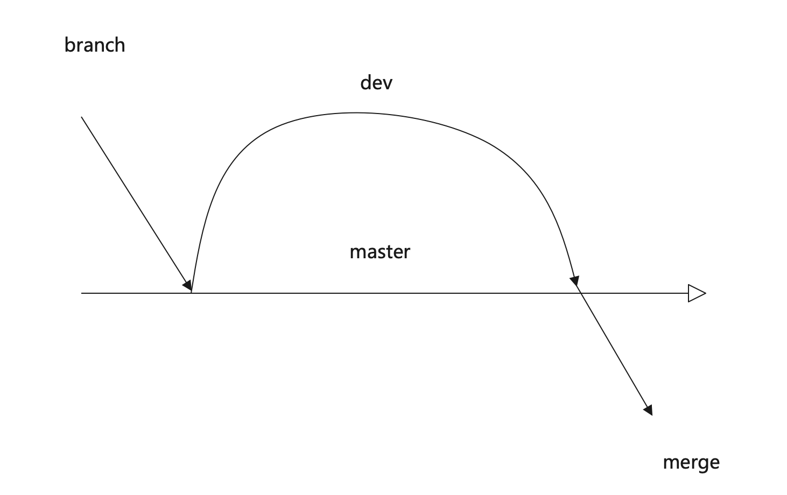
```
git checkout -b dev //创建一个叫 dev 的分支 并切换到 dev 分支
git checkout master //切换回主分支
git branch -d dev //删除新建的 dev 分支
```
OK,github 基础大概就这些，下面说一下如何向 Byzer 提交 PR。

## 2.项目
咱们拿 Byzer/Byzer-lang 举例
### 2.1 Issue
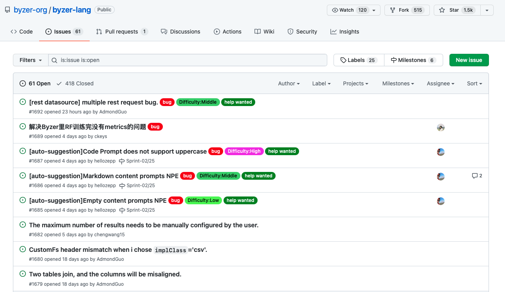
Issue 主要是这个板块，目的是大家对这个项目提供的一些优化建议，或者发现了一个 bug 等等。这也是提交 PR 的主要来源之一。
### 2.2 Pull Request
Pull Request 通常简称为 PR，是指用户针对某个问题、或者是更新一些东西所提交的修改申请。注意，一个 Pull Request 里可以包含多次 commit。

### 2.3 Fork
Fork 工作流是一种分布式工作流，可以接受不信任贡献者的提交。每个成员都可以 fork 项目到自己的目录, 甚至还可以继续衍生出更多项目, 
项目之间的通过 pull request 进行代码合并。 一个项目可以有多个上游项目, 也可以由于多个下游项目, 它们指向形成一种图关系。

当你准备为这个项目提交 PR 了，第一个步骤就是 Fork 。Fork 的图标是个叉的形状，一般在项目主界面的右上方。
通过点击 Fork，可以将一个 repository 复制一份到你的个人账号下的远程仓库中。
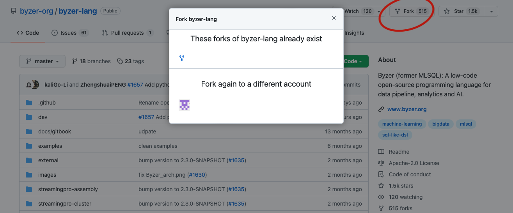
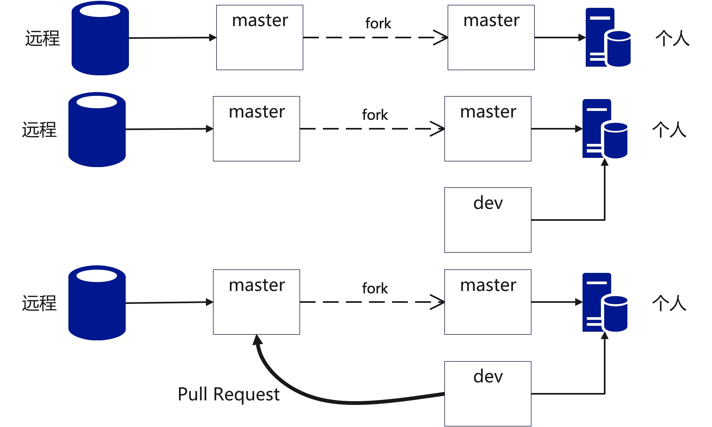
### 2.4 Clone
Fork 完，就可以到你个人的本地远程仓库中，把代码 clone 到本地进行修改了。

## 3.提交
ok，假设我们现在改好了一个 bug，现在要提交PR，改动的文件是 make-distribution.sh。
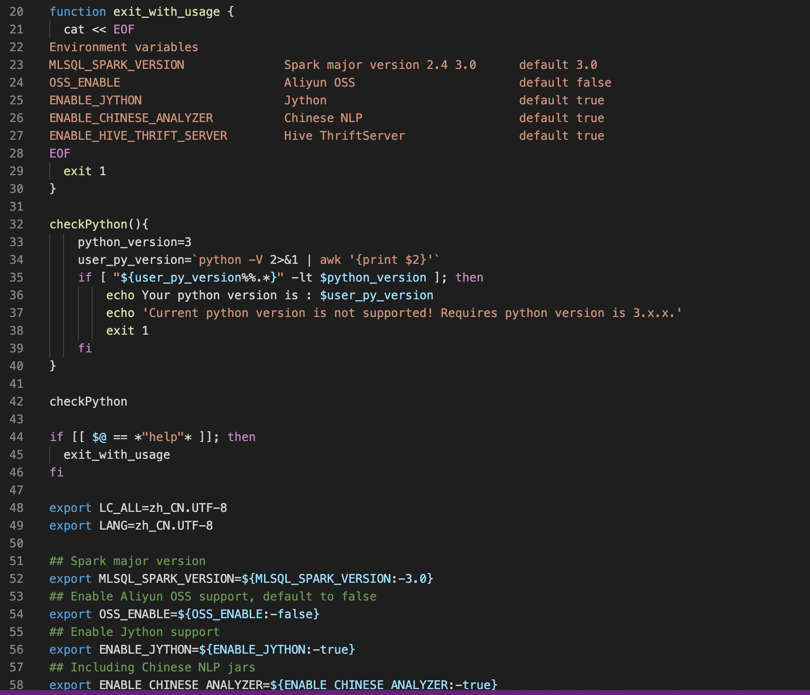
首先要把改动的代码添加到暂存区内。推荐改那个提交那个。
```
git add make-distribution.sh
```
然后 commit 到个人远端仓库，并田间改动信息，强烈建议强烈建议 commit 好好写，并且用英文，要有开源精神哦。
```
git commit -m"XXXX"
```
然后 push 到远程仓库
```
git push --set-upstream origin #1657
```
推荐改了那个 issue 就用那个 issue 的编号作为分支名称。
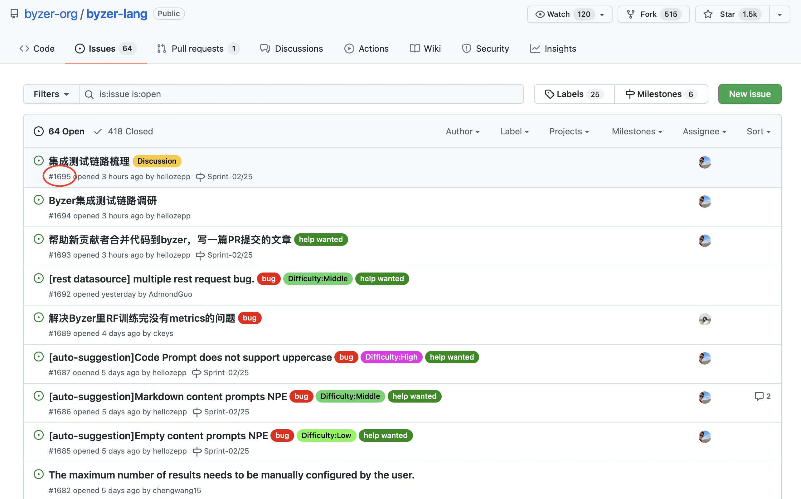
## 4.修改
提交了之后，社区成员会对你的修改提出修改意见，注意查看。
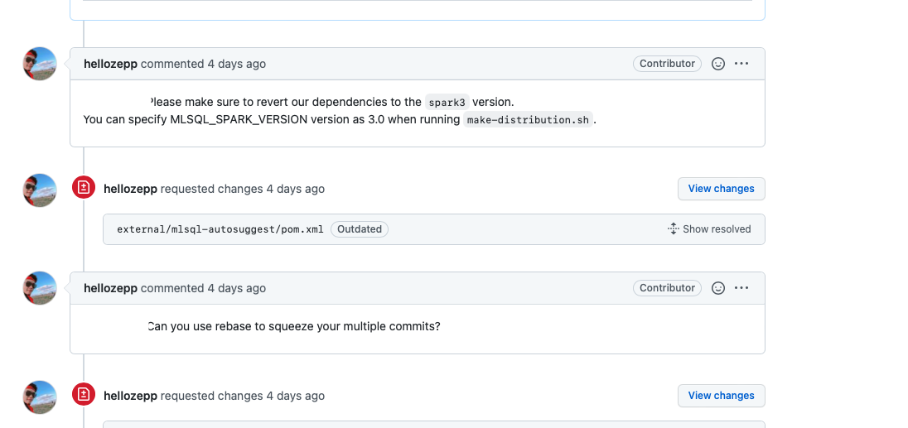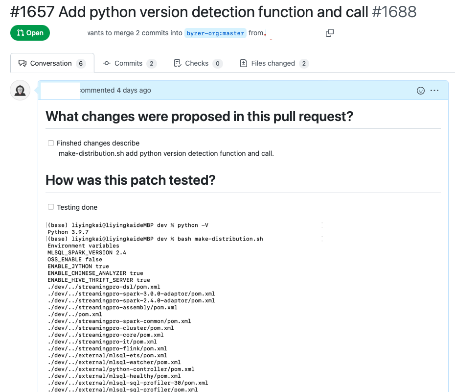
如果有问题，需要对代码再次 push，但是别忘了对 commit 进行 rebase。也许会感觉多次 commit 也无所谓，只不过多几次 commit
提交记录罢了，但是先不说 Git 提交规范，这会导致很严重的项目代码管理漏洞：
1. 不利于项目代码的 review
假设一下，如果你要做 code review 结果看到一堆 commit，是不是很崩溃？
2. 造成分支污染
如果因为某一次 commit，造成项目出现重大 BUG，需要紧急回滚，结果一堆 commit，那这对于你来说是不是一个很让人头疼的 surprise。

千里之堤，止于蚁穴，编程更是如此。
```
git log
```
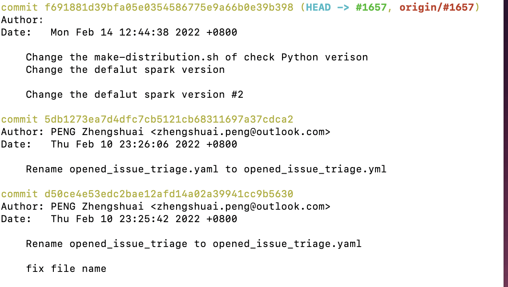
假设我们要合并两次 commit 记录。
```
git rebase -i HEAD~2    
```
这个命令输入之后会自动进入 vi 模式。
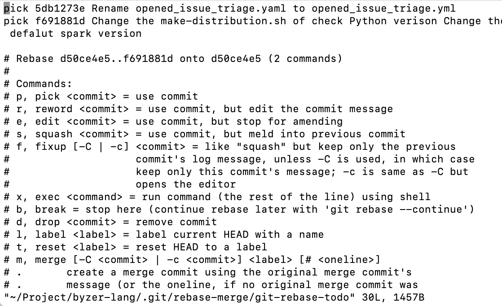
但是有几个命令需要注意以下。
```
p, pick = use commit //使用当前提交
r, reword = use commit, but edit the commit message//使用提交，但编辑提交信息
e, edit = use commit, but stop for amending//使用提交，但停止修改
s, squash = use commit, but meld into previous commit//使用提交，但融合到先前的提交中
f, fixup = like “squash”, but discard this commit’s log message//类似“squash”，但丢弃此提交的日志消息
x, exec = run command (the rest of the line) using shell
d, drop = remove commit //删除提交
```
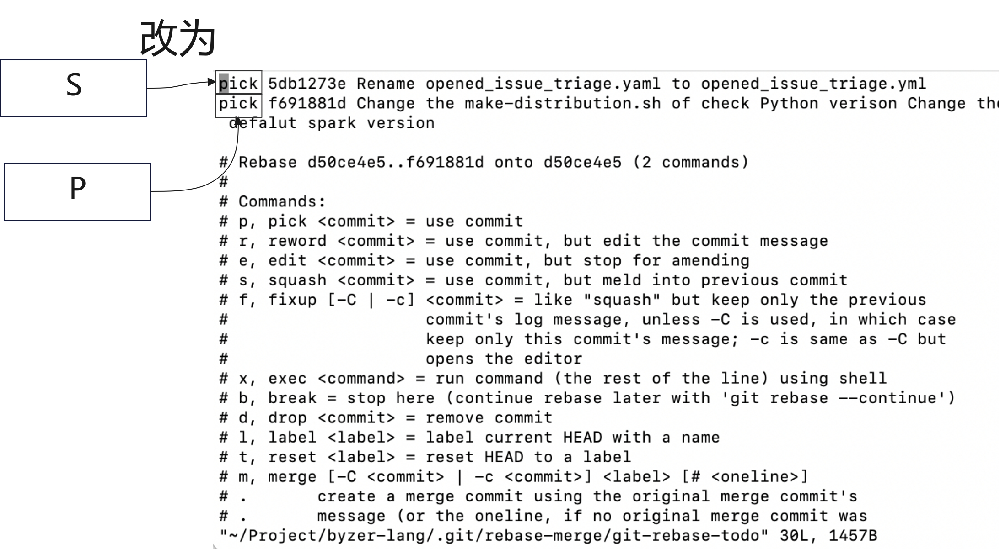
如果因为某些奇怪的原因，不小心退出了vi模式，但是还没有编辑完，或者出现这种界面不要慌。

```
git rebase --edit-todo
```
就可以重新编辑了。

