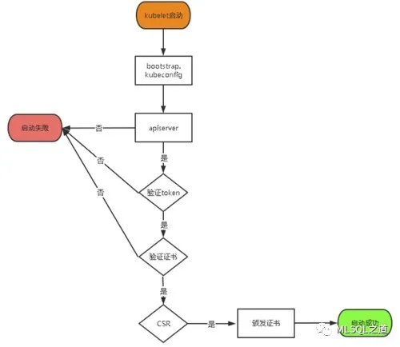

## Byzer on k8s（1） - k8s 安装

本系列教程的主要目标是，以生产的规格部署 k8s，并成功的把 Byzer 部署到 k8s。对于 k8s 的使用不会做过多的讲解，因为网上的资源已经很丰富了，所以着重讲解如何让 Spark 跑在 k8s 上，如何让 Byzer 跑在 k8s 上，一步一步细致讲解，按照步骤做 100% 保证完美运行，全网首发！
k8s 安装是参考：https://www.cnblogs.com/you-men/p/13192086.html。仔细照着做，可以正常运行
下面将按上述文章用二进制包的方式安装 k8s，这样做的目的是更好的理解 k8s，虽然有一点儿点儿复杂，如果有足够的耐心，你会很顺利的。
1. 准备 (一并打包)

```shell
	
	Redhat Linux Centos 7.5
	cni-plugins-linux-amd64-v0.8.6.tgz
	etcd-v3.4.9-linux-amd64.tar.gz
	kubernetes-server-linux-amd64.tar.gz
	kube-flannel.yml
	dashboard/recommended.yaml
	coredns.yaml
	ingress/mandatory.yaml
	cfssl-certinfo_linux-amd64  cfssljson_linux-amd64  cfssl_linux-amd64
	
	# 部署4台机器
	cat /etc/hosts
	
	172.16.2.62 t1-24-12 aston.mlsql.com aston.ui.com hello.mlsql.com hello.ui.com
	172.16.2.66 t1-24-16
	172.16.2.86 t1-25-36
	172.16.2.118 t1-27-68
	
```

2. 环境初始化（以 172.16.2.62 为 Master 节点，未说明的都指在 Master 节点操作）
 
 
```shell
	 cat > init_env.sh  << EOF
	
	# 初始化
	init_security() {
	systemctl stop firewalld
	systemctl disable firewalld &>/dev/null
	setenforce 0
	sed -i '/^SELINUX=/ s/enforcing/disabled/'  /etc/selinux/config
	sed -i '/^GSSAPIAu/ s/yes/no/' /etc/ssh/sshd_config
	sed -i '/^#UseDNS/ {s/^#//;s/yes/no/}' /etc/ssh/sshd_config
	systemctl enable sshd crond &> /dev/null
	rpm -e postfix --nodeps
	echo -e "\033[32m [安全配置] ==> OK \033[0m"
	}
	init_security
	
	init_yumsource() {
	if [ ! -d /etc/yum.repos.d/backup ];then
	    mkdir /etc/yum.repos.d/backup
	fi
	mv /etc/yum.repos.d/* /etc/yum.repos.d/backup 2>/dev/null
	if ! ping -c2 www.baidu.com &>/dev/null    
	then
	    echo "您无法上外网，不能配置yum源"
	    exit    
	fi
	    curl -o /etc/yum.repos.d/163.repo http://mirrors.163.com/.help/CentOS7-Base-163.repo &>/dev/null
	    curl -o /etc/yum.repos.d/epel.repo http://mirrors.aliyun.com/repo/epel-7.repo &>/dev/null
	    yum clean all
	    timedatectl set-timezone Asia/Shanghai
	    echo "nameserver 114.114.114.114" > /etc/resolv.conf
	    echo "nameserver 8.8.8.8" >> /etc/resolv.conf
	    chattr +i /etc/resolv.conf
	    yum -y install ntpdate
	    ntpdate -b  ntp1.aliyun.com        # 对时很重要
	    echo -e "\033[32m [YUM　Source] ==> OK \033[0m"
	}
	init_yumsource

	# 关掉swap分区
	swapoff -a
	# 如果想永久关掉swap分区，打开如下文件注释掉swap哪一行即可.
	# sed -i '/ swap / s/^\(.*\)$/#\1/g' /etc/fstab #永久
	EOF
	
	sh init_env.sh
	
	cat /etc/hosts
	172.16.2.62 t1-24-12 aston.mlsql.com aston.ui.com
	172.16.2.66 t1-24-16
	172.16.2.86 t1-25-36
	172.16.2.118 t1-27-68
	
	# 将桥接的IPv4流量传递到iptables的链
	cat > /etc/sysctl.d/k8s.conf << EOF
	net.bridge.bridge-nf-call-ip6tables = 1
	net.bridge.bridge-nf-call-iptables = 1
	EOF
	
	sysctl --system  # 生效
```
  
3. 部署 etcd

	Etcd 是一个分布式键值存储系统，Kubernetes 使用 Etcd 进行数据存储，所以先准备一个 Etcd 数据库，为解决 Etcd 单点故障，应采用集群方式部署，这里使用 3 台组建集群，可容忍 1 台机器故障。
	
	| 节点名称 | IP  |
	| --------- | ------------- |
	| etcd-1	 | 172.16.2.62	 | 
	| etcd-2	 | 172.16.2.66	 | 
	| etcd-3	 | 172.16.2.86	 | 
	
	准备 cfssl 证书生成工具，cfssl 是一个开源的证书管理工具，使用 json 文件生成证书，相比 openssl 更方便使用。找任意一台服务器操作，这里用 Master 节点。
	
```shell
	chmod +x cfssl_linux-amd64 cfssljson_linux-amd64 cfssl-certinfo_linux-amd64
	mv cfssl_linux-amd64 /usr/local/bin/cfssl
	mv cfssljson_linux-amd64 /usr/local/bin/cfssljson
	mv cfssl-certinfo_linux-amd64 /usr/bin/cfssl-certinfo
	
	# 生成etcd证书
	mkdir -p ~/TLS/{etcd,k8s}
	cd TLS/etcd
	
	# 自签CA
	cat > ca-config.json << EOF
	{
	  "signing": {
	    "default": {
	      "expiry": "87600h"
	    },
	    "profiles": {
	      "www": {
	         "expiry": "87600h",
	         "usages": [
	            "signing",
	            "key encipherment",
	            "server auth",
	            "client auth"
	        ]
	      }
	    }
	  }
	}
	EOF
	
	# 生成证书
	cfssl gencert -initca ca-csr.json | cfssljson -bare ca -
	
	ls *pem
	ca-key.pem  ca.pem
	
	# 使用自签CA签发etcd https证书
	# 创建证书申请文件
		
	cat > server-csr.json << EOF
	{
	    "CN": "etcd",
	    "hosts": [
	    "172.16.2.62",
	    "172.16.2.66",
	    "172.16.2.86",
	    "172.16.2.118"
	    ],
	    "key": {
	        "algo": "rsa",
	        "size": 2048
	    },
	    "names": [
	        {
	            "C": "CN",
	            "L": "BeiJing",
	            "ST": "BeiJing"
	        }
	    ]
	}
		
	# 注：上述文件 hosts 字段中IP为所有 etcd 节点的集群内部通信 IP，一个都不能少！为了方便后期扩容可以多写几个预留的IP。
	
	# 生成证书
	cfssl gencert -ca=ca.pem -ca-key=ca-key.pem -config=ca-config.json -profile=www server-csr.json | cfssljson -bare server
	
	ls server*pem
	server-key.pem  server.pem
	
```
安装 etcd

```shell
	mkdir /opt/etcd/{bin,cfg,ssl} -p
	tar zxvf etcd-v3.4.9-linux-amd64.tar.gz
	mv etcd-v3.4.9-linux-amd64/{etcd,etcdctl} /opt/etcd/bin/
	
	# 配置 etcd
	cat > /opt/etcd/cfg/etcd.conf << EOF 
	#[Member]
	ETCD_NAME="etcd-1"
	ETCD_DATA_DIR="/var/lib/etcd/default.etcd"
	ETCD_LISTEN_PEER_URLS="https://172.16.2.62:2380"
	ETCD_LISTEN_CLIENT_URLS="https://172.16.2.62:2379"
	#[Clustering]
	ETCD_INITIAL_ADVERTISE_PEER_URLS="https://172.16.2.62:2380"
	ETCD_ADVERTISE_CLIENT_URLS="https://172.16.2.62:2379"
	ETCD_INITIAL_CLUSTER="etcd-1=https://172.16.2.62:2380,etcd-2=https://172.16.2.66:2380,etcd-3=https://172.16.2.86:2380"
	ETCD_INITIAL_CLUSTER_TOKEN="etcd-cluster"
	ETCD_INITIAL_CLUSTER_STATE="new"
	
	# ETCD_NAME：节点名称，集群中唯一
	# ETCD_DATA_DIR：数据目录
	# ETCD_LISTEN_PEER_URLS：集群通信监听地址
	# ETCD_LISTEN_CLIENT_URLS：客户端访问监听地址
	# ETCD_INITIAL_ADVERTISE_PEER_URLS：集群通告地址
	# ETCD_ADVERTISE_CLIENT_URLS：客户端通告地址
	# ETCD_INITIAL_CLUSTER：集群节点地址
	# ETCD_INITIAL_CLUSTER_TOKEN：集群 Token
	# ETCD_INITIAL_CLUSTER_STATE：加入集群的当前状态，new 是新集群，existing 表示加入已有集群
	EOF
	
	# systemd 管理 etcd
	cat > /usr/lib/systemd/system/etcd.service << EOF
	[Unit]
	Description=Etcd Server
	After=network.target
	After=network-online.target
	Wants=network-online.target
	[Service]
	Type=notify
	EnvironmentFile=/opt/etcd/cfg/etcd.conf
	ExecStart=/opt/etcd/bin/etcd \
	--cert-file=/opt/etcd/ssl/server.pem \
	--key-file=/opt/etcd/ssl/server-key.pem \
	--peer-cert-file=/opt/etcd/ssl/server.pem \
	--peer-key-file=/opt/etcd/ssl/server-key.pem \
	--trusted-ca-file=/opt/etcd/ssl/ca.pem \
	--peer-trusted-ca-file=/opt/etcd/ssl/ca.pem \
	--logger=zap
	Restart=on-failure
	LimitNOFILE=65536
	[Install]
	WantedBy=multi-user.target
	EOF
	
	# 拷贝证书和生成文件到另外两个节点
	cp ~/TLS/etcd/ca*pem ~/TLS/etcd/server*pem /opt/etcd/ssl/
	scp -r /opt/etcd/ root@172.16.2.66:/opt/
	scp -r /opt/etcd/ root@172.16.2.86:/opt/
	scp /usr/lib/systemd/system/etcd.service root@172.16.2.66:/usr/lib/systemd/system/
	scp /usr/lib/systemd/system/etcd.service root@172.16.2.86:/usr/lib/systemd/system/
	
	修改这两个节点的 etcd.conf 文件
	
	# 172.16.2.66
	vi /opt/etcd/cfg/etcd.conf 
	#[Member]
	ETCD_NAME="etcd-2"
	ETCD_DATA_DIR="/var/lib/etcd/default.etcd"
	ETCD_LISTEN_PEER_URLS="https://172.16.2.66:2380"
	ETCD_LISTEN_CLIENT_URLS="https://172.16.2.66:2379"
	#[Clustering]
	ETCD_INITIAL_ADVERTISE_PEER_URLS="https://172.16.2.66:2380"
	ETCD_ADVERTISE_CLIENT_URLS="https://172.16.2.66:2379"
	ETCD_INITIAL_CLUSTER="etcd-1=https://172.16.2.62:2380,etcd-2=https://172.16.2.66:2380,etcd-3=https://172.16.2.86:2380"
	ETCD_INITIAL_CLUSTER_TOKEN="etcd-cluster"
	ETCD_INITIAL_CLUSTER_STATE="new"
	
	# 172.16.2.86
	vi /opt/etcd/cfg/etcd.conf 
	#[Member]
	ETCD_NAME="etcd-3"
	ETCD_DATA_DIR="/var/lib/etcd/default.etcd"
	ETCD_LISTEN_PEER_URLS="https://172.16.2.86:2380"
	ETCD_LISTEN_CLIENT_URLS="https://172.16.2.86:2379"
	#[Clustering]
	ETCD_INITIAL_ADVERTISE_PEER_URLS="https://172.16.2.86:2380"
	ETCD_ADVERTISE_CLIENT_URLS="https://172.16.2.86:2379"
	ETCD_INITIAL_CLUSTER="etcd-1=https://172.16.2.62:2380,etcd-2=https://172.16.2.66:2380,etcd-3=https://172.16.2.86:2380"
	ETCD_INITIAL_CLUSTER_TOKEN="etcd-cluster"
	ETCD_INITIAL_CLUSTER_STATE="new"
	
	# 启动服务并设置开机自启
	systemctl daemon-reload
	systemctl start etcd
	systemctl enable etcd
	
	# 验证 etcd 集群状态
	/opt/etcd/bin/etcdctl --cacert=/opt/etcd/ssl/ca.pem --cert=/opt/etcd/ssl/server.pem --key=/opt/etcd/ssl/server-key.pem --endpoints="https://172.16.2.62:2379,https://172.16.2.66:2379,https://172.16.2.86:2379" endpoint health
	
	https://172.16.2.66:2379 is healthy: successfully committed proposal: took = 13.159295ms
	https://172.16.2.86:2379 is healthy: successfully committed proposal: took = 13.705304ms
	https://172.16.2.62:2379 is healthy: successfully committed proposal: took = 17.333746ms
	
	# 如果输出上面信息，就说明集群部署成功。如果有问题第一步先看日志：/var/log/message 或 journalctl -u etcd
	
```
4. 安装 docker

```shell
	# 下载安装 docker（4 台机器）
	sudo yum-config-manager --add-repo http://mirrors.aliyun.com/docker-ce/linux/centos/docker-ce.repo
	yum -y install docker-ce-19.03.9-3.el7
	
	# 配置 docker 镜像源
	mkdir /etc/docker
	cat > /etc/docker/daemon.json << EOF
	{
	  "registry-mirrors": ["https://b9pmyelo.mirror.aliyuncs.com"]
	}
	EOF
	
	# 启动并设置开机自启动
	systemctl daemon-reload
	systemctl start docker
	systemctl enable docker
	
```
	
5. 生成 kube-apiserver 证书


```shell
	# 自签证书颁发机构(CA)
	cd /root/TLS/k8s/
	cat > ca-config.json << EOF
	{
	  "signing": {
	    "default": {
	      "expiry": "87600h"
	    },
	    "profiles": {
	      "kubernetes": {
	         "expiry": "87600h",
	         "usages": [
	            "signing",
	            "key encipherment",
	            "server auth",
	            "client auth"
	        ]
	      }
	    }
	  }
	}
	EOF
	cat > ca-csr.json << EOF
	{
	    "CN": "kubernetes",
	    "key": {
	        "algo": "rsa",
	        "size": 2048
	    },
	    "names": [
	        {
	            "C": "CN",
	            "L": "Beijing",
	            "ST": "Beijing",
	            "O": "k8s",
	            "OU": "System"
	        }
	    ]
	}
	EOF
	
	# 生成证书
	cfssl gencert -initca ca-csr.json | cfssljson -bare ca -

	ls *pem
	ca-key.pem  ca.pem
	
	
	# 使用自签 CA 签发 kube-apiserver https 证书
	cat > /root/TLS/k8s/server-csr.json  << EOF 
	{
	    "CN": "kubernetes",
	    "hosts": [
	      "10.0.0.1",
	      "127.0.0.1",
	      "172.16.2.62",
	      "172.16.2.66",
	      "172.16.2.86",
	      "172.16.2.118",
	      "kubernetes",
	      "kubernetes.default",
	      "kubernetes.default.svc",
	      "kubernetes.default.svc.cluster",
	      "kubernetes.default.svc.cluster.local"
	    ],
	    "key": {
	        "algo": "rsa",
	        "size": 2048
	    },
	  "names": [
        {
            "C": "CN",
            "L": "BeiJing",
            "ST": "BeiJing",
	            "O": "k8s",
	            "OU": "System"
	        }
	    ]
	}
	EOF
	# 生成证书
	cfssl gencert -ca=ca.pem -ca-key=ca-key.pem -config=ca-config.json -profile=kubernetes server-csr.json | cfssljson -bare server
	
	ls server*pem
	server-key.pem  server.pem	
	
```
6. 安装 kube-apiserver

```shell
	mkdir -p /opt/kubernetes/{bin,cfg,ssl,logs} 
	tar zxvf kubernetes-server-linux-amd64.tar.gz
	cd kubernetes/server/bin
	cp kube-apiserver kube-scheduler kube-controller-manager /opt/kubernetes/bin
	cp kubectl /usr/bin/
	
	# 部署 kube-apiserver
	cat > /opt/kubernetes/cfg/kube-apiserver.conf << EOF 
	
	KUBE_APISERVER_OPTS="--logtostderr=false \
	--v=2 \
	--log-dir=/opt/kubernetes/logs \
	--etcd-servers=https://172.16.2.62:2379,https://172.16.2.66:2379,https://172.16.2.86:2379 \
	--bind-address=172.16.2.62 \
	--secure-port=6443 \
	--advertise-address=172.16.2.62 \
	--allow-privileged=true \
	--service-cluster-ip-range=10.0.0.0/24 \
	--enable-admission-plugins=NamespaceLifecycle,LimitRanger,ServiceAccount,ResourceQuota,NodeRestriction \
	--authorization-mode=RBAC,Node \
	--enable-bootstrap-token-auth=true \
	--token-auth-file=/opt/kubernetes/cfg/token.csv \
	--service-node-port-range=30000-32767 \
	--kubelet-client-certificate=/opt/kubernetes/ssl/server.pem \
	--kubelet-client-key=/opt/kubernetes/ssl/server-key.pem \
	--tls-cert-file=/opt/kubernetes/ssl/server.pem  \
	--tls-private-key-file=/opt/kubernetes/ssl/server-key.pem \
	--client-ca-file=/opt/kubernetes/ssl/ca.pem \
	--service-account-key-file=/opt/kubernetes/ssl/ca-key.pem \
	--etcd-cafile=/opt/etcd/ssl/ca.pem \
	--etcd-certfile=/opt/etcd/ssl/server.pem \
	--etcd-keyfile=/opt/etcd/ssl/server-key.pem \
	--audit-log-maxage=30 \
	--audit-log-maxbackup=3 \
	--audit-log-maxsize=100 \
	--audit-log-path=/opt/kubernetes/logs/k8s-audit.log"
	
	# –logtostderr：启用日志
	# —v：日志等级
	# –log-dir：日志目录
	# –etcd-servers：etcd集群地址
	# –bind-address：监听地址
	# –secure-port：https安全端口
	# –advertise-address：集群通告地址
	# –allow-privileged：启用授权
	# –service-cluster-ip-range：Service 虚拟IP地址段
	# –enable-admission-plugins：准入控制模块
	# –authorization-mode：认证授权，启用 RBAC 授权和节点自管理
	# –enable-bootstrap-token-auth：启用 TLS bootstrap 机制
	# –token-auth-file：bootstrap token 文件
	# –service-node-port-range：Service nodeport 类型默认分配端口范围
	# –kubelet-client-xxx：apiserver 访问 kubelet 客户端证书
	# –tls-xxx-file：apiserver https 证书
	# –etcd-xxxfile：连接 Etcd 集群证书
	# –audit-log-xxx：审计日志
	EOF
	
	# 拷贝生成证书
	cp ~/TLS/k8s/ca*pem ~/TLS/k8s/server*pem /opt/kubernetes/ssl/
	
```
	
	启用 TLS Bootstrapping 机制：
	TLS Bootstraping：Master apiserver 启用 TLS 认证后，Node 节点 kubelet 和 kube-proxy 要与 kube-apiserver 进行通信，必须使用 CA 签发的有效证书才可以，当 Node 节点很多时，这种客户端证书颁发需要大量工作，同样也会增加集群扩展复杂度。为了简化流程，Kubernetes 引入了 TLS bootstraping 机制来自动颁发客户端证书，kubelet 会以一个低权限用户自动向 apiserver 申请证书，kubelet 的证书由 apiserver 动态签署。所以强烈建议在 Node上使用这种方式，目前主要用于 kubelet，kube-proxy 还是由我们统一颁发一个证书。
	
	TLS bootstraping 工作流程:




