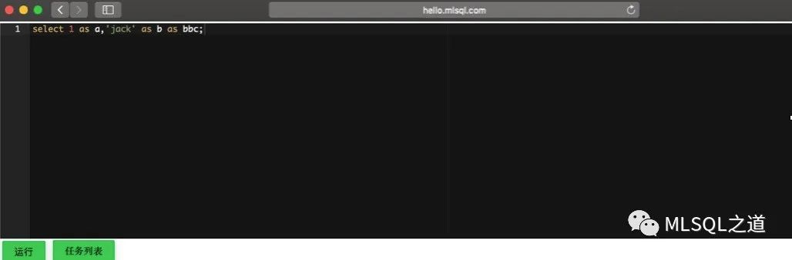

## Kolo on k8s（3） - Kolo on k8s

有了前两篇的铺垫，主角 Kolo 终于上场了，在部署 Kolo on k8s，参考了这三篇文章（和作者的帮助）：

1. http://docs.mlsql.tech/mlsql-stack/qa/mlsql-docker-image.html
2. http://docs.mlsql.tech/mlsql-engine/howtouse/k8s_deploy.html
3. http://blog.mlsql.tech/blog/liveness_readiness.html


在正式部署 Kolo 之前，笔者先构建一个测试的框架，目的有三：

* 可以指定在某台机器部署
* 快速更新 Kolo 配置
* 快速测试

建立标签，以保证 deployment 到指定机器：

```shell

kubectl label nodes t1-24-12 mlsql/role=test
 
kubectl get nodes t1-24-12 --show-labels
```
测试的 deployment 脚本：

```yaml

cat > test.yaml << EOF
apiVersion: apps/v1
kind: Deployment
metadata:
  name: spark-hello
  namespace: default
spec:
  selector:
    matchLabels:
      app: spark-hello
  strategy:
    rollingUpdate:
      maxUnavailable: 0
    type: RollingUpdate
  template:
    metadata:
      labels:
        app: spark-hello
    spec:
      serviceAccountName: spark
      nodeSelector:
        mlsql/role: test
      containers:
      - name: spark-hello     
        args: [ "while true; do sleep 10000; done;" ]
        command:
          - /bin/sh
          - '-c'
        image: '172.16.2.66:5000/spark:v3.0-n'
        imagePullPolicy: Always
        securityContext:
          runAsUser: 0
        volumeMounts:
          - name: mlsql
            mountPath: /opt/mlsql
      volumes:
        - name: mlsql
          hostPath:
            path: /root/k8s/mlsql/test-mount
EOF
# 指定在 test lable 的机器运行，这里指 172.16.2.62
# 本地的 /root/k8s/mlsql/test-mount 挂载到容器的 /opt/mlsql，方便修改 Kolo 配置
# args: [ "while true; do sleep 10000; done;" ]的作用是保证容器一直运行
```
对于 Kolo，需要对外暴露 9003 端口，才可以在外部浏览器访问，而 Spark UI 需要对外暴露 4040 端口。下面通过 ingress/service 来暴露端口供外部访问：

```yaml
cat > ingress.yaml << EOF 
apiVersion: extensions/v1beta1
kind: Ingress
metadata:
  name: spark-hello-ingress
  namespace: default
spec:
  rules:
    - host: hello.mlsql.com
      http:
        paths:
        - path: /
          backend:
            serviceName: spark-hello
            servicePort: 9003
    - host: hello.ui.com
      http:
        paths:
        - path: /
          backend:
            serviceName: spark-hello
            servicePort: 4040
EOF
 
 
cat > service.yaml << EOF
apiVersion: v1
kind: Service
metadata:
  annotations: {}
  name: spark-hello
  namespace: default
spec:
  ports:
    - name: mlsql-hello
      port: 9003
      targetPort: 9003
    - name: spark-hello
      port: 4040
      targetPort: 4040
  selector:
    app: spark-hello
EOF
 
 
kubectl apply -f ingress.yaml
kubectl apply -f service.yaml
 
 
# 在 /etc/hosts 中增加两个域名的映射
172.16.2.62 t1-24-12 hello.mlsql.com hello.ui.com
```

然后把 Kolo 的启动包放到 `/root/k8s/mlsql/test-mount` 目录下，接着编写 Kolo 启动脚本：

```shell
cat > mlsql-start.sh << EOF 
ip=$(cat /etc/hosts | tail -n 1 | awk '{print $1}')
echo $ip
 
 
/opt/spark/bin/spark-submit --master k8s://https://172.16.2.62:6443 \
            --deploy-mode client     \
            --class streaming.core.StreamingApp  \
            --conf spark.kubernetes.container.image=172.16.2.66:5000/spark:v3.0 \
            --conf spark.kubernetes.container.image.pullPolicy=Always  \
            --conf spark.kubernetes.namespace=default                            \
            --conf spark.kubernetes.executor.request.cores=1  \
            --conf spark.kubernetes.executor.limit.cores=1                   \
            --conf spark.dynamicAllocation.enabled=true  \
            --conf spark.dynamicAllocation.shuffleTracking.enabled=true \
            --conf spark.dynamicAllocation.minExecutors=1 \
            --conf spark.dynamicAllocation.maxExecutors=4 \
            --conf spark.dynamicAllocation.executorIdleTimeout=60 \
            --conf spark.jars.ivy=/tmp/.ivy \
            --conf spark.driver.host=$ip \
            --conf spark.sql.cbo.enabled=true  \
            --conf spark.sql.adaptive.enabled=true  \
            --conf spark.sql.cbo.joinReorder.enabled=true  \
            --conf spark.sql.cbo.planStats.enabled=true  \
            --conf spark.sql.cbo.starSchemaDetection=true  \
            --conf spark.driver.maxResultSize=2g  \
            --conf spark.serializer=org.apache.spark.serializer.KryoSerializer  \
            --conf spark.kryoserializer.buffer.max=200m \
            --conf spark.executor.extraJavaOptions="-XX:+UnlockExperimentalVMOptions -XX:+UseZGC -XX:+UseContainerSupport  -Dio.netty.tryReflectionSetAccessible=true" \
            --conf spark.driver.extraJavaOptions="-XX:+UnlockExperimentalVMOptions -XX:+UseZGC -XX:+UseContainerSupport  -Dio.netty.tryReflectionSetAccessible=true -DREALTIME_LOG_HOME=/tmp/__mlsql__/logs" \
            /opt/mlsql/streamingpro-mlsql-spark_3.0_2.12-2.1.0-SNAPSHOT.jar \
            -streaming.name mlsql \
            -streaming.rest true  \
            -streaming.thrift false  \
            -streaming.platform spark  \
            -streaming.enableHiveSupport true  \
            -streaming.spark.service true  \
            -streaming.job.cancel true              \
            -streaming.driver.port 9003
EOF
```
最后就可以启动测试框架了：

```shell

ls /root/k8s/mlsql/test-mount
ingress.yaml  MLSQLDockerfile  mlsql-start.sh  service.yaml  streamingpro-mlsql-spark_3.0_2.12-2.1.0-SNAPSHOT.jar  test.yaml
 
 
kubectl create -f test.yaml
 
 
# 稍等几秒，查看容器的 id
docker ps | grep spark-hello
e4afb60409ab   172.16.2.66:5000/spark                                           "/bin/sh -c 'while t…"   10 days ago   Up 10 days             k8s_spark-hello_spark-hello-598ffbb77d-286vs_default_3fa81533-4816-44f6-9462-3cf775843033_0
 
 
#进入容器
docker exec -it e4afb60409ab /bin/sh
cd /opt/mlsql/
nohup sh mlsql-start.sh &
 
 
# 在用浏览器访问的机器增加域名映射
# 在 /etc/hosts 中增加两个域名的映射
172.16.2.62 t1-24-12 hello.mlsql.com hello.ui.com
```
然后就可以在浏览器中用域名访问了：`http://hello.mlsql.com`（自己去尝试下：http://hello.ui.com/）



通过这种方式启动 Kolo 只适用于测试，方便调试 Kolo，比如增加依赖的 jar，修改启动配置参数等等，可以在宿主机进行修改，然后到容器中启动 Kolo，很方便。

目前 Kolo 是跑通了，但是还不完全支持 python，如果要支持 python，需要重新构建 Spark 环境镜像，增加 conda 和ray 等。

进入 Spark 包，在 `kubernetes/dockerfiles/spark/` 目录下建如下文件（jdk14）：

```shell

cat > DockerfileMLSQL << EOF 
ARG java_image_tag=14.0-jdk-slim
 
 
FROM openjdk:${java_image_tag}
 
 
ARG spark_uid=185
 
 
RUN set -ex && \
    apt-get update && \
    ln -s /lib /lib64 && \
    apt install -y bash tini libc6 libpam-modules krb5-user libnss3 && \
    mkdir -p /opt/spark && \
    mkdir -p /opt/spark/examples && \
    mkdir -p /opt/spark/work-dir && \
    touch /opt/spark/RELEASE && \
    rm /bin/sh && \
    ln -sv /bin/bash /bin/sh && \
    echo "auth required pam_wheel.so use_uid" >> /etc/pam.d/su && \
    chgrp root /etc/passwd && chmod ug+rw /etc/passwd && \
    rm -rf /var/cache/apt/*
 
 
RUN apt-get update \
    && apt-get install -y \
        git \
        wget \
        cmake \
        build-essential \
        curl \
        unzip \
        libgtk2.0-dev \
        zlib1g-dev \
        libgl1-mesa-dev \
        procps \
    && apt-get clean \
    && echo 'export PATH=/opt/conda/bin:$PATH' > /etc/profile.d/conda.sh \
    && wget \
        --quiet "https://repo.anaconda.com/miniconda/Miniconda3-4.7.12.1-Linux-x86_64.sh" \
        -O /tmp/anaconda.sh \
    && /bin/bash /tmp/anaconda.sh -b -p /opt/conda \
    && rm /tmp/anaconda.sh \
    && /opt/conda/bin/conda install -y \
        libgcc python=3.6.9 \
    && /opt/conda/bin/conda clean -y --all \
    && /opt/conda/bin/pip install \
        flatbuffers \
        cython==0.29.0 \
        numpy==1.15.4
 
 
RUN /opt/conda/bin/conda create --name dev python=3.6.9 -y \
    && source /opt/conda/bin/activate  dev \
    && pip install pyarrow==0.10.0 \
    && pip install ray==0.8.0 \
    && pip install aiohttp psutil setproctitle grpcio pandas xlsxwriter watchdog requests click uuid sfcli  pyjava
 
 
COPY jars /opt/spark/jars
COPY bin /opt/spark/bin
COPY sbin /opt/spark/sbin
COPY kubernetes/dockerfiles/spark/entrypoint.sh /opt/
COPY examples /opt/spark/examples
COPY kubernetes/tests /opt/spark/tests
COPY data /opt/spark/data
 
 
ENV SPARK_HOME /opt/spark
 
 
WORKDIR /opt/spark/work-dir
RUN chmod g+w /opt/spark/work-dir
 
 
ENTRYPOINT [ "/opt/entrypoint.sh" ]
 
 
USER ${spark_uid}
EOF
 
 
# 在 spark 目录下执行
docker build -t 172.16.2.66:5000/spark:3.0-j14-mlsql -f kubernetes/dockerfiles/spark/DockerfileMLSQL .
docker push 172.16.2.66:5000/spark:3.0-j14-mlsql
 
 
# 基于 spark 镜像构建 Kolo 镜像
 

cat > MLSQLDockerfile << EOF 
FROM 172.16.2.66:5000/spark:3.0-j14-mlsql
USER root
RUN useradd -ms /bin/sh  hdfs
COPY streamingpro-mlsql-spark_3.0_2.12-2.1.0-SNAPSHOT.jar /opt/spark/work-dir/
WORKDIR /opt/spark/work-dir
ENTRYPOINT [ "/opt/entrypoint.sh" ]
EOF
 
 
docker build -t 172.16.2.66:5000/mlsql:3.0-j14-mlsql -f MLSQLDockerfile .
docker push 172.16.2.66:5000/mlsql:3.0-j14-mlsql
```
在生产使用 Kolo 时，该如何部署呢，下面来看一个模板：

```shell
cat > mlsql-deployment-d.yaml << EOF 
apiVersion: apps/v1
kind: Deployment
metadata:
  name: spark-mlsql-2-0-1-3-0-0
  namespace: default
spec:
  selector:
    matchLabels:
      app: spark-mlsql-2-0-1-3-0-0
  strategy:
    rollingUpdate:
      maxUnavailable: 0
    type: RollingUpdate
  template:
    metadata:
      labels:
        app: spark-mlsql-2-0-1-3-0-0
    spec:
      serviceAccountName: spark
      containers:
      - name: spark-mlsql-2-0-1-3-0-0        
        args:
          - >-
            echo "/opt/spark/bin/spark-submit --master k8s://https://172.16.2.62:6443
            --deploy-mode client    
            --class streaming.core.StreamingApp 
            --conf spark.kubernetes.container.image=172.16.2.66:5000/mlsql:3.0-j14-mlsql
            --conf spark.kubernetes.container.image.pullPolicy=Always 
            --conf spark.kubernetes.namespace=default                           
            --conf spark.kubernetes.executor.request.cores=1 
            --conf spark.kubernetes.executor.limit.cores=1                  
            --conf spark.dynamicAllocation.enabled=true 
            --conf spark.dynamicAllocation.shuffleTracking.enabled=true
            --conf spark.dynamicAllocation.minExecutors=1
            --conf spark.dynamicAllocation.maxExecutors=4
            --conf spark.dynamicAllocation.executorIdleTimeout=60
            --conf spark.jars.ivy=/tmp/.ivy
            --conf spark.driver.host=$POD_IP 
            --conf spark.sql.cbo.enabled=true 
            --conf spark.sql.adaptive.enabled=true 
            --conf spark.sql.cbo.joinReorder.enabled=true 
            --conf spark.sql.cbo.planStats.enabled=true 
            --conf spark.sql.cbo.starSchemaDetection=true 
            --conf spark.driver.maxResultSize=2g 
            --conf spark.serializer=org.apache.spark.serializer.KryoSerializer 
            --conf spark.kryoserializer.buffer.max=200m
            --conf "\"spark.executor.extraJavaOptions=-XX:+UnlockExperimentalVMOptions -XX:+UseZGC -XX:+UseContainerSupport  -Dio.netty.tryReflectionSetAccessible=true\""  
            --conf "\"spark.driver.extraJavaOptions=-XX:+UnlockExperimentalVMOptions -XX:+UseZGC -XX:+UseContainerSupport  -Dio.netty.tryReflectionSetAccessible=true -DREALTIME_LOG_HOME=/tmp/__mlsql__/logs\"" 
            local:///opt/spark/work-dir/streamingpro-mlsql-spark_3.0_2.12-2.1.0-SNAPSHOT.jar
            -streaming.name mlsql
            -streaming.rest true 
            -streaming.thrift false 
            -streaming.platform spark 
            -streaming.enableHiveSupport true 
            -streaming.spark.service true 
            -streaming.job.cancel true             
            -streaming.driver.port 9003" | su hdfs | chown -R hdfs /opt/spark/work-dir | bash
        command:
          - /bin/sh
          - '-c'
        env:
          - name: POD_IP
            valueFrom:
              fieldRef:
                fieldPath: status.podIP          
        image: '172.16.2.66:5000/mlsql:3.0-j14-mlsql'
        imagePullPolicy: Always
        lifecycle:
          preStop:
            exec:
              command:
                - bash
                - '-c'
                - |
                  kill $(jps | grep SparkSubmit | awk '{print $1}')
        volumeMounts:
          - name: spark-conf
            mountPath: /opt/spark/conf
        securityContext:
          runAsUser: 0
      volumes:
        - name: spark-conf
          hostPath:
            path: /root/k8s/mlsql/sparkconf
  EOF
```
宿主机 `/root/k8s/mlsql/sparkconf` 目录下，配置 log4j：

```shell
cat > log4j.properties << EOF
#
# Licensed to the Apache Software Foundation (ASF) under one or more
# contributor license agreements.  See the NOTICE file distributed with
# this work for additional information regarding copyright ownership.
# The ASF licenses this file to You under the Apache License, Version 2.0
# (the "License"); you may not use this file except in compliance with
# the License.  You may obtain a copy of the License at
#
#    http://www.apache.org/licenses/LICENSE-2.0
#
# Unless required by applicable law or agreed to in writing, software
# distributed under the License is distributed on an "AS IS" BASIS,
# WITHOUT WARRANTIES OR CONDITIONS OF ANY KIND, either express or implied.
# See the License for the specific language governing permissions and
# limitations under the License.
#
# Set everything to be logged to the console
log4j.rootCategory=INFO, console,file
log4j.appender.console=org.apache.log4j.ConsoleAppender
log4j.appender.console.target=System.err
log4j.appender.console.layout=org.apache.log4j.PatternLayout
log4j.appender.console.layout.ConversionPattern=%d{yy/MM/dd HH:mm:ss} %X{owner} %p %c{1}: %m%n
 
 
log4j.appender.file=org.apache.log4j.RollingFileAppender
log4j.appender.file.File=${REALTIME_LOG_HOME}/mlsql_engine.log
log4j.appender.file.rollingPolicy=org.apache.log4j.TimeBasedRollingPolicy
log4j.appender.file.rollingPolicy.fileNamePattern=${REALTIME_LOG_HOME}/mlsql_engine.%d.gz
log4j.appender.file.layout=org.apache.log4j.PatternLayout
log4j.appender.file.layout.ConversionPattern=%d{yy/MM/dd HH:mm:ss} %X{owner} %p %c{1}: %m%n
log4j.appender.file.MaxBackupIndex=5
# Set the default spark-shell log level to WARN. When running the spark-shell, the
# log level for this class is used to overwrite the root logger's log level, so that
# the user can have different defaults for the shell and regular Spark apps.
log4j.logger.org.apache.spark.repl.Main=WARN
#log4j.logger.org.apache.spark=WARN
# Settings to quiet third party logs that are too verbose
log4j.logger.org.spark_project.jetty=WARN
log4j.logger.org.spark_project.jetty.util.component.AbstractLifeCycle=ERROR
log4j.logger.org.apache.spark.repl.SparkIMain$exprTyper=INFO
log4j.logger.org.apache.spark.repl.SparkILoop$SparkILoopInterpreter=INFO
log4j.logger.org.apache.parquet=ERROR
log4j.logger.parquet=ERROR
# SPARK-9183: Settings to avoid annoying messages when looking up nonexistent UDFs in SparkSQL with Hive support
log4j.logger.org.apache.hadoop.hive.metastore.RetryingHMSHandler=FATAL
log4j.logger.org.apache.hadoop.hive.ql.exec.FunctionRegistry=ERROR
EOF
```

```shell
lifecycle:
          preStop:
            exec:
              command:
                - bash
                - '-c'
                - |
                  kill $(jps | grep SparkSubmit | awk '{print $1}')
 
 
# 这几行代码很重要，如果没有的话，当 delete deployment 的时候，executor 的 pod 还会一直存活，目的是先关闭SparkContext然后在关闭容器。
```
真正生产部署的时候还有很多事情要做，比如 Kolo 日志采集，Spark 历史服务器，Kolo 访问 Hive 配置，Spark 配置等等，只要想做好，也不是什么大不了的事儿，加油
