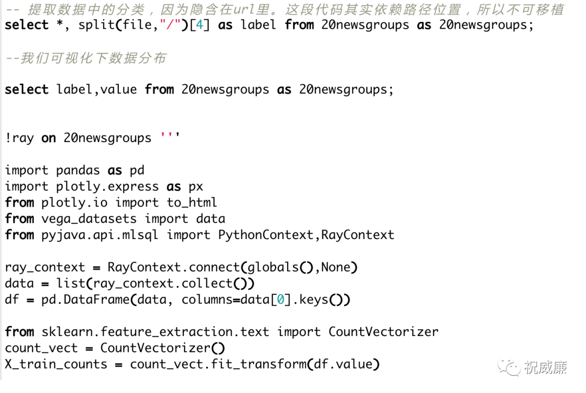

## SQL 思维 VS 编程思维（重制版）

之前看了一篇文章，里面有段话讲的比较务实：

> 开发效率，从平台发展的各阶段实践中，我们发现，对于一个统计任务/算法任务/风控任务，如果采用传统的编程思维方式去实现，那么只能通过堆开发人员，去做大量的开发、迭代和维护工作，一个任务可能会花一天甚至几天的时间才能完成，对于一天几十甚至几百个任务需求来说，一个 SQL 仅仅只需要几分钟的开发时间（以我厂为例，每日 2.5 万+个例行任务和临时任务）。我们做到了全平台 SQL 化，用 SQL 思维取代编程思维，降低平台使用门槛，大大解放上层业务开发团队。

>林庆敏，公众号：趣店技术团队[趣店大数据平台架构](https://mp.weixin.qq.com/s/OCEUS1v0844nVL4V01lPIA)

你可能会好奇，什么是传统编程思维，什么是 SQL 思维？他们的区别在哪？
要想了解他们的差异和区别，不妨来做到测试题：
>现在有十万个主键 ID,对应某个记录表的主键。现在是写代码要求把十万个 ID 对应的记录拿到。

下面给出两个方式。

* 第一个是，用 SQL 里的 In 查询，但是因为受限于 SQL 自身的长度，我们不可能把十万个 ID 都放到一条 SQL 里，所以我们将 ID 集合切分，然后并发去访问得到结果。

	`select * from table1 where id in (....ids...)`

* 第二个方式是，将 ID 保存成一个表 A，然后将 A 和记录表进行 Join 关联。

如果是第一种做法，那么这就是我说的"编程思维"，而第二种则是“ SQL 思维”。

我之前将"编程思维"，"SQL 思维"发了个朋友圈，问大家他们之间有啥区别，答案五花八门。不过就我的认知而言，如果从表面看，其实区别很明显：

1. SQL 思维其实就是 Join 思维。如果面对数据，你的第一反应是 join, pivot, 那么你就是典型的 SQL 思维。

2. 编程思维其实就是 for/if/else 思维。如果你面对数据，第一反应是 for/if/else, 那么就是典型的编程思维。

如果深入点分析，SQL 本质上是面向集合中特定的类型，表，将一切操作都转化为表操作，而且这种操作是通过申明来表达的。虽然编程语言中，操作的最多的其实也是集合类，但是编程语言集合种类繁多，并且作为通用语言，自身也并不会对如何操作集合给出一个“规范的”思维，用户首先想到的是利用 for 循环 /if/else 对集合做处理。

以编程思维为主的人接触 SQL 会觉得各种别扭，还是觉得自己 for 循环(包含 if/else) 的模式更可控，更自由。但是，一个相对来说复杂一点的 SQL 完成的任务，如果让大家用 for 循环模式来完成（其实就是用一些基础的集合类），大家可能会花一天甚至几天的时间才能完成，并且性能可能会比较差，而 SQL 可能只要几分钟。

SQL 的流行取决于数据自然就是按表组织的，无论有无数据库（SQL），他都会是这种形态。那么 SQL 又天然是面向表操作，自然会有很强的能量。
Excel -> SQL -> Python, Excel符合托拉拽的操控数据，所以是最广泛的操作数据的工具，其次就是 SQL 了，Python 虽然流行，但他是一个通用的语言，复杂度摆在那。

虽然一旦你有了 SQL 思维，你可以非常高效的用 SQL 去玩转数据，但是任何一个语言都有其局限，譬如 SQL 很难去做机器学习，即使扩展语法后，你也只能做系统提供的一些算法支持，无法充分利用现有的 Python 生态。

Byzer 很好的解决了这个问题，他在增强了 SQL 的表达能力（脚本化能力）的基础上，还完全支持了 Python 生态体系，非常好的融合大数据和算法。

下面是一段小的 Byzer 脚本：

 

全部 SQL 化是 Byzer 的主要特色，虽然也允许你使用 Python 编程，但是是作为内置在 SQL 中的脚本语言存在的，但这也让 Byzer 的能力得到很大的扩展，基本可以做任何想做的事情。
