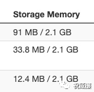

## Spark 资源自动清理

Spark 运行一次 SQL，根据 SQL 的具体执行情况，可能会产生很多垃圾。譬如你可以很容易观察到的就是在 Spark UI 上跑完 SQL 后会有 Storage Memory 的占用：

这个应该是 SQL 中有 join, 并且使用的 hash join 时产生 broadcast 引起的。除了 Broadcast，Spark 还会产生如 RDD，Shuffle 临时数据，累加器数据，Checkpoint 数据。

因为 Spark 是一个分布式框架，这些数据清理可能会涉及到多个节点的复杂的 IO，铁定是不能同步执行的，否则清理的时间可能比执行任务的时间还长。为此 Spark 提供了一个异步清理的机制。也就是 `org.apache.spark.ContextCleaner`.  异步清理会有个问题，就是你怎么知道一个对象是不是可以清理了？比如一个任务产生了一个 Shuffle， 这个 Shuffle 在很多节点产生了很多数据，这个 Shuffle 在 Driver 端会有一个对应的对象，如果这个对象生命周期到头了，那么就说明我们可以去清理这个对象所持有的数据了。

所以，当产生这个对象的时候，我们就需要把这个对象注册起来，其次，当这个对象的生命周期结束了，我们就需要发送一个通知给异步的清理线程，告诉他你可以清理了。所以通常你要维护一个队列，同时你还要手动的在每个资源需要释放的地方将对象设置为 Null，并且发送消息到队列里。

每次都这样做实在是太麻烦，而且很容易疏漏，导致资源泄露。这里不说内存泄露是因为对象所关联的资源可能是文件也可能是内存，并且是分布在多个节点上的。Spark 团队就做了个取巧的设计，注册肯定是要注册的，我 new 对象后就顺带注册下，清理的话，我通过ReferenceQueue 来获取被GC掉的对象的通知，然后触发真实的清理动作。假设我们要清理的是 RDD A， 那么我会提供 A 的一个 WeakRef， 比如叫 ARef，A 被回收，但是 ARef 不会被回收，通过 ARef 我们还能拿到一些信息，比如 rddId，然后通过这个 rddId 去做真正的清理。

但是我们知道，一个对象什么时候被 GC 我们是不可控的，比如对于内存充足的 Driver,可能半天都不会发生 GC，这个时候会导致 spark 没有办法及时做垃圾清理了，如果你的任务还比较多，很可能不是磁盘被跑慢（大量的 shuffle 数据）就是Storage memory 炸了。所以作为对这个方案副作用的补救，Spark 团队设置了一个 30 分钟的定时任务，通过调用 `System.gc()` 手动触发 GC。然后你就会发现 Spark Driver 会定时有一个 Full GC 发生。显然，这个 Full GC 对于流程序或者AdHoc查询服务都是难以忍受的。

那有解决办法么？如果你使用G1,那么还是有的。G1 GC 的 System.gc() 默认触发的是 full GC，也就是 serial old GC。我们只要修改下这个默认行为就可以，通过加上 GC 参数 ` -XX:+ExplicitGCInvokesConcurrent`，G1 就会用自身的并发 GC 来执行 System.gc() 了。此时他只是强行进行一次 global concurrent marking（里面有个 initial marking 会暂停应用程序，但是很快）。另外就是正常的 global concurrent marking 中的 initial marking 都是在都是搭的 young GC 的便车（也就是 young GC 做了，然后 global concurrent marking 直接拿到现成的结果，所以 System.gc()+ -XX:+ExplicitGCInvokesConcurrent 是特例）。然后按照正常的 GC 节奏走。这种情况下就和 G1 的 young GC 无异了。