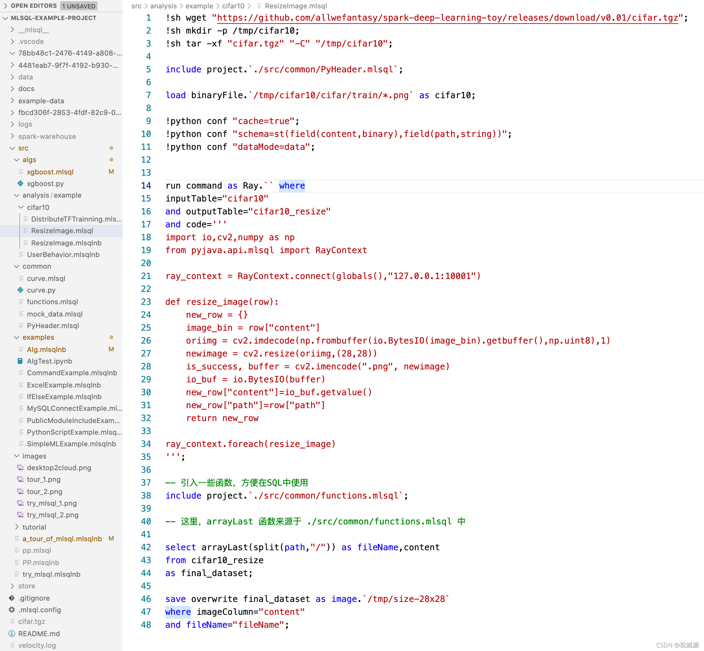

# 可编程的 SQL 是什么样的？

### 背景
如果你使用传统编程语言，比如 Python，那么恭喜你，你可能需要解决大部分你不需要解决的问题，用 Python 你相当于拿到了零部件，而不是一辆能跑的汽车。你花了大量时间去组装汽车，而不是去操控汽车去抵达自己的目的地。大部分非计算机专业的同学核心要解决的是数据操作问题，无论你是摆地摊，开餐馆，或者在办公室做个小职员，在政府机构做工作，你都需要基本的数据处理能力，这本质上是信息处理能力。 但是在操作数据前，你必须要学习诸如变量，函数，线程，分布式等等各种仅仅和语言自身相关的特性，这就变得很没有必要了。操作数据我们也可以使用 Excel（以及类似的软件），但是 Excel 有 Excel 的限制，譬如你各种点点点，还是有点低效的，有很多较为复杂的逻辑也不太好做，数据规模也有限。那什么交互最快，可扩展性最好？语言。你和计算机系统约定好的一个语言，有了语言交流，总是比点点点更高效的。这个语言是啥呢？就是 SQL。

但是 SQL 也有些毛病，首先他最早为了关系型数据库设计的，适合查询而非 ETL，但是现在人们慢慢把他扩展到 ETL, 流式处理，甚至 AI 上，他就有点吃力了。 第二个问题是，他是声明式的，导致缺乏可编程性。所谓可编程性是指，我们应该具备创建小型、可理解、可重用的逻辑片段，并且这些逻辑片段还要被测试、被命名、被组织成包，而这些包之后可以用来构造更多有用的逻辑片段，这样的工作流程才是合理又便捷的。更进一步的，这些“高阶”能力应该是可选的，我们总是希望用户一开始去使用最简单的方式来完成手头的工作而不是显摆一些高阶技巧。

所以最后的结论是，我们希望：

* 保留 SQL 的所有原有优势，简洁易懂，上手就可以干活。
* 允许用户进阶,提供更多可编程能力，但是以一种 SQL Style 的方式提供。

### 保留原有 SQL 精髓
我们仅仅对 SQL 做了丢丢调整，在每条 SQL 语句结尾增加了一个表名，也就是任何一条 SQL 语句的结果集都可以命名为一张新的表。

```
	load hive.`raw.stripe_discounts` as discounts;
	load hive.`raw.stripe_invoice_items` as invoice_items;
	select
	        invoice_items.*,
	        case
	            when discounts.discount_type = 'percent'
	                then amount * (1.0 - discounts.discount_value::float / 100)
	            else amount - discounts.discount_value
	        end as discounted_amount
	
	    from invoice_items
	
	    left outer join discounts
	        on invoice_items.customer_id = discounts.customer_id
	        and invoice_items.invoice_date > discounts.discount_start
	        and (invoice_items.invoice_date < discounts.discount_end
	             or discounts.discount_end is null) as joined;
	
	
	select
	
	        id,
	        invoice_id,
	        customer_id,
	        coalesce(discounted_amount, amount) as discounted_amount,
	        currency,
	        description,
	        created_at,
	        deleted_at
	    from joined as final;
	select * from final as output;
```
大家看到，每条 SQL 的执行结果都被取名为一张新表，然后下一条 SQL 可以引用前面 SQL 产生的表，相比传统我们需要 insert  然后再读取，会简单很多，也更自然，速度更快。而且对于数据处理，我们也无需在一条 SQL 语句里写复杂的嵌套子查询和 Join 了，我们可以将 SQL 展开来书写，校本化，更加易于阅读和使用。
### 支持更多数据源
传统 SQL 是假定你在一个数据源中的，因为你只能按库表方式去使用，在普通 Web 开发里，是你配置的数据库。而在大数据里，一般是数据仓库或者数据湖。 但是随着联邦查询越来越多，越来越普及，我们希望给 SQL 提供更多的加载和保存多种数据源的能力。我们通过提供 load 语句来完成。

```sql
	load excel.`./example-data/excel/hello_world.xlsx` 
	where header="true" 
	as hello_world;
	
	select hello from hello_world as output;
```

在上面的示例可以看到，我们加载了一个 excel 文件，然后映射成一张表，之后可以用标准的 SQL 进行处理。
如果要将结果保存到数仓也很简单:

```sql
save overwrite hello_word as hive.`tmp.excel_table`;

```
### 变量
变量是一个编程语言里，一般你会接触到的第一个概念。我们也给 SQL 增加了这种能力。比如:

```sql
-- It takes effect since the declaration in the same cell.
set world="world";


select "hello ${world}" as title 
as output;
```

在可编程 SQL 中，变量支持多种类型，诸如 sql，shell，conf，defaultParam 等等去满足各种需求和场景。下面是一个典型的例子：

```sql
set date=`select date_sub(CAST(current_timestamp() as DATE), 1) as dt` 
where type="sql";


select "${date}" as dt as output;

```
后面我们会有更多变量的介绍。

### 调用外部模块的代码
传统编程语言如 Java，Python，他们的生态都是靠第三方模块来提供的。第三方模块会被打包成诸如如 Jar，Pip 然后让其他项目引用。 原生的 SQL 是很难复用的，所以没有形成类似的机制，更多的是随用随写。 但是随着 SQL 能力的扩展，在流，在批，在机器学习上的应用越来越多，能写越来越复杂的逻辑，也慢慢有了更多的可复用诉求。

我们通过引入 include 关键字，可以引入本项目或者 github 上的 SQL 代码。https://github.com/allwefantasy/lib-core 是我们使用可编程 SQL 写的一个第三方模块。
假设我们要引用里面定义的一个 UDF 函数 hello，第一步是引入模块:

```sql
include lib.`github.com/allwefantasy/lib-core`
where 
-- libMirror="gitee.com" and  -- 配置代理
-- commit="" and              -- 配置commit点
alias="libCore";
```
第二步就是引入相应的 udf 包，然后在 SQL 中使用：

```sql
include local.`libCore.udf.hello`;
select hello() as name as output;

```

是不是很酷？

### 宏函数
函数是代码复用的基础。几乎任何语言都有函数的概念。我们在 SQL 中也引入的宏函数的概念。但这个宏函数和 原生的 SQL 中的函数比如 split，concat 等等是不一样的。他是 SQL 语言级别的函数。我们来看看示例：

```sql
set loadExcel = '''
load excel.`{0}` 
where header="true" 
as {1}
''';
!loadExcel ./example-data/excel/hello_world.xlsx helloTable;

```
在这段代码中，

1. 我们申明了一个变量 loadExcel, 并且给他设置了一段代码。
2. loadExcel 有诸如 {0}，{1}的占位符。这些会被后续调用时的参数动态替换。
3. 使用功能 ! 将 loadExcel 变量转化为宏函数进行调用。参数传递类似命令行。

### 原生 SQL 函数的动态扩展
像传统关系型数据库，几乎无法扩展 SQL 的内置函数。在 Hive/Spark 中，通常需要以 Jar 包形式提供，可能涉及到重启应用，比较繁琐，比较重。 现在，我们把 SQL UDF 书写变成和书写 SQL 一样。 我们来看一个例子:

```sql
register ScriptUDF.`` as arrayLast 
where lang="scala"
and code='''def apply(a:Seq[String])={
      a.last
}'''
and udfType="udf";

select arrayLast(array("a","b")) as lastChar as output;
```
在上面的代码中，我们通过 register 语法注册了一个函数叫 arrayLast，功能是拿到数组的最后一个值。 我们使用 scala 代码书写这段逻辑。之后我们可以立马在 SQL 中使用功能这个函数。是不是随写随用？

当然，通过模块的能力，你也可以把这些函数集中在一起，然后通过 include 引入。

### 分支语法
SQL 最大的欠缺就是没有分支语句，这导致了一个啥问题呢？他需要寄生在其他语言之中，利用其他语言的分支语句。现在，我们原生的给 SQL 加上了这个能力。 看如下代码：

```sql
set a = "wow,jack";


!if ''' split(:a,",")[0] == "jack" ''';
   select 1 as a as b;
!else;
   select 2 as a as b;
!fi;


select * from b as output;

```
在分支语句中的条件表达式中，你可以使用一切内置、或者我们扩展的原生函数。比如在上面的例子里，我们在if 语句中使用了 split 函数。
还有一个大家用得非常多的场景，就是我先查一张表，根据条件决定接着执行什么样的逻辑。这个有了分支语法以后也会变得很简单，比如：

```sql
select 1 as a as mockTable;
set b_count=`select count(*) from mockTable ` where type="sql" and mode="runtime";


!if ''':b_count > 11 ''';
    
    select 1 as a from b as final_table;
!else;    
    select 2 as a from b as final_table;
!fi;    


select * from final_table as output;

```
机器学习（内置算法）
SQL 表达机器学习其实是比较困难的。但是别忘了我们是可编程的 SQL 呀。我们来看看示例，第一步我们准备一些数据：

```sql
include project.`./src/common/mock_data.Byzer`;
-- create mock/validate/test dataset.
select vec_dense(features) as features, label as label from mock_data as mock_data;
select * from mock_data as mock_data_validate;
select * from mock_data as mock_data_test;
```
接着我们就可以引入一个内置的算法来完成模型的训练。

```sql
train mock_data as RandomForest.`/tmp/models/randomforest` where

keepVersion="true" 

and evaluateTable="mock_data_validate"

and `fitParam.0.labelCol`="label"
and `fitParam.0.featuresCol`="features"
and `fitParam.0.maxDepth`="2"
;
```
这个语句表达的含义是什么呢？ 对 `mock_data` 表的数据使用 `RandomForest` 进行训练，训练时的参数来自 where 语句中，训练后的模型保存在路径`/tmp/models/randomforest `里。是不是非常 naive！

之后你马上可以进行批量预测：

```sql
predict mock_data_test as RandomForest.`/tmp/models/randomforest`  as predicted_table;
```
或者将模型注册成 UDF 函数，使用 Select 语句进行预测:

```
register RandomForest.`/tmp/models/randomforest` as model_predict;
select vec_array(model_predict(features)) as predicted_value from mock_data as output;
```

### Python 脚本支持
在可编程 SQL 里， SQL 是一等公民， Python 只是一些字符串片段。下面是一段示例代码:

```sql
select 1 as a as mockTable;

!python conf "schema=st(field(a,long))";

run command as Ray.`` where 
inputTable="mockTable"
and outputTable="newMockTable"
and code='''
from pyjava.api.Byzer import RayContext

ray_context = RayContext.connect(globals(),None)

newrows = []
for row in ray_context.collect():
    row["a"] = 2
    newrows.append(row)
    
context.build_result(newrows)
''';


select * from newMockTable as output;
```
这段代码，我们使用功能 Ray 模块执行 Python 脚本，这段 Python 脚本会对 mockTable 表加工，把 a 字段从 1 修改为 2，然后处理的结果可以继续被 SQL 处理。是不是很酷？随时随地写 Python 处理数据或者做机器学习，数据获取和加工则是标准的 SQL 来完成。

### 插件
可编程 SQL 无论语法还是内核功能应该是可以扩展的。 比如我需要一个可以产生测试数据的功能。我只要执行如下指令就可以安装具有这个功能的插件：

```sql
!plugin app add - "Byzer-mllib-3.0";
```
然后我就获得了一个叫 SampleDatasetExt 的工具，他可以产生大量的测试数据:

```sql
run command as SampleDatasetExt.`` 
where columns="id,features,label" 
and size="100000" 
and featuresSize="100" 
and labelSize="2" 
as mockData;

select * from mockData as output;
```
在上面的示例代码中，我们通过 SampleDatasetExt 产生了一个具有三列的表，表的记录数为 100000，其中 feature 字段数组大小为 100，label 字段的数组大小为 2。之后我们可以使用 select 语句进行查询进一步加工。
### 更多编程小 trick
比如下面一段代码在实际生产里是常态：

```sql
select SUM( case when `id` is null or `id`='' then 1 else 0 end ) as id,
SUM( case when `diagnosis` is null or `diagnosis`='' then 1 else 0 end ) as diagnosis,
SUM( case when `radius_mean` is null or `radius_mean`='' then 1 else 0 end ) as radius_mean,
SUM( case when `texture_mean` is null or `texture_mean`='' then 1 else 0 end ) as texture_mean,
SUM( case when `perimeter_mean` is null or `perimeter_mean`='' then 1 else 0 end ) as perimeter_mean,
SUM( case when `area_mean` is null or `area_mean`='' then 1 else 0 end ) as area_mean,
SUM( case when `smoothness_mean` is null or `smoothness_mean`='' then 1 else 0 end ) as smoothness_mean,
SUM( case when `compactness_mean` is null or `compactness_mean`='' then 1 else 0 end ) as compactness_mean,
SUM( case when `concavity_mean` is null or `concavity_mean`='' then 1 else 0 end ) as concavity_mean,
SUM( case when `concave points_mean` is null or `concave points_mean`='' then 1 else 0 end ) as concave_points_mean,
SUM( case when `symmetry_mean` is null or `symmetry_mean`='' then 1 else 0 end ) as symmetry_mean,
SUM( case when `fractal_dimension_mean` is null or `fractal_dimension_mean`='' then 1 else 0 end ) as fractal_dimension_mean,
SUM( case when `radius_se` is null or `radius_se`='' then 1 else 0 end ) as radius_se,
SUM( case when `texture_se` is null or `texture_se`='' then 1 else 0 end ) as texture_se,
SUM( case when `perimeter_se` is null or `perimeter_se`='' then 1 else 0 end ) as perimeter_se,
SUM( case when `area_se` is null or `area_se`='' then 1 else 0 end ) as area_se,
SUM( case when `smoothness_se` is null or `smoothness_se`='' then 1 else 0 end ) as smoothness_se,
SUM( case when `compactness_se` is null or `compactness_se`='' then 1 else 0 end ) as compactness_se,
SUM( case when `concavity_se` is null or `concavity_se`='' then 1 else 0 end ) as concavity_se,
SUM( case when `concave points_se` is null or `concave points_se`='' then 1 else 0 end ) as concave_points_se,
SUM( case when `symmetry_se` is null or `symmetry_se`='' then 1 else 0 end ) as symmetry_se,
SUM( case when `fractal_dimension_se` is null or `fractal_dimension_se`='' then 1 else 0 end ) as fractal_dimension_se,
SUM( case when `radius_worst` is null or `radius_worst`='' then 1 else 0 end ) as radius_worst,
SUM( case when `texture_worst` is null or `texture_worst`='' then 1 else 0 end ) as texture_worst,
SUM( case when `perimeter_worst` is null or `perimeter_worst`='' then 1 else 0 end ) as perimeter_worst,
SUM( case when `area_worst` is null or `area_worst`='' then 1 else 0 end ) as area_worst,
SUM( case when `smoothness_worst` is null or `smoothness_worst`='' then 1 else 0 end ) as smoothness_worst,
SUM( case when `compactness_worst` is null or `compactness_worst`='' then 1 else 0 end ) as compactness_worst,
SUM( case when `concavity_worst` is null or `concavity_worst`='' then 1 else 0 end ) as concavity_worst,
SUM( case when `concave points_worst` is null or `concave points_worst`='' then 1 else 0 end ) as concave_points_worst,
SUM( case when `symmetry_worst` is null or `symmetry_worst`='' then 1 else 0 end ) as symmetry_worst,
SUM( case when `fractal_dimension_worst` is null or `fractal_dimension_worst`='' then 1 else 0 end ) as fractal_dimension_worst,
SUM( case when `_c32` is null or `_c32`='' then 1 else 0 end ) as _c32
from data as data_id;

```
写的手累？那有么有办法简化呢？当然有啦。 我们毕竟是可编程是SQL呀。

一个有意思的解决方法如下：

```sql
select 
#set($colums=["id","diagnosis"，"fractal_dimension_worst"])
#foreach( $column in $colums )
    SUM( case when `$column` is null or `$column`='' then 1 else 0 end ) as $column,
#end
 1 as a from newTable as output;

```

我们可以使用内置的 #foreach 循环。先通过 set 设置所有字段名称，然后通过 foreach 循环来生成 sum 语句。

这就完了？就如同茴字有好多写法，我们还有其他的玩法。

```sql
set sum_tpl = '''
SUM( case when `{0}` is null or `{0}`='' then 1 else 0 end ) as {0}
''';


select ${template.get("sum_tpl","diagnosis")},
${template.get("sum_tpl","radius_mean")},
${template.get("sum_tpl","texture_mean")},
from data as output;
```
我们可以通过 set 进行模板设置，然后在 sql 语句里通过 template.get 语句进行模板渲染。 对于一个很复杂的 SQL 语句，里面可能存在多个类似 sum /case when 的重复语句，那么我们就可以使用这种方式了。而且可以做到一处修改，处处生效。不然万一你 sum 里的 1 要改成 2，那可是要改好几十个语句的。

恩，除了这些，还有非常多的好玩的玩法等待你的挖掘，SQL 再也不 Boring 了。

### 不是最后的最后
可以看到，我们给原生 SQL 扩展了变量，函数，多数据源支持，第三方模块，原生 SQL ，原生函数动态扩展，分支语法，机器学习，python 脚本支持，插件等等诸多功能。就像 TypeScript 给 JavaScript 的增强一样，大家也可以只用最基础的 SQL 语法。但是一旦你有需要，你就可以使用更多高阶功能满足自己的诉求。
### 最后
这个可编程的 SQL 是还在梦想中么?当然不是！ 它就在这里： http://byzer.org 我们提供了桌面版和在线试用版本。还不快来感受下。

### 真的最后了
Byzer 目前支持 Web 版，桌面版，包括 Script，Notebook 等多种交互模式。参考 Byzer 2.1.0 版本的[技术白皮书](http://blog.mlsql.tech/blog/mlsql-lang-white-paper.html)


现在，让我们看一段赏心悦目的 Byzer 代码

下载图片tar包，并且解压
设置 python 环境
加载图片目录为表
使用 python 进行分布式图片处理
对文件名进行处理
将表以二进制图片包保存到对象存储目录中


